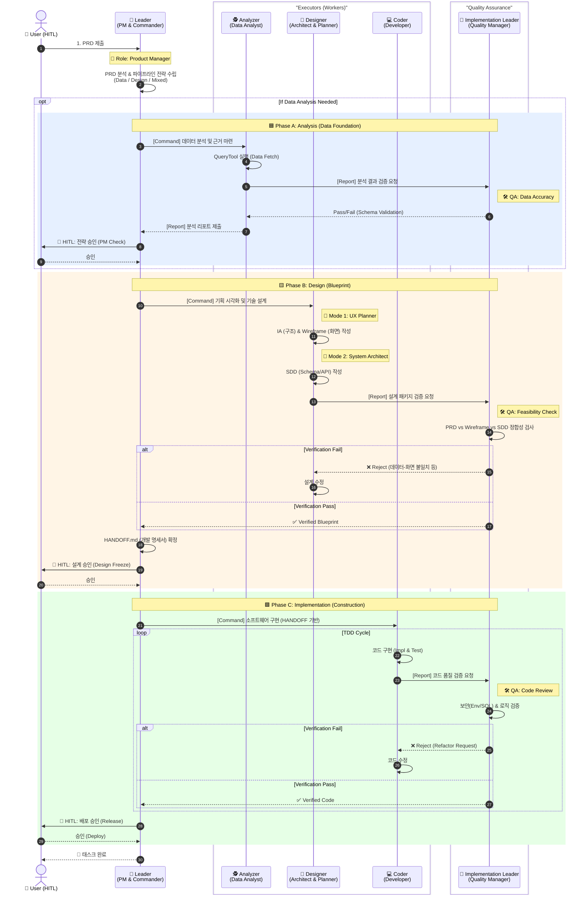
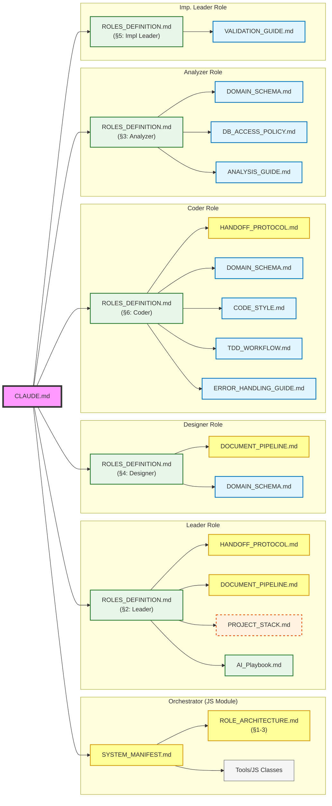
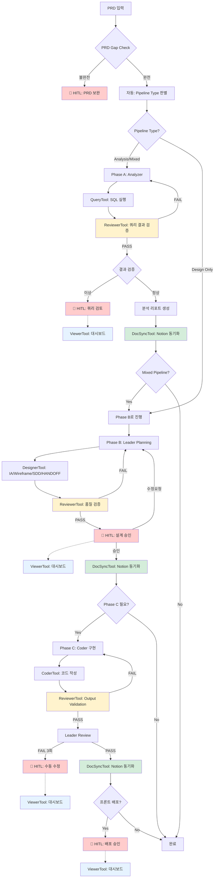
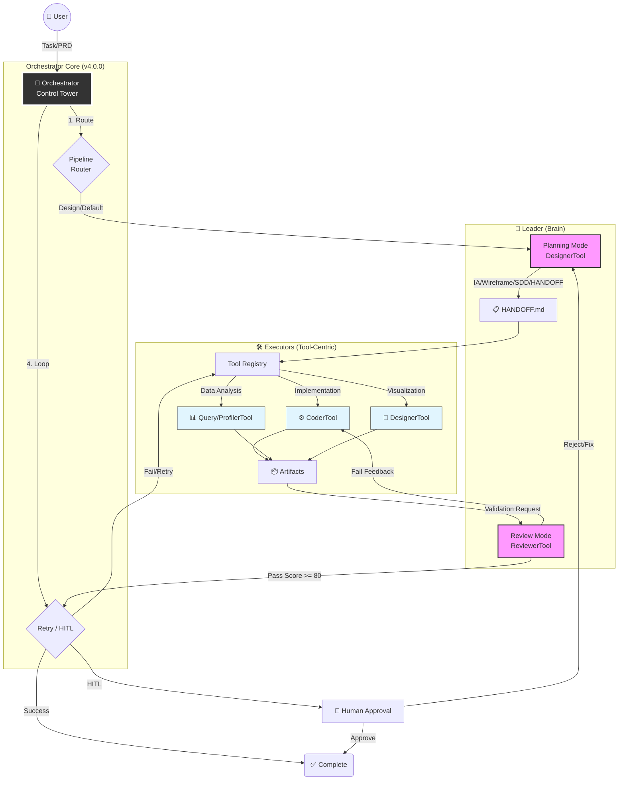

# .claude 디렉토리 가이드

> **목적**: 인간 개발자를 위한 시각적 문서 (다이어그램, 상세 설명)
> **최종 업데이트**: 2025-12-29
> **참고**: LLM은 이 문서를 로딩하지 않습니다. 핵심 규칙은 각 `.md` 파일 참조.

---

## 1. 시스템 개요

### 1.1 Role-Based Collaboration Model (v3.0.0)



### 1.2 문서 로딩 토폴로지 - 미시적 관점 (Role별 컨텍스트 주입)



> **범례**: 🟣 루트(CLAUDE.md) | 🟡 프로토콜(워크플로우) | 🔵 규칙(Rules) | 🟢 정의(Definitions) | 🟠 점선=런타임 입력(PRD, SDD 등) | ⬜ Tool/JS 클래스

### 1.3 문서 의존성 토폴로지 - 거시적 관점 (Frontstage/Backstage)



> **범례**: ⬛ 헌법(Constitution) | 🟢 Frontstage (Role이 로딩) | ⬜ Backstage (시스템/인간용, 점선)

---

## 2. 파이프라인 플로우

### 2.1 Phase 기반 파이프라인 흐름



> **범례**: 🔴 빨간색 = HITL 체크포인트 | 🔵 파란색 = ViewerTool | 🟡 노란색 = ReviewerTool | 🟢 초록색 = DocSyncTool

### 2.2 협업 사이클 (간략)



---

## 3. 시스템 다이어그램 (ASCII)

### 3.1 Role-Based Collaboration Model

```
┌─────────────────────────────────────────────────────────────────────────────┐
│         Role-Based Collaboration Model (v3.0.0)                             │
└─────────────────────────────────────────────────────────────────────────────┘

┌─────────────────────────────────────────────────────────────────────────────┐
│  📥 INPUT                                                                   │
│  • PRD (.claude/project/PRD.md)                                             │
│  • 사용자 요청 (자연어)                                                       │
└─────────────────────────────────────────────────────────────────────────────┘
                                    │
                                    ▼
┌─────────────────────────────────────────────────────────────────────────────┐
│  🎛️ ORCHESTRATOR - 워크플로우 제어 모듈 (판단하지 않음)                         │
│  • Leader 출력 { router: "mixed" } 기반 기계적 파이프라인 스위칭              │
│  • HITL 체크포인트 관리                                                       │
│  • onPhaseComplete 훅에서 doc-sync 자동 실행                                 │
└─────────────────────────────────────────────────────────────────────────────┘
         │
         ▼
┌─────────────────────────────────────────────────────────────────────────────┐
│  🧠 LEADER (PM & Commander) - Tool 없음, 지휘만                               │
│  • PRD 분석 & 파이프라인 전략 수립                                            │
│  • 하위 Role에 목표 하달 (Command)                                            │
│  • HITL 최종 승인 (Approve)                                                  │
└─────────────────────────────────────────────────────────────────────────────┘
         │ 목표 하달
         ├─────────────────────────────────────────────────────────────────┐
         │                                                                 │
         ▼ [Phase A: Analysis]                                             │
┌─────────────────────────────────────┐                                     │
│  🕵️ ANALYZER (Data Analyst)        │                                     │
│  • SQL 쿼리 작성/실행                 │                                     │
│  • 데이터 추출 및 분석                │                                     │
│  Tool: query, profiler              │                                     │
│  Output: analysis/*.sql, *.json     │                                     │
└──────────────────┬──────────────────┘                                     │
                   │ 산출물                                                   │
                   ▼                                                         │
┌──────────────────────────────────────────────────────────────────────────┐ │
│  👮 IMPLEMENTATION LEADER (Quality Manager) - 전 Phase 검증               │ │
│  • Tool: reviewer                                                         │ │
│  • PASS → Leader 보고 / FAIL → Executor 재작업                             │ │
└──────────────────────────────────────────────────────────────────────────┘ │
         │                                                                 │
         ▼ [Phase B: Design]                                               │
┌─────────────────────────────────────┐                                     │
│  📐 DESIGNER (Architect & Planner)  │                                     │
│  [UX Planner Mode] IA/Wireframe     │                                     │
│  [System Architect Mode] SDD        │                                     │
│  Tool: designer                     │                                     │
│  Output: docs/cases/{caseId}/*.md   │                                     │
└──────────────────┬──────────────────┘                                     │
                   │ 산출물                                                   │
                   ▼                                                         │
         [Implementation Leader 검증]                                       │
                   │                                                         │
         ▼ [Phase C: Implementation]                                        │
┌─────────────────────────────────────┐                                     │
│  💻 CODER (Developer)               │                                     │
│  • HANDOFF.md 기반 코드 구현          │                                     │
│  • Self-Check (qualityGate.md)      │                                     │
│  Tool: coder                        │                                     │
│  Output: backend/src/*, frontend/*  │                                     │
└──────────────────┬──────────────────┘                                     │
                   │ 산출물                                                   │
                   ▼                                                         │
         [Implementation Leader 검증]                                       │
                   │ PASS                                                    │
                   ▼                                                         │
┌─────────────────────────────────────────────────────────────────────────────┐
│  📤 OUTPUT                                                                  │
│  [Phase A] docs/cases/{id}/analysis/ (query.sql, result.json, report.md)   │
│  [Phase B] docs/cases/{id}/ (PRD.md, IA.md, Wireframe.md, SDD.md, HANDOFF) │
│  [Phase C] backend/src/{feature}/, frontend/src/{feature}/                 │
│  [로그] workspace/logs/{id}.json                                            │
└─────────────────────────────────────────────────────────────────────────────┘
```

### 3.2 문서 분리 원칙

```
┌─────────────────────────────────────────────────────────────────────────────┐
│  문서 분리 원칙                                                               │
├─────────────────────────────────────────────────────────────────────────────┤
│                                                                             │
│  ROLE_ARCHITECTURE.md (지도)           ROLES_DEFINITION.md (매뉴얼)         │
│  ──────────────────────────────        ──────────────────────────────       │
│  • 전체 파이프라인 Topology             • Role별 시스템 프롬프트              │
│  • Phase 정의 (A/B/C)                  • Role별 입출력 정의 (I/O)            │
│  • Role-Tool 권한 매트릭스              • 검증 항목 상세                      │
│  • HITL 체크포인트 위치                 • Actionable Feedback 규칙           │
│  • Orchestrator 스위칭 규칙             • Role간 보고 양식                    │
│                                                                             │
│  참조: Orchestrator, 개발자             참조: 각 LLM Role (Leader, Coder 등)  │
│                                                                             │
└─────────────────────────────────────────────────────────────────────────────┘
```

---

## 4. 검증 파이프라인 개요

```
PRD 입력
    ↓
┌─────────────────────────────────────────────────────────────────┐
│ Phase 0: PRD Gap Check (기획 단계)                               │
│   - 필수 항목 체크 (목적, 타겟, 기능, 지표, type, pipeline)        │
│   - 레퍼런스 매칭                                                │
│   - 간극 질문 생성 → 사용자 확인 (HITL)                           │
└─────────────────────────────────────────────────────────────────┘
    ↓
┌─────────────────────────────────────────────────────────────────┐
│ Phase A: Analysis (Analyzer Role)                                │
│   - DB 분석, SQL 실행                                            │
│   → Impl Leader 검증                                             │
└─────────────────────────────────────────────────────────────────┘
    ↓
┌─────────────────────────────────────────────────────────────────┐
│ Phase B: Design (Designer Role)                                  │
│   - IA/Wireframe/SDD/HANDOFF 생성                                │
│   → Impl Leader 검증 + HITL 설계 승인                             │
└─────────────────────────────────────────────────────────────────┘
    ↓
┌─────────────────────────────────────────────────────────────────┐
│ Phase C: Implementation (Coder Role)                             │
│   - HANDOFF 기반 코드 구현                                        │
│   → Impl Leader 검증 (3회 FAIL 시 HITL)                           │
└─────────────────────────────────────────────────────────────────┘
    ↓
┌─────────────────────────────────────────────────────────────────┐
│ Quality Gates (배포 전 최종 검증)                                 │
│   - 코드 품질, 테스트, 보안, 성능                                  │
│   - 실패 시 재작업 요청                                           │
└─────────────────────────────────────────────────────────────────┘
    ↓
완료
```

---

## 5. 핵심 원칙 요약

### 5.1 Role-Based Collaboration Model 핵심

```
┌─────────────────────────────────────────────────────────────────────────────┐
│  🎯 Role-Based Collaboration Model (v3.0.0)                                 │
├─────────────────────────────────────────────────────────────────────────────┤
│                                                                             │
│  1. No Agents - Role 기반 정의                                               │
│     • 모든 구성원은 기능 중심의 역할(Role)로 정의                               │
│     • Agent 용어 폐기, Role 용어 사용                                         │
│                                                                             │
│  2. 실행/검증 분리 (Execution & Verification Separation)                     │
│     • 만드는 자(Executor)와 검사하는 자(Impl Leader)를 분리                     │
│     • 황금률: "실행하는 자는 검증하지 않고, 검증하는 자는 실행하지 않는다."        │
│                                                                             │
│  3. Universal Quality Gate                                                  │
│     • 모든 Phase는 Implementation Leader의 검증을 통과해야 Leader에게 보고      │
│                                                                             │
│  4. Multi-LLM Provider 지원                                                  │
│     • Claude (Primary) → GPT-4 → Gemini (Fallback Chain)                    │
│                                                                             │
└─────────────────────────────────────────────────────────────────────────────┘
```

### 5.2 Orchestrator vs Leader 역할 구분

```
┌─────────────────────────────────────────────────────────────────────────────┐
│  ⚠️ 코드 구현 시 강제 규칙                                                    │
├─────────────────────────────────────────────────────────────────────────────┤
│                                                                             │
│  1. Leader는 tools 배열이 비어 있어야 합니다.                                 │
│     └── 시스템 프롬프트에 Tool Definition 포함 금지                          │
│     └── 하위 Role 호출하는 Delegation 인터페이스만 보유                       │
│                                                                             │
│  2. Orchestrator는 '판단'하지 않습니다.                                       │
│     └── "PRD 내용에 따라 분기" 같은 로직 금지 (Leader의 몫)                   │
│     └── Leader가 출력한 { router: "mixed" } 등에 따라 기계적 스위칭만 수행    │
│                                                                             │
│  3. Doc-Sync는 'Hook'입니다.                                                 │
│     └── Leader가 "Notion에 올려줘" 지시 금지                                  │
│     └── Leader는 "Phase B 승인 완료"만 선언                                   │
│     └── Orchestrator가 onPhaseComplete 훅에서 DocSyncTool 자동 실행          │
│                                                                             │
└─────────────────────────────────────────────────────────────────────────────┘
```

---

## 6. 디렉토리 구조

```
.claude/
├── README.md              # 이 파일 (인간용 가이드)
├── SYSTEM_MANIFEST.md     # 파일 맵 & 로딩 전략
├── archive.md             # 삭제된 내용 기록
│
├── rules/                 # [Group A] 제약 사항
│   ├── DOMAIN_SCHEMA.md   # DB 스키마 정의
│   ├── DB_ACCESS_POLICY.md# DB 접근 정책
│   ├── CODE_STYLE.md      # 코딩 스타일
│   ├── TDD_WORKFLOW.md    # TDD 절차
│   ├── VALIDATION_GUIDE.md# 검증 가이드
│   └── ANALYSIS_GUIDE.md  # 분석 가이드
│
├── workflows/             # [Group B] 실행 절차
│   ├── ROLE_ARCHITECTURE.md     # 시스템 지도
│   ├── ROLES_DEFINITION.md      # Role별 매뉴얼
│   ├── HANDOFF_PROTOCOL.md      # 업무 인수인계
│   ├── DOCUMENT_PIPELINE.md     # 문서 생성 파이프라인
│   ├── PRD_GUIDE.md             # PRD 작성 가이드
│   ├── ERROR_HANDLING_GUIDE.md  # 에러 처리 (Backstage)
│   └── INCIDENT_PLAYBOOK.md     # 장애 대응 (Backstage)
│
├── context/               # [Group C] 배경 지식
│   └── AI_Playbook.md     # 인간 온보딩용
│
└── project/               # 프로젝트별 설정 (수정 가능)
    ├── PROJECT_STACK.md   # 기술 스택
    └── PRD.md             # 현재 PRD
```

---

## 7. PRD 파이프라인 라우팅

> **원본 위치**: PRD_GUIDE.md 섹션 1.6


---

## 8. 문서 파이프라인 플로우

> **원본 위치**: DOCUMENT_PIPELINE.md 섹션 전체 파이프라인

```mermaid
flowchart TD
    %% Entry
    Start((Start)) --> PRD_Submit[👤 User: PRD 제출]
    PRD_Submit --> Leader_Analyze[🧠 Leader: PRD 분석<br/>파이프라인 전략 수립]

    Leader_Analyze --> PRD_Route{PRD 유형<br/>분류}

    PRD_Route -- Data --> PhaseA
    PRD_Route -- Design --> PhaseB
    PRD_Route -- Mixed --> PhaseA

    %% ═══════════════════════════════════════
    %% Phase A: Analysis (Data Foundation)
    %% ═══════════════════════════════════════
    subgraph PhaseA ["🟦 Phase A: Analysis (Data Foundation)"]
        direction TB
        A_Command[🧠 Leader → 🕵️ Analyzer<br/>데이터 분석 명령]
        A_Command --> A_Query[🕵️ Analyzer: QueryTool 실행]
        A_Query --> A_Report[🕵️ Analyzer → 👮 ImpLeader<br/>분석 결과 검증 요청]
        A_Report --> A_QA{👮 ImpLeader<br/>Schema Validation}
        A_QA -- Fail --> A_Fix[🕵️ Analyzer: 쿼리 수정]
        A_Fix --> A_Query
        A_QA -- Pass --> A_Submit[🕵️ Analyzer → 🧠 Leader<br/>분석 리포트 제출]
    end

    A_Submit --> HITL_A[📢 HITL: 전략 승인<br/>PM Check]
    HITL_A -- Approved --> PhaseB
    HITL_A -- Rejected --> A_Command

    %% ═══════════════════════════════════════
    %% Phase B: Design (Blueprint)
    %% ═══════════════════════════════════════
    subgraph PhaseB ["🟨 Phase B: Design (Blueprint)"]
        direction TB
        B_Command[🧠 Leader → 📐 Designer<br/>기획 시각화 & 기술 설계 명령]

        B_Command --> B_UX[📐 Designer: UX Planner 모드<br/>IA.md & Wireframe.md]
        B_UX --> B_Arch[📐 Designer: System Architect 모드<br/>SDD.md 작성]
        B_Arch --> B_Report[📐 Designer → 👮 ImpLeader<br/>설계 패키지 검증 요청]

        B_Report --> B_QA{👮 ImpLeader<br/>Feasibility Check<br/>PRD↔Wire↔SDD 정합성}
        B_QA -- Fail --> B_Fix[📐 Designer: 설계 수정]
        B_Fix --> B_UX
        B_QA -- Pass --> B_Verify[👮 ImpLeader → 🧠 Leader<br/>✅ Verified Blueprint]
    end

    B_Verify --> Handoff[🧠 Leader: HANDOFF.md 확정<br/>개발 명세서]
    Handoff --> HITL_B[📢 HITL: 설계 승인<br/>Design Freeze]
    HITL_B -- Approved --> PhaseC
    HITL_B -- Rejected --> B_Command

    %% ═══════════════════════════════════════
    %% Phase C: Implementation (Construction)
    %% ═══════════════════════════════════════
    subgraph PhaseC ["🟩 Phase C: Implementation (Construction)"]
        direction TB
        C_Command[🧠 Leader → 💻 Coder<br/>소프트웨어 구현 명령<br/>HANDOFF 기반]

        C_Command --> C_TDD[💻 Coder: TDD Cycle<br/>Red → Green → Refactor]
        C_TDD --> C_Report[💻 Coder → 👮 ImpLeader<br/>코드 품질 검증 요청]

        C_Report --> C_QA{👮 ImpLeader<br/>Code Review<br/>보안 & 로직 검증}
        C_QA -- Fail --> C_Fix[💻 Coder: 코드 수정]
        C_Fix --> C_TDD
        C_QA -- Pass --> C_Verify[👮 ImpLeader → 🧠 Leader<br/>✅ Verified Code]
    end

    C_Verify --> HITL_C[📢 HITL: 배포 승인<br/>Release]
    HITL_C -- Approved --> Deploy((🎉 Deploy))
    HITL_C -- Rejected --> C_Command

    %% ═══════════════════════════════════════
    %% Styles
    %% ═══════════════════════════════════════
    style HITL_A fill:#f96,stroke:#333,stroke-width:2px,color:white
    style HITL_B fill:#f96,stroke:#333,stroke-width:2px,color:white
    style HITL_C fill:#f96,stroke:#333,stroke-width:2px,color:white
    style PhaseA fill:#e6f0ff,stroke:#4a90d9
    style PhaseB fill:#fff5e6,stroke:#d9a04a
    style PhaseC fill:#e6ffe6,stroke:#4ad94a
```



---

## 9. JIT Injection 원칙 (ROLES_DEFINITION.md)

> **원본 위치**: ROLES_DEFINITION.md 문서 책임 경계 섹션

```
┌─────────────────────────────────────────────────────────────────────────────┐
│  JIT (Just-in-Time) Injection 원칙                                           │
├─────────────────────────────────────────────────────────────────────────────┤
│                                                                             │
│  ✅ Leader Role 호출 시                                                      │
│     → ROLES_DEFINITION.md 섹션 2 (Leader)만 로딩                            │
│                                                                             │
│  ✅ Coder Role 호출 시                                                       │
│     → ROLES_DEFINITION.md 섹션 6 (Coder)만 로딩                             │
│     → HANDOFF_PROTOCOL.md 추가 로딩                                         │
│                                                                             │
│  ✅ Implementation Leader Role 호출 시                                       │
│     → ROLES_DEFINITION.md 섹션 5 (Impl Leader)만 로딩                       │
│                                                                             │
│  ❌ 전체 문서 로딩 금지 (토큰 낭비 방지)                                       │
│                                                                             │
└─────────────────────────────────────────────────────────────────────────────┘
```

---

**END OF README.md**
