## 0. 이 문서는 무엇을 설명하는가

**목적**: AI-기반 협업 시스템의 역할, 책임, 흐름, 원칙을 인간 기준으로 설명

**범위**: 개념 → 흐름 → 규칙 → 구현 가이드

**읽는 법**: 독자 유형별 권장 경로 제공

**최종 업데이트**: 2025-12-29

**참고**: LLM은 이 문서를 로딩하지 않습니다. 핵심 규칙은 각 `.md` 파일 참조.

---

## 1. 문제 정의 (Why/Who)

### 1-1 이 시스템은 무엇을 해결하는가

- **ATO-System-B는 메디게이트의 레거시 개발 프로세스에서 발생하는 핵심 병목을 해결합니다.**

해결하는 문제:

- 순차적 병목 → 기획→디자인→개발→QA 각 단계 대기 시간 제거, AI Role 기반 병렬 협업
- 핸드오프 손실 → PM↔디자이너↔개발자 간 문서 해석 비용 제거, 단일 스펙 문서 체계(PRD→SDD→Code) 자동 생성
- 표준화 부재 → 팀별 상이한 작업 방식 통일, Implementation Leader의 자동 검증 게이트

추가 안전장치:

- 레거시 DB 정합성 → DOMAIN_SCHEMA.md로 20년 레거시 스키마를 AI가 정확히 참조
- 민감 데이터 보호 → DB_ACCESS_POLICY.md로 SELECT만 허용, PII 컬럼 차단
- 무한 루프 방지 → Circuit Breaker(5회 실패 시 HITL 강제 전환)

**목표**: 리드타임 30%↓, 핸드오프 50%↓, 개발 비용 40%↓

### 1-2 Role-Based Collaboration Model

```mermaid
sequenceDiagram
    autonumber
    actor User as 👤 User<br/>(HITL Authority)
    participant Leader as 🧠 Leader<br/>(PM & Commander)

    box "Executors (Workers)" #F5F5F5
        participant Analyzer as 🕵️ Analyzer
        participant Designer as 📐 Designer
        participant Coder as 💻 Coder
    end

    box "Quality Authority" #FFF3CD
        participant ImpLeader as 👮 ImpLeader<br/>(Objective Judge)
    end

    %% ─────────────────────────────────────
    %% Phase 0: Strategy
    %% ─────────────────────────────────────
    User->>Leader: PRD 제출
    Leader->>Leader: 파이프라인 전략 수립

    %% HITL-G (Structural / Risk)
    Leader->>User: 🔴 HITL-G<br/>Structural / Scope Decision Approval
    User-->>Leader: 승인 또는 Reject

    %% ─────────────────────────────────────
    %% Phase A: Analysis
    %% ─────────────────────────────────────
    rect rgb(230,240,255)
        Leader->>Analyzer: 데이터 분석 명령
        Analyzer->>Analyzer: Query / 분석 수행
        Analyzer->>ImpLeader: 분석 결과 검증 요청
        ImpLeader-->>Analyzer: PASS / FAIL
        Analyzer-->>Leader: 분석 리포트
    end

    %% HITL-G (Phase Gate)
    Leader->>User: 🔴 HITL-G<br/>Phase Gate Approval (Analysis → Design)
    User-->>Leader: 승인

    %% ─────────────────────────────────────
    %% Phase B: Design
    %% ─────────────────────────────────────
    rect rgb(255,245,230)
        Leader->>Designer: 설계 명령
        Designer->>Designer: IA / Wireframe / SDD 작성
        Designer->>ImpLeader: 설계 패키지 검증 요청
        ImpLeader-->>Designer: PASS / FAIL
        Designer-->>Leader: 설계 산출물
    end

    %% HITL-G (Design Freeze)
    Leader->>User: 🔴 HITL-G<br/>Design Freeze Approval
    User-->>Leader: 승인

    %% ─────────────────────────────────────
    %% Phase C: Implementation
    %% ─────────────────────────────────────
    rect rgb(230,255,230)
        Leader->>Coder: 구현 명령 (HANDOFF / SDD)
        loop Implementation Cycle
            Coder->>Coder: 구현 & 테스트
            Coder->>ImpLeader: 코드 품질 검증 요청
            ImpLeader-->>Coder: PASS / FAIL
Note right of ImpLeader: FAIL → Internal retry / pipeline rule applies
        end
        Coder-->>Leader: 구현 결과
    end

    %% HITL-G (Release)
    Leader->>User: 🔴 HITL-G<br/>Release Risk Acceptance
    User-->>Leader: 승인 (Go Live)

    Leader-->>User: 🎉 Task Complete

```



### 1-3 문서 로딩 토폴로지 - 미시적 관점


> **범례**: 🟣 루트(CLAUDE.md) | 🟡 프로토콜(워크플로우) | 🔵 규칙(Rules) | 🟢 정의(Definitions) | 🟠 점선=런타임 입력(PRD, SDD 등) | ⬜ Tool/JS 클래스

### 1-4 문서 의존성 토폴로지 - 거시적 관점


> **범례**: ⬛ 헌법(Constitution) | 🟢 Frontstage (Role이 로딩) | ⬜ Backstage (시스템/인간용, 점선)

## 2. 파이프라인 플로우 (How)

### 2-1 Phase 기반 파이프라인 흐름 - 정적 구조 Phase

```mermaid
graph TD
    A[PRD 입력] --> B[👮 ImpLeader: PRD Gap Check]
    B --> B1{Objective Rules Pass?}

    B1 -- YES --> D[자동: Pipeline Type 판별]
    B1 -- NO --> C[🧑 HITL Review]

    %% HITL Actions (ONLY override types)
    C --> C1[Exception Approval<br/>single-run]
    C --> C2[Rule Override<br/>rule change]

    %% HITL Outcomes
    C1 --> D
    C2 --> D
    C --> C3[No Approval → Reject<br/>PRD 보완]
    C3 --> A

    D --> E{Pipeline Type?<br/>code requires SDD}

    %% ═══════════════════════════════════════
    %% Phase A: Analysis
    %% ═══════════════════════════════════════
    E -- analysis --> F
    E -- analyzed_design --> F
    E -- full --> F

    F[Phase A: Analysis] --> G[QueryTool: SQL 실행]
    G --> G1[👮 ImpLeader: 쿼리 결과 검증]
    G1 --> G2{Objective Rules Pass?}

    G2 -- YES --> J[분석 리포트 생성]
    G2 -- NO --> I[🧑 HITL Review]

    I --> I1[Exception Approval]
    I --> I2[Rule Override]
    I --> I3[No Approval → Reject<br/>분석 재작업]

    I1 --> J
    I2 --> J
    I3 --> F

    J --> J2[DocSyncTool: Notion 동기화]
    J2 --> K{analyzed_design / full?}
    K -- Yes --> L[Phase B로 진행]
    K -- No --> U[완료]

    %% ═══════════════════════════════════════
    %% Phase B: Design
    %% ═══════════════════════════════════════
    E -- design --> L
    E -- ui_mockup --> L

    L[Phase B: Design] --> M[DesignerTool: IA / WF / SDD / HANDOFF]
    M --> N1[👮 ImpLeader: 설계 품질 검증]
    N1 --> N2{Objective Rules Pass?}

    N2 -- YES --> O2[DocSyncTool: Notion 동기화]
    N2 -- NO --> O[🧑 HITL Review]

    O --> O1[Exception Approval]
    O --> O3[Rule Override]
    O --> O4[No Approval → Reject<br/>설계 재작업]

    O1 --> O2
    O3 --> O2
    O4 --> L

    O2 --> P{ui_mockup / full?}
    P -- Yes --> Q[Phase C로 진행]
    P -- No --> U

    %% ═══════════════════════════════════════
    %% Phase C: Implementation
    %% ═══════════════════════════════════════
    E -- code --> Q[Phase C로 진행<br/>Input: HANDOFF + SDD]

    Q[Phase C: Implementation<br/>Input: HANDOFF + SDD] --> R1[CoderTool: 코드 작성]
    R1 --> S[👮 ImpLeader: 코드 품질 검증]
    S --> S1{Objective Rules Pass?}

    S1 -- YES --> T1[DocSyncTool: Notion 동기화]
    S1 -- NO --> V[🧑 HITL Review]

    V --> V1[Exception Approval<br/>Tech Debt]
    V --> V2[Rule Override]
    V --> V3[No Approval → Reject<br/>코드 재작업]

    V1 --> T1
    V2 --> T1
    V3 --> Q

    T1 --> U[완료]

    %% ═══════════════════════════════════════
    %% Styles
    %% ═══════════════════════════════════════
    style C fill:#ffcccc
    style I fill:#ffcccc
    style O fill:#ffcccc
    style V fill:#ffcccc

    style B fill:#fff3cd
    style G1 fill:#fff3cd
    style N1 fill:#fff3cd
    style S fill:#fff3cd

    style J2 fill:#d4edda
    style O2 fill:#d4edda
    style T1 fill:#d4edda


```



> **범례**: 🔴 빨간색 = HITL Review (예외 처리) | 🟡 노란색 = 👮 ImpLeader (자동 검증) | 🟢 초록색 = DocSyncTool
>
> **HITL 트리거 조건**: ImpLeader 자동 검증 실패 시에만 HITL Review 진입
>
> - **Exception Approval**: 이번 실행만 예외 승인
> - **Rule Override**: 규칙 자체 수정 승인
> - **Reject**: 재작업 요청

### 2-2 협업 사이클 - Orchestrator 관점/동적 루프 Cycle

```mermaid
graph TD
    User((👤 User)) --> ORC[🤖 Orchestrator]

    subgraph "Orchestrator Core"
        ORC --> Router{Pipeline Router}
        ORC --> |On Demand|Viewer[👀 Viewer]
        ORC --> |On Finalize|DocSync[📄 Doc-Sync]
    end

    subgraph "🧠 Leader"
        Router -->|PRD + Type| L_Plan[Planning]
        L_Plan --> Handoff[📋 HANDOFF.md]
    end

    subgraph "🛠️ Executors"
        Handoff --> Registry[Tool Registry]
        Registry --> Code[⚙️ Coder]
        Registry --> Analysis[📊 Query]
        Registry --> Design[🎨 Designer]
    end

    subgraph "👮 Quality Gate"
        Code --> Review[🧪 Reviewer]
        Analysis --> Review
        Design --> Review
        Review -->|Score| ImLeader[Im Leader<br/>Objective Judge]
    end

    ImLeader -->|PASS| PhaseCheck{Next Phase?}
    ImLeader -->|FAIL| HITL[🚨 HITL Review]

    PhaseCheck -->|Yes| Router
    PhaseCheck -->|No| DocSync
    DocSync --> Done[✅ Complete]

    HITL -->|Approved| PhaseCheck
    HITL -->|Override| PhaseCheck
    HITL -->|Rejected| Registry

    style HITL fill:#ffcccc,stroke:#dc3545
    style ImLeader fill:#fff3cd,stroke:#ffc107
    style Done fill:#d4edda,stroke:#28a745
    style DocSync fill:#d4edda,stroke:#28a745
```



---

## 3. 설계 핵심 원칙 (What to Believe)

### 3-1 Role-Based Collaboration Model 핵심

```
┌─────────────────────────────────────────────────────────────────────────────┐
│  🎯 Role-Based Collaboration Model                                          │
├─────────────────────────────────────────────────────────────────────────────┤
│                                                                             │
│  1. No Agents - Role 기반 정의                                                │
│     • 모든 구성원은 기능 중심의 역할(Role)로 정의                                    │
│     • Agent 용어 폐기, Role 용어 사용                                            │
│                                                                             │
│  2. 실행/검증 분리 (Execution & Verification Separation)                       │
│     • 만드는 자(Executor)와 검사하는 자(Impl Leader)를 분리                        │
│     • 황금률: "실행하는 자는 검증하지 않고, 검증하는 자는 실행하지 않는다."                 │
│                                                                             │
│  3. Universal Quality Gate                                                  │
│     • 모든 Phase는 Implementation Leader의 검증을 통과해야 Leader에게 보고           │
│                                                                             │
│  4. Multi-LLM Provider 지원                                                  │
│     • Claude (Primary) → GPT-4 → Gemini (Fallback Chain)                    │
│                                                                             │
└─────────────────────────────────────────────────────────────────────────────┘
```

### 3-2 Orchestrator vs Leader 역할 구분

```
┌─────────────────────────────────────────────────────────────────────────────┐
│  ⚠️ 코드 구현 시 강제 규칙                                                       │
├─────────────────────────────────────────────────────────────────────────────┤
│                                                                             │
│  1. Leader는 tools 배열이 비어 있어야 합니다.                                      │
│     └── 시스템 프롬프트에 Tool Definition 포함 금지                                │
│     └── 하위 Role 호출하는 Delegation 인터페이스만 보유                             │
│                                                                             │
│  2. Orchestrator는 '판단'하지 않습니다.                                          │
│     └── "PRD 내용에 따라 분기" 같은 로직 금지 (Leader의 몫)                         │
│     └── Leader가 출력한 { router: "..." } 에 따라 기계적 스위칭만 수행               │
│                                                                             │
│  3. Doc-Sync는 'Hook'입니다.                                                  │
│     └── Leader가 "Notion에 올려줘" 지시 금지                                     │
│     └── Leader는 "Phase 완료"만 선언                                            │
│     └── Orchestrator가 onPhaseComplete 훅에서 DocSyncTool 자동 실행              │
│                                                                             │
│  4. Router 값 (6개 타입)                                                      │
│     ┌──────────────────┬───────────────┬────────────────────────────────┐   │
│     │ router           │ Phase 조합     │ 설명                            │   │
│     ├──────────────────┼───────────────┼────────────────────────────────┤   │
│     │ "analysis"       │ A만           │ SQL 분석, 리포트                  │   │
│     │ "design"         │ B만           │ IA/Wireframe/SDD               │   │
│     │ "code"           │ C만           │ HANDOFF, SDD 기반 구현만          │   │
│     │ "analyzed_design"│ A → B         │ 분석 후 설계                      │   │
│     │ "ui_mockup"      │ B → C         │ 설계 후 화면 구현                  │   │
│     │ "full"           │ A → B → C     │ 전체 파이프라인                    │   │
│     └──────────────────┴───────────────┴────────────────────────────────┘   │
│                                                                             │
└─────────────────────────────────────────────────────────────────────────────┘
```

---

## 4. 시스템 참조 다이어그램 (Reference)

### 4-1 Role-Based Collaboration Model 핵심

```
┌─────────────────────────────────────────────────────────────────────────────┐
│         Role-Based Collaboration Model (v3.0.0)                             │
└─────────────────────────────────────────────────────────────────────────────┘

┌─────────────────────────────────────────────────────────────────────────────┐
│  📥 INPUT                                                                   │
│  • PRD (.claude/project/PRD.md)                                             │
│  • 사용자 요청 (자연어)                                                       │
└─────────────────────────────────────────────────────────────────────────────┘
                                    │
                                    ▼
┌─────────────────────────────────────────────────────────────────────────────┐
│  🎛️ ORCHESTRATOR - 워크플로우 제어 모듈 (판단하지 않음)                         │
│  • Leader 출력 { router: "mixed" } 기반 기계적 파이프라인 스위칭              │
│  • HITL 체크포인트 관리                                                       │
│  • onPhaseComplete 훅에서 doc-sync 자동 실행                                 │
└─────────────────────────────────────────────────────────────────────────────┘
         │
         ▼
┌─────────────────────────────────────────────────────────────────────────────┐
│  🧠 LEADER (PM & Commander) - Tool 없음, 지휘만                               │
│  • PRD 분석 & 파이프라인 전략 수립                                            │
│  • 하위 Role에 목표 하달 (Command)                                            │
│  • HITL 최종 승인 (Approve)                                                  │
└─────────────────────────────────────────────────────────────────────────────┘
         │ 목표 하달
         ├─────────────────────────────────────────────────────────────────┐
         │                                                                 │
         ▼ [Phase A: Analysis]                                             │
┌─────────────────────────────────────┐                                     │
│  🕵️ ANALYZER (Data Analyst)        │                                     │
│  • SQL 쿼리 작성/실행                 │                                     │
│  • 데이터 추출 및 분석                │                                     │
│  Tool: query, profiler              │                                     │
│  Output: analysis/*.sql, *.json     │                                     │
└──────────────────┬──────────────────┘                                     │
                   │ 산출물                                                   │
                   ▼                                                         │
┌──────────────────────────────────────────────────────────────────────────┐ │
│  👮 IMPLEMENTATION LEADER (Quality Manager) - 전 Phase 검증               │ │
│  • Tool: reviewer                                                         │ │
│  • PASS → Leader 보고 / FAIL → Executor 재작업                             │ │
└──────────────────────────────────────────────────────────────────────────┘ │
         │                                                                 │
         ▼ [Phase B: Design]                                               │
┌─────────────────────────────────────┐                                     │
│  📐 DESIGNER (Architect & Planner)  │                                     │
│  [UX Planner Mode] IA/Wireframe     │                                     │
│  [System Architect Mode] SDD        │                                     │
│  Tool: designer                     │                                     │
│  Output: docs/cases/{caseId}/*.md   │                                     │
└──────────────────┬──────────────────┘                                     │
                   │ 산출물                                                   │
                   ▼                                                         │
         [Implementation Leader 검증]                                       │
                   │                                                         │
         ▼ [Phase C: Implementation]                                        │
┌─────────────────────────────────────┐                                     │
│  💻 CODER (Developer)               │                                     │
│  • HANDOFF.md 기반 코드 구현          │                                     │
│  • Self-Check (qualityGate.md)      │                                     │
│  Tool: coder                        │                                     │
│  Output: backend/src/*, frontend/*  │                                     │
└──────────────────┬──────────────────┘                                     │
                   │ 산출물                                                   │
                   ▼                                                         │
         [Implementation Leader 검증]                                       │
                   │ PASS                                                    │
                   ▼                                                         │
┌─────────────────────────────────────────────────────────────────────────────┐
│  📤 OUTPUT                                                                  │
│  [Phase A] docs/cases/{id}/analysis/ (query.sql, result.json, report.md)   │
│  [Phase B] docs/cases/{id}/ (PRD.md, IA.md, Wireframe.md, SDD.md, HANDOFF) │
│  [Phase C] backend/src/{feature}/, frontend/src/{feature}/                 │
│  [로그] workspace/logs/{id}.json                                            │
└─────────────────────────────────────────────────────────────────────────────┘
```

### 4-2 문서 분리 원칙

```
┌─────────────────────────────────────────────────────────────────────────────┐
│  문서 분리 원칙                                                               │
├─────────────────────────────────────────────────────────────────────────────┤
│                                                                             │
│  ROLE_ARCHITECTURE.md (지도)           ROLES_DEFINITION.md (매뉴얼)         │
│  ──────────────────────────────        ──────────────────────────────       │
│  • 전체 파이프라인 Topology             • Role별 시스템 프롬프트              │
│  • Phase 정의 (A/B/C)                  • Role별 입출력 정의 (I/O)            │
│  • Role-Tool 권한 매트릭스              • 검증 항목 상세                      │
│  • HITL 체크포인트 위치                 • Actionable Feedback 규칙           │
│  • Orchestrator 스위칭 규칙             • Role간 보고 양식                    │
│                                                                             │
│  참조: Orchestrator, 개발자             참조: 각 LLM Role (Leader, Coder 등)  │
│                                                                             │
└─────────────────────────────────────────────────────────────────────────────┘
```

### 4-3 검증 파이프라인 개요

```
PRD 입력
    ↓
┌─────────────────────────────────────────────────────────────────┐
│ Phase 0: PRD Gap Check (기획 단계)                               │
│   - 필수 항목 체크 (목적, 타겟, 기능, 지표, type, pipeline)        │
│   - 레퍼런스 매칭                                                │
│   - 간극 질문 생성 → 사용자 확인 (HITL)                           │
└─────────────────────────────────────────────────────────────────┘
    ↓
┌─────────────────────────────────────────────────────────────────┐
│ Phase A: Analysis (Analyzer Role)                                │
│   - DB 분석, SQL 실행                                            │
│   → Impl Leader 검증                                             │
└─────────────────────────────────────────────────────────────────┘
    ↓
┌─────────────────────────────────────────────────────────────────┐
│ Phase B: Design (Designer Role)                                  │
│   - IA/Wireframe/SDD/HANDOFF 생성                                │
│   → Impl Leader 검증 + HITL 설계 승인                             │
└─────────────────────────────────────────────────────────────────┘
    ↓
┌─────────────────────────────────────────────────────────────────┐
│ Phase C: Implementation (Coder Role)                             │
│   - HANDOFF 기반 코드 구현                                        │
│   → Impl Leader 검증 (3회 FAIL 시 HITL)                           │
└─────────────────────────────────────────────────────────────────┘
    ↓
┌─────────────────────────────────────────────────────────────────┐
│ Quality Gates (배포 전 최종 검증)                                 │
│   - 코드 품질, 테스트, 보안, 성능                                  │
│   - 실패 시 재작업 요청                                           │
└─────────────────────────────────────────────────────────────────┘
    ↓
완료
```

---

## 5. 구현 및 운영 규칙 (How to Run)

### 5-1. 디렉토리 구조

```
.claude/
├── README.md              # 이 파일 (인간용 가이드)
├── SYSTEM_MANIFEST.md     # 파일 맵 & 로딩 전략
├── archive.md             # 삭제된 내용 기록
│
├── rules/                 # [Group A] 제약 사항
│   ├── DOMAIN_SCHEMA.md   # DB 스키마 정의
│   ├── DB_ACCESS_POLICY.md# DB 접근 정책
│   ├── CODE_STYLE.md      # 코딩 스타일
│   ├── TDD_WORKFLOW.md    # TDD 절차
│   ├── VALIDATION_GUIDE.md# 검증 가이드
│   └── ANALYSIS_GUIDE.md  # 분석 가이드
│
├── workflows/             # [Group B] 실행 절차
│   ├── ROLE_ARCHITECTURE.md     # 시스템 지도
│   ├── ROLES_DEFINITION.md      # Role별 매뉴얼
│   ├── HANDOFF_PROTOCOL.md      # 업무 인수인계
│   ├── DOCUMENT_PIPELINE.md     # 문서 생성 파이프라인
│   ├── PRD_GUIDE.md             # PRD 작성 가이드
│   ├── ERROR_HANDLING_GUIDE.md  # 에러 처리 (Backstage)
│   └── INCIDENT_PLAYBOOK.md     # 장애 대응 (Backstage)
│
├── context/               # [Group C] 배경 지식
│   └── AI_Playbook.md     # 인간 온보딩용
│
└── project/               # 프로젝트별 설정 (수정 가능)
    ├── PROJECT_STACK.md   # 기술 스택
    └── PRD.md             # 현재 PRD
```

### 5-2. PRD 파이프라인 라우팅

> **원본 위치**: PRD_GUIDE.md 섹션 1.6

```mermaid
graph TD
    User([👤 User / CLI]) -->|PRD| ORC[🤖 Orchestrator]
    ORC -->|PRD 전달| Leader[🧠 Leader<br/>PM & Commander]
    Leader -->|파이프라인 전략 수립| Handoff[📋 HANDOFF 생성]
    Handoff --> Router{Pipeline Router}

    %% 6개 Router 타입 분기
    Router -->|"analysis"| ANA_Only[🕵️ Analyzer]
    Router -->|"design"| DSG_Only[📐 Designer]
    Router -->|"code"| CODE_Only[💻 Coder]
    Router -->|"analyzed_design"| ANA_AB[🕵️ Analyzer]
    Router -->|"ui_mockup"| DSG_BC[📐 Designer]
    Router -->|"full"| ANA_Full[🕵️ Analyzer]

    %% ═══════════════════════════════════════
    %% analysis (A만)
    %% ═══════════════════════════════════════
    ANA_Only -->|QueryTool| DB1[(production DB)]
    ANA_Only -->|분석 결과| IMP_A1[👮 ImpLeader]
    IMP_A1 -- 결과 보고 --> Leader_A[🧠 Leader]
    IMP_A1 -- Fail --> ANA_Only
    Leader_A --> HITL_A[📢 HITL]
    HITL_A -->|Approved| End_A([✅ 분석 리포트])

    %% ═══════════════════════════════════════
    %% design (B만)
    %% ═══════════════════════════════════════
    DSG_Only -->|IA/WF/SDD| IMP_B1[👮 ImpLeader]
    IMP_B1 -- 결과 보고 --> Leader_B[🧠 Leader]
    IMP_B1 -- Fail --> DSG_Only
    Leader_B --> HITL_B[📢 HITL]
    HITL_B -->|Approved| End_B([✅ 설계 산출물])

    %% ═══════════════════════════════════════
    %% code (C만)
    %% ═══════════════════════════════════════
    CODE_Only -->|TDD Cycle| IMP_C1[👮 ImpLeader]
    IMP_C1 -- 결과 보고 --> Leader_C[🧠 Leader]
    IMP_C1 -- Fail --> CODE_Only
    Leader_C --> HITL_C[📢 HITL]
    HITL_C -->|Approved| End_C([✅ 코드 산출물])

    %% ═══════════════════════════════════════
    %% analyzed_design (A → B)
    %% ═══════════════════════════════════════
    ANA_AB -->|QueryTool| DB2[(production DB)]
    ANA_AB -->|분석 결과| IMP_A2[👮 ImpLeader]
    IMP_A2 -- Pass --> DSG_AB[📐 Designer]
    IMP_A2 -- Fail --> ANA_AB
    DSG_AB -->|IA/WF/SDD| IMP_B2[👮 ImpLeader]
    IMP_B2 -- Fail --> DSG_AB
    IMP_B2 -- 결과 보고 --> Leader_AB[🧠 Leader]
    Leader_AB --> HITL_AB[📢 HITL]
    HITL_AB -->|Approved| End_AB([✅ 분석+설계])

    %% ═══════════════════════════════════════
    %% ui_mockup (B → C)
    %% ═══════════════════════════════════════
    DSG_BC -->|IA/WF/SDD| IMP_B3[👮 ImpLeader]
    IMP_B3 -- Pass --> CODE_BC[💻 Coder]
    IMP_B3 -- Fail --> DSG_BC
    CODE_BC -->|TDD Cycle| IMP_C3[👮 ImpLeader]
    IMP_C3 -- 결과 보고 --> Leader_BC[🧠 Leader]
    IMP_C3 -- Fail --> CODE_BC
    Leader_BC --> HITL_BC[📢 HITL]
    HITL_BC -->|Approved| End_BC([✅ 설계+구현])

    %% ═══════════════════════════════════════
    %% full (A → B → C)
    %% ═══════════════════════════════════════
    ANA_Full -->|QueryTool| DB3[(production DB)]
    ANA_Full -->|분석 결과|IMP_A3[👮 ImpLeader]
    IMP_A3 -- Pass --> DSG_Full[📐 Designer]
    IMP_A3 -- Fail --> ANA_Full
    DSG_Full -->|IA/WF/SDD| IMP_B4[👮 ImpLeader]
    IMP_B4 -- Pass --> CODE_Full[💻 Coder]
    IMP_B4 -- Fail --> DSG_Full
    CODE_Full -->|TDD Cycle| IMP_C4[👮 ImpLeader]
    IMP_C4 -- 결과 보고 --> Leader_Full[🧠 Leader]
    IMP_C4 -- Fail --> CODE_Full
    Leader_Full --> HITL_Full[📢 HITL]
    HITL_Full -->|Approved| End_Full([🎉 Deploy])

    %% ═══════════════════════════════════════
    %% Styles
    %% ═══════════════════════════════════════
    style Leader fill:#f9f,stroke:#333,stroke-width:2px
    style Handoff fill:#e1f5fe,stroke:#0277bd,stroke-width:2px
    style Router fill:#fff3cd,stroke:#ffc107,stroke-width:2px
    style HITL_A fill:#f96,stroke:#333,color:white
    style HITL_B fill:#f96,stroke:#333,color:white
    style HITL_C fill:#f96,stroke:#333,color:white
    style HITL_AB fill:#f96,stroke:#333,color:white
    style HITL_BC fill:#f96,stroke:#333,color:white
    style HITL_Full fill:#f96,stroke:#333,color:white
```



### 5-3. 문서 파이프라인 플로우

> **원본 위치**: DOCUMENT_PIPELINE.md 섹션 전체 파이프라인

```mermaid
flowchart LR
    %% ═══════════════════════════════════════
    %% 문서 생성/소비 흐름
    %% ═══════════════════════════════════════

    subgraph Input ["📥 입력"]
        PRD[PRD.md]
    end

    subgraph LeaderPhase ["🧠 Leader"]
        HANDOFF[HANDOFF.md]
    end

    subgraph PhaseA ["🟦 Phase A: Analysis"]
        direction TB
        Query[query.sql]
        Result[result.json]
        Report[report.md]
        Query --> Result --> Report
    end

    subgraph PhaseB ["🟨 Phase B: Design"]
        direction TB
        subgraph UX ["UX Planner 모드"]
            IA[IA.md]
            WF[Wireframe.md]
            IA --> WF
        end
        subgraph Arch ["System Architect 모드"]
            SDD[SDD.md]
        end
    end

    subgraph PhaseC ["🟩 Phase C: Implementation"]
        direction TB
        BE[backend/src/*]
        FE[frontend/src/*]
        TEST[tests/*]
    end

    subgraph Output ["📤 산출물 저장소"]
        direction TB
        DOCS[docs/cases/case-id/]
        CODE[src/features/]
    end

    %% ═══════════════════════════════════════
    %% 문서 흐름
    %% ═══════════════════════════════════════
    PRD -->|"🧠 Leader 분석"| HANDOFF

    HANDOFF -->|"분석 명령"| PhaseA
    HANDOFF -->|"설계 명령"| PhaseB
    HANDOFF -->|"구현 명령"| PhaseC

    PhaseA -->|"분석 결과 반영"| PhaseB
    WF -->|"화면 스펙 참조"| PhaseC
    SDD -->|"기술 스펙 참조"| PhaseC

    %% ═══════════════════════════════════════
    %% 산출물 저장
    %% ═══════════════════════════════════════
    Report -->|"저장"| DOCS
    IA -->|"저장"| DOCS
    WF -->|"저장"| DOCS
    SDD -->|"저장"| DOCS
    HANDOFF -->|"저장"| DOCS

    BE -->|"저장"| CODE
    FE -->|"저장"| CODE
    TEST -->|"저장"| CODE

    %% ═══════════════════════════════════════
    %% Styles
    %% ═══════════════════════════════════════
    style PRD fill:#fff3e0,stroke:#e65100,stroke-width:2px
    style HANDOFF fill:#e1f5fe,stroke:#0277bd,stroke-width:2px
    style LeaderPhase fill:#f9f,stroke:#333,stroke-width:2px
    style PhaseA fill:#e6f0ff,stroke:#4a90d9
    style PhaseB fill:#fff5e6,stroke:#d9a04a
    style PhaseC fill:#e6ffe6,stroke:#4ad94a
    style UX fill:#fff8e1,stroke:#f9a825
    style Arch fill:#fff8e1,stroke:#f9a825
    style DOCS fill:#f3e5f5,stroke:#7b1fa2
    style CODE fill:#f3e5f5,stroke:#7b1fa2
```



### 5-4. JIT Injection 원칙

> **원본 위치**: ROLES_DEFINITION.md 문서 책임 경계 섹션

```
┌─────────────────────────────────────────────────────────────────────────────┐
│  JIT (Just-in-Time) Injection 원칙                                           │
├─────────────────────────────────────────────────────────────────────────────┤
│                                                                             │
│  ✅ Leader Role 호출 시                                                      │
│     → ROLES_DEFINITION.md 섹션 2 (Leader)만 로딩                            │
│                                                                             │
│  ✅ Coder Role 호출 시                                                       │
│     → ROLES_DEFINITION.md 섹션 6 (Coder)만 로딩                             │
│     → HANDOFF_PROTOCOL.md 추가 로딩                                         │
│                                                                             │
│  ✅ Implementation Leader Role 호출 시                                       │
│     → ROLES_DEFINITION.md 섹션 5 (Impl Leader)만 로딩                       │
│                                                                             │
│  ❌ 전체 문서 로딩 금지 (토큰 낭비 방지)                                       │
│                                                                             │
└─────────────────────────────────────────────────────────────────────────────┘
```

---

| 섹션                                                                                       | 읽고 얻어야 하는 것           | 임원 | 엔지니어 | 운영자 |
| ------------------------------------------------------------------------------------------ | ----------------------------- | :--: | :------: | :----: |
| [0. 이 문서는 무엇을 설명하는가](#0-이-문서는-무엇을-설명하는가)                           | 이 문서의 범위와 한계 이해    |  ✅  |    ✅    |   ✅   |
| [1. 문제 정의 (Why/Who)](#1-문제-정의-whywho)                                              | 왜 이런 구조가 필요한지       |  ✅  |    ✅    |   △    |
| [1-1 이 시스템은 무엇을 해결하는가](#1-1-이-시스템은-무엇을-해결하는가)                    | 해결 대상과 문제 범위 명확화  |  ✅  |    ✅    |   △    |
| [1-2 Role-Based Collaboration Model](#1-2-role-based-collaboration-model)                  | 사람이 AI와 어떻게 협업하는지 |  ✅  |    ✅    |   ✅   |
| [1-3 문서 로딩 토폴로지 - 미시적 관점](#1-3-문서-로딩-토폴로지---미시적-관점)              | 문서가 언제·어떻게 로딩되는지 |  △   |    ✅    |   ✅   |
| [1-4 문서 의존성 토폴로지 - 거시적 관점](#1-4-문서-의존성-토폴로지---거시적-관점)          | 문서 간 위계와 참조 방향      |  △   |    ✅    |   ✅   |
| [2. 파이프라인 플로우 (How)](#2-파이프라인-플로우-how)                                     | 시스템 실행 흐름의 큰 틀      |  △   |    ✅    |   ✅   |
| [2-1 Phase 기반 파이프라인 흐름](#2-1-phase-기반-파이프라인-흐름---정적-구조-phase)        | Phase 중심의 정적 구조 이해   |  △   |    ✅    |   ✅   |
| [2-2 협업 사이클 - Orchestrator 관점](#2-2-협업-사이클---orchestrator-관점동적-루프-cycle) | 자동 루프와 인간 개입 위치    |  ✅  |    ✅    |   ✅   |
| [3. 설계 핵심 원칙 (What to Believe)](#3-설계-핵심-원칙-what-to-believe)                   | 시스템이 지키는 사고 기준     |  ✅  |    ✅    |   ✅   |
| [3-1 Role-Based Collaboration Model 핵심](#3-1-role-based-collaboration-model-핵심)        | 역할 기반 협업의 불변 원칙    |  ✅  |    ✅    |   ✅   |
| [3-2 Orchestrator vs Leader 역할 구분](#3-2-orchestrator-vs-leader-역할-구분)              | 판단과 통제의 분리 기준       |  ✅  |    ✅    |   ✅   |
| [4. 시스템 참조 다이어그램 (Reference)](#4-시스템-참조-다이어그램-reference)               | 구조를 정확히 재확인          |  △   |    △     |   △    |
| [4-1 Role-Based Collaboration Model 핵심](#4-1-role-based-collaboration-model-핵심)        | ASCII 기준 구조 재확인        |  △   |    ✅    |   ✅   |
| [4-2 문서 분리 원칙](#4-2-문서-분리-원칙)                                                  | 문서 경계가 왜 중요한지       |  △   |    ✅    |   ✅   |
| [4-3 검증 파이프라인 개요](#4-3-검증-파이프라인-개요)                                      | 품질 판단 위치와 흐름         |  △   |    ✅    |   ✅   |
| [5. 구현 및 운영 규칙 (How to Run)](#5-구현-및-운영-규칙-how-to-run)                       | 실무 적용 범위 인지           |      |    ✅    |   ✅   |
| [5-1 디렉토리 구조](#5-1-디렉토리-구조)                                                    | 파일이 있어야 할 자리         |      |    ✅    |   ✅   |
| [5-2 PRD 파이프라인 라우팅](#5-2-prd-파이프라인-라우팅)                                    | 시작 시 분기 규칙             |      |    ✅    |   ✅   |
| [5-3 문서 파이프라인 플로우](#5-3-문서-파이프라인-플로우)                                  | 문서 생성·소비 흐름           |      |    ✅    |   ✅   |
| [5-4 JIT Injection 원칙](#5-4-jit-injection-원칙)                                          | 맥락 주입 허용 범위           |      |    ✅    |   △    |

---

**END OF README.md**
