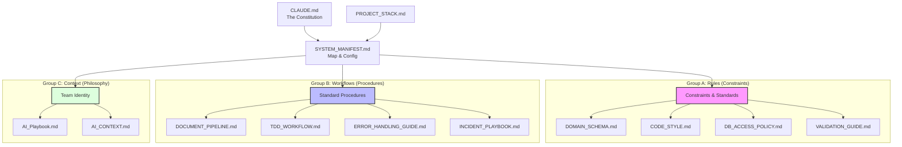
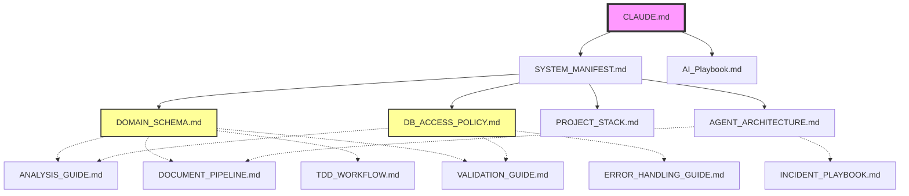
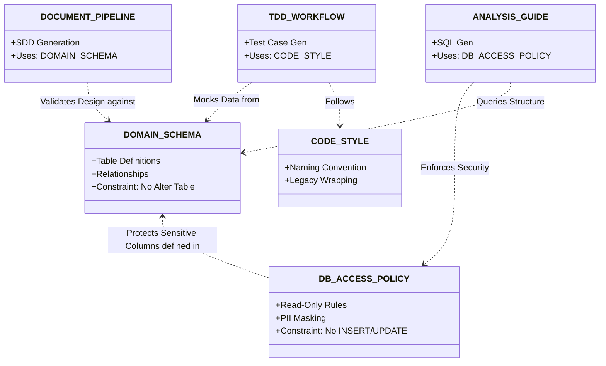
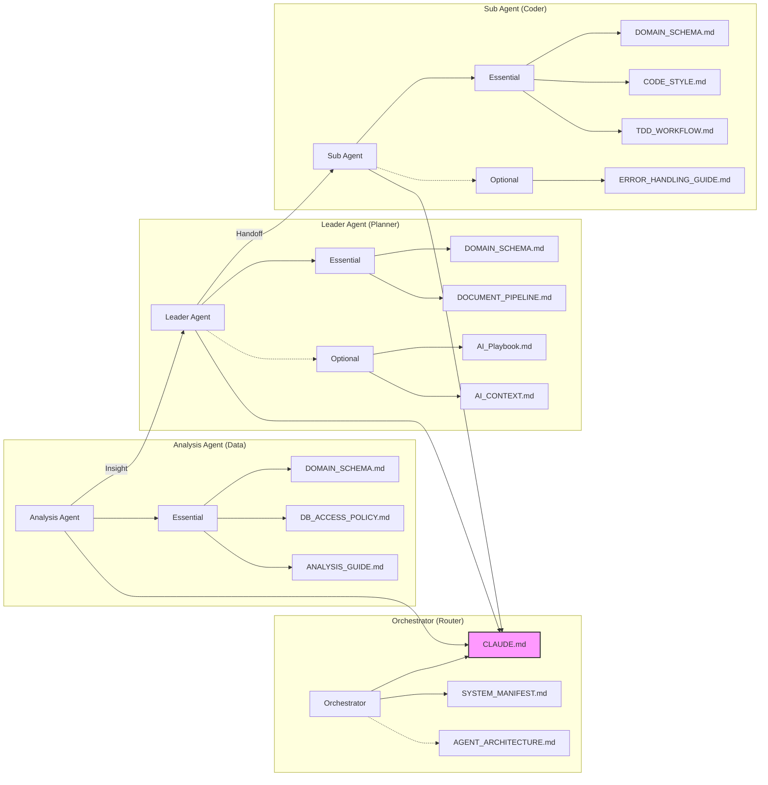

# SYSTEM_MANIFEST.md (System B Control Tower)

**Version**: 4.4.1
**Last Updated**: 2025-12-24
**Role**: Orchestrator's Configuration Map & Human Guide

## 1. System Identity

We are **ATO-System-B v2.0**, a Human-in-the-Loop AI Orchestration System.

| Component               | Version           | Description                                |
| :---------------------- | :---------------- | :----------------------------------------- |
| **System Identity**     | ATO-System-B v2.0 | 리브랜딩 완료 (Medi-Notion → ATO-System-B) |
| **Orchestrator Engine** | v4.0.0            | Leader-Sub Agent 협업 엔진                 |
| **Document Standard**   | MANIFEST v4.2.0   | 본 문서 (Single Source of Truth)           |

## 2. Document Map (The New Address Book)

Orchestrator는 작업 모드에 따라 아래 경로에서 문서를 로드합니다.

### Group A: Rules (Constraints)

엄격하게 준수해야 하는 제약 사항

| Priority | Path                                | Description                                |
| :------- | :---------------------------------- | :----------------------------------------- |
| P0       | `.claude/rules/CODE_STYLE.md`       | 코딩 컨벤션 및 스타일 가이드               |
| P0       | `.claude/rules/DOMAIN_SCHEMA.md`    | 데이터베이스 스키마 정의 (Source of Truth) |
| P0       | `.claude/rules/VALIDATION_GUIDE.md` | 품질 검증 기준                             |
| P1       | `.claude/rules/TDD_WORKFLOW.md`     | 테스트 주도 개발 절차 (Red-Green-Refactor) |
| P1       | `.claude/rules/DB_ACCESS_POLICY.md` | DB 접근 권한 및 보안 정책                  |
| P1       | `.claude/rules/ANALYSIS_GUIDE.md`   | 데이터 분석 가이드                         |

### Group B: Workflows (Processes)

작업 순서와 협업 절차

| Priority | Path                                        | Description                                |
| :------- | :------------------------------------------ | :----------------------------------------- |
| P0       | `.claude/workflows/DOCUMENT_PIPELINE.md`    | PRD → SDD → Code 문서 생성 파이프라인      |
| P0       | `.claude/workflows/AGENT_ARCHITECTURE.md`   | Leader & Sub-agent 역할 및 HITL 체크포인트 |
| P1       | `.claude/workflows/INCIDENT_PLAYBOOK.md`    | 장애 대응 및 복구 절차                     |
| P1       | `.claude/workflows/PRD_GUIDE.md`            | 요구사항 정의 가이드                       |
| P1       | `.claude/workflows/ERROR_HANDLING_GUIDE.md` | 에러 처리 및 예외 관리 가이드              |

### Group C: Context (Philosophy)

팀의 철학 및 행동 강령

| Priority | Path                             | Description                       |
| :------- | :------------------------------- | :-------------------------------- |
| Root     | `CLAUDE.md`                      | 시스템 최상위 헌법 (Safety Rules) |
| Key      | `.claude/context/AI_Playbook.md` | 팀의 철학 및 목표 (Why)           |
| Key      | `.claude/context/AI_CONTEXT.md`  | 에이전트 세부 행동 수칙           |

### 2.1 Document Hierarchy Map

시스템 문서의 분류 체계와 계층 구조입니다.



### 2.2 Document Topology (Dependency Map)

문서 간의 위계와 의존성 관계도입니다. 상위 문서(화살표 시작점)가 수정되면 하위 문서(화살표 끝점)의 정합성을 검토해야 합니다.



### 2.3 Rule-Workflow Interaction Matrix

핵심 규칙(Rules)이 실제 워크플로우(Workflows)를 어떻게 제어하는지 보여주는 논리적 상호작용도입니다.
`DOMAIN_SCHEMA`는 모든 설계와 구현의 기준점(Anchor)입니다.



## 3. Agent별 필수 로딩 문서

각 Agent는 역할에 따라 아래 문서를 로드합니다. 모든 Agent는 `CLAUDE.md`를 필수 로드합니다.

| Agent/Skill          | 필수 로딩 문서                                           | 선택 로딩 문서          |
| :------------------- | :------------------------------------------------------- | :---------------------- |
| **Orchestrator**     | SYSTEM_MANIFEST.md                                       | AGENT_ARCHITECTURE.md   |
| **Leader**           | DOMAIN_SCHEMA.md, DOCUMENT_PIPELINE.md                   | AI_Playbook.md          |
| **coder** (Skill)    | DOMAIN_SCHEMA.md, CODE_STYLE.md, TDD_WORKFLOW.md         | ERROR_HANDLING_GUIDE.md |
| **query** (Skill)    | DOMAIN_SCHEMA.md, DB_ACCESS_POLICY.md, ANALYSIS_GUIDE.md | -                       |
| **designer** (Skill) | DOCUMENT_PIPELINE.md, PRD_GUIDE.md                       | AI_Playbook.md          |
| **doc-sync** (Skill) | DOCUMENT_PIPELINE.md                                     | PRD_GUIDE.md            |
| **profiler** (Skill) | DOMAIN_SCHEMA.md, ANALYSIS_GUIDE.md                      | -                       |
| **reviewer** (Skill) | VALIDATION_GUIDE.md, CODE_STYLE.md                       | TDD_WORKFLOW.md         |
| **viewer** (Skill)   | SYSTEM_MANIFEST.md                                       | -                       |

### 3-1. Context Loading Topology



### 3.2 Skill-Agent 용어 매핑

Skill과 Agent(역할 기반) 간 용어 매핑입니다.

| Skill    | 호출 Agent             | 설명                    |
| :------- | :--------------------- | :---------------------- |
| coder    | SubAgent (Coding Mode) | 코드 구현 담당          |
| query    | AnalysisAgent          | SQL 쿼리 및 데이터 분석 |
| profiler | AnalysisAgent          | 프로필 분석             |
| designer | Leader (Planning Mode) | 시각화 고도화           |
| doc-sync | Leader                 | 문서 동기화             |
| reviewer | OutputValidator        | 산출물 검증             |
| viewer   | (Orchestrator)         | 웹 뷰어 (LLM 미사용)    |

> **토큰 최적화**: 상세 토큰 예산은 `AGENT_ARCHITECTURE.md`의 **Agent 로딩 전략** 섹션을 참조하세요.

## 4. Context Mode Loading Strategy

Orchestrator는 PRD 분석 결과에 따라 자동으로 적절한 모드를 선택합니다.

| 모드         | 로딩 문서                           | 트리거 조건        |
| :----------- | :---------------------------------- | :----------------- |
| **Planning** | Group C + DOCUMENT_PIPELINE.md      | PRD 작성/분석 요청 |
| **Coding**   | Group A + TDD_WORKFLOW.md           | 구현/수정 요청     |
| **Review**   | Group A (VALIDATION) + PRD_GUIDE.md | 검토/QA 요청       |

## 5. Skill Registry (v2.5.0)

7개 스킬이 `orchestrator/skills/` 하위에 정의되어 있습니다.

> **네이밍 규칙 (v2.5.0)**: Skill 이름에서 `-agent` 접미사 제거. `agent`는 LLM 기반 실행 주체에만 사용.

| Skill    | Version | Status | 설명                      |
| :------- | :------ | :----- | :------------------------ |
| query    | v1.2.0  | Ready  | SQL 쿼리 생성 및 실행     |
| coder    | v1.3.0  | Ready  | 설계 문서 기반 코드 구현  |
| designer | v2.2.0  | Ready  | 시각화 고도화 (MD → HTML) |
| doc-sync | v2.1.0  | Ready  | 로컬 ↔ Notion 동기화      |
| profiler | v1.2.0  | Ready  | 회원 프로필 분석          |
| reviewer | v1.2.0  | Ready  | 산출물 품질 검증          |
| viewer   | v1.5.0  | Ready  | 웹 뷰어 API               |

### 5.1 레거시 매핑 (하위 호환성)

| 기존 이름 (Deprecated) | 새 이름  |
| :--------------------- | :------- |
| query-agent            | query    |
| code-agent             | coder    |
| design-agent           | designer |
| doc-agent              | doc-sync |
| profile-agent          | profiler |
| review-agent           | reviewer |
| viewer-agent           | viewer   |

## 6. Workspace Paths (런타임 임시 저장소)

> ⚠️ **Deprecated (v4.3.0)**: `workspace/analysis/`는 `docs/cases/{caseId}/analysis/`로 통합되었습니다.

| Path                  | Description                   | Status                                           |
| :-------------------- | :---------------------------- | :----------------------------------------------- |
| `workspace/logs/`     | 실행 로그, HITL 승인 로그     | Active                                           |
| `workspace/sessions/` | 세션 데이터                   | Active                                           |
| `workspace/analysis/` | ~~분석 결과물~~               | **Deprecated** → `docs/cases/{caseId}/analysis/` |
| `workspace/features/` | 피처별 산출물 (dr-insight 등) | Active                                           |

## 7. Docs Paths (Case-Centric 통합 저장소)

**Case-Centric 전략 (v4.3.0)**: 모든 산출물은 `docs/cases/{caseId}/`에 통합 저장됩니다.

| Path                            | Description                                              |
| :------------------------------ | :------------------------------------------------------- |
| `docs/cases/{caseId}/`          | **통합 산출물 폴더** (PRD 스냅샷 포함)                   |
| `docs/cases/{caseId}/PRD.md`    | 실행 시점 PRD 스냅샷 (`.claude/project/PRD.md`에서 복사) |
| `docs/cases/{caseId}/analysis/` | **[New]** 데이터 분석 결과 (SQL, JSON, 리포트)           |
| `docs/cases/{caseId}/visuals/`  | 시각화 산출물 (HTML)                                     |
| `docs/architecture/`            | 시스템 아키텍처 설계 문서                                |

### 7.1 PRD 스냅샷 전략

```
입력 (Input Slot)              실행 시 복사              산출물 (Archive)
.claude/project/PRD.md  ──────────────────────>  docs/cases/{caseId}/PRD.md
                               (Snapshot)
```

- **입력**: 사용자가 `.claude/project/PRD.md`에 작성
- **실행**: Orchestrator 시작 시 `docs/cases/{caseId}/PRD.md`로 복사
- **참조**: 모든 Agent는 `docs/cases/{caseId}/PRD.md`를 SSOT로 사용

## 8. Service Paths (코드 저장소)

ATO-System-B v2.0의 실제 코드 구조입니다. 에이전트는 이 경로들에 대한 쓰기 권한을 가집니다.

| Path            | Description                     | Agent Access         |
| :-------------- | :------------------------------ | :------------------- |
| `backend/src/`  | Express API 서버                | ✅ code-agent        |
| `frontend/src/` | React 프론트엔드                | ✅ code-agent        |
| `orchestrator/` | 오케스트레이터 엔진             | ⚠️ 제한적 (skills만) |
| `mcp-server/`   | MCP 서버 모듈                   | ✅ code-agent        |
| `src/`          | 레거시 코드 (마이그레이션 대상) | ⚠️ 읽기 전용         |

## 9. 문서 작성 규칙

### 9.1 섹션 제목 변경 정책

다른 문서에서 참조되는 섹션 제목은 **변경 시 PO 승인 필수**입니다.

| 문서                    | 참조되는 섹션 제목                                       |
| :---------------------- | :------------------------------------------------------- |
| `AGENT_ARCHITECTURE.md` | "Agent 로딩 전략", "Agent 역할 정의"                     |
| `SYSTEM_MANIFEST.md`    | "Context Mode", "Document Map", "Agent별 필수 로딩 문서" |
| `DOMAIN_SCHEMA.md`      | "핵심 레거시 스키마", "보안 및 접근 제어"                |
| `VALIDATION_GUIDE.md`   | "보안 게이트"                                            |
| `CODE_STYLE.md`         | "필수 조건"                                              |

### 9.2 참조 형식

섹션 번호 대신 섹션 이름으로 참조하여 순서 변경에 강건하게 합니다.

```markdown
# ❌ Bad - 섹션 번호로 참조 (순서 변경 시 깨짐)

**`AGENT_ARCHITECTURE.md` 섹션 0**을 참조하세요.

# ✅ Good - 섹션 이름으로 참조

**`AGENT_ARCHITECTURE.md`의 Agent 로딩 전략 섹션**을 참조하세요.
```
