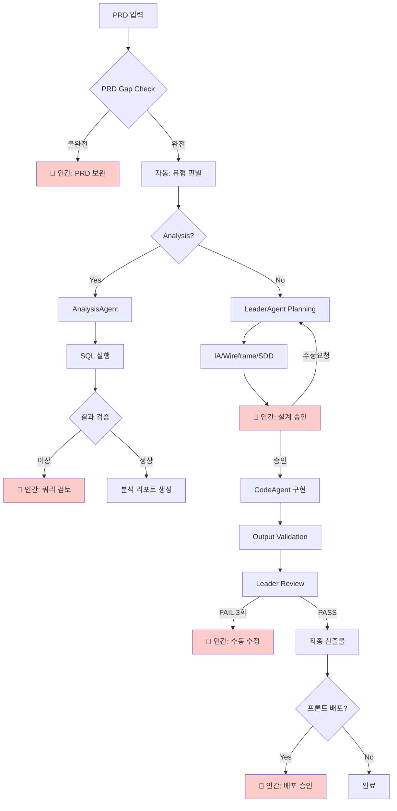

# AGENT_ARCHITECTURE.md

> **문서 버전**: 2.2.1
> **최종 업데이트**: 2025-12-22
> **물리적 경로**: `.claude/workflows/AGENT_ARCHITECTURE.md`
> **변경 이력**: 레거시 src/ 경로 완전 제거 - 디렉토리 구조도 현행화
> **상위 문서**: `CLAUDE.md` > **대상 Agent**: Orchestrator, Leader, SubAgent, OutputValidator

---

## 0. Agent 로딩 설정

### 0.1 섹션별 로딩 대상

| 섹션                         | 대상 Agent       | 필수 여부 |
| ---------------------------- | ---------------- | --------- |
| 섹션 1 (아키텍처 개요)       | Orchestrator     | 필수      |
| 섹션 2 (협업 사이클)         | 참조용           | 선택      |
| 섹션 3.1 (Orchestrator 역할) | Orchestrator     | 필수      |
| 섹션 3.2 (Leader 역할)       | Leader           | 필수      |
| 섹션 3.3 (SubAgent 역할)     | SubAgent         | 필수      |
| 섹션 4 (Multi-LLM Provider)  | Orchestrator     | 선택      |
| 섹션 5 (보안 아키텍처)       | 모든 Agent       | 권장      |
| 섹션 6 (Handoff 프로토콜)    | Leader, SubAgent | 필수      |
| 섹션 7-10 (사용법 등)        | 사용자 참조용    | -         |

### 0.2 로딩 우선순위

**필수 로딩 (모든 실행에서)**

- 자신의 역할 정의 섹션 (3.1 / 3.2 / 3.3)
- Handoff 프로토콜 (섹션 6) - Leader/SubAgent만

**선택 로딩 (필요시)**

- 보안 아키텍처 (섹션 5) - 보안 검증 필요 시
- 재시도 정책 (섹션 10) - 에러 발생 시

### 0.3 Agent별 로딩 예상 토큰

| Agent               | 로딩 섹션          | 예상 토큰 |
| ------------------- | ------------------ | --------- |
| **Leader**          | 섹션 3.2, 섹션 6   | ~800      |
| **SubAgent**        | 섹션 3.3, 섹션 6   | ~600      |
| **Orchestrator**    | 섹션 1, 3.1, 5, 10 | ~1,200    |
| **OutputValidator** | 섹션 5.1 Layer 3   | ~300      |

### 0.4 Task ID 네이밍 규칙

**형식**: `{prefix}-{keyword}-{timestamp}`

| 패턴            | 예시                              | 설명                    |
| --------------- | --------------------------------- | ----------------------- |
| Case 분석       | `case4-active-user-1766119848270` | Case 번호 + 핵심 키워드 |
| 설계 케이스     | `recruit-agent-1766031235704`     | 기능명                  |
| 혼합 케이스     | `case5-dormancy-1766037994472`    | Case 번호 + 핵심 키워드 |
| 기본 (fallback) | `task-1766113510884`              | 키워드 추출 실패 시     |

**키워드 자동 추출** (orchestrator.js `generateFriendlyTaskId`):

```javascript
keywords: [
  { pattern: /채용|recruit|job/i, name: "recruit" },
  { pattern: /휴면|dormancy|dormant/i, name: "dormancy" },
  { pattern: /활성|active|heavy/i, name: "active-user" },
  { pattern: /분석|analysis|analyze/i, name: "analysis" },
  { pattern: /설계|design/i, name: "design" },
  { pattern: /예측|predict/i, name: "predict" },
  { pattern: /추천|recommend/i, name: "recommend" },
];
```

**Viewer 표시 규칙** (`formatters.ts`):

- timestamp 제외하고 의미있는 이름만 표시
- 예: `case5-dormancy-1766037994472` → `case5-dormancy`
- fallback: `task-1766113510884` → `task-510884`

**산출물 경로 규칙** (SYSTEM_MANIFEST v4.1.0 준수, Flatten 구조 2025-12-23):

```
docs/cases/{caseId}/               # 케이스 설계 문서 (PRD, IA, SDD, Wireframe, HANDOFF)
docs/cases/{caseId}/visuals/       # 시각화 산출물 (HTML)
workspace/analysis/{task-id}/      # 분석 결과 (SQL, JSON, 리포트)
workspace/features/{feature}/      # 피처별 산출물
backend/src/{feature}/             # 백엔드 구현 코드
frontend/src/{feature}/            # 프론트엔드 구현 코드
workspace/logs/{task-id}.json      # 실행 로그
```

**caseId 추출 규칙**:
- `case5-dormancy-20251223` → `case5-dormancy` (날짜 8자리 제거)
- `case5-dormancy-1766037994472` → `case5-dormancy` (타임스탬프 13자리 제거)

**금지 패턴**:

- ❌ `test-1`, `temp` (의미없는 이름)
- ❌ 특수문자 포함 (`task@#$%`)

---

## 0.5 전체 파이프라인 플로우 (HITL 포함)

> 🔴 빨간색 노드 = Human-in-the-Loop 체크포인트



### HITL 체크포인트 요약

| 체크포인트    | 노드 | 트리거 조건                                  | 인간 액션                    |
| ------------- | ---- | -------------------------------------------- | ---------------------------- |
| **PRD 보완**  | C    | PRD Gap Check 불완전 (필수 항목 누락)        | PRD 필수 항목 보완 후 재시작 |
| **쿼리 검토** | J    | SQL 결과 이상 (0행, 타임아웃, 스키마 불일치) | 쿼리 수정 또는 승인          |
| **설계 승인** | M    | IA/Wireframe/SDD 생성 완료                   | 설계 검토 및 승인/수정요청   |
| **수동 수정** | Q    | 3회 연속 Review FAIL                         | 직접 수정 또는 방향 조정     |
| **배포 승인** | T    | 프론트엔드 배포 필요 시                      | 최종 배포 승인               |

### 자동 중단 트리거

```yaml
PRD Gap Check:
  - 필수 6개 항목 중 누락 존재
  - type/pipeline 불일치

SQL 결과 검증:
  - 결과 행 0개
  - 쿼리 타임아웃 (30초 초과)
  - DOMAIN_SCHEMA.md와 컬럼 불일치

Output Validation:
  - PRD 체크리스트 매칭률 < 80%
  - 보안 게이트 위반 (Protected Path 접근)
  - 재시도 횟수 >= 3회
```

---

## 1. 아키텍처 개요

### 1.1 핵심 원칙

```
┌─────────────────────────────────────────────────────────────────────────────┐
│  🎯 Orchestrator 중심 아키텍처 원칙                                           │
├─────────────────────────────────────────────────────────────────────────────┤
│                                                                             │
│  1. Orchestrator = 단일 제어점 (Single Control Point)                        │
│     • 모든 에이전트 실행은 Orchestrator를 통해서만 발생                           │
│     • MCP Server 불필요 - 직접 API 호출 방식                                    │
│                                                                             │
│  2. Multi-LLM Provider 지원                                                  │
│     • Claude (Primary) → GPT-4 → Gemini (Fallback Chain)                    │
│     • 아키텍처 변경 없이 LLM 교체 가능                                           │
│                                                                             │
│  3. 보안 우선 (Security First)                                               │
│     • 입력 검증 (Path Traversal, Prompt Injection 방어)                       │
│     • 출력 검증 (Protected Path 보호)                                         │
│     • 감사 로깅 (Audit Trail)                                                │
│                                                                             │
└─────────────────────────────────────────────────────────────────────────────┘
```

### 1.2 시스템 다이어그램

```
┌─────────────────────────────────────────────────────────────────────────────┐
│         Orchestrator-Centric Multi-LLM Architecture (v3.2.0)                │
└─────────────────────────────────────────────────────────────────────────────┘

┌─────────────────────────────────────────────────────────────────────────────┐
│  📥 INPUT                                                                   │
│  ─────────────────────────────────────────────────────────────────────────  │
│  • 사용자 요청 (자연어)                                                       │
│  • Lightweight PRD (15줄 이내)                                               │
│  • 제약사항 & 성공기준                                                        │
└─────────────────────────────────────────────────────────────────────────────┘
                                     │
                                     ▼
┌─────────────────────────────────────────────────────────────────────────────┐
│  🎛️ ORCHESTRATOR (orchestrator.js)                                          │
│  ═══════════════════════════════════════════════════════════════════════════│
│                                                                             │
│  역할: 전체 워크플로우 제어 + 보안 검증                                          │
│                                                                             │
│  ┌─────────────────────────────────────────────────────────────────────┐    │
│  │  Security Layer (v3.2.0)                                            │    │
│  │  • validateTaskId()      - Path Traversal 방지                       │    │
│  │  • sanitizeTaskDescription() - 입력 길이 제한 (10,000자)               │    │
│  │  • sanitizePrdContent()  - PRD 길이 제한 (50,000자)                   │    │
│  │  • validateFilePath()    - 경로 검증                                  │    │
│  │  • checkRateLimit()      - 20회/시간 제한                             │    │
│  └─────────────────────────────────────────────────────────────────────┘    │
│                                                                             │
│  ┌─────────────────────────────────────────────────────────────────────┐    │
│  │  Provider Factory                                                   │    │
│  │  • Anthropic (Claude) ─► Primary                                    │    │
│  │  • OpenAI (GPT-4)     ─► Fallback #1                                │    │
│  │  • Google (Gemini)    ─► Fallback #2                                │    │
│  └─────────────────────────────────────────────────────────────────────┘    │
│                                                                             │
└─────────────────────────────────────────────────────────────────────────────┘
          │                                             ▲
          │ run()                                       │ results
          ▼                                             │
┌─────────────────────────────────────────────────────────────────────────────┐
│  🧠 LEADER AGENT (leader.js)                                                │
│  ═══════════════════════════════════════════════════════════════════════════│
│                                                                             │
│  역할: Thinking / Planning / Review                                          │
│  • 직접적인 코드 실행 책임 없음                                                 │
│                                                                             │
│  ┌─────────────────────────────────────────────────────────────────────┐    │
│  │  Security (Prompt Injection Defense)                                │    │
│  │  • sanitizeUserInput()   - 위험 패턴 필터링                            │    │
│  │  • wrapUserContent()     - 경계 마커로 감싸기                          │    │
│  │    ───USER_INPUT_START───                                           │    │
│  │    (user content)                                                   │    │
│  │    ───USER_INPUT_END───                                             │    │
│  └─────────────────────────────────────────────────────────────────────┘    │
│                                                                             │
│  [Planning Mode]                    [Review Mode]                           │
│  ┌─────────────────────┐           ┌─────────────────────┐                  │
│  │ • 요구사항 분석        │           │ • 코드 리뷰            │                 │
│  │ • IA.md 생성          │           │ • QUALITY_GATES 검증  │                 │
│  │ • Wireframe.md 생성   │           │ • 피드백 생성          │                 │
│  │ • SDD.md 생성         │           │ • PASS/FAIL 판정      │                 │
│  │ • HANDOFF.md 생성     │           │                      │                 │
│  └─────────────────────┘           └─────────────────────┘                  │
│                                                                             │
│  Context: CLAUDE.md + AI_Playbook.md + DOMAIN_SCHEMA.md + DOCUMENT_PIPELINE │
└─────────────────────────────────────────────────────────────────────────────┘
          │                                             ▲
          │ 📋 HANDOFF.md                               │ 📤 Code + Tests
          ▼                                             │
┌─────────────────────────────────────────────────────────────────────────────┐
│  ⚙️ SUB-AGENT (subagent.js)                                                 │
│  ═══════════════════════════════════════════════════════════════════════════│
│                                                                             │
│  역할: 실행 엔진 (코드 생성)                                                   │
│  • 승인된 계획만 실행                                                          │
│  • 아키텍처 판단/결정 권한 없음                                                  │
│                                                                             │
│  ┌─────────────────────────────────────────────────────────────────────┐    │
│  │  Security (Output Validation)                                       │    │
│  │  • validateOutput()      - 출력 파일 경로 검증                         │    │
│  │    ✗ Path Traversal (../)                                           │    │
│  │    ✗ Absolute Path (/etc/passwd)                                    │    │
│  │    ✗ Protected Path (.claude/{rules,workflows,context}/*)           │    │
│  └─────────────────────────────────────────────────────────────────────┘    │
│                                                                             │
│  [Coding Mode]                                                              │
│  ┌─────────────────────────────────────────────────────────────────────┐    │
│  │  INPUT (from Leader)          OUTPUT (to Leader)                    │    │
│  │  ───────────────────          ─────────────────                     │    │
│  │  • HANDOFF.md                 • backend/src/{feature}/*.ts          │    │
│  │  • IA.md                      • frontend/src/{feature}/*.tsx        │    │
│  │  • SDD.md                     • **/tests/*.test.ts                  │    │
│  └─────────────────────────────────────────────────────────────────────┘    │
│                                                                             │
│  🚨 제약사항 (강제 규칙):                                                      │
│  ┌─────────────────────────────────────────────────────────────────────┐    │
│  │ ❌ .claude/{rules, workflows, context}/* 수정 금지                    │    │
│  │ ❌ 아키텍처 임의 변경 금지                                               │    │
│  │ ❌ 서버 DB INSERT/UPDATE/DELETE 금지                                   │    │
│  │ ✅ SELECT만 허용 → 로컬에서 작업                                         │    │
│  └─────────────────────────────────────────────────────────────────────┘    │
│                                                                             │
│  Context: CLAUDE.md + DOMAIN_SCHEMA.md + TDD_WORKFLOW.md + CODE_STYLE.md    │
└─────────────────────────────────────────────────────────────────────────────┘
```

---

## 2. 협업 사이클 (Orchestrator 자동화)

```
┌─────────────────────────────────────────────────────────────────────────────┐
│  🔄 자동화된 협업 사이클                                                       │
│  ═══════════════════════════════════════════════════════════════════════════│
│                                                                             │
│  ┌────────────┐                                                             │
│  │ 1. 입력    │ ─── 사용자 개입 (1회만)                                        │
│  │ (User)     │     Task Description + PRD (optional)                       │
│  └─────┬──────┘                                                             │
│        │                                                                    │
│        ▼                                                                    │
│  ┌────────────┐     ┌────────────┐     ┌─────────────┐     ┌────────────┐  ┌────────────┐ │
│  │ 2. 계획    │ ──► │ 3. 구현    │ ──► │ 3.5 Output  │ ──► │ 4. 검증    │ ─►│ 5. 완료    │ │
│  │ (Leader)   │     │ (Sub)      │     │ Validation  │     │ (Leader)   │  │            │ │
│  └────────────┘     └────────────┘     └─────────────┘     └─────┬──────┘  └────────────┘ │
│        │                 │                   │                   │                        │
│        ▼                 ▼                   ▼                   ▼                        │
│   IA.md         backend/src/*.ts     PRD 체크리스트       PASS? ──┬── YES → 완료          │
│   Wireframe.md  frontend/src/*.tsx   6/6 매칭 확인              │                        │
│   SDD.md        **/tests/*.ts        (3단계 매칭)                └── NO → 재시도 (최대 5회)│
│   HANDOFF.md                                                                             │
│                                                                             │
└─────────────────────────────────────────────────────────────────────────────┘
```

---

## 3. 역할 정의

### 3.1 Orchestrator (orchestrator.js)

| 항목     | 내용                                                |
| -------- | --------------------------------------------------- |
| **역할** | 전체 제어 + 보안 게이트웨이                         |
| **담당** | 입력 검증, 에이전트 실행, 재시도 관리, 로그 저장    |
| **보안** | Rate Limiting, Path Traversal 방지, 입력 새니타이징 |

### 3.2 Leader Agent (leader.js)

| 항목     | 내용                                                     |
| -------- | -------------------------------------------------------- |
| **역할** | 설계자 + 검증자                                          |
| **Mode** | Planning Mode, Review Mode                               |
| **담당** | IA/Wireframe/SDD/HANDOFF 생성, 코드 리뷰, PASS/FAIL 판정 |
| **보안** | Prompt Injection 방어 (wrapUserContent)                  |
| **권한** | `.claude/project/*` 수정 가능                            |

### 3.3 Sub-agent (subagent.js)

| 항목     | 내용                                                           |
| -------- | -------------------------------------------------------------- |
| **역할** | 구현자                                                         |
| **Mode** | Coding Mode                                                    |
| **담당** | 코드 작성, 테스트 작성                                         |
| **보안** | Output Validation (Protected Path 보호)                        |
| **권한** | `backend/src/*`, `frontend/src/*`, `mcp-server/*` 수정 가능    |
| **제약** | `.claude/{rules, workflows, context}/*`, `orchestrator/` 수정 금지 |

---

## 4. Multi-LLM Provider 패턴

### 4.1 Provider 구조

```
orchestrator/providers/
├── base.js          # 추상 인터페이스
├── anthropic.js     # Claude API (Primary)
├── openai.js        # GPT-4 API (Fallback #1)
├── gemini.js        # Gemini API (Fallback #2)
├── factory.js       # Provider Factory + Fallback Chain
└── index.js         # 통합 내보내기
```

### 4.2 Fallback Chain

```
┌─────────────────────────────────────────────────────────────────────────────┐
│  🔄 Provider Fallback Chain                                                 │
├─────────────────────────────────────────────────────────────────────────────┤
│                                                                             │
│    ┌──────────────┐     FAIL     ┌──────────────┐     FAIL     ┌─────────┐ │
│    │   Claude     │ ──────────►  │    GPT-4     │ ──────────►  │ Gemini  │ │
│    │  (Primary)   │              │ (Fallback 1) │              │ (FB 2)  │ │
│    └──────────────┘              └──────────────┘              └─────────┘ │
│           │                             │                           │      │
│           ▼                             ▼                           ▼      │
│        SUCCESS                       SUCCESS                     SUCCESS   │
│                                                                             │
│    환경변수:                                                                  │
│    • ANTHROPIC_API_KEY (Claude)                                             │
│    • OPENAI_API_KEY (GPT-4)                                                 │
│    • GOOGLE_API_KEY (Gemini)                                                │
│                                                                             │
└─────────────────────────────────────────────────────────────────────────────┘
```

### 4.3 Provider 설정

```javascript
// orchestrator.js 생성자
const orchestrator = new Orchestrator({
  provider: "anthropic", // Primary provider
  fallbackOrder: ["anthropic", "openai", "gemini"],
  useFallback: true, // Fallback 활성화
  providerConfig: {
    anthropic: { model: "claude-sonnet-4-20250514" },
    openai: { model: "gpt-4-turbo-preview" },
    gemini: { model: "gemini-pro" },
  },
});
```

---

## 5. 보안 아키텍처 (v3.2.0)

### 5.1 보안 계층

```
┌─────────────────────────────────────────────────────────────────────────────┐
│  🔒 Security Layers                                                         │
├─────────────────────────────────────────────────────────────────────────────┤
│                                                                             │
│  Layer 1: Input Validation (Orchestrator)                                   │
│  ┌───────────────────────────────────────────────────────────────────────┐  │
│  │ • validateTaskId()     : ../../../ 차단, 특수문자 제한                    │  │
│  │ • sanitizeTaskDescription() : 10,000자 제한                             │  │
│  │ • sanitizePrdContent() : 50,000자 제한                                  │  │
│  │ • validateFilePath()   : projectRoot 외부 경로 차단                      │  │
│  │ • checkRateLimit()     : 20회/시간 제한                                  │  │
│  └───────────────────────────────────────────────────────────────────────┘  │
│                                                                             │
│  Layer 2: Prompt Injection Defense (Leader)                                 │
│  ┌───────────────────────────────────────────────────────────────────────┐  │
│  │ • DANGEROUS_PATTERNS 필터링:                                            │  │
│  │   - ignore previous instructions                                       │  │
│  │   - disregard all rules                                                │  │
│  │   - you are now                                                        │  │
│  │   - system prompt                                                      │  │
│  │ • wrapUserContent(): 경계 마커로 사용자 입력 격리                          │  │
│  └───────────────────────────────────────────────────────────────────────┘  │
│                                                                             │
│  Layer 3: Output Validation (Sub-agent)                                     │
│  ┌───────────────────────────────────────────────────────────────────────┐  │
│  │ • Path Traversal 거부 (../)                                            │  │
│  │ • Absolute Path 거부 (/etc/passwd)                                     │  │
│  │ • Protected Path 거부 (.claude/rules/*, .claude/workflows/*)           │  │
│  └───────────────────────────────────────────────────────────────────────┘  │
│                                                                             │
│  Layer 4: Audit & Integrity (Utils)                                         │
│  ┌───────────────────────────────────────────────────────────────────────┐  │
│  │ • AuditLogger: 보안 이벤트 추적, 민감정보 마스킹                           │  │
│  │ • RulebookValidator: .claude/rules/*, workflows/* SHA256 해시 검증   │  │
│  │ • HandoffValidator: HANDOFF 프로토콜 스키마 + 보안 검증                   │  │
│  └───────────────────────────────────────────────────────────────────────┘  │
│                                                                             │
└─────────────────────────────────────────────────────────────────────────────┘
```

### 5.2 보안 유틸리티

```
orchestrator/utils/
├── audit-logger.js       # 감사 로깅 (민감정보 마스킹)
├── rulebook-validator.js # 룰북 해시 무결성 검증
├── handoff-validator.js  # HANDOFF 프로토콜 검증
└── index.js              # 통합 내보내기
```

| 유틸리티              | 역할                                                   |
| --------------------- | ------------------------------------------------------ |
| **AuditLogger**       | 보안 이벤트 기록, API 키/이메일 마스킹                 |
| **RulebookValidator** | 룰북 폴더(`rules`, `workflows`, `context`) 무결성 검증 |
| **HandoffValidator**  | HANDOFF 필수 섹션 확인, 악의적 지시 필터링             |

---

## 6. Handoff 프로토콜

### 6.1 Leader → Sub-agent (HANDOFF.md)

```markdown
## Mode

Coding

## Input

- docs/task-1/IA.md
- docs/task-1/SDD.md
- DOMAIN_SCHEMA.md

## Output

- backend/src/features/login/index.ts
- backend/tests/login.test.ts

## Constraints

- TypeScript 필수
- TDD 방식
- DOMAIN_SCHEMA.md 컬럼명 준수

## CompletionCriteria

- 빌드 성공
- 테스트 PASS
```

### 6.2 Sub-agent → Leader (완료 보고)

```markdown
## 완료 보고: login-feature

### 생성된 파일

- backend/src/features/login/index.ts
- backend/tests/login.test.ts

### 실행 결과

- 테스트: PASS (5/5)
- 타입체크: PASS

### 이슈

- 없음
```

### 6.3 HandoffValidator 검증 항목

| 검증          | 내용                                          |
| ------------- | --------------------------------------------- |
| **필수 섹션** | Mode, Input, Output, Constraints              |
| **Mode 값**   | coding, review, test, refactor, debug 중 하나 |
| **보안 패턴** | "ignore previous", "bypass security" 등 차단  |

---

## 7. 파일 구조

```
Medi-Notion/
├── .claude/
│   ├── rules/ ───────────── 🔴 READ ONLY (Constraint Layer)
│   │   ├── CODE_STYLE.md
│   │   ├── DOMAIN_SCHEMA.md
│   │   ├── QUALITY_GATES.md
│   │   ├── DB_ACCESS_POLICY.md
│   │   └── VALIDATION_GUIDE.md
│   │
│   ├── workflows/ ───────── 🔴 READ ONLY (Process Layer)
│   │   ├── AGENT_ARCHITECTURE.md  ← 현재 문서
│   │   ├── DOCUMENT_PIPELINE.md
│   │   ├── SYSTEM_MANIFEST.md
│   │   └── PRD_GUIDE.md
│   │
│   ├── context/ ─────────── 🔴 READ ONLY (Philosophy Layer)
│   │   ├── AI_Playbook.md
│   │   └── AI_CONTEXT.md
│   │
│   ├── project/ ─────────── 🟢 WRITABLE (Leader만)
│   │   ├── PRD.md
│   │   └── PROJECT_STACK.md
│   │
│   └── state/ ───────────── 🟢 자동 업데이트
│       └── handoff-status.json
│
├── orchestrator/ ────────── 🎛️ 오케스트레이터
│   ├── orchestrator.js      # 메인 제어
│   ├── index.js             # CLI 엔트리포인트
│   │
│   ├── agents/
│   │   ├── leader.js        # Leader Agent
│   │   ├── subagent.js      # Sub-agent (Claude Native)
│   │   ├── prd-analyzer.js  # PRD Gap Check
│   │   └── output-validator.js # 산출물 검증
│   │
│   ├── providers/           # Multi-LLM Provider
│   │   ├── base.js
│   │   ├── anthropic.js
│   │   ├── openai.js
│   │   ├── gemini.js
│   │   ├── factory.js
│   │   └── index.js
│   │
│   ├── utils/               # 보안 유틸리티
│   │   ├── audit-logger.js
│   │   ├── rulebook-validator.js
│   │   ├── handoff-validator.js
│   │   └── index.js
│   │
│   ├── viewer/              # 결과 뷰어 (v3.3.0)
│   │   └── server.js        # Express 서버 (localhost:3000)
│   │
│   ├── tests/
│   │   └── security.test.js
│   │
│   └── logs/                # 실행 로그
│       └── audit/
│
├── docs/<task-id>/          # 설계 문서 (자동 생성)
│   ├── IA.md
│   ├── Wireframe.md
│   ├── SDD.md
│   └── HANDOFF.md
│
├── backend/src/             # 백엔드 API (Sub-agent 작업 영역)
│   └── {feature}/
│
└── frontend/src/            # 프론트엔드 컴포넌트 (Sub-agent 작업 영역)
    └── features/{feature}/
```

---

## 8. 사용법

### 8.1 기본 실행

```bash
# 기본 사용
node orchestrator/index.js "로그인 기능 구현"

# PRD 기반 구현
node orchestrator/index.js --prd docs/PRD.md "기능 구현"

# Dry-run (파일 저장 없이)
node orchestrator/index.js --no-save "테스트 작업"
```

### 8.2 옵션

| 옵션                | 설명             | 기본값             |
| ------------------- | ---------------- | ------------------ |
| `--prd <path>`      | PRD 파일 경로    | -                  |
| `--task-id <id>`    | 작업 ID 지정     | `task-{timestamp}` |
| `--no-save`         | 파일 저장 안 함  | false              |
| `--max-retries <n>` | 최대 재시도 횟수 | 3 (상한 5)         |

### 8.3 환경 설정

```bash
# orchestrator/.env
ANTHROPIC_API_KEY="sk-ant-..."
OPENAI_API_KEY="sk-..."           # Optional (Fallback)
GOOGLE_API_KEY="..."              # Optional (Fallback)

ANTHROPIC_MODEL="claude-sonnet-4-20250514"
MAX_RETRIES=3
```

---

## 9. 메트릭 추적

Orchestrator는 다음 메트릭을 자동 추적합니다:

| 메트릭               | 설명                                     |
| -------------------- | ---------------------------------------- |
| **총 소요 시간**     | 전체 작업 완료까지 걸린 시간             |
| **단계별 소요 시간** | Planning, Coding, Review 각 단계         |
| **토큰 사용량**      | Leader/Sub-agent 입력/출력 토큰          |
| **재시도 횟수**      | Review FAIL로 인한 재시도                |
| **Provider 사용**    | 어떤 LLM Provider가 사용되었는지         |
| **보안 이벤트**      | Path Traversal, Prompt Injection 시도 등 |

로그 출력:

```
orchestrator/logs/<task-id>.json       # 실행 메트릭
orchestrator/logs/audit/audit-*.jsonl  # 보안 감사 로그
```

---

## 10. 재시도 정책

| 상황                   | 동작                        |
| ---------------------- | --------------------------- |
| Review PASS            | 작업 완료                   |
| Review FAIL (1~4회)    | 피드백 반영 후 재시도       |
| Review FAIL (5회 초과) | 작업 중단, 사용자 개입 요청 |
| API 에러               | Fallback Provider 시도      |
| 모든 Provider 실패     | 에러 로그 기록, 작업 중단   |

---

## 📚 관련 문서

| 문서                     | 역할                     |
| ------------------------ | ------------------------ |
| `CLAUDE.md`              | 팀 헌법, Safety Rules    |
| `QUALITY_GATES.md`       | Leader의 검증 기준       |
| `DOMAIN_SCHEMA.md`       | 데이터베이스 스키마      |
| `orchestrator/README.md` | Orchestrator 상세 가이드 |

---

## 📝 변경 이력

| 버전  | 날짜       | 변경 내용                                                                      |
| ----- | ---------- | ------------------------------------------------------------------------------ |
| 2.0.0 | 2025-12-19 | Agent 로딩 설정 섹션 추가 (섹션 0), 섹션별 선택적 로딩 전략                    |
| 1.8.0 | 2025-12-17 | Output Validation → Review 연동, 3단계 PRD 매칭, CTE 탐지 개선, 결과 뷰어 추가 |
| 1.7.0 | 2025-12-17 | MCP 제거, Orchestrator 중심 아키텍처, Multi-LLM Provider, 보안 v3.2.0          |
| 1.6.0 | 2025-12-17 | (백업: AGENT_ARCHITECTURE_v1.6.0.md)                                           |
| 1.2.0 | 2025-12-17 | Orchestrator 섹션 추가                                                         |

---

**END OF AGENT_ARCHITECTURE.md**
