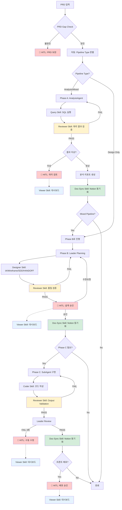

# AGENT_ARCHITECTURE.md

> **문서 버전**: 2.6.2
> **최종 업데이트**: 2025-12-24
> **물리적 경로**: `.claude/workflows/AGENT_ARCHITECTURE.md`
> **변경 이력**: Phase A 다이어그램 수정 - Reviewer Skill 위치를 Query Skill 직후로 이동
> **상위 문서**: `CLAUDE.md` > **대상 Agent**: Leader, SubAgent, AnalysisAgent, OutputValidator
> **참고**: Orchestrator는 Agent가 아닌 워크플로우 제어 모듈입니다 (JavaScript 클래스)

---

## 0. Agent 로딩 설정

> **⚠️ 용어 정의**: 이 문서에서 "Agent"는 LLM 기반 에이전트만 의미합니다.
> Orchestrator는 JavaScript 클래스로, Agent가 아닌 **워크플로우 제어 모듈**입니다.

### 0.1 섹션별 로딩 대상

| 섹션                          | 대상                | 필수 여부 |
| ----------------------------- | ------------------- | --------- |
| 섹션 1 (아키텍처 개요)        | 사용자/개발자 참조  | -         |
| 섹션 2 (협업 사이클)          | 참조용              | 선택      |
| 섹션 3.1 (Orchestrator 역할)  | 사용자/개발자 참조  | -         |
| 섹션 3.2 (Leader 역할)        | Leader Agent        | 필수      |
| 섹션 3.3 (SubAgent 역할)      | SubAgent            | 필수      |
| 섹션 3.4 (AnalysisAgent 역할) | AnalysisAgent       | 필수      |
| 섹션 4 (Multi-LLM Provider)   | 사용자/개발자 참조  | -         |
| 섹션 5 (보안 아키텍처)        | 모든 Agent          | 권장      |
| 섹션 6 (Handoff 프로토콜)     | Leader, SubAgent    | 필수      |
| 섹션 7-10 (사용법 등)         | 사용자 참조용       | -         |

### 0.2 로딩 우선순위

**필수 로딩 (모든 실행에서)**

- 자신의 역할 정의 섹션 (3.1 / 3.2 / 3.3 / 3.4)
- Handoff 프로토콜 (섹션 6) - Leader/SubAgent만

**선택 로딩 (필요시)**

- 보안 아키텍처 (섹션 5) - 보안 검증 필요 시
- 재시도 정책 (섹션 10) - 에러 발생 시

### 0.3 Agent별 로딩 예상 토큰

> LLM 기반 Agent만 토큰을 소비합니다. Orchestrator는 코드 모듈이므로 제외.

| Agent               | 로딩 섹션            | 예상 토큰 |
| ------------------- | -------------------- | --------- |
| **Leader**          | 섹션 3.2, 섹션 6     | ~800      |
| **SubAgent**        | 섹션 3.3, 섹션 6     | ~600      |
| **AnalysisAgent**   | 섹션 3.4             | ~500      |
| **OutputValidator** | 섹션 5.1 Layer 3     | ~300      |

### 0.4 Task ID 네이밍 규칙

**형식**: `{prefix}-{keyword}-{timestamp}`

| 패턴            | 예시                              | 설명                    |
| --------------- | --------------------------------- | ----------------------- |
| Case 분석       | `case4-active-user-1766119848270` | Case 번호 + 핵심 키워드 |
| 설계 케이스     | `recruit-agent-1766031235704`     | 기능명                  |
| 혼합 케이스     | `case5-dormancy-1766037994472`    | Case 번호 + 핵심 키워드 |
| 기본 (fallback) | `task-1766113510884`              | 키워드 추출 실패 시     |

**키워드 자동 추출** (orchestrator.js `generateFriendlyTaskId`):

```javascript
keywords: [
  { pattern: /채용|recruit|job/i, name: "recruit" },
  { pattern: /휴면|dormancy|dormant/i, name: "dormancy" },
  { pattern: /활성|active|heavy/i, name: "active-user" },
  { pattern: /분석|analysis|analyze/i, name: "analysis" },
  { pattern: /설계|design/i, name: "design" },
  { pattern: /예측|predict/i, name: "predict" },
  { pattern: /추천|recommend/i, name: "recommend" },
];
```

**Viewer 표시 규칙** (`formatters.ts`):

- timestamp 제외하고 의미있는 이름만 표시
- 예: `case5-dormancy-1766037994472` → `case5-dormancy`
- fallback: `task-1766113510884` → `task-510884`

**산출물 경로 규칙** (SYSTEM_MANIFEST v4.3.0 준수, Case-Centric 구조):

```
docs/cases/{caseId}/               # 케이스 설계 문서 (PRD, IA, SDD, Wireframe, HANDOFF)
docs/cases/{caseId}/analysis/      # 분석 결과 (SQL, JSON, 리포트) ✅
docs/cases/{caseId}/visuals/       # 시각화 산출물 (HTML)
backend/src/{feature}/             # 백엔드 구현 코드
frontend/src/{feature}/            # 프론트엔드 구현 코드
workspace/logs/{task-id}.json      # 실행 로그
```

> ⚠️ **Deprecated**: `workspace/analysis/{task-id}/`는 `docs/cases/{caseId}/analysis/`로 통합되었습니다.

**caseId 추출 규칙**:
- `case5-dormancy-20251223` → `case5-dormancy` (날짜 8자리 제거)
- `case5-dormancy-1766037994472` → `case5-dormancy` (타임스탬프 13자리 제거)

**금지 패턴**:

- ❌ `test-1`, `temp` (의미없는 이름)
- ❌ 특수문자 포함 (`task@#$%`)

---

## 0.5 전체 파이프라인 플로우 (Phase 기반 HITL)

> 🔴 빨간색 노드 = Human-in-the-Loop 체크포인트
> **Phase 정의**: README.md v4.3.2와 동기화

### Phase 개요

| Phase | 이름 | 담당 Agent | 사용 Skill | 설명 | 구현 상태 |
|-------|------|------------|------------|------|-----------|
| **Phase A** | Analysis | AnalysisAgent | query, profiler | DB 분석, SQL 쿼리 실행, 데이터 추출 | ✅ 구현됨 |
| **Phase B** | Design | Leader | designer | IA.md, Wireframe.md, SDD.md, HANDOFF.md 생성 | ✅ 구현됨 |
| **Phase C** | Code Implementation | SubAgent | coder | HANDOFF.md 기반 코드 구현 | ⏳ 미구현 |
| **Phase D** | Security Layer | Orchestrator (내부) | - | 입력 검증, 프롬프트 인젝션 방어 | ✅ 구현됨 |

### 공통 Skill (Cross-Phase)

| Skill | 사용 시점 | 호출 주체 | 설명 | 구현 상태 |
|-------|----------|----------|------|-----------|
| **reviewer** | Phase 산출물 완료 후 | Leader | 품질 검증 (80점 미만 시 재작업) | ✅ 구현됨 |
| **viewer** | HITL 체크포인트 | User (웹 대시보드) | 실시간 모니터링, 승인/거부/피드백 | ✅ 구현됨 |
| **doc-sync** | Phase 완료 후 | Leader → SubAgent | Notion 동기화 (산출물 업로드) | ✅ 구현됨 |

### 파이프라인 타입

```
┌─────────────────────────────────────────────────────────────────────────────┐
│  Pipeline Type Selection (PRD type 필드 기반)                               │
├─────────────────────────────────────────────────────────────────────────────┤
│                                                                             │
│  Analysis Only     →  Phase A만 실행                                        │
│  Design Only       →  Phase B만 실행                                        │
│  Mixed (기본)      →  Phase A → Phase B 순차 실행                           │
│  Full (향후)       →  Phase A → Phase B → Phase C 전체 실행                 │
│                                                                             │
└─────────────────────────────────────────────────────────────────────────────┘
```

### Phase 기반 파이프라인 흐름



> **범례**: 🔴 빨간색 = HITL 체크포인트 | 🔵 파란색 = Viewer Skill | 🟡 노란색 = Reviewer Skill | 🟢 초록색 = Doc-Sync Skill

### HITL 체크포인트 요약

| 체크포인트    | Phase | 트리거 조건                                  | 인간 액션                    |
| ------------- | ----- | -------------------------------------------- | ---------------------------- |
| **PRD 보완**  | 진입 전 | PRD Gap Check 불완전 (필수 항목 누락)        | PRD 필수 항목 보완 후 재시작 |
| **쿼리 검토** | A    | SQL 결과 이상 (0행, 타임아웃, 스키마 불일치) | 쿼리 수정 또는 승인          |
| **설계 승인** | B    | IA/Wireframe/SDD 생성 완료                   | 설계 검토 및 승인/수정요청   |
| **수동 수정** | C    | 3회 연속 Review FAIL                         | 직접 수정 또는 방향 조정     |
| **배포 승인** | C    | 프론트엔드 배포 필요 시                      | 최종 배포 승인               |

### 자동 중단 트리거

```yaml
PRD Gap Check:
  - 필수 6개 항목 중 누락 존재
  - type/pipeline 불일치

Phase A (SQL 결과 검증):
  - 결과 행 0개
  - 쿼리 타임아웃 (30초 초과)
  - DOMAIN_SCHEMA.md와 컬럼 불일치

Phase C (Output Validation):
  - PRD 체크리스트 매칭률 < 80%
  - 보안 게이트 위반 (Protected Path 접근)
  - 재시도 횟수 >= 3회
```

---

## 0.6 Skill-Agent 매핑 (도구 규정)

> **Source of Truth**: `SYSTEM_MANIFEST.md`의 Skill Registry 및 `orchestrator/skills/README.md`와 동기화
> 각 Agent가 사용 가능한 Skill을 명확히 규정합니다.

### Skill vs Agent 개념 정리

> **네이밍 규칙 (v2.5.0)**: Skill 이름에서 `-agent` 접미사 제거. `agent`는 LLM 기반 실행 주체에만 사용.

```
┌─────────────────────────────────────────────────────────────────────────────┐
│  Skill과 Agent의 관계                                                        │
├─────────────────────────────────────────────────────────────────────────────┤
│                                                                             │
│  Skill (skills/*/SKILL.md)              Agent (agents/*.js)                 │
│  ─────────────────────────              ─────────────────────               │
│  • 능력/역할 정의서                      • LLM 기반 실행 주체                  │
│  • 프롬프트 템플릿                       • Claude API 호출                     │
│  • 입출력 스키마 정의                    • Skill을 로드하여 사용                │
│                                                                             │
│  예시:                                                                       │
│  AnalysisAgent (agents/analysis-agent.js)                                   │
│    └── query Skill (skills/query/SKILL.md) 로드                             │
│    └── profiler Skill (skills/profiler/SKILL.md) 로드                       │
│                                                                             │
│  ⚠️ Skill 자체는 Agent가 아닙니다. Agent가 Skill을 사용합니다.                 │
│                                                                             │
└─────────────────────────────────────────────────────────────────────────────┘
```

### Skill 목록 및 호출 Agent

| Skill | Version | 호출 Agent | Phase | 주요 기능 |
|-------|---------|------------|-------|-----------|
| **query** | v1.2.0 | AnalysisAgent | A | SQL 쿼리 작성 및 실행, 데이터 추출 |
| **profiler** | v1.2.0 | AnalysisAgent | A | 사용자 프로파일 분석, 세그먼트 분류 |
| **designer** | v2.2.0 | Leader | B | 시각화 고도화 (Mermaid → HTML) |
| **doc-sync** | v2.1.0 | Leader | B | 로컬 ↔ Notion 동기화 |
| **coder** | v1.3.0 | SubAgent | C | 코드 구현 (backend/frontend) |
| **reviewer** | v1.2.0 | OutputValidator | C | 산출물 품질 검증, PASS/FAIL |
| **viewer** | v1.5.0 | (Orchestrator) | - | 웹 뷰어 API (LLM 미사용) |

> **참고**: viewer는 순수 JavaScript 유틸리티로, LLM Agent가 아닙니다.

### Agent-Skill 권한 매트릭스

```
┌───────────────────────────────────────────────────────────────────────────────────┐
│  Agent-Skill 권한 매트릭스                                                         │
├───────────────────────────────────────────────────────────────────────────────────┤
│                                                                                   │
│                 query  profiler  designer  doc-sync  coder  reviewer  viewer     │
│  ───────────────────────────────────────────────────────────────────────────────  │
│  Orchestrator     -       -          -         -        -       -       ✅       │
│  Leader           -       -          ✅        ✅       -       ✅      -        │
│  SubAgent         -       -          -         ✅       ✅      -       -        │
│  AnalysisAgent    ✅      ✅         -         -        -       -       -        │
│  User (HITL)      -       -          -         -        -       -       ✅       │
│                                                                                   │
│  ✅ = 사용 가능 / - = 사용 불가                                                     │
│                                                                                   │
│  사용 시점:                                                                        │
│  • reviewer: Phase 산출물 완료 후 품질 검증 (Leader가 호출)                         │
│  • doc-sync: Phase 완료 + HITL 승인 후 Notion 동기화 (Leader→SubAgent 지시)        │
│  • viewer: HITL 체크포인트에서 User가 대시보드로 모니터링/승인/거부                  │
└───────────────────────────────────────────────────────────────────────────────────┘
```

### 왜 Leader는 DB에 직접 접속하지 않는가?

```
┌─────────────────────────────────────────────────────────────────────────────┐
│  🔒 역할 분리 원칙 (Separation of Concerns)                                  │
├─────────────────────────────────────────────────────────────────────────────┤
│                                                                             │
│  Leader Agent의 역할:                                                        │
│  ├── 설계자 (Architect): 전체 구조 설계, IA/SDD 생성                          │
│  ├── 조율자 (Coordinator): SubAgent 작업 지시, HANDOFF 생성                   │
│  └── 검증자 (Reviewer): 산출물 검토, PASS/FAIL 판정                           │
│                                                                             │
│  Leader가 DB 접속하지 않는 이유:                                              │
│  1. 단일 책임 원칙 (SRP): 설계/조율과 데이터 분석은 별개 관심사                   │
│  2. 보안 분리: DB 접근 권한은 AnalysisAgent에만 부여 (Query Skill 사용)         │
│  3. 토큰 효율성: Leader는 설계 컨텍스트만 로드, DB 스키마 불필요                  │
│  4. 감사 추적: DB 쿼리는 AnalysisAgent를 통해서만 실행 → 로깅 일원화            │
│                                                                             │
│  데이터가 필요할 때:                                                          │
│  PRD → Orchestrator → AnalysisAgent (Phase A) → 분석 결과 → Leader (Phase B) │
│                                                                             │
│  ⚠️ Leader가 직접 SELECT 쿼리를 작성/실행하는 것은 아키텍처 위반입니다.          │
│                                                                             │
└─────────────────────────────────────────────────────────────────────────────┘
```

---

## 1. 아키텍처 개요

### 1.1 핵심 원칙

```
┌─────────────────────────────────────────────────────────────────────────────┐
│  🎯 Orchestrator 중심 아키텍처 원칙                                           │
├─────────────────────────────────────────────────────────────────────────────┤
│                                                                             │
│  1. Orchestrator = 단일 제어점 (Single Control Point)                        │
│     • 모든 에이전트 실행은 Orchestrator를 통해서만 발생                           │
│     • MCP Server 불필요 - 직접 API 호출 방식                                    │
│                                                                             │
│  2. Multi-LLM Provider 지원                                                  │
│     • Claude (Primary) → GPT-4 → Gemini (Fallback Chain)                    │
│     • 아키텍처 변경 없이 LLM 교체 가능                                           │
│                                                                             │
│  3. 보안 우선 (Security First)                                               │
│     • 입력 검증 (Path Traversal, Prompt Injection 방어)                       │
│     • 출력 검증 (Protected Path 보호)                                         │
│     • 감사 로깅 (Audit Trail)                                                │
│                                                                             │
└─────────────────────────────────────────────────────────────────────────────┘
```

### 1.2 시스템 다이어그램 (Phase 기반)

```
┌─────────────────────────────────────────────────────────────────────────────┐
│         Orchestrator-Centric Multi-LLM Architecture (v4.0.0)                │
└─────────────────────────────────────────────────────────────────────────────┘

┌─────────────────────────────────────────────────────────────────────────────┐
│  📥 INPUT                                                                   │
│  ─────────────────────────────────────────────────────────────────────────  │
│  • PRD (.claude/project/PRD.md)                                             │
│  • 사용자 요청 (자연어)                                                       │
└─────────────────────────────────────────────────────────────────────────────┘
                                     │
                                     ▼
┌─────────────────────────────────────────────────────────────────────────────┐
│  🎛️ ORCHESTRATOR (orchestrator.js) - 워크플로우 제어 모듈                      │
│  ═══════════════════════════════════════════════════════════════════════════│
│  • PRD 파싱 → Pipeline Type 결정 (Analysis/Design/Mixed/Full)               │
│  • Phase에 맞는 Agent 호출                                                   │
│  • HITL 체크포인트 관리                                                       │
│  • Security Layer (입력 검증, Rate Limiting)                                 │
└─────────────────────────────────────────────────────────────────────────────┘
          │
          ├─────────────────────────────────────────────────────────────────┐
          │                                                                 │
          ▼ [Phase A: Analysis]                                             │
┌─────────────────────────────────────┐                                     │
│  📊 ANALYSIS AGENT                  │                                     │
│  ─────────────────────────────────  │                                     │
│  • SQL 쿼리 작성/실행                 │                                     │
│  • 데이터 추출 및 분석                │                                     │
│  • 분석 리포트 생성                   │                                     │
│                                     │                                     │
│  Skill: query, profiler             │                                     │
│  Output: analysis/*.sql, *.json     │                                     │
└─────────────────────────────────────┘                                     │
          │                                                                 │
          ▼ [Phase B: Design]                                               │
┌─────────────────────────────────────┐                                     │
│  🧠 LEADER AGENT                    │                                     │
│  ─────────────────────────────────  │                                     │
│  [Planning Mode]                    │                                     │
│  • 요구사항 분석                      │                                     │
│  • IA.md / Wireframe.md 생성        │                                     │
│  • SDD.md / HANDOFF.md 생성         │                                     │
│                                     │                                     │
│  Skill: designer, doc-sync          │                                     │
│  Output: docs/cases/{caseId}/*.md   │                                     │
└─────────────────────────────────────┘                                     │
          │                                                                 │
          ▼ [Phase C: Implementation] ⏳ 미구현                               │
┌─────────────────────────────────────┐                                     │
│  ⚙️ SUB-AGENT                       │                                     │
│  ─────────────────────────────────  │                                     │
│  [Coding Mode]                      │                                     │
│  • HANDOFF.md 기반 코드 구현          │                                     │
│  • 테스트 작성                        │                                     │
│                                     │                                     │
│  Skill: coder                       │                                     │
│  Output: backend/src/*, frontend/*  │                                     │
└─────────────────────────────────────┘                                     │
          │                                                                 │
          ▼ [Review Loop] ⏳ 미구현                                          │
┌─────────────────────────────────────┐                                     │
│  🔍 LEADER (Review Mode)            │──── FAIL (최대 3회) ────┐            │
│  • 코드 리뷰                          │                        │            │
│  • VALIDATION_GUIDE 검증             │                        ▼            │
│  • PASS/FAIL 판정                    │◄─── 피드백 반영 ◄── SubAgent        │
└─────────────────────────────────────┘                                     │
          │ PASS                                                            │
          ▼                                                                 │
┌─────────────────────────────────────────────────────────────────────────────┐
│  📤 OUTPUT                                                                  │
│  ─────────────────────────────────────────────────────────────────────────  │
│                                                                             │
│  [Phase A 산출물]                    [Phase B 산출물]                        │
│  ┌─────────────────────────┐        ┌─────────────────────────┐            │
│  │ docs/cases/{id}/analysis/│        │ docs/cases/{id}/        │            │
│  │ ├── query.sql           │        │ ├── PRD.md (스냅샷)      │            │
│  │ ├── result.json         │        │ ├── IA.md               │            │
│  │ └── report.md           │        │ ├── Wireframe.md        │            │
│  └─────────────────────────┘        │ ├── SDD.md              │            │
│                                     │ └── HANDOFF.md          │            │
│  [Phase C 산출물] ⏳ 미구현           └─────────────────────────┘            │
│  ┌─────────────────────────┐                                               │
│  │ backend/src/{feature}/  │        [로그]                                  │
│  │ frontend/src/{feature}/ │        ┌─────────────────────────┐            │
│  │ **/tests/*.test.ts      │        │ workspace/logs/{id}.json│            │
│  └─────────────────────────┘        └─────────────────────────┘            │
│                                                                             │
└─────────────────────────────────────────────────────────────────────────────┘
```

---

## 2. 협업 사이클

> **상세 플로우**: 섹션 0.5 "전체 파이프라인 플로우 (Phase 기반 HITL)" 참조

---

## 3. 역할 정의

### 3.1 Orchestrator (orchestrator.js) - 워크플로우 제어 모듈

> **⚠️ 주의**: Orchestrator는 LLM Agent가 아닙니다. (섹션 0 용어 정의 참조)

| 항목     | 내용                                                |
| -------- | --------------------------------------------------- |
| **타입** | JavaScript 클래스 (NOT LLM Agent)                   |
| **역할** | 전체 제어 + 보안 게이트웨이                         |
| **담당** | PRD 파싱, Agent 호출, HITL 관리, 재시도, 로그 저장  |
| **보안** | Rate Limiting, Path Traversal 방지, 입력 새니타이징 |
| **호출** | Leader, SubAgent, AnalysisAgent를 생성하고 호출     |

### 3.2 Leader Agent (leader.js)

| 항목     | 내용                                                     |
| -------- | -------------------------------------------------------- |
| **역할** | 설계자 + 검증자                                          |
| **Mode** | Planning Mode, Review Mode                               |
| **담당** | IA/Wireframe/SDD/HANDOFF 생성, 코드 리뷰, PASS/FAIL 판정 |
| **보안** | Prompt Injection 방어 (wrapUserContent)                  |
| **권한** | `.claude/project/*` 수정 가능                            |

### 3.3 Sub-agent (subagent.js)

| 항목     | 내용                                                           |
| -------- | -------------------------------------------------------------- |
| **역할** | 구현자                                                         |
| **Mode** | Coding Mode                                                    |
| **담당** | 코드 작성, 테스트 작성                                         |
| **보안** | Output Validation (Protected Path 보호)                        |
| **권한** | `backend/src/*`, `frontend/src/*`, `mcp-server/*` 수정 가능    |
| **제약** | `.claude/{rules, workflows, context}/*`, `orchestrator/` 수정 금지 |

### 3.4 AnalysisAgent (데이터 분석가)

> **Phase A 전담**: 모든 데이터베이스 분석 작업은 AnalysisAgent를 통해서만 수행됩니다.

| 항목       | 내용                                                              |
| ---------- | ----------------------------------------------------------------- |
| **역할**   | 데이터 분석가 (Data Analyst)                                      |
| **Phase**  | Phase A (Analysis)                                                |
| **담당**   | SQL 쿼리 작성/실행, 데이터 추출, 분석 리포트 생성                 |
| **Skill**  | `query`, `profiler`                                               |
| **보안**   | SELECT 쿼리만 허용, INSERT/UPDATE/DELETE 금지                    |
| **권한**   | `docs/cases/{caseId}/analysis/*` 쓰기 가능                        |
| **제약**   | 프로덕션 DB 직접 수정 금지, 로컬 작업만 허용                      |

```
┌─────────────────────────────────────────────────────────────────────────────┐
│  AnalysisAgent 작업 흐름                                                     │
├─────────────────────────────────────────────────────────────────────────────┤
│                                                                             │
│  INPUT                                                                      │
│  ├── PRD (분석 요구사항)                                                     │
│  ├── DOMAIN_SCHEMA.md (테이블/컬럼 정의)                                     │
│  └── DB_ACCESS_POLICY.md (접근 권한)                                        │
│                                                                             │
│  PROCESS                                                                    │
│  ├── 1. PRD에서 분석 목표 추출                                               │
│  ├── 2. DOMAIN_SCHEMA.md 참조하여 SQL 작성                                   │
│  ├── 3. Query Skill로 SQL 실행                                              │
│  ├── 4. 결과 검증 (행 수, 스키마 일치)                                       │
│  └── 5. 분석 리포트 생성                                                     │
│                                                                             │
│  OUTPUT                                                                     │
│  ├── docs/cases/{caseId}/analysis/query.sql                                 │
│  ├── docs/cases/{caseId}/analysis/result.json                               │
│  └── docs/cases/{caseId}/analysis/report.md                                 │
│                                                                             │
└─────────────────────────────────────────────────────────────────────────────┘
```

**⚠️ 핵심 원칙**: Leader Agent는 DB에 직접 접속하지 않습니다.
- 데이터 분석이 필요한 경우, Orchestrator가 AnalysisAgent를 Phase A에서 먼저 실행
- AnalysisAgent의 분석 결과는 `docs/cases/{caseId}/analysis/`에 저장
- Leader는 Phase B에서 이 분석 결과를 참조하여 설계 진행

---

## 4. Multi-LLM Provider 패턴

### 4.1 Provider 구조

```
orchestrator/providers/
├── base.js          # 추상 인터페이스
├── anthropic.js     # Claude API (Primary)
├── openai.js        # GPT-4 API (Fallback #1)
├── gemini.js        # Gemini API (Fallback #2)
├── factory.js       # Provider Factory + Fallback Chain
└── index.js         # 통합 내보내기
```

### 4.2 Fallback Chain

```
┌─────────────────────────────────────────────────────────────────────────────┐
│  🔄 Provider Fallback Chain                                                 │
├─────────────────────────────────────────────────────────────────────────────┤
│                                                                             │
│    ┌──────────────┐     FAIL     ┌──────────────┐     FAIL     ┌─────────┐ │
│    │   Claude     │ ──────────►  │    GPT-4     │ ──────────►  │ Gemini  │ │
│    │  (Primary)   │              │ (Fallback 1) │              │ (FB 2)  │ │
│    └──────────────┘              └──────────────┘              └─────────┘ │
│           │                             │                           │      │
│           ▼                             ▼                           ▼      │
│        SUCCESS                       SUCCESS                     SUCCESS   │
│                                                                             │
│    환경변수:                                                                  │
│    • ANTHROPIC_API_KEY (Claude)                                             │
│    • OPENAI_API_KEY (GPT-4)                                                 │
│    • GOOGLE_API_KEY (Gemini)                                                │
│                                                                             │
└─────────────────────────────────────────────────────────────────────────────┘
```

### 4.3 Provider 설정

```javascript
// orchestrator.js 생성자
const orchestrator = new Orchestrator({
  provider: "anthropic", // Primary provider
  fallbackOrder: ["anthropic", "openai", "gemini"],
  useFallback: true, // Fallback 활성화
  providerConfig: {
    anthropic: { model: "claude-sonnet-4-20250514" },
    openai: { model: "gpt-4-turbo-preview" },
    gemini: { model: "gemini-pro" },
  },
});
```

---

## 5. 보안 아키텍처 (v3.2.0)

### 5.1 보안 계층

```
┌─────────────────────────────────────────────────────────────────────────────┐
│  🔒 Security Layers                                                         │
├─────────────────────────────────────────────────────────────────────────────┤
│                                                                             │
│  Layer 1: Input Validation (Orchestrator)                                   │
│  ┌───────────────────────────────────────────────────────────────────────┐  │
│  │ • validateTaskId()     : ../../../ 차단, 특수문자 제한                    │  │
│  │ • sanitizeTaskDescription() : 10,000자 제한                             │  │
│  │ • sanitizePrdContent() : 50,000자 제한                                  │  │
│  │ • validateFilePath()   : projectRoot 외부 경로 차단                      │  │
│  │ • checkRateLimit()     : 20회/시간 제한                                  │  │
│  └───────────────────────────────────────────────────────────────────────┘  │
│                                                                             │
│  Layer 2: Prompt Injection Defense (Leader)                                 │
│  ┌───────────────────────────────────────────────────────────────────────┐  │
│  │ • DANGEROUS_PATTERNS 필터링:                                            │  │
│  │   - ignore previous instructions                                       │  │
│  │   - disregard all rules                                                │  │
│  │   - you are now                                                        │  │
│  │   - system prompt                                                      │  │
│  │ • wrapUserContent(): 경계 마커로 사용자 입력 격리                          │  │
│  └───────────────────────────────────────────────────────────────────────┘  │
│                                                                             │
│  Layer 3: Output Validation (Sub-agent)                                     │
│  ┌───────────────────────────────────────────────────────────────────────┐  │
│  │ • Path Traversal 거부 (../)                                            │  │
│  │ • Absolute Path 거부 (/etc/passwd)                                     │  │
│  │ • Protected Path 거부 (.claude/rules/*, .claude/workflows/*)           │  │
│  └───────────────────────────────────────────────────────────────────────┘  │
│                                                                             │
│  Layer 4: Audit & Integrity (Utils)                                         │
│  ┌───────────────────────────────────────────────────────────────────────┐  │
│  │ • AuditLogger: 보안 이벤트 추적, 민감정보 마스킹                           │  │
│  │ • RulebookValidator: .claude/rules/*, workflows/* SHA256 해시 검증   │  │
│  │ • HandoffValidator: HANDOFF 프로토콜 스키마 + 보안 검증                   │  │
│  └───────────────────────────────────────────────────────────────────────┘  │
│                                                                             │
└─────────────────────────────────────────────────────────────────────────────┘
```

### 5.2 보안 유틸리티

```
orchestrator/utils/
├── audit-logger.js       # 감사 로깅 (민감정보 마스킹)
├── rulebook-validator.js # 룰북 해시 무결성 검증
├── handoff-validator.js  # HANDOFF 프로토콜 검증
└── index.js              # 통합 내보내기
```

| 유틸리티              | 역할                                                   |
| --------------------- | ------------------------------------------------------ |
| **AuditLogger**       | 보안 이벤트 기록, API 키/이메일 마스킹                 |
| **RulebookValidator** | 룰북 폴더(`rules`, `workflows`, `context`) 무결성 검증 |
| **HandoffValidator**  | HANDOFF 필수 섹션 확인, 악의적 지시 필터링             |

---

## 6. Handoff 프로토콜

### 6.1 Leader → Sub-agent (HANDOFF.md)

```markdown
## Mode

Coding

## Input

- docs/task-1/IA.md
- docs/task-1/SDD.md
- DOMAIN_SCHEMA.md

## Output

- backend/src/features/login/index.ts
- backend/tests/login.test.ts

## Constraints

- TypeScript 필수
- TDD 방식
- DOMAIN_SCHEMA.md 컬럼명 준수

## CompletionCriteria

- 빌드 성공
- 테스트 PASS
```

### 6.2 Sub-agent → Leader (완료 보고)

```markdown
## 완료 보고: login-feature

### 생성된 파일

- backend/src/features/login/index.ts
- backend/tests/login.test.ts

### 실행 결과

- 테스트: PASS (5/5)
- 타입체크: PASS

### 이슈

- 없음
```

### 6.3 HandoffValidator 검증 항목

| 검증          | 내용                                          |
| ------------- | --------------------------------------------- |
| **필수 섹션** | Mode, Input, Output, Constraints              |
| **Mode 값**   | coding, review, test, refactor, debug 중 하나 |
| **보안 패턴** | "ignore previous", "bypass security" 등 차단  |

---

## 7. 파일 구조

```
ATO-System-B/
├── .claude/
│   ├── rules/ ───────────── 🔴 READ ONLY (Constraint Layer)
│   │   ├── CODE_STYLE.md
│   │   ├── DOMAIN_SCHEMA.md
│   │   ├── DB_ACCESS_POLICY.md
│   │   ├── VALIDATION_GUIDE.md
│   │   ├── TDD_WORKFLOW.md
│   │   └── ANALYSIS_GUIDE.md
│   │
│   ├── workflows/ ───────── 🔴 READ ONLY (Process Layer)
│   │   ├── AGENT_ARCHITECTURE.md  ← 현재 문서
│   │   ├── DOCUMENT_PIPELINE.md
│   │   ├── SYSTEM_MANIFEST.md
│   │   └── PRD_GUIDE.md
│   │
│   ├── context/ ─────────── 🔴 READ ONLY (Philosophy Layer)
│   │   ├── AI_Playbook.md
│   │   └── AI_CONTEXT.md
│   │
│   ├── project/ ─────────── 🟢 WRITABLE (Leader만)
│   │   ├── PRD.md
│   │   └── PROJECT_STACK.md
│   │
│   └── state/ ───────────── 🟢 자동 업데이트
│       └── handoff-status.json
│
├── orchestrator/ ────────── 🎛️ 오케스트레이터
│   ├── orchestrator.js      # 메인 제어
│   ├── index.js             # CLI 엔트리포인트
│   │
│   ├── agents/
│   │   ├── leader.js        # Leader Agent
│   │   ├── subagent.js      # Sub-agent
│   │   ├── analysis-agent.js # AnalysisAgent
│   │   ├── prd-analyzer.js  # PRD Gap Check
│   │   └── output-validator.js # 산출물 검증
│   │
│   ├── skills/              # Skill 정의 (v2.5.0 네이밍)
│   │   ├── query/           # SQL 쿼리 생성
│   │   ├── profiler/        # 프로파일 분석
│   │   ├── designer/        # 시각화 (MD→HTML)
│   │   ├── doc-sync/        # Notion 동기화
│   │   ├── coder/           # 코드 구현
│   │   ├── reviewer/        # 품질 검증
│   │   └── viewer/          # 웹 뷰어 API
│   │
│   ├── providers/           # Multi-LLM Provider
│   │   └── ...
│   │
│   └── utils/               # 유틸리티
│       └── ...
│
├── workspace/
│   ├── logs/                # 실행 로그 ✅
│   └── sessions/            # 세션 데이터
│
├── docs/cases/{caseId}/     # 케이스별 산출물 (통합)
│   ├── PRD.md               # 스냅샷
│   ├── IA.md
│   ├── SDD.md
│   ├── HANDOFF.md
│   └── analysis/            # 분석 결과
│
├── backend/src/             # 백엔드 API
│
└── frontend/src/            # 프론트엔드
```

---

## 8. 사용법

### 8.1 기본 실행

```bash
# 기본 사용
node orchestrator/index.js "로그인 기능 구현"

# PRD 기반 구현
node orchestrator/index.js --prd docs/PRD.md "기능 구현"

# Dry-run (파일 저장 없이)
node orchestrator/index.js --no-save "테스트 작업"
```

### 8.2 옵션

| 옵션                | 설명             | 기본값             |
| ------------------- | ---------------- | ------------------ |
| `--prd <path>`      | PRD 파일 경로    | -                  |
| `--task-id <id>`    | 작업 ID 지정     | `task-{timestamp}` |
| `--no-save`         | 파일 저장 안 함  | false              |
| `--max-retries <n>` | 최대 재시도 횟수 | 3 (상한 5)         |

### 8.3 환경 설정

```bash
# orchestrator/.env
ANTHROPIC_API_KEY="sk-ant-..."
OPENAI_API_KEY="sk-..."           # Optional (Fallback)
GOOGLE_API_KEY="..."              # Optional (Fallback)

ANTHROPIC_MODEL="claude-sonnet-4-20250514"
MAX_RETRIES=3
```

---

## 9. 메트릭 추적

Orchestrator는 다음 메트릭을 자동 추적합니다:

| 메트릭               | 설명                                     |
| -------------------- | ---------------------------------------- |
| **총 소요 시간**     | 전체 작업 완료까지 걸린 시간             |
| **단계별 소요 시간** | Planning, Coding, Review 각 단계         |
| **토큰 사용량**      | Leader/Sub-agent 입력/출력 토큰          |
| **재시도 횟수**      | Review FAIL로 인한 재시도                |
| **Provider 사용**    | 어떤 LLM Provider가 사용되었는지         |
| **보안 이벤트**      | Path Traversal, Prompt Injection 시도 등 |

로그 출력:

```
workspace/logs/<task-id>.json          # 실행 메트릭
workspace/logs/audit/audit-*.jsonl     # 보안 감사 로그
```

---

## 10. 재시도 정책

| 상황                   | 동작                        |
| ---------------------- | --------------------------- |
| Review PASS            | 작업 완료                   |
| Review FAIL (1~4회)    | 피드백 반영 후 재시도       |
| Review FAIL (5회 초과) | 작업 중단, 사용자 개입 요청 |
| API 에러               | Fallback Provider 시도      |
| 모든 Provider 실패     | 에러 로그 기록, 작업 중단   |

---

## 📚 관련 문서

| 문서                     | 역할                     |
| ------------------------ | ------------------------ |
| `CLAUDE.md`              | 팀 헌법, Safety Rules    |
| `VALIDATION_GUIDE.md`    | Leader의 검증 기준       |
| `DOMAIN_SCHEMA.md`       | 데이터베이스 스키마      |
| `orchestrator/README.md` | Orchestrator 상세 가이드 |

---

## 📝 변경 이력

| 버전  | 날짜       | 변경 내용                                                                      |
| ----- | ---------- | ------------------------------------------------------------------------------ |
| 2.6.2 | 2025-12-24 | Phase A 다이어그램 수정: Reviewer Skill 위치를 Query Skill 직후로 이동, 쿼리 결과 검증 후 리포트 생성 흐름으로 변경 |
| 2.6.1 | 2025-12-24 | Agent-Skill 권한 매트릭스 업데이트: Leader→reviewer, SubAgent→doc-sync, User(HITL)→viewer 추가, 사용 시점 설명 추가 |
| 2.6.0 | 2025-12-24 | 공통 Skill (Reviewer, Viewer, Doc-Sync) 표 추가, 다이어그램에 Cross-Phase Skill 흐름 반영 (HITL↔Viewer, 품질검증↔Reviewer, Phase완료↔Doc-Sync) |
| 2.5.1 | 2025-12-24 | Phase 표 Agent/Skill 분리, Mermaid 다이어그램 Skill 참조 수정, 섹션 3.4 query→Query Skill 업데이트 |
| 2.5.0 | 2025-12-24 | Skill 네이밍 리팩토링: agent 접미사 제거 (query-agent→query, code-agent→coder 등), 시스템 다이어그램 Skill 업데이트 |
| 2.4.0 | 2025-12-24 | 문서 정리: 섹션2 중복 제거, 파일구조 ATO-System-B로 수정, 로그경로 workspace/logs로 수정, QUALITY_GATES→VALIDATION_GUIDE 수정 |
| 2.3.0 | 2025-12-24 | AnalysisAgent 역할 공식화 (섹션 3.4), Skill-Agent 매핑 테이블 추가 (섹션 0.6), Phase 기반 파이프라인 현행화 |
| 2.0.0 | 2025-12-19 | Agent 로딩 설정 섹션 추가 (섹션 0), 섹션별 선택적 로딩 전략                    |
| 1.8.0 | 2025-12-17 | Output Validation → Review 연동, 3단계 PRD 매칭                                |
| 1.7.0 | 2025-12-17 | MCP 제거, Orchestrator 중심 아키텍처, Multi-LLM Provider                       |

---

**END OF AGENT_ARCHITECTURE.md**
