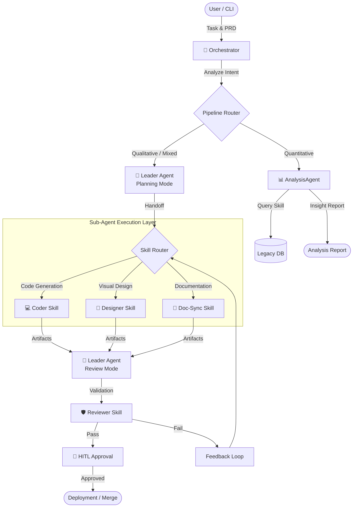

# PRD 통합 가이드 v2.0

> **문서 버전**: 2.0.6
> **최종 업데이트**: 2025-12-26
> **변경 이력**: 섹션 참조 이름 기반으로 전환 (SYSTEM_MANIFEST 9.2 준수)
> **물리적 경로**: `.claude/workflows/PRD_GUIDE.md` > **관리자**: 미래전략실 (ATO Team)
> **통합 대상**: PRD_TEMPLATE_V2.md, PRD_TYPE_PIPELINE.md, PRD_REFERENCE_MAP.md

## 📋 PRDAnalyzer 로딩 설정

| Agent           | 로딩 문서                                  |
| --------------- | ------------------------------------------ |
| **PRDAnalyzer** | `.claude/workflows/PRD_GUIDE.md` (이 문서) |

---

## 1. PRD 필수 항목 (6개)

### 1.1 목적 (Objective)

```
왜 만드는가? 어떤 문제를 해결하는가?

예시:
- "HEAVY 세그먼트 회원의 패턴을 파악하여 AI Agent 타겟 세그먼트 정의"
- "사용자 온보딩 이탈률 30% 감소"
```

**검증**: 한 문장으로 "~를 위해 ~를 만든다" 형태로 요약 가능해야 함

---

### 1.2 타겟 유저 (Target User)

```
누가 사용하는가? 어떤 맥락에서?

예시:
- "AI PM, 기획팀 - 주간 리포트 작성 시 참조"
- "신규 가입 회원 - 첫 로그인 후 30분 내"
```

**검증**: 페르소나 또는 역할이 명확히 정의되어야 함

---

### 1.3 핵심 기능 (Core Features)

```
무엇을 해야 하는가? (동사 + 목적어)

예시:
- "HEAVY 세그먼트 회원 목록을 조회한다"
- "전문과목별 분포를 전체 회원과 비교한다"
```

**검증**: 각 기능이 테스트 가능한 단위여야 함

---

### 1.4 성공 지표 (Success Criteria)

```
어떻게 성공을 판단하는가?

예시:
- "전체 대비 +5%p 이상 차이 세그먼트 1개 이상 발견"
- "분석 리포트 생성 완료"
```

**검증**: 정량적 측정 가능하거나, 명확한 완료 조건이어야 함

---

### 1.5 PRD 유형 (Type)

```yaml
type: QUANTITATIVE | QUALITATIVE | MIXED

QUANTITATIVE (정량적):
  - SQL/쿼리 실행이 필요함
  - 수치 분석/통계가 핵심
  - 예: 세그먼트 분석, KPI 리포트, 전환율 분석

QUALITATIVE (정성적):
  - 설계/제안/UX가 핵심
  - 휴리스틱/경험 기반 판단
  - 예: 온보딩 UX 설계, 사용자 여정 맵, 개선안 제안

MIXED (혼합):
  - 정량 분석 → 정성 해석의 2단계
  - 예: 데이터 분석 → 인사이트 → Use Case 제안
```

---

### 1.6 파이프라인 (Pipeline)

```yaml
pipeline: analysis | design | code | mixed

analysis:
  - SQL 실행 → 데이터 수집 → 결과 해석
  - Agent: AnalysisAgent

design:
  - 레퍼런스 매칭 → 설계 초안 → 상세화
  - Agent: Leader → SubAgent

code:
  - 코드 생성 → 테스트 → 리뷰
  - Agent: Leader → CodingAgent

mixed:
  - analysis → design 또는 analysis → code 체이닝
```

**검증**: type과 pipeline 매칭 확인

- QUANTITATIVE → analysis 또는 mixed
- QUALITATIVE → design 또는 code
- MIXED → mixed



---

## 2. 유형 판별 기준

### 2.1 유형 판별 매트릭스

| 판별 기준               | 정량적 | 정성적 | 혼합 |
| ----------------------- | ------ | ------ | ---- |
| 데이터 분석 필요        | ✅     | ❌     | ✅   |
| SQL/쿼리 실행 필요      | ✅     | ❌     | ✅   |
| 휴리스틱/경험 기반 판단 | ❌     | ✅     | ✅   |
| 수치적 성공 지표        | ✅     | △      | ✅   |
| 주관적 판단 필요        | ❌     | ✅     | ✅   |

---

### 2.2 키워드 기반 판별

```yaml
quantitative_keywords: # 정량적
  - 분석, 통계, 세그먼트, 코호트, KPI
  - 수치, 비율, 퍼센트, 증가, 감소
  - 조회, 집계, 카운트, 합계, 평균
  - SQL, 쿼리, 데이터베이스

qualitative_keywords: # 정성적
  - 설계, UX, UI, 사용자 경험
  - 제안, 추천, 개선안, 방향
  - 여정, 플로우, 시나리오
  - 인터뷰, 피드백, 휴리스틱

mixed_indicators: # 혼합 (정량 + 정성 키워드 동시 존재)
  - "분석 → 제안"
  - "데이터 기반 인사이트"
  - "패턴 → Use Case"
```

---

### 2.3 산출물 기반 판별

| 산출물 유형               | 정량 | 정성 | 혼합 |
| ------------------------- | ---- | ---- | ---- |
| SQL 쿼리                  | ✅   |      |      |
| 분석 테이블/차트          | ✅   |      | ✅   |
| 수치 리포트               | ✅   |      | ✅   |
| 설계 문서 (IA, Wireframe) |      | ✅   | ✅   |
| 제안서/추천               |      | ✅   | ✅   |
| 인사이트 문서             |      | ✅   | ✅   |

---

## 3. 유형별 처리 파이프라인

### 3.1 정량적 PRD 파이프라인

```
[입력] PRD + DOMAIN_SCHEMA.md + DB 연결 정보

Step 1: 데이터 요구사항 파싱
  - 필요 테이블/컬럼 식별
  - DOMAIN_SCHEMA.md와 대조
  - 누락/불일치 시 사용자 확인

Step 2: 분석 쿼리 설계
  - SQL 쿼리 생성 (SELECT only)
  - 쿼리 리뷰 (인덱스, 성능)

Step 3: 쿼리 실행
  - Bash로 DB 연결 및 실행
  - 결과 데이터 수집
  - 오류 시 쿼리 수정 및 재시도

Step 4: 결과 해석
  - 데이터 → 통계 요약
  - 이상치/패턴 식별
  - 수치 기반 결론 도출

Step 5: 산출물 생성
  - *.sql (쿼리 파일)
  - analysis_result.json/csv (데이터)
  - report.md (수치 리포트)
```

---

### 3.2 정성적 PRD 파이프라인

> **HITL 참조**: 설계 초안 생성 후 **Human-in-the-Loop 설계 승인** 체크포인트가 트리거됩니다.
> 5개 HITL 체크포인트 전체 정의는 `AGENT_ARCHITECTURE.md`의 **HITL 체크포인트** 섹션을 참조하세요.

```
[입력] PRD + 레퍼런스 + 기존 컨텍스트

Step 1: 컨텍스트 수집
  - 기존 서비스/기능 파악
  - 관련 문서 로드
  - 레퍼런스 서비스 매칭

Step 2: 레퍼런스 기반 설계
  - 유사 서비스 패턴 참조
  - 휴리스틱 적용 (UX 원칙 등)
  - 초안 생성

Step 3: 사용자 확인 [Human-in-the-Loop] ← HITL 체크포인트
  - "이 방향이 맞을까요?"
  - 피드백 수집
  - 수정 반영

Step 4: 상세화
  - IA (정보 구조) 작성
  - Wireframe (화면 구조) 작성
  - 인터랙션 정의

Step 5: 산출물 생성
  - IA.md
  - Wireframe.md
  - proposal.md (제안서)
```

---

### 3.3 혼합 PRD 파이프라인

```
[입력] PRD + DOMAIN_SCHEMA + 레퍼런스 + DB 연결

Phase A: 정량적 처리
  Step A1: 데이터 요구사항 파싱
  Step A2: SQL 쿼리 생성 및 실행
  Step A3: 결과 데이터 수집
  [중간 산출물] 쿼리 결과, 수치 데이터
            ↓
       [데이터 전달]
            ↓
Phase B: 정성적 처리 (데이터 기반)
  Step B1: 데이터 해석 (패턴, 이상치)
  Step B2: 인사이트 도출
  Step B3: 제안 생성 (Use Case, 액션 아이템)

[최종 산출물]
  - *.sql (쿼리)
  - analysis_result.* (데이터)
  - insight_report.md (인사이트)
  - proposal.md (제안)
```

---

## 4. 레퍼런스 자동 매핑

PRD에 레퍼런스가 없을 때 키워드 기반으로 자동 제안합니다.

### 4.1 카테고리별 레퍼런스

| 카테고리         | 키워드                   | 레퍼런스 서비스           | 핵심 패턴                       |
| ---------------- | ------------------------ | ------------------------- | ------------------------------- |
| **데이터 분석**  | 분석, 세그먼트, 코호트   | Amplitude, Mixpanel       | 필터 → 그룹핑 → 비교 → 인사이트 |
| **CRUD 서비스**  | 관리, 목록, 등록         | Admin 템플릿              | 검색 + 필터 + 테이블 + 액션     |
| **온보딩**       | 온보딩, 가이드, 튜토리얼 | Slack, Notion             | 단계별 진행 → 체크리스트 → 완료 |
| **커뮤니케이션** | 알림, 메시지, 채팅       | GitHub, Slack             | 읽음/안읽음 → 카테고리 → 액션   |
| **시각화**       | 차트, 대시보드           | Google Analytics, Tableau | KPI 카드 + 트렌드 차트 + 필터   |

---

### 4.2 레퍼런스 매칭 흐름

```
1. PRD 입력
      ↓
2. 키워드 추출 + 레퍼런스 매칭
      ↓
3. 매칭 결과 제시
   "이 PRD는 [Amplitude 세그먼트 분석]과 유사해 보입니다.
    패턴: 필터 → 그룹핑 → 비교 → 인사이트
    맞을까요?"
      ↓
4. 사용자 확인 (Y/N/수정)
      ↓
5. 확정된 레퍼런스 기반으로 산출물 생성
```

---

## 5. 산출물 타입 정의

| type             | 설명             | 검증 기준                     |
| ---------------- | ---------------- | ----------------------------- |
| `SQL_QUERY`      | SQL 쿼리 파일    | 문법 유효, DOMAIN_SCHEMA 일치 |
| `ANALYSIS_TABLE` | 분석 결과 테이블 | 데이터 존재, 헤더 정의        |
| `REPORT`         | Markdown 리포트  | 필수 섹션 존재                |
| `PROPOSAL`       | 제안서/인사이트  | 액션 아이템 포함              |
| `IA_DOCUMENT`    | 정보 구조        | 레벨 구조, 네이밍             |
| `WIREFRAME`      | 화면 구조        | ASCII/Markdown 형식           |
| `SDD`            | 설계 명세        | API/컴포넌트 정의             |
| `CODE`           | 소스 코드        | 실행/테스트 가능              |
| `TEST`           | 테스트 코드      | 테스트 통과                   |

---

## 6. 조건부 필수 항목

### 6.1 데이터 요구사항 (정량적 PRD 필수)

```yaml
# type이 QUANTITATIVE 또는 MIXED일 때 필수

data_requirements:
  tables:
    - name: USERS
      columns: [U_ID, U_KIND, U_ALIVE]
    - name: USER_DETAIL
      columns: [U_MAJOR_CODE_1, U_WORK_TYPE_1]

db_connection:
  host: "222.122.26.242"
  port: 3306
  database: "medigate"
```

---

### 6.2 산출물 체크리스트 (권장)

```yaml
deliverables:
  - name: "활성 회원 세그먼트 SQL"
    type: SQL_QUERY
    criteria: "HEAVY 세그먼트 조건 정의, 실행 가능한 SELECT문"

  - name: "전문과목별 분포 비교"
    type: ANALYSIS_TABLE
    criteria: "전체 vs HEAVY 비교, %p 차이 계산"
```

---

## 7. PRD 완성도 체크

| 구분   | 항목                           | 체크 |
| ------ | ------------------------------ | :--: |
| 필수   | 목적                           | [ ]  |
| 필수   | 타겟 유저                      | [ ]  |
| 필수   | 핵심 기능                      | [ ]  |
| 필수   | 성공 지표                      | [ ]  |
| 필수   | PRD 유형 (type)                | [ ]  |
| 필수   | 파이프라인 (pipeline)          | [ ]  |
| 조건부 | 데이터 요구사항 (정량 시 필수) | [ ]  |
| 조건부 | 산출물 체크리스트              | [ ]  |
| 선택   | 참조 서비스                    | [ ]  |
| 선택   | 제약사항                       | [ ]  |

**검증 규칙**:

1. 필수 6개 미충족 시 → PRD 보완 요청
2. type이 QUANTITATIVE/MIXED인데 데이터 요구사항 없음 → 필수 보완 요청
3. type과 pipeline 불일치 시 → 경고 및 확인

---

## 8. 관련 문서

| 문서                    | 물리적 경로                               | 역할                                    |
| ----------------------- | ----------------------------------------- | --------------------------------------- |
| `CLAUDE.md`             | `.claude/CLAUDE.md`                       | 프로젝트 헌법                           |
| `AGENT_ARCHITECTURE.md` | `.claude/workflows/AGENT_ARCHITECTURE.md` | **HITL 체크포인트** 섹션                |
| `DOMAIN_SCHEMA.md`      | `.claude/rules/DOMAIN_SCHEMA.md`          | 테이블/컬럼 정의 (정량적 PRD 필수 참조) |
| `DB_ACCESS_POLICY.md`   | `.claude/rules/DB_ACCESS_POLICY.md`       | DB 접근 권한 정책                       |
| `VALIDATION_GUIDE.md`   | `.claude/rules/VALIDATION_GUIDE.md`       | 산출물 검증 기준                        |
| `PROJECT_STACK.md`      | `.claude/project/PROJECT_STACK.md`        | 기술 스택 정의                          |

---

**END OF PRD_GUIDE.md**

_올바른 PRD가 올바른 산출물을 만듭니다._
