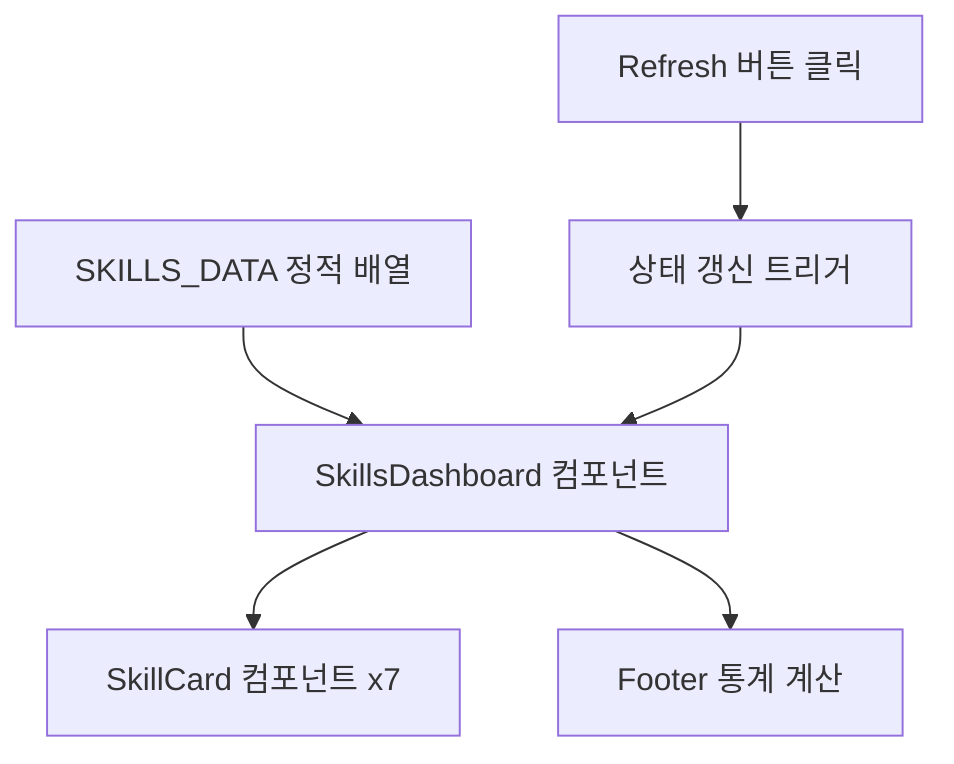

# IA.md - Skill Dashboard 정보 구조

> **문서 버전**: 1.0.0
> **최종 업데이트**: 2026-01-06
> **상위 문서**: HANDOFF.md - 260106-skills-pipeline-test

---

## 1. 서비스 정보 계층 구조

```
Skill Dashboard
├── 1. Header
│   ├── 1.1 제목 (Skill Dashboard)
│   └── 1.2 Refresh 버튼
│
├── 2. Skill Grid
│   ├── 2.1 Skill Card (반복 x7)
│   │   ├── 2.1.1 Skill 이름
│   │   ├── 2.1.2 버전 정보
│   │   ├── 2.1.3 상태 표시 (active/inactive)
│   │   └── 2.1.4 설명 텍스트
│   │
│   └── 2.2 Grid Layout (3열)
│
└── 3. Footer
    └── 3.1 통계 요약 (Total / Active / Inactive)
```

---

## 2. 네비게이션 구조

### 2.1 진입점 (Entry Points)

| 위치 | 라우팅 | 설명 |
|------|--------|------|
| main.tsx | `/` | 앱 루트 (SkillsDashboard 직접 렌더링) |

### 2.2 페이지 라우팅

```
/ (SkillsDashboard)
└── 단일 페이지 앱 (SPA)
    └── 라우팅 없음 (정적 대시보드)
```

> **참고**: 이 대시보드는 단일 화면으로 구성되며, 별도의 라우팅이 없습니다.

---

## 3. 데이터 흐름 (Data Flow)

### 3.1 데이터 흐름도



### 3.2 데이터 소스

| 데이터 | 소스 타입 | 업데이트 주기 |
|--------|-----------|---------------|
| Skill 목록 | 정적 배열 (Mock) | 없음 (하드코딩) |
| 통계 정보 | 계산값 | 렌더링 시 |

---

## 4. 컨텐츠 구조

### 4.1 Skill Card 정보 구성

```yaml
Skill Card:
  - name: string       # Skill 이름 (leader, designer, coder 등)
  - version: string    # 버전 (1.3.0 형식)
  - status: enum       # 상태 (active | inactive)
  - description: string # 설명 텍스트
```

### 4.2 정보 우선순위

| 우선순위 | 항목 | 표시 위치 |
|----------|------|-----------|
| 1 | Skill 이름 | 카드 상단 (bold) |
| 2 | 상태 표시 | 카드 하단 (컬러 dot) |
| 3 | 버전 정보 | 카드 중간 |
| 4 | 설명 | 호버/확장 시 |

---

## 5. 상태 관리 (State Management)

### 5.1 상태 정의

```yaml
상태 목록:
  - skills: Skill[]      # Skill 목록 배열
  - activeCount: number  # 활성 Skill 수
  - inactiveCount: number # 비활성 Skill 수
```

### 5.2 상태 전이 조건

| 현재 상태 | 이벤트 | 다음 상태 |
|----------|--------|----------|
| 초기 렌더링 | - | skills 로드됨 |
| skills 로드됨 | Refresh 클릭 | skills 재계산 |

> **참고**: 정적 데이터이므로 상태 전이가 단순합니다.

---

## 6. 접근 권한 구조

| 권한 레벨 | 대상 | 접근 범위 |
|-----------|------|----------|
| 기본 | 모든 사용자 | 대시보드 조회 |

> **참고**: 인증/권한 없이 접근 가능한 공개 대시보드입니다.

---

## 7. 모바일/반응형 고려사항

### 7.1 브레이크포인트

| 디바이스 | 너비 | Grid 열 수 |
|----------|------|-----------|
| Mobile | < 640px | 1열 |
| Tablet | 640px ~ 1024px | 2열 |
| Desktop | > 1024px | 3열 |

### 7.2 TailwindCSS 반응형 클래스

```
grid-cols-1 sm:grid-cols-2 lg:grid-cols-3
```

---

**END OF IA.md**
