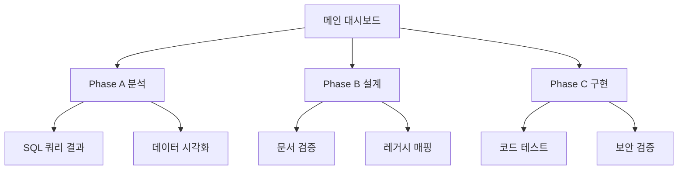

# IA.md - 정보 구조

> **문서 ID**: IA-orchestrator-validation-20251223  
> **연관 PRD**: case6-orchestrator-validation-20251223  
> **생성일**: 2025-12-23

## 1. 서비스 구조

```
오케스트레이터 통합 검증 시스템
├── Phase A: 정량적 분석 대시보드
│   ├── 활성 회원 세그먼트 분석
│   ├── 전문과목별 분포 분석  
│   ├── 로그인 패턴 분석
│   └── 분석 결과 해석
├── Phase B: 설계 문서 관리
│   ├── IA 설계 검증
│   ├── Wireframe 검증
│   ├── SDD 검증
│   └── HANDOFF 검증
└── Phase C: 구현 결과 검증
    ├── API 엔드포인트 테스트
    ├── React 컴포넌트 테스트
    ├── 테스트 코드 커버리지
    └── Output Validation 결과
```

## 2. 페이지 레벨 구조

### Level 1: 메인 대시보드
```
/orchestrator-validation
├── 검증 개요 카드
├── Phase 진행 상태
├── 성공 지표 모니터링
└── 실시간 로그 피드
```

### Level 2: Phase별 상세
```
/orchestrator-validation/phase-a
├── SQL 쿼리 실행 결과
├── 데이터 시각화 차트
├── 스키마 일치성 검증
└── 분석 인사이트

/orchestrator-validation/phase-b  
├── IA 구조 리뷰
├── Wireframe 검증
├── SDD 레거시 매핑 확인
└── HANDOFF 완성도 체크

/orchestrator-validation/phase-c
├── 코드 빌드 상태
├── 테스트 커버리지 리포트
├── TypeScript 컴파일 결과
└── Protected Path 보안 검증
```

## 3. 네비게이션 플로우



## 4. 사용자 여정 (User Journey)

### AI PM 여정
```
1. 대시보드 접근 → 전체 Phase 상태 확인
2. Phase A → SQL 실행 결과 및 데이터 검증
3. Phase B → 설계 문서 품질 확인
4. Phase C → 구현 결과 및 테스트 리포트 확인
5. 종합 결과 → 오케스트레이터 정상 작동 여부 판단
```

### QA 엔지니어 여정  
```
1. 테스트 시나리오 실행 → Happy Path / Edge Cases
2. 각 Phase별 성공 기준 달성 확인
3. HITL 체크포인트 트리거 검증
4. 보안 위반 / 재시도 횟수 모니터링
5. 품질 리포트 생성
```

## 5. 컴포넌트 계층

### 공통 컴포넌트
- ValidationHeader: 검증 진행 상태 표시
- PhaseCard: 각 Phase 요약 정보
- MetricWidget: 성공 지표 실시간 모니터링
- LogFeed: 오케스트레이터 로그 실시간 스트리밍

### Phase별 전용 컴포넌트
- SQLQueryResult: SQL 실행 결과 테이블
- SchemaValidator: DOMAIN_SCHEMA 일치성 체크
- DocumentReviewer: IA/SDD/HANDOFF 문서 검토
- CodeTestReport: 커버리지 및 빌드 결과