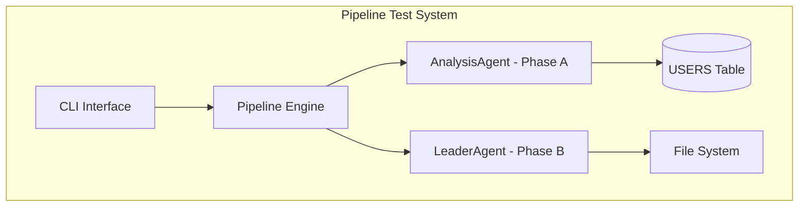

# SDD.md - 시스템 설계

## 1. 아키텍처 개요



## 2. 레거시 스키마 매핑

### USERS 테이블 활용

```sql
-- DOMAIN_SCHEMA.md 기반 실제 컬럼명 사용
TABLE: USERS
├── U_ID VARCHAR(14) PRIMARY KEY     -- 사용자 식별자
├── U_KIND CHAR(6)                   -- 회원 유형 (DOC001=의사)
├── U_ALIVE CHAR(6) DEFAULT 'Y'      -- 활성 상태 (Y/N)
└── U_REG_DATE DATETIME              -- 가입일
```

### 제약사항
- **위험도**: LOW (USERS 테이블은 20만 행으로 안전)
- **인덱스**: PRIMARY KEY(U_ID) 활용
- **필터 조건**: U_ALIVE='Y' 필수

## 3. Phase별 상세 설계

### Phase A: Analysis (AnalysisAgent)

**입력**: PRD 요구사항
**출력**: `active_users.sql`

```sql
-- 생성될 SQL 쿼리 템플릿
SELECT 
    COUNT(*) as total_active_users,
    U_KIND,
    COUNT(CASE WHEN U_KIND = 'DOC001' THEN 1 END) as doctor_count,
    COUNT(CASE WHEN U_KIND = 'PHA001' THEN 1 END) as pharmacist_count
FROM USERS 
WHERE U_ALIVE = 'Y'
GROUP BY U_KIND
ORDER BY COUNT(*) DESC
LIMIT 10;
```

**성공 기준**: 
- SELECT문만 사용 ✓
- LIMIT 포함 ✓
- DOMAIN_SCHEMA.md 실제 컬럼명 사용 ✓

### Phase B: Design (LeaderAgent)

**입력**: Phase A SQL 실행 결과
**출력**: `Analysis_Report.md`

```markdown
# Analysis_Report.md 템플릿
## 쿼리 실행 결과
- 실행 시간: [측정값]ms
- 조회 행수: [결과값]행

## 활성 사용자 통계
- 전체: [count]명
- 의사(DOC001): [count]명  
- 약사(PHA001): [count]명

## 파이프라인 검증
✓ Phase A: SQL 생성 및 실행 완료
✓ Phase B: 리포트 생성 완료
✓ Phase C: mixed 파이프라인으로 스킵됨
```

## 4. 에러 처리

| 에러 시나리오 | 대응 방안 |
|---------------|-----------|
| USERS 테이블 접근 실패 | 연결 재시도 후 실패 시 Phase A 중단 |
| SQL 실행 오류 | 쿼리 검증 후 에러 로그 출력 |
| 파일 생성 실패 | 권한 확인 후 대체 경로 시도 |

## 5. 성능 고려사항

- **USERS 테이블**: 20만 행으로 Full Scan 가능 (위험도 LOW)
- **예상 실행시간**: < 100ms
- **메모리 사용량**: < 10MB

## 6. 테스트 검증 포인트

```yaml
validation_points:
  phase_a:
    - sql_syntax: "Valid SELECT statement"
    - limit_clause: "LIMIT 10 included"
    - column_names: "U_ID, U_KIND, U_ALIVE from DOMAIN_SCHEMA"
  
  phase_b:
    - report_generated: "Analysis_Report.md exists"
    - content_format: "Markdown with required sections"
  
  pipeline:
    - phase_c_skipped: "Phase C not executed"
    - completion_report: "printCompletionReport output"
```

## Risk

- **Duration 버그**: PRD에서 언급된 "Duration 버그 수정 확인"이 성능 측정과 관련될 수 있음
- **파이프라인 종료**: mixed 파이프라인에서 Phase C가 정상적으로 스킵되는지 확인 필요