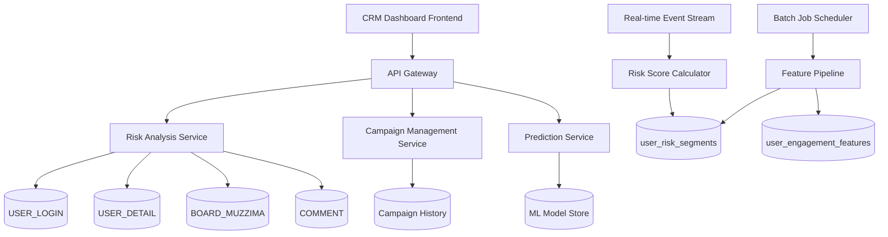
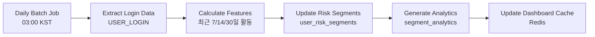
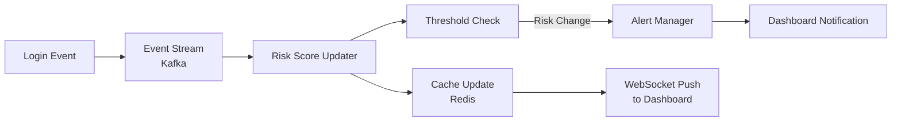

# SDD.md - 휴면 위험 예측 시스템 설계

## 1. 시스템 아키텍처 개요



## 2. 레거시 스키마 매핑 (Legacy Schema Mapping)

### 2.1 핵심 테이블 활용

**⚠️ DOMAIN_SCHEMA.md 기반 실제 컬럼명 사용**

| 개념 | 물리 테이블 | 핵심 컬럼 | 용도 |
|------|-------------|----------|------|
| 로그인 이력 | `USER_LOGIN` | `U_ID`, `LOGIN_DATE`, `SVC_FROM` | 접속 패턴 분석 |
| 회원 정보 | `USER_DETAIL` | `U_MAJOR_CODE_1`, `U_WORK_TYPE_1`, `U_CAREER_YEAR` | 세그먼트 분류 |
| 게시글 활동 | `BOARD_MUZZIMA` | `U_ID`, `REG_DATE`, `CTG_CODE` | 콘텐츠 참여도 |
| 댓글 활동 | `COMMENT` | `U_ID`, `REG_DATE`, `SVC_CODE` | 커뮤니티 참여도 |

### 2.2 위험도 라벨링 로직 (Rule-based)

```sql
-- user_risk_segments 테이블 생성 로직
WITH user_activity_summary AS (
  SELECT 
    ul.U_ID,
    MAX(STR_TO_DATE(ul.LOGIN_DATE, '%Y%m%d')) AS last_login_date,
    COUNT(DISTINCT ul.LOGIN_DATE) AS total_login_days,
    COUNT(CASE WHEN STR_TO_DATE(ul.LOGIN_DATE, '%Y%m%d') >= DATE_SUB(NOW(), INTERVAL 30 DAY) THEN 1 END) AS login_days_30d,
    COUNT(CASE WHEN STR_TO_DATE(ul.LOGIN_DATE, '%Y%m%d') >= DATE_SUB(NOW(), INTERVAL 7 DAY) THEN 1 END) AS login_days_7d
  FROM USER_LOGIN ul
  WHERE ul.U_KIND = 'DOC001'  -- 의사만 대상
  GROUP BY ul.U_ID
),
user_engagement AS (
  SELECT 
    u.U_ID,
    ud.U_MAJOR_CODE_1,
    ud.U_WORK_TYPE_1,
    ud.U_CAREER_YEAR,
    COALESCE(b.post_count, 0) AS post_count,
    COALESCE(c.comment_count, 0) AS comment_count
  FROM USERS u
  LEFT JOIN USER_DETAIL ud ON u.U_ID = ud.U_ID
  LEFT JOIN (
    SELECT U_ID, COUNT(*) AS post_count 
    FROM BOARD_MUZZIMA 
    WHERE REG_DATE >= DATE_SUB(NOW(), INTERVAL 90 DAY)
    GROUP BY U_ID
  ) b ON u.U_ID = b.U_ID
  LEFT JOIN (
    SELECT U_ID, COUNT(*) AS comment_count 
    FROM COMMENT 
    WHERE REG_DATE >= DATE_SUB(NOW(), INTERVAL 90 DAY)
    GROUP BY U_ID
  ) c ON u.U_ID = c.U_ID
  WHERE u.U_KIND = 'DOC001' AND u.U_ALIVE = 'Y'
)
SELECT 
  uas.U_ID,
  uas.last_login_date,
  DATEDIFF(NOW(), uas.last_login_date) AS days_since_last_login,
  uas.total_login_days,
  uas.login_days_30d,
  uas.login_days_7d,
  ue.U_MAJOR_CODE_1,
  ue.U_WORK_TYPE_1,
  ue.post_count,
  ue.comment_count,
  -- 위험도 라벨링 로직
  CASE
    WHEN DATEDIFF(NOW(), uas.last_login_date) <= 7 THEN 'ACTIVE'
    WHEN DATEDIFF(NOW(), uas.last_login_date) <= 14 THEN 'AT_RISK_L1'
    WHEN DATEDIFF(NOW(), uas.last_login_date) <= 30 THEN 'AT_RISK_L2'
    WHEN DATEDIFF(NOW(), uas.last_login_date) <= 60 THEN 'DORMANT_L1'
    WHEN DATEDIFF(NOW(), uas.last_login_date) <= 90 THEN 'DORMANT_L2'
    ELSE 'CHURNED'
  END AS risk_stage,
  -- 위험 점수 (0-100)
  LEAST(100, 
    (DATEDIFF(NOW(), uas.last_login_date) * 1.2) +
    (CASE WHEN uas.login_days_7d = 0 THEN 20 ELSE 0 END) +
    (CASE WHEN ue.comment_count = 0 THEN 15 ELSE 0 END)
  ) AS risk_score
FROM user_activity_summary uas
JOIN user_engagement ue ON uas.U_ID = ue.U_ID;
```

## 3. API 설계

### 3.1 세그먼트 현황 API

```yaml
/api/v1/segments/summary:
  get:
    summary: 세그먼트별 회원 수 현황
    responses:
      200:
        content:
          application/json:
            schema:
              type: object
              properties:
                timestamp:
                  type: string
                  format: date-time
                segments:
                  type: object
                  properties:
                    ACTIVE:
                      type: object
                      properties:
                        count: 27458
                        percentage: 27.0
                        change_7d: +2.3
                    AT_RISK_L1:
                      type: object
                      properties:
                        count: 7484
                        percentage: 7.5
                        change_7d: -5.1
```

### 3.2 세그먼트 상세 조회 API

```yaml
/api/v1/segments/{segment_type}/members:
  get:
    parameters:
      - name: segment_type
        in: path
        required: true
        schema:
          type: string
          enum: [ACTIVE, AT_RISK_L1, AT_RISK_L2, DORMANT_L1, DORMANT_L2, CHURNED]
      - name: major_code
        in: query
        schema:
          type: string
      - name: work_type
        in: query
        schema:
          type: string
      - name: page
        in: query
        schema:
          type: integer
          default: 1
      - name: limit
        in: query
        schema:
          type: integer
          default: 20
    responses:
      200:
        content:
          application/json:
            schema:
              type: object
              properties:
                total_count: 7484
                page: 1
                limit: 20
                members:
                  type: array
                  items:
                    type: object
                    properties:
                      u_id_masked: "U001***"
                      major_name: "내과"
                      work_type_name: "봉직"
                      days_since_last_login: 9
                      risk_score: 85
```

### 3.3 캠페인 실행 API

```yaml
/api/v1/campaigns:
  post:
    summary: 리텐션 캠페인 생성 및 실행
    requestBody:
      content:
        application/json:
          schema:
            type: object
            properties:
              name: "AT_RISK L1 긴급복귀 캠페인"
              target_segment: "AT_RISK_L1"
              channel: "PUSH"
              message_template: "맞춤 채용공고 3건 도착"
              schedule_time: "2025-12-19T18:00:00Z"
              filters:
                major_codes: ["IM", "GS"]
                work_types: ["OWN", "EMP"]
    responses:
      201:
        content:
          application/json:
            schema:
              type: object
              properties:
                campaign_id: "CAMP_20251219_001"
                target_count: 6787
                estimated_reach: 6139
                status: "SCHEDULED"
```

## 4. 데이터 흐름 설계

### 4.1 배치 처리 파이프라인



### 4.2 실시간 처리 파이프라인



## 5. ML 예측 모델 설계

### 5.1 Feature Engineering

```python
# user_engagement_features 테이블 구조
features = {
    'login_frequency_7d': 'COUNT(DISTINCT LOGIN_DATE) in last 7 days',
    'login_frequency_30d': 'COUNT(DISTINCT LOGIN_DATE) in last 30 days', 
    'days_since_last_login': 'DATEDIFF(NOW(), MAX(LOGIN_DATE))',
    'avg_session_gap': '평균 로그인 간격',
    'post_count_90d': 'BOARD_MUZZIMA 작성 수 (90일)',
    'comment_count_90d': 'COMMENT 작성 수 (90일)',
    'career_year': 'USER_DETAIL.U_CAREER_YEAR',
    'major_engagement_rate': '전문과목별 평균 참여율',
    'mobile_usage_ratio': 'SVC_FROM=MOBILE 비율',
    'weekend_login_ratio': '주말 로그인 비율'
}
```

### 5.2 모델 아키텍처

| 단계 | 모델 | 용도 | 정확도 목표 |
|------|------|------|------------|
| 1차 | Logistic Regression | 기본 위험도 분류 | >75% |
| 2차 | Random Forest | Feature 중요도 분석 | >80% |
| 3차 | XGBoost | 최종 예측 모델 | >85% |

## 6. 성능 및 확장성 고려사항

### 6.1 쿼리 최적화

**⚠️ USER_LOGIN 테이블 (2,267만 건) 처리 시 주의사항**

```sql
-- ❌ 위험: Full Table Scan
SELECT * FROM USER_LOGIN WHERE LOGIN_DATE >= '20251201';

-- ✅ 안전: 인덱스 활용 + 파티션
SELECT * FROM USER_LOGIN 
WHERE U_ID = 'DOC001' 
  AND LOGIN_DATE >= '20251201'
LIMIT 1000;
```

### 6.2 캐시 전략

| 데이터 유형 | 캐시 TTL | 캐시 키 | 갱신 조건 |
|-------------|----------|---------|-----------|
| 세그먼트 현황 | 1시간 | `segments:summary` | 배치 작업 완료 시 |
| 회원 상세 | 30분 | `member:{u_id}:profile` | 로그인 시 |
| 캠페인 성과 | 5분 | `campaign:{id}:metrics` | 실시간 |

### 6.3 데이터베이스 파티셔닝

```sql
-- USER_LOGIN 테이블 월별 파티셔닝 제안
ALTER TABLE USER_LOGIN 
PARTITION BY RANGE (YEAR(STR_TO_DATE(LOGIN_DATE, '%Y%m%d')))
(
    PARTITION p202501 VALUES LESS THAN (2025),
    PARTITION p202502 VALUES LESS THAN (2026),
    PARTITION p_future VALUES LESS THAN MAXVALUE
);
```

## 7. 보안 및 개인정보 보호

### 7.1 개인정보 마스킹

```javascript
// API 응답 시 개인정보 마스킹
const maskUserId = (userId) => {
  return userId.substring(0, 4) + '*'.repeat(userId.length - 4);
};

// 예시: "DOC001234" → "DOC0***"
```

### 7.2 접근 권한 제어

| 역할 | 조회 가능 데이터 | 제한사항 |
|------|-----------------|----------|
| CRM_MANAGER | 세그먼트별 통계, 마스킹된 회원 목록 | 개인식별 불가 |
| DATA_ANALYST | 집계 데이터만 | 개별 회원 정보 접근 불가 |
| MARKETING | 캠페인 타겟 수만 | 회원 상세 정보 접근 불가 |

## 8. 모니터링 및 알림

### 8.1 시스템 모니터링

```yaml
metrics:
  - name: segment_calculation_duration
    threshold: 300s
    alert: Slack #data-alerts
  
  - name: risk_score_accuracy
    threshold: 0.80
    alert: Email to ML team
  
  - name: campaign_delivery_rate
    threshold: 0.90
    alert: CRM Manager
```

### 8.2 비즈니스 알림

| 조건 | 알림 대상 | 채널 |
|------|-----------|------|
| AT_RISK_L1 1만명 초과 | CRM팀 | Slack |
| 주간 이탈률 25% 초과 | 서비스팀 | Email |
| 캠페인 복귀율 5% 미만 | 마케팅팀 | Dashboard |