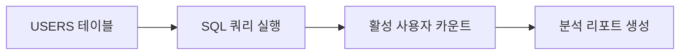

# IA.md - 정보 구조

## 1. 서비스 구조

```
Pipeline Refactoring Test
├── Phase A (Analysis)
│   └── 활성 사용자 조회 (F1)
├── Phase B (Design)  
│   └── 분석 리포트 작성 (F2)
└── Phase C (Coding)
    └── [SKIP - mixed 파이프라인에서 제외]
```

## 2. 데이터 흐름



## 3. Phase별 산출물

| Phase | 산출물 | 형식 | 역할 |
|-------|--------|------|------|
| A | active_users.sql | SQL 파일 | 활성 사용자 조회 쿼리 |
| B | Analysis_Report.md | Markdown | 분석 결과 요약 리포트 |
| C | [SKIP] | - | mixed 파이프라인에서 제외 |

## 4. 테스트 시나리오 흐름

1. **Phase A 진입**: AnalysisAgent가 USERS 테이블 조회
2. **SQL 실행**: U_ALIVE='Y' 조건으로 활성 사용자 카운트
3. **Phase B 진입**: LeaderAgent가 분석 결과 기반 리포트 작성
4. **Pipeline 완료**: Phase C 스킵 후 종료
5. **검증**: CLI에서 `printCompletionReport` 출력 확인