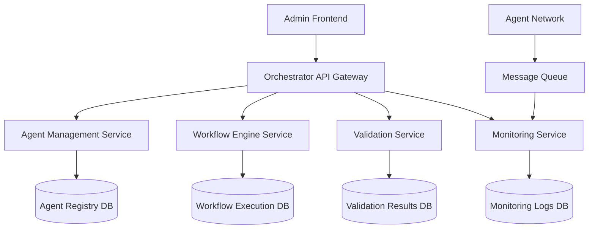

# SDD.md - 시스템 설계

## 1. 아키텍처 개요



## 2. 레거시 스키마 매핑

### 신규 테이블 생성 필요 (DBA 승인 필요)

```sql
-- 오케스트레이터 에이전트 테이블
CREATE TABLE ORCHESTRATOR_AGENTS (
    AGENT_ID VARCHAR(20) PRIMARY KEY,
    AGENT_NAME VARCHAR(100) NOT NULL,
    AGENT_TYPE CHAR(6) NOT NULL,           -- LEADER, CODING, DESIGN, ANALYSIS
    STATUS CHAR(6) DEFAULT 'ACTIVE',       -- ACTIVE, IDLE, ERROR, STOPPED
    ENDPOINT_URL VARCHAR(255),
    LAST_HEARTBEAT DATETIME,
    CONFIG JSON,
    REG_DATE DATETIME DEFAULT NOW(),
    MOD_DATE DATETIME DEFAULT NOW()
);

-- 워크플로우 실행 기록
CREATE TABLE ORCHESTRATOR_EXECUTIONS (
    EXECUTION_ID VARCHAR(30) PRIMARY KEY,
    WORKFLOW_TYPE VARCHAR(50) NOT NULL,    -- 'FEATURE_DEVELOPMENT', 'VALIDATION'
    STATUS CHAR(6) DEFAULT 'RUNNING',      -- RUNNING, SUCCESS, FAILED, TIMEOUT
    REQUEST_DATA JSON,                     -- PRD, 작업 요청 내용
    RESULT_DATA JSON,                      -- 실행 결과
    START_TIME DATETIME,
    END_TIME DATETIME,
    DURATION_SEC INT,
    ERROR_MESSAGE TEXT,
    TRIGGERED_BY VARCHAR(20),              -- 실행 요청자 (U_ID)
    REG_DATE DATETIME DEFAULT NOW()
);

-- 검증 결과 테이블  
CREATE TABLE ORCHESTRATOR_VALIDATIONS (
    VALIDATION_ID VARCHAR(30) PRIMARY KEY,
    EXECUTION_ID VARCHAR(30),              -- ORCHESTRATOR_EXECUTIONS FK
    TEST_CATEGORY VARCHAR(50),             -- 'INTEGRATION', 'PERFORMANCE', 'UNIT'
    TEST_NAME VARCHAR(100),
    STATUS CHAR(6),                        -- PASS, FAIL, SKIP
    RESULT_SCORE DECIMAL(5,2),            -- 0-100 점수
    DETAILS JSON,                          -- 상세 결과 데이터
    DURATION_MS INT,
    REG_DATE DATETIME DEFAULT NOW(),
    FOREIGN KEY (EXECUTION_ID) REFERENCES ORCHESTRATOR_EXECUTIONS(EXECUTION_ID)
);

-- 시스템 로그 테이블
CREATE TABLE ORCHESTRATOR_LOGS (
    LOG_ID BIGINT PRIMARY KEY AUTO_INCREMENT,
    AGENT_ID VARCHAR(20),                  -- ORCHESTRATOR_AGENTS FK
    EXECUTION_ID VARCHAR(30),              -- ORCHESTRATOR_EXECUTIONS FK  
    LOG_LEVEL CHAR(6),                     -- DEBUG, INFO, WARN, ERROR
    MESSAGE TEXT,
    CONTEXT_DATA JSON,
    REG_DATE DATETIME DEFAULT NOW(),
    INDEX idx_agent_date (AGENT_ID, REG_DATE),
    INDEX idx_execution_date (EXECUTION_ID, REG_DATE)
);
```

### 기존 테이블 활용
- 관리자 권한: `USERS` 테이블의 `U_KIND = 'ADM001'` 조건 활용
- 사용자 세션: 기존 세션 관리 체계 활용

## 3. API 설계

### 3.1 오케스트레이터 관리 API

```yaml
# 에이전트 관리
GET /api/v1/orchestrator/agents
  - 에이전트 목록 조회
  - Query: status, type, page, size
  
GET /api/v1/orchestrator/agents/{agentId}
  - 에이전트 상세 정보
  
POST /api/v1/orchestrator/agents/{agentId}/heartbeat
  - 에이전트 헬스체크 (에이전트 → 오케스트레이터)
  
PUT /api/v1/orchestrator/agents/{agentId}/config
  - 에이전트 설정 변경

# 워크플로우 관리  
GET /api/v1/orchestrator/workflows
  - 워크플로우 실행 기록 조회
  
POST /api/v1/orchestrator/workflows/execute
  - 워크플로우 실행 요청
  - Body: { type, requestData, priority }
  
GET /api/v1/orchestrator/workflows/{executionId}
  - 워크플로우 실행 상세 조회

# 검증 API
POST /api/v1/orchestrator/validation/integration-test
  - 통합 테스트 실행
  
GET /api/v1/orchestrator/validation/results/{validationId}
  - 검증 결과 조회
  
GET /api/v1/orchestrator/health
  - 전체 시스템 헬스체크
```

### 3.2 실시간 모니터링 API

```yaml
# WebSocket 연결
WS /api/v1/orchestrator/monitor/stream
  - 실시간 에이전트 상태 스트림
  - 워크플로우 실행 상태 실시간 업데이트
  
# 메트릭 API  
GET /api/v1/orchestrator/metrics/dashboard
  - 대시보드용 집계 메트릭
  - Response: { totalAgents, activeAgents, successRate, recentExecutions }
```

## 4. 검증 시나리오 설계

### 4.1 Agent Communication Test
```javascript
// 에이전트 간 통신 검증
const testAgentCommunication = async () => {
  // 1. Leader Agent에게 작업 할당
  const workRequest = {
    type: 'DESIGN',
    payload: { requirement: 'Simple wireframe test' }
  };
  
  // 2. Design Agent 호출 확인
  const result = await orchestrator.assignWork('DESIGN_AGENT', workRequest);
  
  // 3. 응답 시간 및 결과 검증
  assert(result.executionTime < 5000, 'Response time under 5s');
  assert(result.status === 'SUCCESS', 'Task completed successfully');
};
```

### 4.2 Error Recovery Test
```javascript  
// 에러 복구 메커니즘 검증
const testErrorRecovery = async () => {
  // 1. 의도적으로 에이전트 중단
  await orchestrator.stopAgent('CODING_AGENT');
  
  // 2. 작업 할당 시 대체 에이전트 활용 확인
  const result = await orchestrator.assignWork('CODING', workRequest);
  
  // 3. Fallback 메커니즘 동작 검증
  assert(result.handledBy !== 'CODING_AGENT', 'Fallback agent used');
  assert(result.status === 'SUCCESS', 'Work completed despite agent failure');
};
```

## 5. 성능 요구사항

| 메트릭 | 목표값 | 측정 방법 |
|--------|--------|----------|
| Agent Response Time | < 3초 | 작업 할당 후 첫 응답까지 시간 |
| Workflow Completion | < 30초 | 단순 작업 기준 전체 완료 시간 |
| System Recovery Time | < 10초 | 에이전트 장애 시 복구 시간 |
| Concurrent Workflows | 10개 | 동시 실행 가능한 워크플로우 수 |

## 6. 모니터링 및 알람

```yaml
# 알람 규칙
alerts:
  - name: "Agent Down"
    condition: "agent.heartbeat > 60s"
    action: "notify_admin + auto_restart"
    
  - name: "Workflow Timeout" 
    condition: "execution.duration > 300s"
    action: "notify_admin + force_terminate"
    
  - name: "High Error Rate"
    condition: "error_rate > 10% in 5min"
    action: "notify_admin + enable_debug_mode"
```