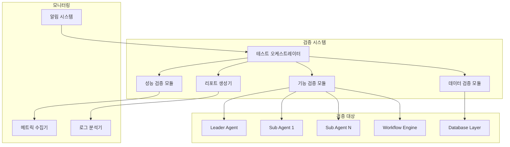
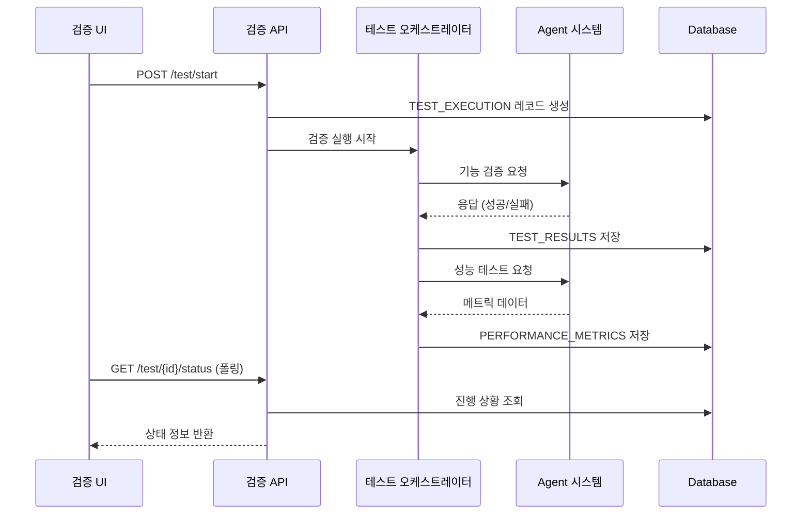

# SDD.md - 시스템 설계

## 문서 메타데이터
- **문서명**: SDD.md (Software Design Document)
- **생성일**: 2025-12-23
- **기반**: PRD, IA.md, Wireframe.md, DOMAIN_SCHEMA.md
- **범위**: 오케스트레이터 통합 기능 검증 시스템

## 1. 아키텍처 개요



## 2. 레거시 스키마 매핑

오케스트레이터 검증을 위한 새로운 테이블 설계가 필요합니다.

### 2.1 검증 관련 신규 테이블

```sql
-- 테스트 실행 마스터
CREATE TABLE TEST_EXECUTION (
  TEST_ID           VARCHAR(20) PRIMARY KEY,
  TEST_TYPE         VARCHAR(20) NOT NULL,     -- 'FUNCTION', 'PERFORMANCE', 'DATA'
  TEST_NAME         VARCHAR(100) NOT NULL,
  STATUS            VARCHAR(20) DEFAULT 'PENDING', -- 'PENDING', 'RUNNING', 'SUCCESS', 'FAILED'
  START_TIME        DATETIME,
  END_TIME          DATETIME,
  DURATION_MS       INT,
  CREATED_BY        VARCHAR(14),              -- USERS.U_ID FK
  CREATED_DATE      DATETIME DEFAULT NOW()
);

-- 테스트 결과 상세
CREATE TABLE TEST_RESULTS (
  RESULT_ID         INT PRIMARY KEY AUTO_INCREMENT,
  TEST_ID           VARCHAR(20) NOT NULL,     -- TEST_EXECUTION.TEST_ID FK
  COMPONENT_NAME    VARCHAR(50),              -- 'Leader_Agent', 'Sub_Agent_1' 등
  CHECK_POINT       VARCHAR(100),             -- 검증 포인트 설명
  EXPECTED_VALUE    TEXT,                     -- 예상 결과
  ACTUAL_VALUE      TEXT,                     -- 실제 결과
  RESULT_STATUS     VARCHAR(20),              -- 'PASS', 'FAIL', 'WARNING'
  ERROR_MESSAGE     TEXT,
  EXECUTION_TIME_MS INT,
  CREATED_DATE      DATETIME DEFAULT NOW(),
  
  FOREIGN KEY (TEST_ID) REFERENCES TEST_EXECUTION(TEST_ID)
);

-- 성능 메트릭
CREATE TABLE PERFORMANCE_METRICS (
  METRIC_ID         INT PRIMARY KEY AUTO_INCREMENT,
  TEST_ID           VARCHAR(20) NOT NULL,     -- TEST_EXECUTION.TEST_ID FK
  METRIC_TYPE       VARCHAR(30) NOT NULL,     -- 'RESPONSE_TIME', 'THROUGHPUT', 'CPU', 'MEMORY'
  METRIC_VALUE      DECIMAL(10,3),
  METRIC_UNIT       VARCHAR(10),              -- 'ms', 'tps', '%', 'MB'
  MEASURED_AT       DATETIME DEFAULT NOW(),
  
  FOREIGN KEY (TEST_ID) REFERENCES TEST_EXECUTION(TEST_ID)
);
```

### 2.2 기존 테이블 활용

| 용도 | 기존 테이블 | 활용 방식 |
|------|------------|----------|
| 검증 실행자 정보 | `USERS` | `TEST_EXECUTION.CREATED_BY` → `USERS.U_ID` |
| 시스템 로그 분석 | 기존 로그 테이블 (있다면) | 검증 대상 시스템의 동작 로그 분석 |

## 3. API 설계

### 3.1 검증 실행 API

```yaml
# 통합 검증 시작
POST /api/v1/orchestrator/test/start
Request:
  {
    "test_types": ["FUNCTION", "PERFORMANCE", "DATA"],
    "test_config": {
      "parallel_execution": true,
      "timeout_seconds": 300
    }
  }
Response:
  {
    "test_id": "TEST_20251223_001",
    "status": "STARTED",
    "estimated_duration": "5 minutes"
  }

# 검증 상태 조회
GET /api/v1/orchestrator/test/{test_id}/status
Response:
  {
    "test_id": "TEST_20251223_001",
    "status": "RUNNING",
    "progress_percentage": 65,
    "current_phase": "Agent 연동 테스트",
    "elapsed_time": "3m 20s"
  }

# 검증 결과 조회
GET /api/v1/orchestrator/test/{test_id}/results
Response:
  {
    "test_id": "TEST_20251223_001",
    "overall_status": "SUCCESS",
    "summary": {
      "total_checks": 45,
      "passed": 42,
      "failed": 2,
      "warnings": 1
    },
    "details": [
      {
        "component": "Leader Agent",
        "status": "PASS",
        "response_time": "120ms"
      }
    ]
  }
```

### 3.2 모니터링 API

```yaml
# 실시간 메트릭 조회
GET /api/v1/orchestrator/metrics/realtime
Response:
  {
    "timestamp": "2025-12-23T10:30:00Z",
    "metrics": {
      "avg_response_time": 150,
      "throughput_tps": 45,
      "cpu_usage": 40,
      "memory_usage": 30
    }
  }
```

## 4. 데이터 흐름



## 5. 검증 시나리오

### 5.1 기능 검증 시나리오

| 시나리오 | 검증 내용 | 성공 기준 |
|---------|----------|-----------|
| Agent 통신 | Leader ↔ Sub Agent 메시지 전달 | 응답시간 < 500ms, 성공률 > 95% |
| Workflow 실행 | 문서 생성 파이프라인 | 전체 단계 완료, 오류 없음 |
| 오류 복구 | Agent 장애 시 복구 | 10초 내 자동 복구 |

### 5.2 성능 검증 시나리오

| 지표 | 목표값 | 측정 방법 |
|------|-------|-----------|
| 응답시간 | 평균 < 200ms | 100회 연속 요청 측정 |
| 처리량 | > 50 TPS | 5분간 연속 부하 |
| 동시성 | 10개 Agent 동시 실행 | 리소스 사용량 모니터링 |

## 6. 제약사항 및 고려사항

### 6.1 기술적 제약사항
- 검증 실행 중 운영 시스템에 영향 최소화
- 대용량 테이블(`USER_LOGIN`, `COMMENT`) 접근 시 성능 영향 고려
- 검증 데이터는 별도 스키마에 저장 (운영 DB 분리)

### 6.2 보안 고려사항
- 검증 로그에 민감 정보(개인정보) 포함 금지
- 검증 결과 접근 권한 제한 (관리자 레벨만)
- 검증용 테스트 데이터는 익명화된 샘플 데이터 사용