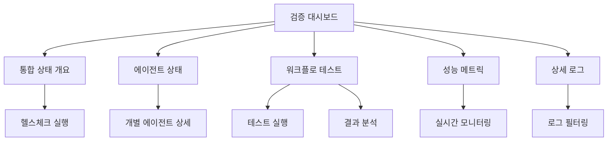

# IA.md - 오케스트레이터 통합 기능 검증 정보 구조

## 문서 정보
- **버전**: 1.0.0
- **작성일**: 2025-12-27
- **대상**: 오케스트레이터 통합 기능 검증

## 페이지 계층 구조

### 1. 검증 대시보드 (/) 
```
/orchestrator-verification
├── /overview (통합 상태 개요)
├── /agent-status (에이전트 상태 모니터링)
├── /workflow-test (워크플로 테스트)
├── /performance (성능 메트릭)
└── /logs (상세 로그)
```

### 2. 상세 페이지 구조

#### 2.1 통합 상태 개요 (/overview)
- 전체 시스템 헬스체크
- 주요 컴포넌트 연결 상태
- 실시간 상태 모니터링

#### 2.2 에이전트 상태 모니터링 (/agent-status)
- Leader Agent 상태
- Sub-agent 리스트 및 상태
- 에이전트 간 통신 상태

#### 2.3 워크플로 테스트 (/workflow-test)
- 기본 워크플로 실행 테스트
- 복잡한 시나리오 테스트
- 오류 복구 테스트

#### 2.4 성능 메트릭 (/performance)
- 응답 시간 측정
- 처리량 모니터링
- 리소스 사용량

#### 2.5 상세 로그 (/logs)
- 시스템 로그 조회
- 오류 로그 분석
- 디버깅 정보

## 네비게이션 플로우



## 사용자 역할별 접근

| 역할 | 접근 가능 페이지 | 권한 |
|------|-----------------|------|
| 시스템 관리자 | 전체 페이지 | 읽기/쓰기/실행 |
| 개발자 | 로그, 성능, 테스트 | 읽기/실행 |
| 운영자 | 개요, 상태, 성능 | 읽기 |

## 데이터 흐름

1. **실시간 모니터링**: WebSocket 연결을 통한 실시간 상태 업데이트
2. **테스트 실행**: REST API를 통한 비동기 테스트 실행
3. **로그 수집**: 중앙화된 로그 수집 시스템 연동