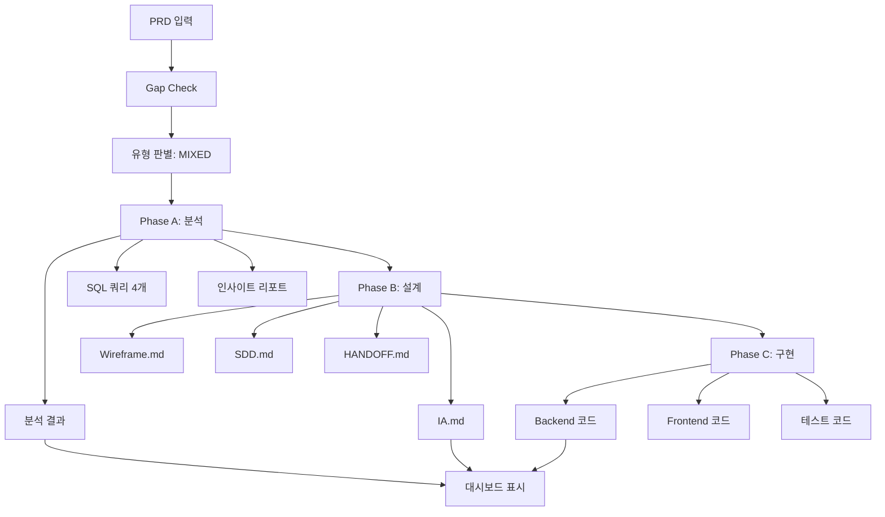

# IA.md - 정보 구조

> **문서 버전**: 1.0.0  
> **작성일**: 2025-12-23  
> **연관 PRD**: case6-orchestrator-validation-20251223

---

## 1. 사이트 구조

```
오케스트레이터 통합 검증 시스템
├── 대시보드 (/)
│   ├── 개요 섹션
│   ├── Phase A: 정량적 분석
│   │   ├── 활성 회원 세그먼트
│   │   ├── 전문과목별 분포
│   │   └── 로그인 패턴 분석
│   ├── Phase B: 정성적 설계
│   │   ├── IA 설계 현황
│   │   ├── Wireframe 생성 현황
│   │   ├── SDD 작성 현황
│   │   └── HANDOFF 생성 현황
│   └── Phase C: 코드 구현
│       ├── API 엔드포인트 구현
│       ├── React 컴포넌트 구현
│       ├── 테스트 코드 작성
│       └── Output Validation
├── 분석 상세 (/analytics)
│   ├── SQL 쿼리 결과
│   ├── 데이터 시각화
│   └── 인사이트 리포트
├── 설계 문서 (/design)
│   ├── IA 문서 뷰어
│   ├── Wireframe 뷰어
│   ├── SDD 문서 뷰어
│   └── HANDOFF 문서 뷰어
├── 코드 리뷰 (/code)
│   ├── Backend 코드
│   ├── Frontend 코드
│   ├── 테스트 결과
│   └── 빌드 상태
└── 시스템 모니터링 (/monitoring)
    ├── 파이프라인 상태
    ├── HITL 체크포인트
    ├── 성공 지표
    └── 로그 뷰어
```

## 2. 네비게이션 구조

### 2.1 메인 네비게이션

| 메뉴 | 경로 | 설명 |
|------|------|------|
| 대시보드 | / | 전체 검증 현황 개요 |
| 분석 | /analytics | Phase A 정량적 분석 결과 |
| 설계 | /design | Phase B 설계 문서들 |
| 코드 | /code | Phase C 구현 결과 |
| 모니터링 | /monitoring | 시스템 상태 및 로그 |

### 2.2 사이드 네비게이션 (상세)

**분석 섹션 (/analytics)**
```
├── 회원 세그먼트 분석
├── 전문과목 분포 차트
├── 로그인 패턴 트렌드
└── 종합 인사이트
```

**설계 섹션 (/design)**
```
├── IA 문서
├── Wireframe 설계
├── SDD (시스템 설계)
└── HANDOFF 지시서
```

## 3. 페이지 계층 구조

### Level 1: 대시보드 (/)
- **목적**: 전체 검증 프로세스 상태 한눈에 파악
- **주요 컴포넌트**: 
  - 진행률 표시기 (Phase A→B→C)
  - 성공 지표 카드
  - HITL 체크포인트 상태
  - 각 Phase별 요약

### Level 2: Phase별 상세 페이지
- **Analytics (/analytics)**: 정량적 분석 결과
- **Design (/design)**: 설계 문서 모음
- **Code (/code)**: 구현 결과물
- **Monitoring (/monitoring)**: 시스템 상태

### Level 3: 상세 항목 페이지
- **SQL 쿼리 상세 (/analytics/queries/{id})**
- **문서 뷰어 (/design/{document-type})**
- **코드 파일 뷰어 (/code/{component})**
- **로그 상세 (/monitoring/logs/{session})**

## 4. 정보 흐름



## 5. 사용자 경로 (User Journey)

### 5.1 QA 엔지니어 경로
```
1. 대시보드 접속 → 전체 상태 확인
2. Phase A 분석 → SQL 쿼리 실행 결과 확인
3. HITL 체크포인트 → 쿼리 검토 및 승인
4. Phase B 설계 → 문서 생성 상태 확인
5. HITL 체크포인트 → 설계 검토 및 승인
6. Phase C 구현 → 코드 및 테스트 결과 확인
7. 최종 성공 지표 → 검증 완료 확인
```

### 5.2 DevOps 경로
```
1. 모니터링 대시보드 → 파이프라인 상태 확인
2. 로그 뷰어 → 오류 발생 여부 확인
3. 성능 지표 → 타임아웃, 재시도 횟수 확인
4. 보안 감사 → 보안 위반 0건 확인
```

## 6. 반응형 고려사항

| 디바이스 | 레이아웃 | 주요 조정사항 |
|----------|----------|---------------|
| Desktop (≥1024px) | 사이드바 + 메인 영역 | 전체 네비게이션 표시 |
| Tablet (768-1023px) | 접이식 사이드바 | 차트 크기 조정 |
| Mobile (≤767px) | 햄버거 메뉴 | 테이블 스크롤, 카드 레이아웃 |

## 7. 접근성 (Accessibility)

- **키보드 네비게이션**: Tab 순서 논리적 구성
- **스크린 리더**: semantic HTML 태그 사용
- **색상 대비**: WCAG 2.1 AA 준수
- **텍스트 크기**: 최소 16px, 확대 200% 지원