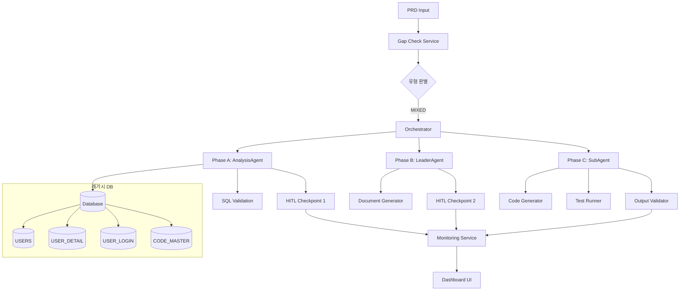

# SDD.md - 시스템 설계

> **문서 버전**: 1.0.0  
> **작성일**: 2025-12-23  
> **연관 PRD**: case6-orchestrator-validation-20251223  
> **아키텍처**: Microservice + Event-Driven

---

## 1. 아키텍처 개요



## 2. 레거시 스키마 매핑 (Legacy Mapping)

### 2.1 사용할 테이블

| 개념 엔티티 | 물리 테이블 | 주요 컬럼 | 제약사항 |
|------------|------------|-----------|----------|
| 회원 기본 | `USERS` | `U_ID`, `U_KIND`, `U_ALIVE`, `U_REG_DATE` | 500K 행, 인덱싱 양호 |
| 회원 상세 | `USER_DETAIL` | `U_ID`, `U_MAJOR_CODE_1`, `U_WORK_TYPE_1` | 500K 행, 1:1 매핑 |
| 로그인 이력 | `USER_LOGIN` | `U_ID`, `LOGIN_DATE`, `LOGIN_IP` | ⚠️ 2,267만 행 - 반드시 LIMIT 필요 |
| 코드 마스터 | `CODE_MASTER` | `CODE_TYPE`, `CODE_VALUE`, `CODE_NAME` | 참조용, 소량 데이터 |

### 2.2 필수 제약사항 준수

**⚠️ 대용량 테이블 접근 규칙**
```sql
-- ❌ 절대 금지: Full Table Scan
SELECT * FROM USER_LOGIN;

-- ✅ 필수: LIMIT + 날짜 필터
SELECT * FROM USER_LOGIN 
WHERE LOGIN_DATE >= DATE_SUB(NOW(), INTERVAL 7 DAY)
ORDER BY LOGIN_DATE DESC 
LIMIT 10000;
```

**컬럼명 정확성 (DOMAIN_SCHEMA.md 준수)**
- `U_ID` (NOT `user_id`)
- `U_KIND` (NOT `user_type`)
- `U_ALIVE` (NOT `is_active`)
- `U_MAJOR_CODE_1` (NOT `major_code`)

## 3. 시스템 컴포넌트 설계

### 3.1 Phase A: AnalysisAgent 설계

```typescript
// src/services/AnalysisAgent.ts
interface AnalysisRequest {
  queries: QuerySpec[];
  timeLimit: number; // 30초 제한
  rowLimit: number;  // 10,000행 제한
}

interface QuerySpec {
  id: string;
  name: string;
  sql: string;
  expectedSchema: string[];
  validation: ValidationRule[];
}

class AnalysisAgent {
  async executeQuery(spec: QuerySpec): Promise<QueryResult> {
    // 1. SQL 안전성 검증
    this.validateSQL(spec.sql);
    
    // 2. DOMAIN_SCHEMA 컬럼명 검증
    this.validateColumns(spec.sql);
    
    // 3. 실행 및 결과 검증
    const result = await this.dbService.execute(spec.sql);
    
    // 4. HITL 체크포인트 조건 확인
    if (this.needsHumanReview(result)) {
      await this.triggerHITL('query_review', spec, result);
    }
    
    return result;
  }
}
```

### 3.2 Phase B: LeaderAgent 설계

```typescript
// src/services/LeaderAgent.ts
interface DesignRequest {
  prdContent: string;
  analysisResults: AnalysisResult[];
  mode: 'planning';
}

interface DocumentSpec {
  type: 'IA' | 'WIREFRAME' | 'SDD' | 'HANDOFF';
  content: string;
  validation: ValidationResult;
}

class LeaderAgent {
  async generateDocuments(req: DesignRequest): Promise<DocumentSpec[]> {
    // 1. PRD 분석 및 요구사항 추출
    const requirements = this.extractRequirements(req.prdContent);
    
    // 2. IA 생성 (정보 구조)
    const ia = await this.generateIA(requirements);
    
    // 3. Wireframe 생성 (화면 설계)
    const wireframe = await this.generateWireframe(ia, requirements);
    
    // 4. SDD 생성 (시스템 설계) - 레거시 매핑 포함
    const sdd = await this.generateSDD(requirements, req.analysisResults);
    
    // 5. HANDOFF 생성 (Sub-agent 지시서)
    const handoff = await this.generateHandoff(sdd, requirements);
    
    // 6. HITL 트리거: 설계 승인
    await this.triggerHITL('design_approval', [ia, wireframe, sdd, handoff]);
    
    return [ia, wireframe, sdd, handoff];
  }
}
```

### 3.3 Phase C: SubAgent 설계

```typescript
// src/services/SubAgent.ts
interface CodeRequest {
  handoff: HandoffDocument;
  mode: 'coding';
  outputPath: string;
}

interface CodeOutput {
  backend: CodeFile[];
  frontend: CodeFile[];
  tests: TestFile[];
  validation: ValidationResult;
}

class SubAgent {
  async generateCode(req: CodeRequest): Promise<CodeOutput> {
    // 1. HANDOFF 해석
    const specs = this.parseHandoff(req.handoff);
    
    // 2. Backend 코드 생성 (TypeScript, NestJS)
    const backend = await this.generateBackend(specs.api);
    
    // 3. Frontend 코드 생성 (React, TypeScript, Tailwind)
    const frontend = await this.generateFrontend(specs.ui);
    
    // 4. 테스트 코드 생성 (Jest, TDD)
    const tests = await this.generateTests(specs.tests);
    
    // 5. Output Validation
    const validation = await this.validateOutput({
      backend, frontend, tests
    });
    
    // 6. Protected Path 검증
    this.validateProtectedPaths(req.outputPath);
    
    return { backend, frontend, tests, validation };
  }
}
```

## 4. API 설계 (Draft)

### 4.1 Phase A APIs

```yaml
# GET /api/v1/analytics/segments
# 활성 회원 세그먼트 조회
responses:
  200:
    schema:
      type: object
      properties:
        data:
          type: array
          items:
            type: object
            properties:
              u_kind: { type: string, example: "DOC001" }
              count: { type: integer, example: 425320 }
              percentage: { type: number, example: 85.0 }
        meta:
          type: object
          properties:
            total_count: { type: integer }
            execution_time: { type: number }
            query_hash: { type: string }

# GET /api/v1/analytics/distribution
# 전문과목별 분포 분석
parameters:
  - name: major_codes
    in: query
    schema:
      type: array
      items:
        type: string
responses:
  200:
    schema:
      type: object
      properties:
        data:
          type: array
          items:
            type: object
            properties:
              major_code: { type: string }
              major_name: { type: string }
              active_count: { type: integer }
              total_count: { type: integer }
              activity_rate: { type: number }

# GET /api/v1/analytics/login-patterns
# 로그인 패턴 분석 (⚠️ 대용량)
parameters:
  - name: days
    in: query
    schema:
      type: integer
      default: 7
      maximum: 30
  - name: limit
    in: query
    schema:
      type: integer
      default: 1000
      maximum: 10000
responses:
  200:
    schema:
      type: object
      properties:
        data:
          type: array
          items:
            type: object
            properties:
              login_hour: { type: integer }
              login_count: { type: integer }
              day_of_week: { type: string }
        meta:
          type: object
          properties:
            warning: { type: string }
            limited: { type: boolean }
```

### 4.2 Phase B APIs

```yaml
# GET /api/v1/design/documents
# 설계 문서 조회
responses:
  200:
    schema:
      type: object
      properties:
        documents:
          type: array
          items:
            type: object
            properties:
              type: { enum: ["IA", "WIREFRAME", "SDD", "HANDOFF"] }
              content: { type: string }
              created_at: { type: string }
              status: { enum: ["draft", "review", "approved"] }

# POST /api/v1/hitl/checkpoints
# HITL 체크포인트 트리거
requestBody:
  schema:
    type: object
    properties:
      type: { enum: ["query_review", "design_approval"] }
      data: { type: object }
      priority: { enum: ["low", "medium", "high"] }
```

### 4.3 Phase C APIs

```yaml
# GET /api/v1/code/status
# 코드 생성 상태 조회
responses:
  200:
    schema:
      type: object
      properties:
        backend:
          type: object
          properties:
            files_generated: { type: integer }
            build_status: { enum: ["pass", "fail", "running"] }
            test_coverage: { type: number }
        frontend:
          type: object
          properties:
            components_generated: { type: integer }
            build_status: { enum: ["pass", "fail", "running"] }
            lint_status: { enum: ["pass", "fail", "running"] }

# GET /api/v1/validation/results
# Output Validation 결과
responses:
  200:
    schema:
      type: object
      properties:
        protected_paths: 
          type: array
          items:
            type: object
            properties:
              path: { type: string }
              status: { enum: ["safe", "violation"] }
              action: { type: string }
```

## 5. 데이터 모델 변경

### 5.1 신규 테이블 (최소한으로)

```sql
-- 검증 세션 추적용
CREATE TABLE ORCHESTRATOR_SESSIONS (
  SESSION_ID VARCHAR(36) PRIMARY KEY,
  PRD_HASH VARCHAR(64) NOT NULL,
  STATUS ENUM('running', 'completed', 'failed') DEFAULT 'running',
  PHASE VARCHAR(20),
  START_TIME DATETIME DEFAULT CURRENT_TIMESTAMP,
  END_TIME DATETIME NULL,
  METADATA JSON,
  INDEX idx_status_phase (STATUS, PHASE),
  INDEX idx_start_time (START_TIME)
);

-- HITL 체크포인트 이력
CREATE TABLE HITL_CHECKPOINTS (
  CHECKPOINT_ID VARCHAR(36) PRIMARY KEY,
  SESSION_ID VARCHAR(36) NOT NULL,
  TYPE ENUM('query_review', 'design_approval', 'manual_override'),
  STATUS ENUM('pending', 'approved', 'rejected') DEFAULT 'pending',
  DATA JSON,
  REQUESTED_AT DATETIME DEFAULT CURRENT_TIMESTAMP,
  RESOLVED_AT DATETIME NULL,
  RESOLVER VARCHAR(50),
  FOREIGN KEY (SESSION_ID) REFERENCES ORCHESTRATOR_SESSIONS(SESSION_ID)
);
```

### 5.2 기존 테이블 활용 (변경 없음)

⚠️ **중요**: 기존 레거시 테이블은 절대 수정하지 않습니다.
- `USERS`, `USER_DETAIL`, `USER_LOGIN`, `CODE_MASTER` 모두 READ-ONLY
- 새로운 컬럼 추가나 스키마 변경 금지
- 데이터 정합성 유지를 위해 기존 구조 그대로 활용

## 6. 보안 설계

### 6.1 DB 접근 제어

```typescript
// src/config/database.config.ts
const dbConfig = {
  host: process.env.DB_HOST || "222.122.26.242",
  port: parseInt(process.env.DB_PORT) || 3306,
  database: "medigate",
  username: "ai_readonly", // SELECT 전용 계정
  password: process.env.DB_PASSWORD,
  
  // 쿼리 제한 설정
  timeout: 30000, // 30초
  rowLimit: 10000, // 최대 10,000행
  
  // 금지된 SQL 패턴
  forbiddenPatterns: [
    /INSERT\s+INTO/i,
    /UPDATE\s+/i,
    /DELETE\s+FROM/i,
    /DROP\s+/i,
    /ALTER\s+/i,
    /CREATE\s+/i
  ]
};

class DatabaseGuard {
  validateSQL(sql: string): void {
    // 1. 금지 패턴 검증
    for (const pattern of dbConfig.forbiddenPatterns) {
      if (pattern.test(sql)) {
        throw new SecurityViolationError(`Forbidden SQL pattern: ${pattern}`);
      }
    }
    
    // 2. LIMIT 절 강제
    if (sql.toUpperCase().includes('USER_LOGIN') && !sql.toUpperCase().includes('LIMIT')) {
      throw new ValidationError('USER_LOGIN queries must include LIMIT clause');
    }
    
    // 3. 컬럼명 검증 (DOMAIN_SCHEMA.md 대조)
    this.validateColumnNames(sql);
  }
}
```

### 6.2 Protected Path 보호

```typescript
// src/guards/path.guard.ts
const PROTECTED_PATHS = [
  '.claude/rules/',
  '.claude/workflows/',
  'src/config/',
  'package.json',
  'tsconfig.json'
];

class PathGuard {
  validateOutputPath(path: string): void {
    for (const protectedPath of PROTECTED_PATHS) {
      if (path.startsWith(protectedPath)) {
        throw new SecurityViolationError(
          `Attempt to modify protected path: ${path}`
        );
      }
    }
  }
}
```

## 7. 성능 최적화

### 7.1 쿼리 최적화 전략

| 테이블 | 최적화 방법 | 예상 성능 |
|--------|-------------|-----------|
| `USERS` | 인덱스 활용 (U_KIND, U_ALIVE) | < 1초 |
| `USER_DETAIL` | JOIN 최소화, 필요 컬럼만 SELECT | < 2초 |
| `USER_LOGIN` | 날짜 범위 제한 + LIMIT 강제 | < 5초 |
| `CODE_MASTER` | 메모리 캐싱 (참조 테이블) | < 0.1초 |

### 7.2 캐싱 전략

```typescript
// src/services/cache.service.ts
interface CacheStrategy {
  codeMaster: {
    ttl: 3600; // 1시간
    key: 'code_master:{type}';
  };
  userSegments: {
    ttl: 300; // 5분
    key: 'segments:{date}';
  };
  loginPatterns: {
    ttl: 600; // 10분
    key: 'login_patterns:{days}:{limit}';
  };
}
```

## 8. 모니터링 설계

### 8.1 메트릭 정의

| 메트릭 | 타입 | 목표 | 알람 조건 |
|--------|------|------|----------|
| `sql_execution_time` | Timer | ≤ 30초 | > 25초 |
| `pipeline_completion_rate` | Counter | 100% | < 95% |
| `hitl_response_time` | Timer | ≤ 5분 | > 10분 |
| `security_violations` | Counter | 0건 | ≥ 1건 |
| `test_coverage` | Gauge | ≥ 90% | < 85% |

### 8.2 로깅 전략

```typescript
// src/utils/logger.ts
interface LogStructure {
  timestamp: string;
  session_id: string;
  phase: 'A' | 'B' | 'C';
  component: string;
  level: 'INFO' | 'WARN' | 'ERROR';
  message: string;
  metadata?: object;
}

// 예시 로그
{
  "timestamp": "2025-12-23T14:30:15Z",
  "session_id": "sess_abc123",
  "phase": "A",
  "component": "AnalysisAgent",
  "level": "INFO",
  "message": "SQL query executed successfully",
  "metadata": {
    "query_id": "segment_query",
    "execution_time": 2.3,
    "rows_returned": 3
  }
}
```

## 9. 위험 요소 (Risk)

### 9.1 높은 위험 (High Risk)

| 위험 | 영향도 | 완화 방안 |
|------|--------|----------|
| `USER_LOGIN` 테이블 과부하 | 🚨 DB 중단 | 강제 LIMIT, 타임아웃, 모니터링 |
| Protected Path 수정 시도 | 🚨 설정 파괴 | Path Guard, 감사 로그 |
| HITL 응답 지연 | 🔴 파이프라인 중단 | 타임아웃 설정, 자동 재시도 |
| 스키마 불일치 SQL | 🔴 쿼리 실패 | DOMAIN_SCHEMA.md 검증 |

### 9.2 중간 위험 (Medium Risk)

| 위험 | 완화 방안 |
|------|----------|
| 테스트 커버리지 미달 | 90% 미만 시 빌드 실패 |
| 메모리 누수 | 세션 기반 정리, TTL 설정 |
| 동시성 문제 | 세션별 격리, 락 메커니즘 |

## 10. 배포 전략

### 10.1 단계별 배포

```yaml
Phase 1: Infrastructure
  - Database 연결 설정
  - 보안 가드 배포
  - 모니터링 설정

Phase 2: Core Services  
  - AnalysisAgent 배포
  - 쿼리 안전성 검증

Phase 3: Document Pipeline
  - LeaderAgent 배포
  - HITL 체크포인트 설정

Phase 4: Code Generation
  - SubAgent 배포
  - Output Validation

Phase 5: Full Pipeline
  - 통합 테스트
  - 성능 튜닝
```

### 10.2 롤백 계획

- 각 Phase별 독립적 롤백 가능
- 데이터베이스 변경 없으므로 롤백 위험 최소
- 설정 파일 버전 관리로 즉시 복구

---

## 관련 문서

| 문서 | 역할 |
|------|------|
| `DOMAIN_SCHEMA.md` | 레거시 스키마 정의, 컬럼명 검증 |
| `DB_ACCESS_POLICY.md` | 보안 제약, 접근 권한 |
| `AGENT_ARCHITECTURE.md` | HITL 체크포인트 정의 |
| `TDD_WORKFLOW.md` | 테스트 작성 규칙 |