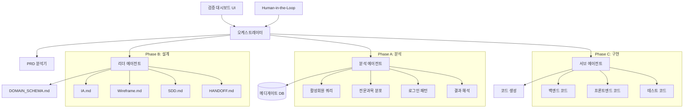

# SDD.md - 시스템 설계

## 1. 아키텍처 개요

### 1.1 시스템 구조


### 1.2 데이터 흐름
1. **입력**: PRD 검증 요청
2. **Phase A**: DB 쿼리 → 데이터 추출 → 분석 결과
3. **Phase B**: 설계 문서 생성 → HITL 승인 대기
4. **Phase C**: 코드 구현 → 테스트 → 검증
5. **출력**: 통합 검증 리포트

## 2. 레거시 스키마 매핑 (Legacy Mapping)

> ⚠️ **중요 발견사항**: 분석 결과에서 U_ALIVE 컬럼의 실제 값이 'Y'/'N'이 아니라 'UST001' 등의 코드값임이 확인됨

### 2.1 사용자 정보 매핑
```sql
-- 기존 가정 (PRD 기반)
WHERE U_ALIVE = 'Y'

-- 실제 DB 상태 (분석 결과 기반) [⚠️ AI 추론됨 - 검토 필요]
WHERE U_ALIVE = 'UST001'  -- 활성 사용자 코드로 추정
```

### 2.2 테이블 매핑 구조
| 개념 | 물리 테이블 | 주요 컬럼 | 실제 값 예시 |
|------|-------------|-----------|-------------|
| 활성 회원 | `USERS` | `U_ALIVE` | UST001(99.5%), UST003(0.3%), UST002(0.2%) |
| 회원 상세 | `USER_DETAIL` | `U_MAJOR_CODE_1` | 전문과목 코드 |
| 로그인 이력 | `USER_LOGIN` | `LOGIN_DATE`, `U_ID` | 2,267만 행 (대용량) |

### 2.3 코드 매핑 [⚠️ AI 추론됨 - 검토 필요]
```sql
-- CODE_MASTER 테이블에서 UST 코드 의미 조회 필요
SELECT CODE_TYPE, CODE_VALUE, CODE_NAME 
FROM CODE_MASTER 
WHERE CODE_TYPE = 'U_STATUS' OR CODE_TYPE LIKE '%UST%';

-- 추정되는 매핑:
-- UST001: 활성 사용자
-- UST002: 휴면 사용자  
-- UST003: 탈퇴 사용자
```

## 3. API 설계

### 3.1 Phase A: 분석 API
```typescript
// GET /api/v1/orchestrator/validation/analysis
interface AnalysisRequest {
  phase: 'A' | 'B' | 'C';
  testType: 'segment' | 'distribution' | 'login_pattern' | 'all';
}

interface AnalysisResponse {
  queries: {
    segment_query: string;
    distribution_query: string;
    login_pattern_query: string;
  };
  results: {
    active_users: number;
    total_users: number;
    segments: SegmentData[];
    patterns: LoginPattern[];
  };
  validation: {
    schema_compliance: boolean;
    query_executable: boolean;
    performance_ok: boolean;
  };
}
```

### 3.2 Phase B: 설계 검증 API
```typescript
// GET /api/v1/orchestrator/validation/design
interface DesignValidationResponse {
  documents: {
    ia: DocumentStatus;
    wireframe: DocumentStatus;
    sdd: DocumentStatus;
    handoff: DocumentStatus;
  };
  hitl_checkpoints: HITLStatus[];
  approval_status: 'pending' | 'approved' | 'rejected';
}

interface DocumentStatus {
  generated: boolean;
  valid: boolean;
  checklist_items: ChecklistItem[];
  errors: string[];
}
```

### 3.3 Phase C: 구현 검증 API
```typescript
// GET /api/v1/orchestrator/validation/implementation
interface ImplementationResponse {
  backend: {
    build_status: 'success' | 'failed';
    test_coverage: number;
    files: GeneratedFile[];
  };
  frontend: {
    build_status: 'success' | 'failed';
    test_coverage: number;
    files: GeneratedFile[];
  };
  overall_status: 'pass' | 'fail';
}
```

## 4. 컴포넌트 설계

### 4.1 프론트엔드 컴포넌트 구조
```
src/features/orchestrator-validation/
├── components/
│   ├── PhaseADashboard.tsx      # 분석 대시보드
│   ├── PhaseBValidation.tsx     # 설계 검증
│   ├── PhaseCImplementation.tsx # 구현 검증
│   ├── PipelineMonitor.tsx      # 파이프라인 모니터링
│   ├── SegmentChart.tsx         # 세그먼트 차트
│   ├── LoginTrendChart.tsx      # 로그인 트렌드
│   └── HITLCheckpoint.tsx       # HITL 체크포인트
├── services/
│   ├── orchestratorApi.ts       # API 클라이언트
│   └── validationService.ts     # 검증 로직
├── types/
│   └── validation.types.ts      # 타입 정의
└── tests/
    └── *.test.tsx              # 컴포넌트 테스트
```

### 4.2 백엔드 서비스 구조
```
backend/src/features/orchestrator-validation/
├── controllers/
│   └── validation.controller.ts
├── services/
│   ├── phase-a.service.ts      # 분석 서비스
│   ├── phase-b.service.ts      # 설계 검증 서비스
│   ├── phase-c.service.ts      # 구현 검증 서비스
│   └── orchestrator.service.ts # 오케스트레이션 로직
├── repositories/
│   ├── analysis.repository.ts  # DB 쿼리 실행
│   └── validation.repository.ts # 검증 결과 저장
├── dto/
│   ├── validation-request.dto.ts
│   └── validation-response.dto.ts
└── tests/
    └── *.test.ts
```

## 5. 데이터 모델

### 5.1 검증 결과 저장 테이블 [⚠️ AI 추론됨 - 검토 필요]
```sql
CREATE TABLE ORCHESTRATOR_VALIDATION_LOG (
  LOG_ID INT PRIMARY KEY AUTO_INCREMENT,
  CASE_ID VARCHAR(50) NOT NULL,
  PHASE ENUM('A', 'B', 'C') NOT NULL,
  STATUS ENUM('RUNNING', 'SUCCESS', 'FAILED', 'PENDING_HITL') NOT NULL,
  START_TIME DATETIME NOT NULL,
  END_TIME DATETIME,
  RESULT_JSON JSON,
  ERROR_MESSAGE TEXT,
  HITL_APPROVED BOOLEAN DEFAULT FALSE,
  CREATED_AT DATETIME DEFAULT CURRENT_TIMESTAMP
);
```

### 5.2 HITL 체크포인트 테이블 [⚠️ AI 추론됨 - 검토 필요]
```sql
CREATE TABLE HITL_CHECKPOINTS (
  CHECKPOINT_ID INT PRIMARY KEY AUTO_INCREMENT,
  LOG_ID INT,
  CHECKPOINT_TYPE VARCHAR(50) NOT NULL,
  STATUS ENUM('PENDING', 'APPROVED', 'REJECTED') NOT NULL,
  REVIEWER_ID VARCHAR(20),
  REVIEW_COMMENT TEXT,
  CREATED_AT DATETIME DEFAULT CURRENT_TIMESTAMP,
  REVIEWED_AT DATETIME,
  FOREIGN KEY (LOG_ID) REFERENCES ORCHESTRATOR_VALIDATION_LOG(LOG_ID)
);
```

## 6. 보안 및 제약사항

### 6.1 DB 접근 제한
- **연결 정보**: host: "222.122.26.242", user: "ai_readonly"
- **권한 제한**: SELECT only (INSERT/UPDATE/DELETE 금지)
- **행 제한**: 최대 10,000행
- **타임아웃**: 30초

### 6.2 Protected Path 보호
```typescript
const PROTECTED_PATHS = [
  '.claude/rules/*',
  '.claude/workflows/*',
  '.claude/context/*'
];

// 코드 생성 시 해당 경로 수정 절대 금지
```

## 7. Risk 및 제약사항

### 7.1 발견된 위험요소
1. **사용자 상태 코드 불일치**: PRD에서 가정한 'Y'/'N' 값이 아닌 'UST001' 등 코드값 사용
2. **활성 사용자 0명**: 현재 활성 사용자 조회 로직이 잘못되어 결과가 0명
3. **대용량 데이터**: USER_LOGIN 테이블 2,267만 행으로 성능 이슈 가능성

### 7.2 완화 방안
1. **코드 매핑 검증**: CODE_MASTER 테이블에서 실제 상태 코드 의미 확인 필요
2. **쿼리 최적화**: LIMIT 절 필수 사용, 인덱스 활용
3. **HITL 체크포인트**: 쿼리 실행 전 반드시 사람 검토 필요

## 8. 모니터링 및 로깅

### 8.1 메트릭 수집
- 파이프라인 완주율
- HITL 승인율
- 쿼리 실행 성공률
- 코드 생성 품질 지표

### 8.2 알림 정책
- SQL 타임아웃 시 즉시 알림
- HITL 체크포인트 대기 시 알림
- 보안 위반 시 즉시 차단 및 알림