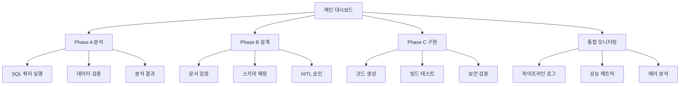

# IA.md - 오케스트레이터 통합 검증 정보 구조

## 1. 전체 정보 아키텍처

```
오케스트레이터 검증 대시보드
├── Phase A: 분석 검증 섹션
│   ├── 활성 회원 세그먼트 조회
│   ├── 전문과목별 분포 분석  
│   ├── 로그인 패턴 분석
│   └── 분석 결과 해석
├── Phase B: 설계 검증 섹션
│   ├── IA 문서 검증
│   ├── Wireframe 검증
│   ├── SDD 검증
│   └── HANDOFF 검증
├── Phase C: 구현 검증 섹션
│   ├── API 엔드포인트 검증
│   ├── React 컴포넌트 검증
│   ├── 테스트 코드 검증
│   └── Output Validation 결과
└── 통합 모니터링 섹션
    ├── 파이프라인 진행률
    ├── HITL 체크포인트 상태
    ├── 성공 지표 대시보드
    └── 에러/재시도 로그
```

## 2. 페이지 계층 구조

### 2.1 메인 대시보드 (`/orchestrator-validation`)

```
Header
├── 제목: "오케스트레이터 통합 기능 검증"
├── 진행률 프로그레스 바 (Phase A→B→C)
└── 현재 단계 표시

Main Content
├── Phase Status Cards (A, B, C)
├── Real-time Metrics Panel
├── HITL Checkpoint Status
└── Quick Actions

Sidebar
├── Navigation Menu
├── System Status
└── Recent Logs
```

### 2.2 Phase A 상세 페이지 (`/validation/phase-a`)

```
Analysis Validation Dashboard
├── SQL Query Section
│   ├── segment_query.sql 실행 결과
│   ├── distribution_query.sql 실행 결과  
│   ├── login_pattern_query.sql 실행 결과
│   └── Query Performance Metrics
├── Data Validation Section
│   ├── DOMAIN_SCHEMA 일치 검증
│   ├── Row Count 제한 검증
│   └── Timeout 검증
└── Analysis Results
    ├── analysis_result.json 뷰어
    └── insight_report.md 렌더링
```

### 2.3 Phase B 상세 페이지 (`/validation/phase-b`)

```
Design Validation Dashboard
├── Document Status Grid
│   ├── IA.md 검증 상태
│   ├── Wireframe.md 검증 상태
│   ├── SDD.md 검증 상태
│   └── HANDOFF.md 검증 상태
├── Content Preview Panel
├── Legacy Schema Mapping Validation
└── HITL Approval Status
```

### 2.4 Phase C 상세 페이지 (`/validation/phase-c`)

```
Implementation Validation Dashboard
├── Code Generation Status
│   ├── Backend TypeScript Files
│   ├── Frontend React Components
│   └── Test Files
├── Build & Test Results
│   ├── TypeScript 컴파일 결과
│   ├── Test Coverage Report
│   └── Lint 검사 결과
├── Protected Path Security Check
└── Final Output Validation
```

## 3. 네비게이션 플로우



## 4. 상태 관리 구조

### 4.1 전역 상태

```typescript
interface ValidationState {
  phases: {
    A: PhaseStatus;
    B: PhaseStatus;
    C: PhaseStatus;
  };
  hitl: HITLCheckpoint[];
  metrics: SystemMetrics;
  errors: ErrorLog[];
}

interface PhaseStatus {
  status: 'pending' | 'running' | 'success' | 'failed';
  progress: number;
  outputs: Output[];
  validations: ValidationResult[];
}
```

### 4.2 페이지별 로컬 상태

- **Phase A**: SQL 실행 상태, 결과 데이터, 검증 스코어
- **Phase B**: 문서 생성 상태, 내용 미리보기, 승인 플래그  
- **Phase C**: 빌드 상태, 테스트 결과, 커버리지 리포트

## 5. 데이터 소스 매핑

### 5.1 Phase A 데이터 플로우

```
USERS (U_ID, U_KIND, U_ALIVE) 
→ segment_query.sql 
→ 활성 회원 집계 결과
→ 세그먼트 분포 차트

USER_DETAIL (U_MAJOR_CODE_1)
→ distribution_query.sql
→ 전문과목별 분포 데이터  
→ 분포 비교 테이블

USER_LOGIN (LOGIN_DATE, U_ID) [⚠️ LIMIT 필수]
→ login_pattern_query.sql
→ 시간대별 패턴 데이터
→ 트렌드 차트
```

### 5.2 검증 기준 매핑

| 검증 항목 | 데이터 소스 | 기준값 |
|-----------|-------------|--------|
| SQL 생성 성공률 | 쿼리 실행 로그 | 100% |
| 스키마 일치율 | DOMAIN_SCHEMA 대조 | 100% |
| 테스트 커버리지 | Jest/Vitest 리포트 | ≥ 90% |
| 파이프라인 완주 | Phase 상태 로그 | A→B→C |
| HITL 트리거 | 체크포인트 로그 | ≥ 2회 |

## 6. 접근성 및 반응형 고려사항

### 6.1 반응형 브레이크포인트

- **Desktop**: 1200px+ (풀 대시보드)
- **Tablet**: 768px-1199px (사이드바 축소)  
- **Mobile**: <768px (스택 레이아웃)

### 6.2 접근성 요구사항

- ARIA 라벨 (status, progress)
- 키보드 네비게이션 지원
- 고대비 모드 지원
- 스크린 리더 호환성

## 7. 라우팅 테이블

| Route | Component | 권한 | 설명 |
|-------|-----------|------|------|
| `/` | MainDashboard | ALL | 전체 현황 |
| `/validation/phase-a` | PhaseAValidation | QA+ | 분석 검증 |
| `/validation/phase-b` | PhaseBValidation | QA+ | 설계 검증 |  
| `/validation/phase-c` | PhaseCValidation | QA+ | 구현 검증 |
| `/monitoring` | SystemMonitoring | ADMIN | 시스템 모니터링 |
| `/logs` | LogViewer | ADMIN | 상세 로그 |