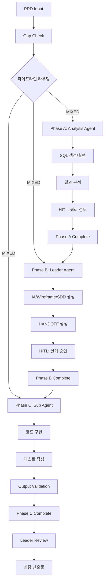

# SDD.md - 오케스트레이터 통합 기능 검증 시스템 설계

## 1. 아키텍처 개요

### 1.1 시스템 구조



### 1.2 기술 스택

| Layer | 기술 스택 | 비고 |
|-------|-----------|------|
| Frontend | React 18 + TypeScript + Vite | FSD 패턴 적용 |
| UI | Tailwind CSS + Headless UI | 반응형 레이아웃 |
| State | Zustand + React Query | 상태 관리 |
| Charts | Recharts + D3.js | 데이터 시각화 |
| Backend | Node.js + Express + TypeScript | RESTful API |
| Database | MySQL 8.0 (Legacy) | 읽기 전용 접근 |
| Testing | Jest + Vitest + Testing Library | TDD 워크플로 |
| Build | Vite + TypeScript + ESLint | 빌드 파이프라인 |

## 2. 레거시 스키마 매핑 (DOMAIN_SCHEMA 준수)

### 2.1 데이터 소스 매핑

| 기능 | 사용 테이블 | 필수 컬럼 | 제약사항 |
|------|------------|-----------|----------|
| A1. 회원 세그먼트 | `USERS` | `U_ID`, `U_KIND`, `U_ALIVE`, `U_REG_DATE` | - |
| A2. 전문과목 분포 | `USER_DETAIL` + `CODE_MASTER` | `U_MAJOR_CODE_1`, `CODE_NAME` | JOIN 최적화 필요 |
| A3. 로그인 패턴 | `USER_LOGIN` | `U_ID`, `LOGIN_DATE` | ⚠️ LIMIT 10,000 필수 |
| 사용자 프로필 | `USERS` + `USER_DETAIL` | 1:1 관계 | 개인정보 제한 |

### 2.2 실제 쿼리 패턴 (Legacy Column Names)

```sql
-- A1. 활성 회원 세그먼트 조회 (DOMAIN_SCHEMA 준수)
SELECT 
  U_KIND,
  COUNT(*) as member_count,
  ROUND(COUNT(*) * 100.0 / SUM(COUNT(*)) OVER(), 2) as percentage
FROM USERS 
WHERE U_ALIVE = 'Y'
  AND U_REG_DATE >= DATE_SUB(NOW(), INTERVAL 30 DAY)
GROUP BY U_KIND
ORDER BY member_count DESC;

-- A2. 전문과목별 분포 분석 (JOIN 최적화)
SELECT 
  cm.CODE_NAME as major_name,
  COUNT(CASE WHEN u.U_ALIVE = 'Y' THEN 1 END) as active_count,
  COUNT(*) as total_count,
  ROUND(
    (COUNT(CASE WHEN u.U_ALIVE = 'Y' THEN 1 END) * 100.0 / COUNT(*)) - 
    (SELECT COUNT(CASE WHEN U_ALIVE = 'Y' THEN 1 END) * 100.0 / COUNT(*) FROM USERS), 
    2
  ) as difference_pct
FROM USER_DETAIL ud
JOIN USERS u ON ud.U_ID = u.U_ID
JOIN CODE_MASTER cm ON cm.CODE_TYPE = 'MAJOR' AND cm.CODE_VALUE = ud.U_MAJOR_CODE_1
WHERE cm.USE_FLAG = 'Y'
GROUP BY ud.U_MAJOR_CODE_1, cm.CODE_NAME
HAVING COUNT(*) >= 100  -- 통계적 유의성
ORDER BY ABS(difference_pct) DESC;

-- A3. 로그인 패턴 분석 (대용량 테이블 - LIMIT 필수)
SELECT 
  HOUR(LOGIN_DATE) as login_hour,
  COUNT(*) as login_count,
  COUNT(DISTINCT U_ID) as unique_users
FROM USER_LOGIN 
WHERE LOGIN_DATE >= DATE_SUB(NOW(), INTERVAL 7 DAY)
  AND LOGIN_DATE <= NOW()
GROUP BY HOUR(LOGIN_DATE)
ORDER BY login_hour
LIMIT 10000;  -- ⚠️ DB_ACCESS_POLICY 제한 준수
```

### 2.3 데이터 모델 변경 사항

**⚠️ 중요: 기존 레거시 테이블 구조 변경 없음**

```yaml
신규 테이블: 없음 (기존 테이블 활용)
컬럼 추가: 없음 (기존 컬럼 활용)
인덱스 변경: 없음 (기존 인덱스 활용)

사유: 
- 검증 목적의 읽기 전용 기능
- 레거시 시스템 안정성 우선
- DOMAIN_SCHEMA 완벽 준수
```

## 3. API 설계

### 3.1 RESTful API 구조

```typescript
// API 엔드포인트 정의
interface AnalyticsAPI {
  // Phase A: 분석 API
  'GET /api/v1/analytics/segments': {
    query: { 
      userType?: string
      period?: string  // '30d' | '90d' | '1y'
      limit?: number
    }
    response: SegmentAnalysisResponse
  }
  
  'GET /api/v1/analytics/distribution': {
    query: {
      majorCode?: string
      compareActive?: boolean
    }
    response: DistributionResponse  
  }
  
  'GET /api/v1/analytics/login-patterns': {
    query: {
      period?: string
      granularity?: 'hour' | 'day' | 'week'
      limit: number // 최대 10000 (DB_ACCESS_POLICY)
    }
    response: LoginPatternResponse
  }
  
  // Phase C: 검증 API
  'GET /api/v1/validation/pipeline-status': {
    response: PipelineStatusResponse
  }
  
  'GET /api/v1/validation/metrics': {
    response: SystemMetricsResponse
  }
  
  'POST /api/v1/validation/hitl-approval': {
    body: HITLApprovalRequest
    response: ApprovalResponse
  }
}
```

### 3.2 DTO 정의

```typescript
// segment-query.dto.ts
export interface SegmentQueryDto {
  userType?: string;
  period?: '30d' | '90d' | '1y';
  limit?: number;
}

export interface SegmentAnalysisResponse {
  segments: Array<{
    userType: string;
    memberCount: number;
    percentage: number;
    trend: 'up' | 'down' | 'stable';
  }>;
  totalMembers: number;
  activeMembers: number;
  generatedAt: string;
  queryExecutionTime: number;
}

// analytics-response.dto.ts  
export interface DistributionResponse {
  distributions: Array<{
    majorName: string;
    majorCode: string;
    activeCount: number;
    totalCount: number;
    differencePct: number;
    isSignificant: boolean; // |diff| >= 5%p
  }>;
  summary: {
    totalMajors: number;
    significantDifferences: number;
    topGrowingMajor: string;
  };
}

export interface LoginPatternResponse {
  patterns: Array<{
    hour?: number;
    day?: string;
    week?: string;
    loginCount: number;
    uniqueUsers: number;
  }>;
  peak: {
    time: string;
    count: number;
  };
  queryInfo: {
    limitApplied: number;
    totalProcessed: number;
    executionTime: number;
  };
}
```

### 3.3 에러 핸들링

```typescript
// 레거시 DB 연동 에러 처리
interface ApiError {
  code: string;
  message: string;
  details?: Record<string, any>;
}

// 예상 에러 시나리오
const ERROR_CODES = {
  // DB 접근 관련
  'DB_TIMEOUT': 'Query execution timeout (>30s)',
  'DB_LIMIT_EXCEEDED': 'Row limit exceeded (>10,000)',
  'DB_CONNECTION_FAILED': 'Database connection failed',
  
  // 스키마 관련
  'SCHEMA_MISMATCH': 'Column not found in DOMAIN_SCHEMA',
  'INVALID_TABLE': 'Table not accessible',
  
  // 비즈니스 로직
  'INSUFFICIENT_DATA': 'Not enough data for analysis',
  'INVALID_PERIOD': 'Invalid time period specified'
} as const;
```

## 4. 프론트엔드 아키텍처 (FSD 패턴)

### 4.1 Feature-Sliced Design 구조

```
src/
├── app/                    # 앱 설정
│   ├── providers/         # Context, Router 설정
│   └── styles/           # 글로벌 스타일
├── pages/                 # 페이지 라우트
│   ├── AnalyticsDashboard/
│   ├── ValidationMonitoring/
│   └── PipelineStatus/
├── features/              # 비즈니스 피처
│   ├── segment-analysis/
│   │   ├── api/          # API 호출
│   │   ├── model/        # 상태 관리
│   │   └── ui/           # UI 컴포넌트
│   ├── distribution-analysis/
│   └── login-patterns/
├── entities/              # 비즈니스 엔티티
│   ├── user/
│   ├── analytics/
│   └── validation/
├── shared/                # 공통 모듈
│   ├── ui/               # 공통 UI 컴포넌트
│   ├── api/              # API 클라이언트
│   ├── lib/              # 유틸리티
│   └── constants/        # 상수 정의
└── widgets/              # 복합 UI 블록
    ├── AnalyticsDashboard/
    └── ValidationPanel/
```

### 4.2 상태 관리 (Zustand)

```typescript
// features/analytics/model/analytics-store.ts
interface AnalyticsState {
  // Phase A 데이터
  segments: SegmentData[];
  distribution: DistributionData[];
  loginPatterns: LoginPatternData[];
  
  // 실행 상태
  loading: {
    segments: boolean;
    distribution: boolean;
    patterns: boolean;
  };
  
  errors: Record<string, string | null>;
  
  // 액션
  fetchSegments: (params: SegmentQueryDto) => Promise<void>;
  fetchDistribution: (params: DistributionQueryDto) => Promise<void>;
  fetchLoginPatterns: (params: PatternQueryDto) => Promise<void>;
  
  // Phase B/C 상태
  pipelineStatus: PipelineStatus;
  validationMetrics: ValidationMetrics;
  updatePipelineStatus: (status: PipelineStatus) => void;
}

// 타입 안전한 스토어 생성
export const useAnalyticsStore = create<AnalyticsState>()(
  devtools(
    immer((set, get) => ({
      // 초기 상태
      segments: [],
      distribution: [],
      loginPatterns: [],
      
      loading: {
        segments: false,
        distribution: false, 
        patterns: false
      },
      
      errors: {},
      
      // 액션 구현
      fetchSegments: async (params) => {
        set((state) => {
          state.loading.segments = true;
          state.errors.segments = null;
        });
        
        try {
          const response = await analyticsApi.getSegments(params);
          set((state) => {
            state.segments = response.segments;
            state.loading.segments = false;
          });
        } catch (error) {
          set((state) => {
            state.errors.segments = error.message;
            state.loading.segments = false;
          });
        }
      }
      
      // ... 다른 액션들
    }))
  )
);
```

### 4.3 차트 컴포넌트 설계

```typescript
// shared/ui/charts/SegmentChart.tsx
interface SegmentChartProps {
  data: Array<{
    name: string;
    value: number;
    percentage: number;
    color?: string;
  }>;
  title: string;
  loading?: boolean;
  error?: string;
}

export const SegmentChart: React.FC<SegmentChartProps> = ({
  data,
  title,
  loading,
  error
}) => {
  if (loading) {
    return <ChartSkeleton />;
  }
  
  if (error) {
    return <ChartError message={error} />;
  }
  
  return (
    <div className="bg-white rounded-lg shadow-sm border p-6">
      <h3 className="text-lg font-medium text-gray-900 mb-4">{title}</h3>
      
      {/* Recharts 바 차트 */}
      <ResponsiveContainer width="100%" height={300}>
        <BarChart data={data}>
          <CartesianGrid strokeDasharray="3 3" />
          <XAxis 
            dataKey="name" 
            angle={-45}
            textAnchor="end"
            height={60}
          />
          <YAxis />
          <Tooltip 
            formatter={(value, name) => [
              `${value}명 (${data.find(d => d.value === value)?.percentage}%)`,
              '회원 수'
            ]}
          />
          <Bar dataKey="value" fill="#3B82F6" />
        </BarChart>
      </ResponsiveContainer>
      
      {/* 데이터 테이블 */}
      <div className="mt-4 overflow-x-auto">
        <table className="min-w-full text-sm">
          <thead>
            <tr className="border-t border-gray-200">
              <th className="text-left py-2">회원 유형</th>
              <th className="text-right py-2">회원 수</th>
              <th className="text-right py-2">비율</th>
            </tr>
          </thead>
          <tbody>
            {data.map((item, index) => (
              <tr key={index} className="border-t border-gray-100">
                <td className="py-2">{item.name}</td>
                <td className="text-right py-2">
                  {item.value.toLocaleString()}명
                </td>
                <td className="text-right py-2">{item.percentage}%</td>
              </tr>
            ))}
          </tbody>
        </table>
      </div>
    </div>
  );
};
```

## 5. 테스트 전략

### 5.1 TDD 워크플로 (Red-Green-Refactor)

```typescript
// backend/src/features/analytics/tests/analytics.service.test.ts

describe('AnalyticsService', () => {
  let service: AnalyticsService;
  let mockRepository: jest.Mocked<AnalyticsRepository>;
  
  beforeEach(() => {
    mockRepository = {
      findSegments: jest.fn(),
      findDistribution: jest.fn(),
      findLoginPatterns: jest.fn()
    } as jest.Mocked<AnalyticsRepository>;
    
    service = new AnalyticsService(mockRepository);
  });
  
  describe('getSegmentAnalysis', () => {
    // RED: 실패하는 테스트 작성
    it('should return segment analysis with correct format', async () => {
      // Given - 레거시 DB 형식 목업 데이터
      const mockDbResult = [
        { U_KIND: 'UKD001', member_count: 128487, percentage: 63.0 },
        { U_KIND: 'UKD002', member_count: 16310, percentage: 8.0 }
      ];
      
      mockRepository.findSegments.mockResolvedValue(mockDbResult);
      
      // When
      const result = await service.getSegmentAnalysis({
        period: '30d',
        limit: 1000
      });
      
      // Then - 응답 형식 검증
      expect(result).toMatchObject({
        segments: expect.arrayContaining([
          expect.objectContaining({
            userType: 'UKD001',
            memberCount: 128487,
            percentage: 63.0
          })
        ]),
        totalMembers: expect.any(Number),
        generatedAt: expect.any(String)
      });
      
      // DOMAIN_SCHEMA 준수 검증
      expect(mockRepository.findSegments).toHaveBeenCalledWith(
        expect.objectContaining({
          columns: ['U_KIND', 'COUNT(*)', 'U_ALIVE'], // 실제 컬럼명
          table: 'USERS',
          where: expect.stringContaining("U_ALIVE = 'Y'") // 레거시 값
        })
      );
    });
    
    // GREEN: 구현으로 테스트 통과
    // REFACTOR: 코드 개선
    
    it('should handle DB timeout with proper error', async () => {
      // Given - 타임아웃 시뮬레이션
      mockRepository.findSegments.mockRejectedValue(
        new Error('Query timeout after 30 seconds')
      );
      
      // When & Then
      await expect(service.getSegmentAnalysis({}))
        .rejects
        .toThrow('DB_TIMEOUT: Query execution timeout (>30s)');
    });
    
    it('should apply LIMIT for large result sets', async () => {
      // Given
      const params = { limit: 5000 };
      
      // When
      await service.getSegmentAnalysis(params);
      
      // Then - DB_ACCESS_POLICY 준수 검증
      expect(mockRepository.findSegments).toHaveBeenCalledWith(
        expect.objectContaining({
          limit: 5000, // 10,000 이하
          timeout: 30000 // 30초 이하
        })
      );
    });
  });
});
```

### 5.2 프론트엔드 테스트

```typescript
// frontend/src/features/segment-analysis/ui/SegmentChart.test.tsx

describe('SegmentChart', () => {
  const mockData = [
    { name: 'UKD001', value: 128487, percentage: 63.0 },
    { name: 'UKD002', value: 16310, percentage: 8.0 }
  ];
  
  it('renders chart with segment data correctly', () => {
    render(
      <SegmentChart 
        data={mockData} 
        title="회원 세그먼트 분포"
      />
    );
    
    // 차트 제목 표시 확인
    expect(screen.getByText('회원 세그먼트 분포')).toBeInTheDocument();
    
    // 데이터 포인트 확인
    expect(screen.getByText('UKD001')).toBeInTheDocument();
    expect(screen.getByText('128,487명')).toBeInTheDocument();
    expect(screen.getByText('63.0%')).toBeInTheDocument();
  });
  
  it('shows loading state while data is being fetched', () => {
    render(
      <SegmentChart 
        data={[]} 
        title="Loading Test"
        loading={true}
      />
    );
    
    expect(screen.getByTestId('chart-skeleton')).toBeInTheDocument();
  });
  
  it('handles error state gracefully', () => {
    render(
      <SegmentChart 
        data={[]} 
        title="Error Test"
        error="DB_TIMEOUT: Query execution timeout"
      />
    );
    
    expect(screen.getByText(/Query execution timeout/)).toBeInTheDocument();
  });
});
```

## 6. 보안 및 제약사항

### 6.1 DB 접근 보안 (DB_ACCESS_POLICY 준수)

```typescript
// shared/api/db-client.ts
class SecureDbClient {
  private readonly MAX_ROWS = 10000;
  private readonly TIMEOUT_MS = 30000;
  
  async executeQuery(query: string, params: any[]): Promise<any[]> {
    // 1. SQL Injection 방지
    const sanitizedQuery = this.sanitizeQuery(query);
    
    // 2. 허용된 테이블만 접근
    this.validateTableAccess(sanitizedQuery);
    
    // 3. SELECT만 허용
    if (!sanitizedQuery.trim().toUpperCase().startsWith('SELECT')) {
      throw new SecurityError('Only SELECT queries allowed');
    }
    
    // 4. LIMIT 강제 적용
    const limitedQuery = this.enforceLimits(sanitizedQuery);
    
    // 5. 타임아웃 설정
    const result = await Promise.race([
      this.dbConnection.query(limitedQuery, params),
      this.timeoutPromise(this.TIMEOUT_MS)
    ]);
    
    return result;
  }
  
  private validateTableAccess(query: string): void {
    const allowedTables = ['USERS', 'USER_DETAIL', 'USER_LOGIN', 'CODE_MASTER'];
    const referencedTables = this.extractTableNames(query);
    
    const invalidTables = referencedTables.filter(
      table => !allowedTables.includes(table.toUpperCase())
    );
    
    if (invalidTables.length > 0) {
      throw new SecurityError(`Access denied to tables: ${invalidTables.join(', ')}`);
    }
  }
  
  private enforceLimits(query: string): string {
    // LIMIT이 없거나 MAX_ROWS를 초과하는 경우 강제 적용
    if (!query.toUpperCase().includes('LIMIT')) {
      return `${query} LIMIT ${this.MAX_ROWS}`;
    }
    
    // 기존 LIMIT 값 검증
    const limitMatch = query.match(/LIMIT\s+(\d+)/i);
    if (limitMatch) {
      const limitValue = parseInt(limitMatch[1]);
      if (limitValue > this.MAX_ROWS) {
        return query.replace(/LIMIT\s+\d+/i, `LIMIT ${this.MAX_ROWS}`);
      }
    }
    
    return query;
  }
}
```

### 6.2 Protected Path 보호

```typescript
// shared/lib/security/path-guard.ts
export class PathGuard {
  private static readonly PROTECTED_PATHS = [
    '.claude/rules/',
    '.claude/workflows/', 
    'backend/config/',
    'frontend/.env'
  ];
  
  static validateOutputPath(filePath: string): void {
    const normalizedPath = path.normalize(filePath);
    
    for (const protectedPath of this.PROTECTED_PATHS) {
      if (normalizedPath.startsWith(protectedPath)) {
        throw new SecurityError(
          `Output to protected path denied: ${filePath}`
        );
      }
    }
  }
  
  static validateFileOperation(operation: 'read' | 'write' | 'delete', filePath: string): void {
    if (operation !== 'read') {
      this.validateOutputPath(filePath);
    }
    
    // 추가 보안 검증
    if (filePath.includes('..') || filePath.includes('~')) {
      throw new SecurityError('Path traversal attempt detected');
    }
  }
}
```

## 7. 모니터링 및 로깅

### 7.1 파이프라인 상태 추적

```typescript
// shared/lib/monitoring/pipeline-tracker.ts
interface PipelineEvent {
  phase: 'A' | 'B' | 'C';
  step: string;
  status: 'started' | 'completed' | 'failed';
  timestamp: Date;
  metadata?: Record<string, any>;
}

export class PipelineTracker {
  private events: PipelineEvent[] = [];
  
  trackEvent(event: Omit<PipelineEvent, 'timestamp'>): void {
    const fullEvent: PipelineEvent = {
      ...event,
      timestamp: new Date()
    };
    
    this.events.push(fullEvent);
    
    // 실시간 모니터링을 위한 이벤트 발송
    this.emitEvent(fullEvent);
    
    // 로그 기록
    this.logEvent(fullEvent);
  }
  
  getPhaseStatus(phase: 'A' | 'B' | 'C'): 'completed' | 'running' | 'failed' | 'pending' {
    const phaseEvents = this.events.filter(e => e.phase === phase);
    
    if (phaseEvents.some(e => e.status === 'failed')) {
      return 'failed';
    }
    
    if (phaseEvents.some(e => e.status === 'started') && 
        !phaseEvents.some(e => e.status === 'completed')) {
      return 'running';
    }
    
    if (phaseEvents.some(e => e.status === 'completed')) {
      return 'completed';
    }
    
    return 'pending';
  }
  
  getPipelineMetrics(): {
    totalDuration: number;
    phaseADuration: number;
    phaseBDuration: number;  
    phaseCDuration: number;
    hitlCheckpoints: number;
    successRate: number;
  } {
    // 메트릭 계산 로직
    return {
      totalDuration: this.calculateTotalDuration(),
      phaseADuration: this.calculatePhaseDuration('A'),
      phaseBDuration: this.calculatePhaseDuration('B'),
      phaseCDuration: this.calculatePhaseDuration('C'),
      hitlCheckpoints: this.countHitlCheckpoints(),
      successRate: this.calculateSuccessRate()
    };
  }
}
```

## 8. HITL 체크포인트 구현

### 8.1 체크포인트 정의

```typescript
// shared/lib/hitl/checkpoint-manager.ts
interface HITLCheckpoint {
  id: string;
  phase: 'A' | 'B' | 'C';
  trigger: 'sql_result_review' | 'design_approval' | 'manual_override';
  status: 'pending' | 'approved' | 'rejected';
  context: {
    title: string;
    description: string;
    artifacts: string[]; // 검토 대상 파일들
    criteria: string[]; // 승인 기준
  };
  createdAt: Date;
  resolvedAt?: Date;
  reviewer?: string;
  feedback?: string;
}

export class HITLManager {
  private checkpoints: Map<string, HITLCheckpoint> = new Map();
  
  async createCheckpoint(
    phase: 'A' | 'B' | 'C',
    trigger: HITLCheckpoint['trigger'],
    context: HITLCheckpoint['context']
  ): Promise<string> {
    const checkpoint: HITLCheckpoint = {
      id: `hitl_${Date.now()}_${Math.random().toString(36).substr(2, 9)}`,
      phase,
      trigger,
      status: 'pending',
      context,
      createdAt: new Date()
    };
    
    this.checkpoints.set(checkpoint.id, checkpoint);
    
    // Phase별 특정 체크포인트 처리
    switch (trigger) {
      case 'sql_result_review':
        return this.handleSqlReviewCheckpoint(checkpoint);
      
      case 'design_approval':
        return this.handleDesignApprovalCheckpoint(checkpoint);
        
      case 'manual_override':
        return this.handleManualOverrideCheckpoint(checkpoint);
    }
  }
  
  private async handleSqlReviewCheckpoint(checkpoint: HITLCheckpoint): Promise<string> {
    // Phase A: SQL 결과 검토
    const sqlResults = await this.loadSqlResults(checkpoint.context.artifacts);
    
    // 자동 검증 가능한 항목들
    const autoValidation = {
      rowCountValid: sqlResults.every(r => r.rowCount <= 10000),
      executionTimeValid: sqlResults.every(r => r.executionTime <= 30000),
      schemaCompliant: await this.validateSchemaCompliance(sqlResults)
    };
    
    // 자동 검증 통과 시 자동 승인
    if (Object.values(autoValidation).every(v => v)) {
      checkpoint.status = 'approved';
      checkpoint.resolvedAt = new Date();
      checkpoint.reviewer = 'system_auto_validation';
      return checkpoint.id;
    }
    
    // 수동 검토 필요
    await this.notifyReviewer(checkpoint);
    return checkpoint.id;
  }
  
  async approveCheckpoint(checkpointId: string, reviewer: string, feedback?: string): Promise<void> {
    const checkpoint = this.checkpoints.get(checkpointId);
    if (!checkpoint) {
      throw new Error(`Checkpoint not found: ${checkpointId}`);
    }
    
    checkpoint.status = 'approved';
    checkpoint.resolvedAt = new Date();
    checkpoint.reviewer = reviewer;
    checkpoint.feedback = feedback;
    
    // 파이프라인 진행 재개
    await this.resumePipeline(checkpoint.phase);
  }
}
```

## 9. Risk & Mitigation

### 9.1 위험 요소

| 위험 | 영향도 | 발생 확률 | 완화 방안 |
|------|--------|-----------|-----------|
| 대용량 테이블 타임아웃 | 높음 | 중간 | LIMIT 강제 적용, 인덱스 활용 |
| 레거시 스키마 불일치 | 높음 | 낮음 | DOMAIN_SCHEMA 검증, 테스트 커버리지 |
| HITL 체크포인트 지연 | 중간 | 높음 | 자동 승인 로직, 알림 시스템 |
| 보안 정책 위반 | 높음 | 낮음 | PathGuard, SQL 검증, 감사 로그 |

### 9.2 완화 전략

```typescript
// shared/lib/resilience/circuit-breaker.ts
export class DatabaseCircuitBreaker {
  private failures = 0;
  private readonly threshold = 5;
  private readonly timeout = 60000; // 1분
  private lastFailTime: Date | null = null;
  
  async execute<T>(operation: () => Promise<T>): Promise<T> {
    if (this.isOpen()) {
      throw new Error('Circuit breaker is OPEN. Database operations suspended.');
    }
    
    try {
      const result = await operation();
      this.onSuccess();
      return result;
    } catch (error) {
      this.onFailure();
      throw error;
    }
  }
  
  private isOpen(): boolean {
    return this.failures >= this.threshold &&
           this.lastFailTime &&
           (Date.now() - this.lastFailTime.getTime()) < this.timeout;
  }
  
  private onSuccess(): void {
    this.failures = 0;
    this.lastFailTime = null;
  }
  
  private onFailure(): void {
    this.failures++;
    this.lastFailTime = new Date();
  }
}
```

## 10. 배포 및 운영

### 10.1 환경 설정

```yaml
# docker-compose.yml
version: '3.8'
services:
  orchestrator-validation:
    build:
      context: .
      dockerfile: Dockerfile
    environment:
      - NODE_ENV=production
      - DB_HOST=222.122.26.242
      - DB_PORT=3306
      - DB_NAME=medigate
      - DB_USER=ai_readonly
      - DB_PASSWORD=${DB_PASSWORD}
      - REDIS_URL=${REDIS_URL}
    ports:
      - "3000:3000"
    volumes:
      - ./logs:/app/logs
    depends_on:
      - redis
      
  redis:
    image: redis:7-alpine
    ports:
      - "6379:6379"
    volumes:
      - redis_data:/data
      
volumes:
  redis_data:
```

### 10.2 헬스체크 엔드포인트

```typescript
// backend/src/health/health.controller.ts
@Controller('health')
export class HealthController {
  constructor(private readonly healthService: HealthService) {}
  
  @Get()
  async getHealth(): Promise<HealthResponse> {
    return {
      status: 'ok',
      timestamp: new Date().toISOString(),
      services: {
        database: await this.healthService.checkDatabase(),
        redis: await this.healthService.checkRedis(),
        pipeline: await this.healthService.checkPipeline()
      },
      version: process.env.APP_VERSION || 'dev'
    };
  }
  
  @Get('ready')
  async getReadiness(): Promise<ReadinessResponse> {
    const checks = await Promise.all([
      this.healthService.checkDatabaseConnection(),
      this.healthService.checkSchemaAccess(),
      this.healthService.checkPermissions()
    ]);
    
    return {
      ready: checks.every(check => check.success),
      checks
    };
  }
}
```