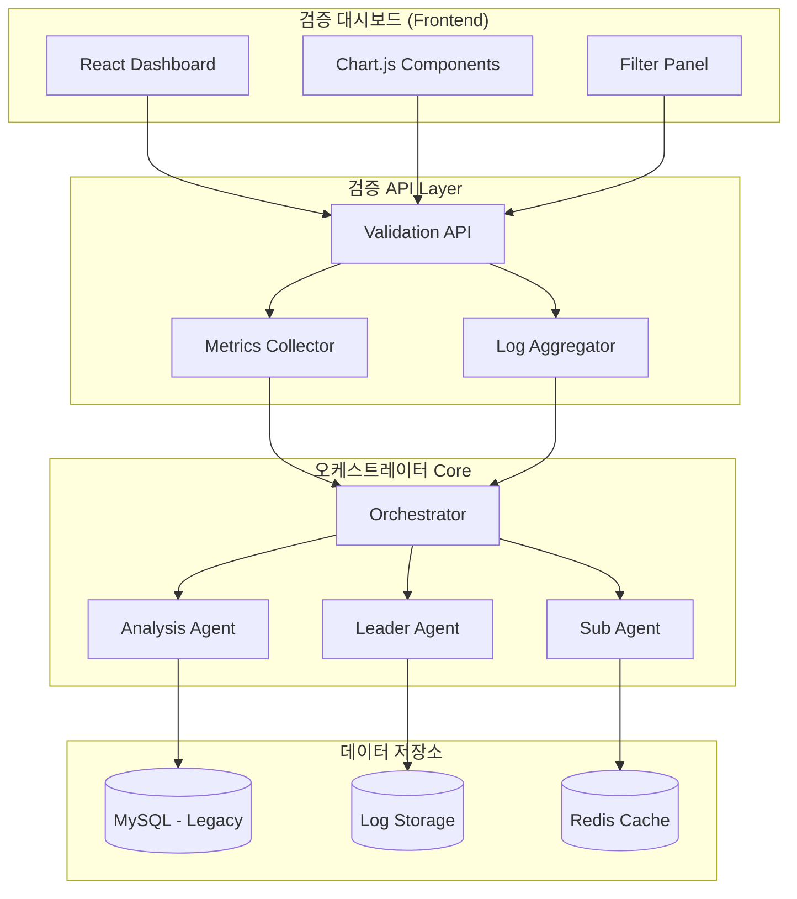
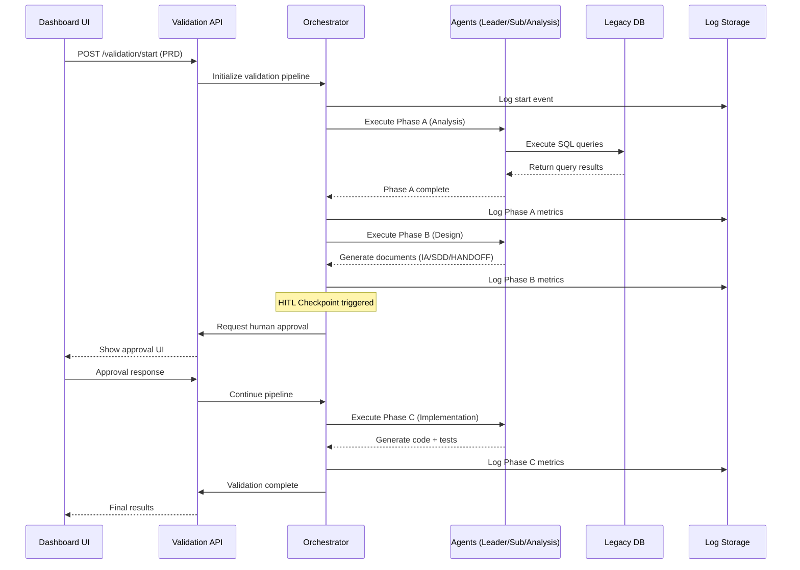
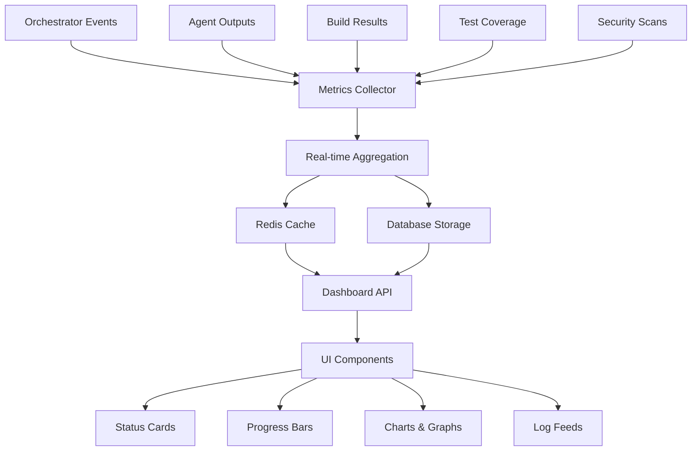

# SDD.md - 시스템 설계

> **문서 ID**: SDD-orchestrator-validation-20251223  
> **연관 PRD**: case6-orchestrator-validation-20251223  
> **생성일**: 2025-12-23

## 1. 아키텍처 개요

### 1.1 시스템 구조



### 1.2 검증 파이프라인 구조

```
Input: PRD → Gap Check → Type Detection → Pipeline Routing
  ↓
Phase A (AnalysisAgent):
  SQL Generation → Schema Validation → Query Execution → Result Analysis
  ↓
Phase B (LeaderAgent):  
  IA Generation → Wireframe Creation → SDD Design → HANDOFF Preparation
  ↓
Phase C (SubAgent):
  Code Generation → Test Creation → Build Validation → Security Check
  ↓
Output: Validation Report + Metrics + Generated Assets
```

## 2. 레거시 스키마 매핑

### 2.1 Phase A 데이터 분석용 테이블

| 개념 | 물리 테이블 | 사용 컬럼 | 제약사항 |
|------|------------|-----------|----------|
| 회원 기본정보 | `USERS` | `U_ID`, `U_KIND`, `U_ALIVE`, `U_REG_DATE` | - |
| 회원 상세정보 | `USER_DETAIL` | `U_ID`, `U_MAJOR_CODE_1`, `U_WORK_TYPE_1` | LEFT JOIN 필요 |
| 로그인 이력 | `USER_LOGIN` | `U_ID`, `LOGIN_DATE` | ⚠️ 반드시 LIMIT 10,000 적용 |

### 2.2 검증 메트릭 저장 (신규 테이블) [⚠️ AI 추론됨 - 검토 필요]

```sql
-- 오케스트레이터 실행 로그
CREATE TABLE ORCHESTRATOR_VALIDATION_LOG (
    LOG_ID          INT AUTO_INCREMENT PRIMARY KEY,
    CASE_ID         VARCHAR(50),                    -- case6-orchestrator-validation-20251223
    PHASE           VARCHAR(10),                    -- 'A', 'B', 'C'  
    COMPONENT       VARCHAR(20),                    -- 'PRD_ANALYZER', 'LEADER_AGENT' 등
    STATUS          VARCHAR(20),                    -- 'SUCCESS', 'FAILED', 'IN_PROGRESS'
    EXECUTION_TIME  DECIMAL(10,3),                  -- 실행 시간(초)
    ERROR_MESSAGE   TEXT,                          -- 오류 시 메시지
    CREATED_AT      TIMESTAMP DEFAULT CURRENT_TIMESTAMP
);

-- 검증 지표 스냅샷  
CREATE TABLE VALIDATION_METRICS_SNAPSHOT (
    SNAPSHOT_ID     INT AUTO_INCREMENT PRIMARY KEY,
    CASE_ID         VARCHAR(50),
    SQL_SUCCESS_RATE DECIMAL(5,2),                 -- SQL 생성 성공률 (%)
    SCHEMA_MATCH_RATE DECIMAL(5,2),                -- 스키마 일치율 (%)
    TEST_COVERAGE    DECIMAL(5,2),                 -- 테스트 커버리지 (%)
    BUILD_STATUS     VARCHAR(10),                  -- 'PASS', 'FAIL'
    SECURITY_VIOLATIONS INT DEFAULT 0,             -- 보안 위반 횟수
    RETRY_COUNT      INT DEFAULT 0,                -- 재시도 횟수
    HITL_TRIGGERS    INT DEFAULT 0,                -- HITL 트리거 횟수
    CREATED_AT       TIMESTAMP DEFAULT CURRENT_TIMESTAMP
);
```

## 3. API 설계

### 3.1 검증 상태 조회 API

```typescript
// GET /api/v1/validation/orchestrator/{caseId}/status
interface ValidationStatusResponse {
  caseId: string;
  overallStatus: 'IN_PROGRESS' | 'COMPLETED' | 'FAILED';
  currentPhase: 'A' | 'B' | 'C';
  phaseStatuses: {
    phaseA: PhaseStatus;
    phaseB: PhaseStatus;  
    phaseC: PhaseStatus;
  };
  metrics: ValidationMetrics;
  executionTime: number; // 초
  retryCount: number;
}

interface PhaseStatus {
  status: 'WAITING' | 'IN_PROGRESS' | 'COMPLETED' | 'FAILED';
  startedAt?: string;
  completedAt?: string;
  errorMessage?: string;
  validationPoints: ValidationPoint[];
}

interface ValidationPoint {
  component: string;        // 'PRD_ANALYZER', 'LEADER_AGENT' 등
  checkName: string;        // 'Gap Check', 'SQL 생성' 등  
  status: 'PASS' | 'FAIL' | 'PENDING';
  details?: string;
}
```

### 3.2 Phase A 분석 결과 조회 API

```typescript
// GET /api/v1/validation/orchestrator/{caseId}/phase-a/results
interface PhaseAResultsResponse {
  sqlQueries: {
    segmentQuery: SQLQueryResult;
    distributionQuery: SQLQueryResult;
    loginPatternQuery: SQLQueryResult;
  };
  analysisResults: {
    userSegments: UserSegmentData[];
    majorDistribution: MajorDistributionData[];
    loginPatterns: LoginPatternData;
  };
  schemaValidation: {
    tablesUsed: string[];
    columnsMatched: number;
    columnsTotal: number;
    mismatches: string[];
  };
}

interface SQLQueryResult {
  query: string;
  executionTime: number;
  rowCount: number;
  status: 'SUCCESS' | 'FAILED';
  errorMessage?: string;
}
```

### 3.3 Phase B 설계 문서 조회 API  

```typescript
// GET /api/v1/validation/orchestrator/{caseId}/phase-b/documents
interface PhaseBDocumentsResponse {
  documents: {
    ia: DocumentInfo;
    wireframe: DocumentInfo;
    sdd: DocumentInfo;
    handoff: DocumentInfo;
  };
  validationResults: {
    iaCompleteness: ValidationResult;
    wireframeClarity: ValidationResult;
    sddLegacyMapping: ValidationResult;
    handoffSecurity: ValidationResult;
  };
  hitlStatus: HITLCheckpointStatus;
}

interface DocumentInfo {
  filename: string;
  size: number; // bytes
  status: 'GENERATED' | 'VALIDATED' | 'FAILED';
  downloadUrl: string;
}

interface HITLCheckpointStatus {
  isTriggered: boolean;
  checkpointType: 'DESIGN_APPROVAL' | 'QUERY_REVIEW';
  status: 'PENDING' | 'APPROVED' | 'REJECTED';
  reviewItems: string[];
}
```

### 3.4 Phase C 구현 결과 조회 API

```typescript
// GET /api/v1/validation/orchestrator/{caseId}/phase-c/implementation  
interface PhaseCImplementationResponse {
  buildResults: {
    backend: BuildResult;
    frontend: BuildResult;
    tests: BuildResult;
  };
  testCoverage: {
    overall: number;
    backend: number;
    frontend: number;
    details: CoverageDetail[];
  };
  securityValidation: {
    protectedPathViolations: number;
    sqlInjectionChecks: boolean;
    accessPolicyCompliance: boolean;
    violations: SecurityViolation[];
  };
  generatedFiles: FileStructure[];
}

interface BuildResult {
  status: 'PASS' | 'FAIL';
  executionTime: number;
  errors: string[];
  warnings: string[];
}
```

## 4. 데이터 흐름 설계

### 4.1 검증 프로세스 데이터 흐름



### 4.2 메트릭 수집 데이터 흐름



## 5. 보안 및 제약사항

### 5.1 데이터베이스 접근 제어

| 제약 항목 | 설정값 | 검증 방법 |
|-----------|--------|----------|
| 쿼리 타입 | SELECT only | SQL 파싱으로 INSERT/UPDATE/DELETE 차단 |
| 행 수 제한 | 10,000행 | 모든 쿼리에 LIMIT 자동 적용 |
| 실행 시간 | 30초 | 쿼리 타임아웃 설정 |
| 테이블 접근 | 화이트리스트 | USERS, USER_DETAIL, USER_LOGIN만 허용 |

### 5.2 Protected Path 보호

```typescript
// 보호된 경로 목록
const PROTECTED_PATHS = [
  '.claude/rules/*',
  '.claude/context/*', 
  '.claude/workflows/*',
  'backend/config/database.ts',
  'backend/src/auth/*'
];

// 파일 접근 시 검증 로직
function validateFileAccess(filepath: string): boolean {
  return !PROTECTED_PATHS.some(pattern => 
    minimatch(filepath, pattern)
  );
}
```

### 5.3 HITL 체크포인트 정의

| 체크포인트 | 트리거 조건 | 승인 항목 |
|------------|-------------|----------|
| 쿼리 검토 | Phase A 완료 후 데이터 이상 감지 시 | SQL 쿼리 정확성, 결과 데이터 유효성 |  
| 설계 승인 | Phase B 완료 후 | IA 구조, SDD 레거시 매핑, HANDOFF 보안 규칙 |
| 수동 수정 | Review 3회 실패 시 (선택사항) | 코드 수정, 설정 변경 |

## 6. 성능 및 모니터링

### 6.1 성능 목표

| 메트릭 | 목표값 | 측정 방법 |
|--------|--------|----------|
| 전체 파이프라인 실행 시간 | ≤ 60분 | Orchestrator 로그 |
| Phase A SQL 실행 시간 | ≤ 10분 | 각 쿼리별 타이밍 |
| Phase B 문서 생성 시간 | ≤ 15분 | Agent 응답 시간 |
| Phase C 코드 생성 시간 | ≤ 20분 | 빌드 포함 시간 |
| 대시보드 응답 시간 | ≤ 2초 | API 응답 시간 |

### 6.2 모니터링 지표

```yaml
# 시스템 헬스 지표
orchestrator_pipeline_duration_seconds: 파이프라인 실행 시간
orchestrator_phase_success_rate: Phase별 성공률  
orchestrator_retry_count_total: 재시도 횟수
orchestrator_hitl_trigger_count: HITL 트리거 횟수
orchestrator_security_violations_total: 보안 위반 횟수

# 품질 지표  
validation_sql_success_rate: SQL 생성 성공률
validation_schema_match_rate: 스키마 일치율
validation_test_coverage_percent: 테스트 커버리지
validation_build_success_rate: 빌드 성공률

# 리소스 지표
database_query_duration_seconds: DB 쿼리 실행 시간
database_connection_pool_usage: DB 연결 풀 사용률
memory_usage_bytes: 메모리 사용량
cpu_usage_percent: CPU 사용률
```

## 7. Risk 분석

### 7.1 기술적 위험

| Risk | Impact | Probability | 완화 방안 |
|------|--------|-------------|----------|
| 대용량 테이블 조회로 인한 성능 저하 | High | Medium | LIMIT 자동 적용, 쿼리 타임아웃 설정 |
| 레거시 스키마 불일치로 인한 SQL 오류 | High | Low | DOMAIN_SCHEMA.md 사전 검증, HITL 체크포인트 |
| Phase 간 의존성으로 인한 전체 실패 | Medium | Medium | 각 Phase별 독립 실행 가능하도록 설계 |
| HITL 대기로 인한 실행 지연 | Low | High | 타임아웃 설정, 자동 승인 옵션 |

### 7.2 보안 위험

| Risk | Impact | Probability | 완화 방안 |  
|------|--------|-------------|----------|
| Protected Path 우회 접근 | Critical | Low | 파일 접근 시 경로 검증, 감사 로깅 |
| SQL Injection 공격 | High | Low | 파라미터화된 쿼리, SQL 파싱 검증 |
| 민감 데이터 노출 | High | Medium | SELECT 권한만 부여, 컬럼 화이트리스트 |

## 8. 확장성 고려사항

### 8.1 스케일링 전략

- **수평 확장**: 각 Phase를 독립적인 컨테이너로 분리
- **비동기 처리**: Phase 간 메시지 큐를 통한 비동기 실행  
- **캐싱 전략**: 자주 사용되는 검증 결과 Redis 캐싱
- **Load Balancing**: 다중 검증 요청 시 Agent 인스턴스 분산

### 8.2 확장 포인트

```typescript
// 새로운 Phase 추가를 위한 인터페이스
interface ValidationPhase {
  name: string;
  execute(context: ValidationContext): Promise<PhaseResult>;
  validate(result: PhaseResult): ValidationResult;
  getDependencies(): string[]; // 선행 Phase 목록
}

// 새로운 검증 지표 추가를 위한 인터페이스  
interface ValidationMetric {
  name: string;
  calculate(data: any): number;
  getThreshold(): number;
  getUnit(): string;
}
```