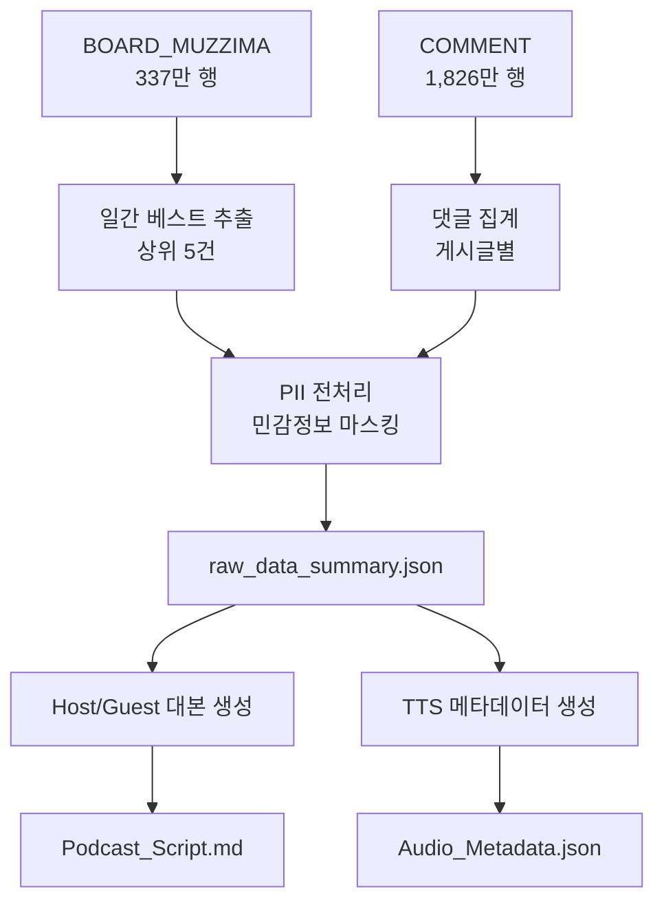

# IA.md - 정보 구조

## 1. 시스템 아키텍처

```
메디게이트 무찌마 → Phase A (데이터 추출) → Phase B (팟캐스트 생성) → 산출물 배포
```

### 1.1 Phase 구조

| Phase | 목적 | 입력 | 출력 |
|-------|------|------|------|
| Phase A | 일간 베스트 추출 및 전처리 | BOARD_MUZZIMA, COMMENT | best_posts_query.sql, raw_data_summary.json |
| Phase B | 팟캐스트 대본 및 메타데이터 생성 | raw_data_summary.json | Podcast_Script.md, Audio_Metadata.json |

## 2. 데이터 흐름 구조



## 3. 라우팅 구조 (API 기준)

```
/api/v1/podcast/
├── /extract          # Phase A - 데이터 추출
│   ├── /best-posts    # 베스트 게시물 조회
│   └── /preprocess    # PII 전처리
└── /generate          # Phase B - 콘텐츠 생성
    ├── /script        # 대본 생성
    └── /metadata      # 오디오 메타데이터
```

## 4. 보안 계층

| 계층 | 규칙 | 적용 범위 |
|------|------|-----------|
| 데이터 접근 | REG_DATE >= 조건 강제, LIMIT 10 이하 | BOARD_MUZZIMA, COMMENT |
| PII 보호 | 개인식별정보 마스킹 필수 | 모든 게시글 내용 |
| SELECT 제한 | SELECT * 금지, 필요 컬럼만 조회 | 모든 쿼리 |