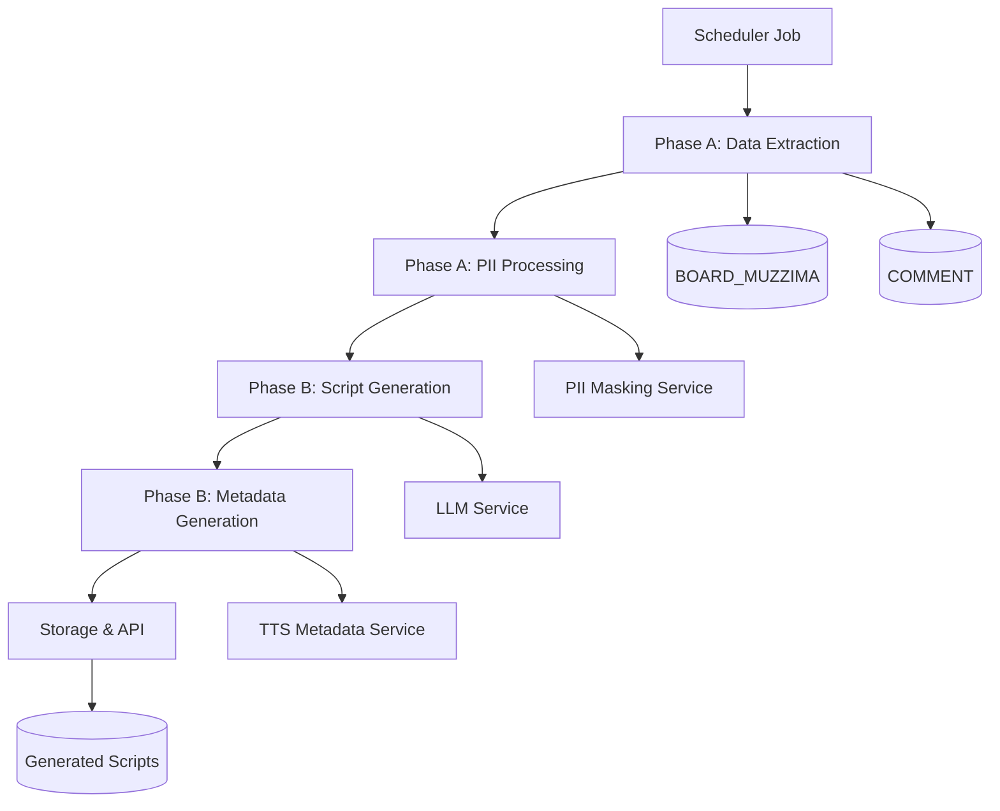

# SDD.md - 시스템 설계

## 아키텍처 개요

### 시스템 구성


## 레거시 스키마 매핑

### 핵심 테이블 활용
```sql
-- BOARD_MUZZIMA (337만 행) - 메인 게시물
SELECT 
    BOARD_IDX,
    CTG_CODE,
    U_ID,
    TITLE,
    CONTENT,
    READ_CNT,
    AGREE_CNT,
    REG_DATE
FROM BOARD_MUZZIMA
WHERE REG_DATE >= DATE_SUB(NOW(), INTERVAL 24 HOUR)
    AND CTG_CODE IN ('001', '002', '003') -- 주요 카테고리만
ORDER BY (READ_CNT * 0.7 + AGREE_CNT * 0.3) DESC
LIMIT 10;

-- COMMENT (1,826만 행) - 댓글 데이터
SELECT 
    BOARD_IDX,
    COUNT(*) as comment_cnt,
    COUNT(DISTINCT U_ID) as unique_commenters
FROM COMMENT
WHERE BOARD_IDX IN (상위 게시물 ID 목록)
    AND SVC_CODE = 'MUZZIMA'
    AND REG_DATE >= DATE_SUB(NOW(), INTERVAL 24 HOUR)
GROUP BY BOARD_IDX
ORDER BY comment_cnt DESC;
```

### 인덱스 활용 전략
- `(REG_DATE, CTG_CODE)` 복합 인덱스 필수
- `BOARD_IDX` 기반 댓글 조회 최적화
- `LIMIT 10` 이하로 제한하여 Full Scan 방지

## API 설계

### Phase A: 데이터 추출
```yaml
paths:
  /api/v1/podcast/daily-briefing/extract:
    get:
      summary: 일간 베스트 게시물 추출
      parameters:
        - name: date
          schema:
            type: string
            format: date
          description: 대상 날짜 (기본값: 어제)
      responses:
        200:
          content:
            application/json:
              schema:
                type: object
                properties:
                  posts:
                    type: array
                    items:
                      $ref: '#/components/schemas/BestPost'
                  metadata:
                    $ref: '#/components/schemas/ExtractionMetadata'

components:
  schemas:
    BestPost:
      type: object
      properties:
        board_idx:
          type: integer
        title:
          type: string
        content_preview:
          type: string
          maxLength: 200
        read_cnt:
          type: integer
        comment_cnt:
          type: integer
        score:
          type: number
          description: "조회수*0.7 + 댓글수*0.3 정규화 점수"
        pii_detected:
          type: array
          items:
            type: string
```

### Phase B: 대본 생성
```yaml
  /api/v1/podcast/daily-briefing/generate:
    post:
      summary: 팟캐스트 대본 생성
      requestBody:
        content:
          application/json:
            schema:
              type: object
              properties:
                posts:
                  type: array
                  items:
                    $ref: '#/components/schemas/BestPost'
                options:
                  $ref: '#/components/schemas/GenerationOptions'
      responses:
        200:
          content:
            application/json:
              schema:
                $ref: '#/components/schemas/PodcastScript'

    GenerationOptions:
      type: object
      properties:
        target_duration:
          type: string
          default: "8-10분"
        host_character:
          type: string
          enum: ["professional", "friendly", "analytical"]
        guest_character:
          type: string  
          enum: ["experienced", "junior", "specialist"]
        tone:
          type: string
          enum: ["formal", "conversational", "educational"]

    PodcastScript:
      type: object
      properties:
        script_id:
          type: string
        total_duration:
          type: string
        segments:
          type: array
          items:
            $ref: '#/components/schemas/ScriptSegment'
        metadata:
          $ref: '#/components/schemas/PodcastMetadata'

    ScriptSegment:
      type: object
      properties:
        speaker:
          type: string
          enum: ["HOST", "GUEST"]
        text:
          type: string
        metadata:
          type: object
          properties:
            emotion:
              type: string
              enum: ["밝음", "진지함", "놀람", "걱정"]
            speed:
              type: string
              enum: ["빠름", "보통", "느림"]
            emphasis:
              type: array
              items:
                type: string
            pause_after:
              type: number
              description: "다음 발화까지 휴지 시간(초)"
```

## 데이터 처리 파이프라인

### Phase A: 데이터 수집 및 전처리
```python
class DailyBestExtractor:
    def __init__(self):
        self.db_pool = create_db_pool()
        self.pii_processor = PIIProcessor()
    
    async def extract_best_posts(self, target_date: date) -> List[BestPost]:
        """24시간 내 베스트 게시물 추출"""
        query = """
        SELECT 
            BOARD_IDX,
            TITLE,
            CONTENT,
            READ_CNT,
            (SELECT COUNT(*) FROM COMMENT 
             WHERE BOARD_IDX = bm.BOARD_IDX 
             AND SVC_CODE = 'MUZZIMA') as comment_cnt,
            (READ_CNT * 0.7 + 
             (SELECT COUNT(*) FROM COMMENT 
              WHERE BOARD_IDX = bm.BOARD_IDX) * 0.3) as score
        FROM BOARD_MUZZIMA bm
        WHERE REG_DATE >= %s
        AND REG_DATE < %s
        AND CTG_CODE IN ('001', '002', '003', '004', '005')
        ORDER BY score DESC
        LIMIT 10
        """
        
        start_time = datetime.combine(target_date, time.min)
        end_time = start_time + timedelta(days=1)
        
        async with self.db_pool.acquire() as conn:
            rows = await conn.fetch(query, start_time, end_time)
            
        posts = []
        for row in rows:
            # PII 전처리
            processed_content = self.pii_processor.mask_sensitive_data(
                row['CONTENT']
            )
            
            posts.append(BestPost(
                board_idx=row['BOARD_IDX'],
                title=row['TITLE'],
                content_preview=processed_content[:200],
                read_cnt=row['READ_CNT'],
                comment_cnt=row['comment_cnt'],
                score=row['score']
            ))
        
        return posts[:5]  # 상위 5건만 반환

class PIIProcessor:
    def __init__(self):
        self.patterns = {
            'phone': r'\d{2,3}-\d{3,4}-\d{4}',
            'email': r'[\w\.-]+@[\w\.-]+\.\w+',
            'hospital': r'[가-힣]+병원|[가-힣]+의원|[가-힣]+클리닉',
            'doctor_name': r'[가-힣]{2,3}\s*선생님?|Dr\.\s*[가-힣]{2,3}'
        }
    
    def mask_sensitive_data(self, text: str) -> str:
        """민감 정보 마스킹"""
        masked_text = text
        
        # 병원명 → A병원, B의원
        hospitals = re.findall(self.patterns['hospital'], text)
        for i, hospital in enumerate(set(hospitals)):
            replacement = f"{chr(65+i)}병원" if "병원" in hospital else f"{chr(65+i)}의원"
            masked_text = masked_text.replace(hospital, replacement)
        
        # 의사명 → 김○○ 선생님
        doctors = re.findall(self.patterns['doctor_name'], text)
        for doctor in set(doctors):
            name = re.sub(r'[선생님Dr\.\s]', '', doctor)
            if len(name) >= 2:
                masked_name = f"{name[0]}{'○' * (len(name)-1)} 선생님"
                masked_text = masked_text.replace(doctor, masked_name)
        
        # 연락처, 이메일 완전 제거
        masked_text = re.sub(self.patterns['phone'], '[연락처 삭제]', masked_text)
        masked_text = re.sub(self.patterns['email'], '[이메일 삭제]', masked_text)
        
        return masked_text
```

### Phase B: 대본 생성
```python
class PodcastScriptGenerator:
    def __init__(self):
        self.llm_client = OpenAIClient()
        self.character_profiles = self.load_character_profiles()
    
    async def generate_script(
        self, 
        posts: List[BestPost], 
        options: GenerationOptions
    ) -> PodcastScript:
        """대본 생성"""
        
        # 캐릭터 프로필 로드
        host_profile = self.character_profiles[options.host_character]
        guest_profile = self.character_profiles[options.guest_character]
        
        # 프롬프트 구성
        prompt = self.build_prompt(posts, host_profile, guest_profile, options)
        
        # LLM 호출
        response = await self.llm_client.generate(prompt)
        
        # 구조화된 응답 파싱
        script = self.parse_script_response(response)
        
        # 메타데이터 생성
        metadata = await self.generate_metadata(script)
        
        return PodcastScript(
            script_id=f"daily-{datetime.now().strftime('%Y%m%d')}",
            segments=script,
            metadata=metadata
        )
    
    def build_prompt(self, posts, host_profile, guest_profile, options):
        return f"""
다음 의료 커뮤니티 게시물들을 바탕으로 2인 대화형 팟캐스트 대본을 작성하세요.

## 게시물 요약
{self.format_posts_for_prompt(posts)}

## 캐릭터 설정
HOST: {host_profile.description}
- 말투: {host_profile.speech_style}
- 역할: 진행, 질문, 정리

GUEST: {guest_profile.description}  
- 말투: {guest_profile.speech_style}
- 역할: 경험 공유, 전문 해설

## 대본 요구사항
- 총 길이: {options.target_duration}
- 톤: {options.tone}
- 형식: [HOST] 또는 [GUEST] 표시 후 발화 내용
- 각 발화마다 메타데이터 {{감정: , 속도: , 강조: }} 포함

## 구성
1. 인사 및 오프닝 (1분)
2. 주요 이슈 소개 (2분)  
3. 게시물별 상세 토론 (5분)
4. 정리 및 마무리 (1분)
"""

    async def generate_metadata(self, script: List[ScriptSegment]) -> PodcastMetadata:
        """TTS용 메타데이터 생성"""
        total_duration = 0
        host_duration = 0
        guest_duration = 0
        keywords = Counter()
        
        for segment in script:
            # 발화 시간 추정 (한국어 기준: 분당 300자)
            duration = len(segment.text) / 300 * 60
            total_duration += duration
            
            if segment.speaker == "HOST":
                host_duration += duration
            else:
                guest_duration += duration
            
            # 키워드 추출
            words = re.findall(r'[가-힣]{2,}', segment.text)
            keywords.update(words)
        
        return PodcastMetadata(
            total_duration=f"{int(total_duration // 60)}분 {int(total_duration % 60)}초",
            host_duration=f"{int(host_duration // 60)}분 {int(host_duration % 60)}초", 
            guest_duration=f"{int(guest_duration // 60)}분 {int(guest_duration % 60)}초",
            top_keywords=keywords.most_common(10)
        )
```

## 데이터베이스 설계

### 생성된 대본 저장
```sql
CREATE TABLE podcast_scripts (
    script_id VARCHAR(50) PRIMARY KEY,
    generation_date DATE NOT NULL,
    script_json JSON NOT NULL,
    metadata_json JSON,
    status ENUM('draft', 'reviewed', 'published') DEFAULT 'draft',
    created_at TIMESTAMP DEFAULT CURRENT_TIMESTAMP,
    
    INDEX idx_generation_date (generation_date),
    INDEX idx_status (status)
);

CREATE TABLE podcast_source_posts (
    script_id VARCHAR(50),
    board_idx INT,
    score DECIMAL(5,2),
    inclusion_reason VARCHAR(100),
    
    PRIMARY KEY (script_id, board_idx),
    FOREIGN KEY (script_id) REFERENCES podcast_scripts(script_id),
    INDEX idx_board_idx (board_idx)
);
```

## 스케줄링 및 자동화

### 일간 배치 작업
```python
import asyncio
from celery import Celery
from datetime import datetime, timedelta

app = Celery('podcast_generator')

@app.task
async def generate_daily_podcast():
    """매일 오전 6시 실행되는 팟캐스트 생성 작업"""
    try:
        target_date = datetime.now().date() - timedelta(days=1)
        
        # Phase A: 베스트 게시물 추출
        extractor = DailyBestExtractor()
        best_posts = await extractor.extract_best_posts(target_date)
        
        if len(best_posts) < 3:
            logger.warning(f"충분한 게시물이 없음: {len(best_posts)}건")
            return
        
        # Phase B: 대본 생성
        generator = PodcastScriptGenerator()
        script = await generator.generate_script(
            best_posts, 
            GenerationOptions(
                target_duration="8-10분",
                host_character="professional",
                guest_character="experienced",
                tone="conversational"
            )
        )
        
        # 저장
        await save_podcast_script(script, best_posts)
        
        logger.info(f"팟캐스트 대본 생성 완료: {script.script_id}")
        
    except Exception as e:
        logger.error(f"팟캐스트 생성 실패: {str(e)}")
        # 알림 발송
        await send_error_notification(e)

# 스케줄 설정: 매일 오전 6시
app.conf.beat_schedule = {
    'generate-daily-podcast': {
        'task': 'generate_daily_podcast',
        'schedule': crontab(hour=6, minute=0),
    },
}
```

## 성능 및 제약사항

### 성능 최적화
- **쿼리 최적화**: REG_DATE 인덱스 강제 사용
- **결과 제한**: LIMIT 10 이하, SELECT * 금지
- **캐싱**: Redis를 통한 일간 베스트 게시물 캐싱
- **비동기 처리**: Phase A/B 병렬 처리 가능

### 리스크 관리
- **대용량 테이블 보호**: COMMENT 테이블 Full Scan 방지
- **PII 누출 방지**: 자동 마스킹 + 인간 검토 단계
- **LLM 품질 관리**: 부적절한 내용 필터링
- **저작권 준수**: 원 게시물 출처 명시

### 모니터링 지표
- 일일 처리 게시물 수
- 대본 생성 성공률
- PII 마스킹 정확도  
- API 응답 시간 (Phase A < 5초, Phase B < 30초)