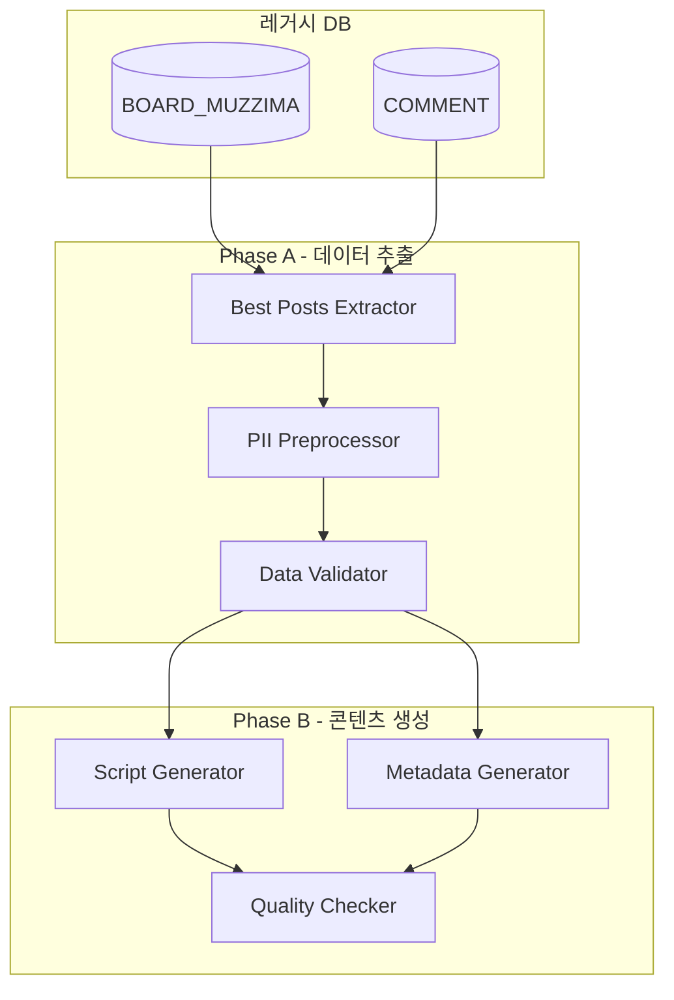

# SDD.md - 시스템 설계

## 1. 아키텍처 개요

### 1.1 시스템 구성도


## 2. 레거시 스키마 매핑

### 2.1 BOARD_MUZZIMA 테이블 활용
```sql
-- 실제 컬럼명 기준 (DOMAIN_SCHEMA.md 준수)
SELECT 
    BOARD_IDX,          -- 게시글 ID
    CTG_CODE,           -- 카테고리 코드 (NOT SVC_CODE)
    TITLE,              -- 제목
    CONTENT,            -- 내용 (MEDIUMTEXT)
    read_CNT,           -- 조회수 (소문자 주의)
    AGREE_CNT,          -- 추천수
    REG_DATE            -- 등록일시
FROM BOARD_MUZZIMA
WHERE REG_DATE >= DATE_SUB(NOW(), INTERVAL 24 HOUR)  -- 필수 조건
ORDER BY (read_CNT + AGREE_CNT * 3) DESC            -- 가중치 적용
LIMIT 5;  -- 상위 5건만
```

### 2.2 COMMENT 테이블 연동
```sql
-- 댓글 수 집계 (인덱스 활용)
SELECT 
    BOARD_IDX,
    COUNT(*) as comment_count
FROM COMMENT 
WHERE SVC_CODE = 'MUZZIMA'  -- 게시판 구분 필수
  AND BOARD_IDX IN (?, ?, ?, ?, ?)  -- 베스트 게시물 IDX만
GROUP BY BOARD_IDX;
```

### 2.3 제약사항 및 Risk
- ⚠️ **COMMENT 테이블 위험도: 🚨 Extreme (1,826만 행)**
- **필수 대응**: BOARD_IDX IN 절로 범위 제한
- **금지**: WHERE 조건 없는 전체 스캔
- **SELECT * 금지**: 필요 컬럼만 명시적 조회

## 3. Phase A - 데이터 추출 설계

### 3.1 베스트 게시물 추출 로직
```python
def extract_best_posts():
    """
    지난 24시간 내 베스트 게시물 5건 추출
    가중치: 조회수 + (댓글수 * 3)
    """
    base_query = """
    SELECT 
        b.BOARD_IDX,
        b.TITLE,
        b.CONTENT,
        b.read_CNT,
        b.AGREE_CNT,
        b.REG_DATE,
        COALESCE(c.comment_count, 0) as comment_count,
        (b.read_CNT + b.AGREE_CNT * 3 + COALESCE(c.comment_count, 0) * 2) as engagement_score
    FROM BOARD_MUZZIMA b
    LEFT JOIN (
        SELECT BOARD_IDX, COUNT(*) as comment_count
        FROM COMMENT 
        WHERE SVC_CODE = 'MUZZIMA'
        GROUP BY BOARD_IDX
    ) c ON b.BOARD_IDX = c.BOARD_IDX
    WHERE b.REG_DATE >= DATE_SUB(NOW(), INTERVAL 24 HOUR)
    ORDER BY engagement_score DESC
    LIMIT 5;
    """
    return execute_query(base_query)
```

### 3.2 PII 전처리 모듈
```python
class PIIPreprocessor:
    """개인식별정보 마스킹 처리"""
    
    def __init__(self):
        self.patterns = {
            'name': r'[가-힣]{2,4}(선생님?|교수님?|원장님?)',  # 이름 + 호칭
            'hospital': r'[가-힣]+병원|[가-힣]+의원',           # 의료기관명
            'phone': r'\d{3}-\d{4}-\d{4}',                    # 전화번호
            'email': r'[a-zA-Z0-9._%+-]+@[a-zA-Z0-9.-]+\.[a-zA-Z]{2,}' # 이메일
        }
    
    def mask_content(self, text: str) -> str:
        """민감 정보를 마스킹 처리"""
        for pattern_type, pattern in self.patterns.items():
            text = re.sub(pattern, self._get_mask(pattern_type), text)
        return text
    
    def _get_mask(self, pattern_type: str) -> str:
        masks = {
            'name': 'H** 선생님',
            'hospital': '**병원',
            'phone': '***-****-****',
            'email': '***@***.***'
        }
        return masks.get(pattern_type, '***')
```

## 4. Phase B - 팟캐스트 생성 설계

### 4.1 대본 생성 템플릿
```python
class PodcastScriptGenerator:
    """팟캐스트 대본 생성기"""
    
    SCRIPT_TEMPLATE = """
# 메디캐스트 일간 브리핑 - {date}

## [00:00] 인트로
**Host**: 안녕하세요, 메디게이트 일간 브리핑입니다. 오늘은 {date} 무찌마에서 가장 화제가 된 이야기들을 살펴보겠습니다.

**Guest**: 네, 반갑습니다. 오늘도 흥미로운 주제들이 많이 올라왔네요.

{segments}

## [08:30] 마무리
**Host**: 오늘의 브리핑은 여기까지입니다. 내일도 새로운 소식으로 찾아뵙겠습니다.
**Guest**: 감사합니다.
    """
    
    def generate_script(self, posts_data: Dict) -> str:
        segments = []
        timestamp = 30  # 30초부터 시작
        
        for i, post in enumerate(posts_data['best_posts'], 1):
            segment = self._create_segment(i, post, timestamp)
            segments.append(segment)
            timestamp += 90  # 각 세그먼트 90초
            
        return self.SCRIPT_TEMPLATE.format(
            date=posts_data['extraction_date'],
            segments='\n\n'.join(segments)
        )
```

### 4.2 TTS 메타데이터 생성
```python
class AudioMetadataGenerator:
    """TTS용 메타데이터 생성"""
    
    def generate_metadata(self, script: str) -> Dict:
        return {
            "audio_config": {
                "voice": "ko-KR-Neural-Standard-C",  # 여성 목소리
                "speaking_rate": 1.0,
                "pitch": 0.0,
                "volume_gain_db": 0.0
            },
            "segments": self._parse_segments(script),
            "total_estimated_duration": self._estimate_duration(script),
            "emotion_tags": {
                "intro": "professional",
                "discussion": "engaging", 
                "conclusion": "warm"
            }
        }
```

## 5. API 설계

### 5.1 Phase A APIs
```yaml
/api/v1/podcast/extract/best-posts:
  get:
    summary: 일간 베스트 게시물 추출
    parameters:
      - name: date
        in: query
        schema:
          type: string
          format: date
    responses:
      200:
        content:
          application/sql:
            schema:
              type: string
              description: "best_posts_query.sql 파일"

/api/v1/podcast/extract/preprocess:
  post:
    summary: PII 전처리
    requestBody:
      content:
        application/json:
          schema:
            type: object
            properties:
              raw_posts:
                type: array
    responses:
      200:
        content:
          application/json:
            schema:
              $ref: '#/components/schemas/RawDataSummary'
```

### 5.2 Phase B APIs
```yaml
/api/v1/podcast/generate/script:
  post:
    summary: 팟캐스트 대본 생성
    requestBody:
      content:
        application/json:
          schema:
            $ref: '#/components/schemas/RawDataSummary'
    responses:
      200:
        content:
          text/markdown:
            schema:
              type: string
              description: "Podcast_Script.md 파일"

/api/v1/podcast/generate/metadata:
  post:
    summary: 오디오 메타데이터 생성
    responses:
      200:
        content:
          application/json:
            schema:
              $ref: '#/components/schemas/AudioMetadata'
```

## 6. Risk 및 제약사항

| Risk | 영향도 | 대응 방안 |
|------|--------|-----------|
| COMMENT 테이블 Full Scan | 🚨 Critical | IN 절로 범위 제한, 인덱스 강제 사용 |
| PII 노출 | 🔴 High | 3단계 마스킹 처리 + 수동 검토 |
| 대용량 CONTENT 조회 | 🟡 Medium | 필요 컬럼만 SELECT, LIMIT 엄격 적용 |
| TTS 품질 저하 | 🟢 Low | 감정 태그 + 사전 검증 |

## 7. 성능 최적화

### 7.1 쿼리 최적화
- **인덱스 활용**: `(REG_DATE, read_CNT)` 복합 인덱스
- **서브쿼리 최소화**: LEFT JOIN으로 댓글 수 집계
- **결과 캐싱**: 일간 베스트는 24시간 캐시

### 7.2 메모리 관리
- **스트리밍 처리**: 큰 CONTENT는 청크 단위로 처리
- **가비지 컬렉션**: PII 처리 후 원본 데이터 즉시 삭제