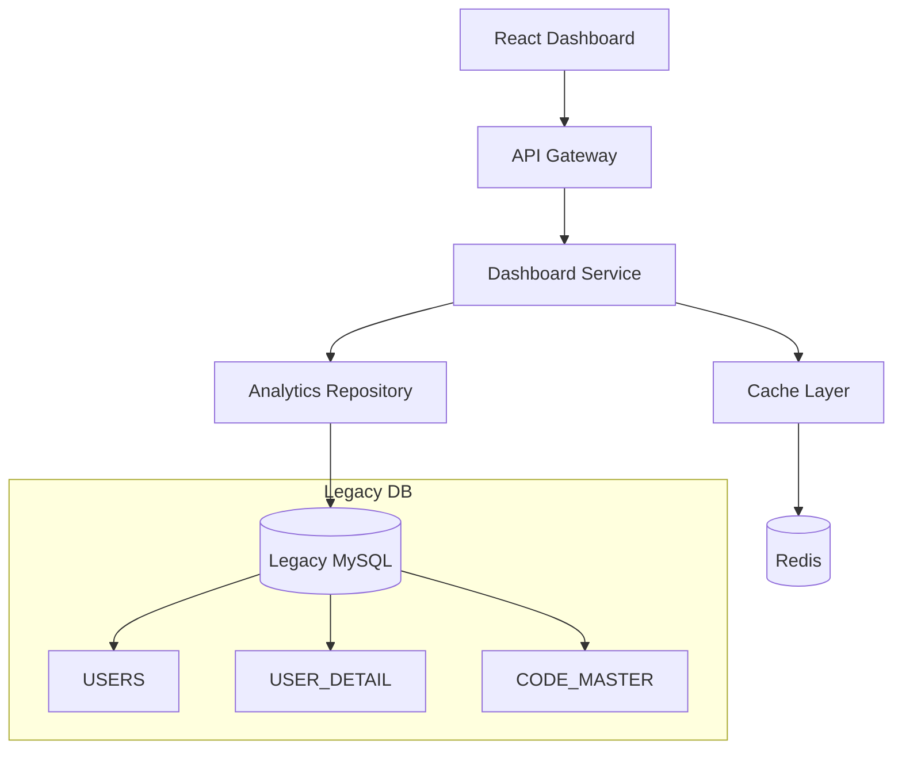

# SDD.md - 시스템 설계

## 1. 아키텍처 개요



## 2. 레거시 스키마 매핑 (Legacy Mapping)

### 2.1 핵심 테이블 매핑

| 비즈니스 요구사항 | 물리 테이블 | 핵심 컬럼 | 주의사항 |
|------------------|------------|-----------|----------|
| 활성 사용자 수 | `USERS` | `U_ALIVE` | CHAR(6) 타입, 'Y'/'N' 값 |
| 사용자 유형 분포 | `USERS` + `CODE_MASTER` | `U_KIND` + `CODE_NAME` | U_KIND는 CHAR(6) |
| 신규 가입자 추이 | `USERS` | `U_REG_DATE` | DATETIME 타입 |
| 전문과목 분석 | `USER_DETAIL` + `CODE_MASTER` | `U_MAJOR_CODE_1` | U_ID로 JOIN |

### 2.2 데이터 품질 이슈 및 대응

⚠️ **발견된 문제점**:
- 활성 사용자(`U_ALIVE='Y'`) 0명 vs 지속적인 신규 가입
- 데이터 정합성 검증 필요

**대응 방안**:
```sql
-- 활성 사용자 정의 재검토 쿼리
SELECT 
    U_ALIVE,
    COUNT(*) as user_count,
    COUNT(*) * 100.0 / (SELECT COUNT(*) FROM USERS) as percentage
FROM USERS 
GROUP BY U_ALIVE;
```

## 3. API 설계

### 3.1 RESTful API 스펙

```yaml
/api/v1/dashboard/user-stats:
  get:
    summary: 활성 사용자 통계 조회
    responses:
      200:
        schema:
          type: object
          properties:
            active_users: { type: integer, example: 0 }
            total_users: { type: integer, example: 203184 }
            monthly_new: { type: integer, example: 408 }
            activation_rate: { type: number, example: 0.0 }

/api/v1/dashboard/user-distribution:
  get:
    summary: 사용자 유형별 분포
    responses:
      200:
        schema:
          type: array
          items:
            type: object
            properties:
              user_kind: { type: string, example: "UKD001" }
              kind_name: { type: string, example: "의사" }
              user_count: { type: integer, example: 128356 }
              percentage: { type: number, example: 63.2 }

/api/v1/dashboard/user-trends:
  get:
    summary: 월별 신규 가입자 추이
    parameters:
      - name: start_date
        type: string
        format: date
      - name: end_date
        type: string
        format: date
    responses:
      200:
        schema:
          type: array
          items:
            properties:
              month: { type: string, example: "2025-03" }
              new_users: { type: integer, example: 532 }
```

### 3.2 SQL 쿼리 최적화

```sql
-- 활성 사용자 통계 (인덱스 활용)
SELECT 
    COUNT(CASE WHEN U_ALIVE = 'Y' THEN 1 END) as active_users,
    COUNT(*) as total_users,
    COUNT(CASE WHEN U_REG_DATE >= DATE_SUB(NOW(), INTERVAL 1 MONTH) THEN 1 END) as monthly_new
FROM USERS;

-- 유형별 분포 (CODE_MASTER 조인)
SELECT 
    u.U_KIND,
    cm.CODE_NAME,
    COUNT(*) as user_count,
    ROUND(COUNT(*) * 100.0 / (SELECT COUNT(*) FROM USERS), 2) as percentage
FROM USERS u
LEFT JOIN CODE_MASTER cm ON (cm.CODE_TYPE = 'U_KIND' AND cm.CODE_VALUE = u.U_KIND)
GROUP BY u.U_KIND, cm.CODE_NAME
ORDER BY user_count DESC;

-- 월별 신규 가입자 추이 (날짜 인덱스 활용)
SELECT 
    DATE_FORMAT(U_REG_DATE, '%Y-%m') as month,
    COUNT(*) as new_users
FROM USERS 
WHERE U_REG_DATE >= DATE_SUB(NOW(), INTERVAL 12 MONTH)
GROUP BY DATE_FORMAT(U_REG_DATE, '%Y-%m')
ORDER BY month DESC;
```

## 4. 성능 최적화

### 4.1 캐싱 전략

| 데이터 유형 | TTL | 갱신 주기 |
|------------|-----|----------|
| 전체 통계 | 1시간 | 매시 정각 |
| 유형별 분포 | 6시간 | 매일 새벽 3시 |
| 월별 추이 | 24시간 | 매일 새벽 1시 |

### 4.2 인덱스 권장사항

```sql
-- USERS 테이블 권장 인덱스
CREATE INDEX idx_users_alive_regdate ON USERS(U_ALIVE, U_REG_DATE);
CREATE INDEX idx_users_kind ON USERS(U_KIND);
CREATE INDEX idx_users_regdate ON USERS(U_REG_DATE);

-- USER_DETAIL 테이블 권장 인덱스  
CREATE INDEX idx_user_detail_major ON USER_DETAIL(U_MAJOR_CODE_1);
```

## 5. Risk 분석

### 5.1 데이터 정합성 리스크 🔴 HIGH

**문제**: 활성 사용자 0명이지만 신규 가입자는 지속 유입
**영향**: 대시보드 신뢰성 저하, 잘못된 비즈니스 의사결정
**대응**: 
- U_ALIVE 컬럼 정의 재검토
- 실제 활성도 지표(로그인 이력) 추가 고려

### 5.2 성능 리스크 🟡 MEDIUM

**문제**: USERS 테이블 20만+ 레코드 실시간 집계
**영향**: 대시보드 로딩 지연
**대응**:
- 캐싱 계층 도입
- 배치 집계 테이블 검토

### 5.3 확장성 리스크 🟡 MEDIUM

**문제**: 단일 서버 집계 방식
**영향**: 사용자 증가 시 성능 저하
**대응**:
- 분산 집계 아키텍처 검토
- Read Replica 활용

## 6. 모니터링 및 알림

### 6.1 핵심 지표

- API 응답 시간 < 500ms
- 데이터 정합성 체크 (일 1회)
- 캐시 히트율 > 90%

### 6.2 알림 조건

- 활성 사용자 수 급격한 변화 (±20% 이상)
- API 에러율 5% 초과
- 데이터 갱신 지연 2시간 이상