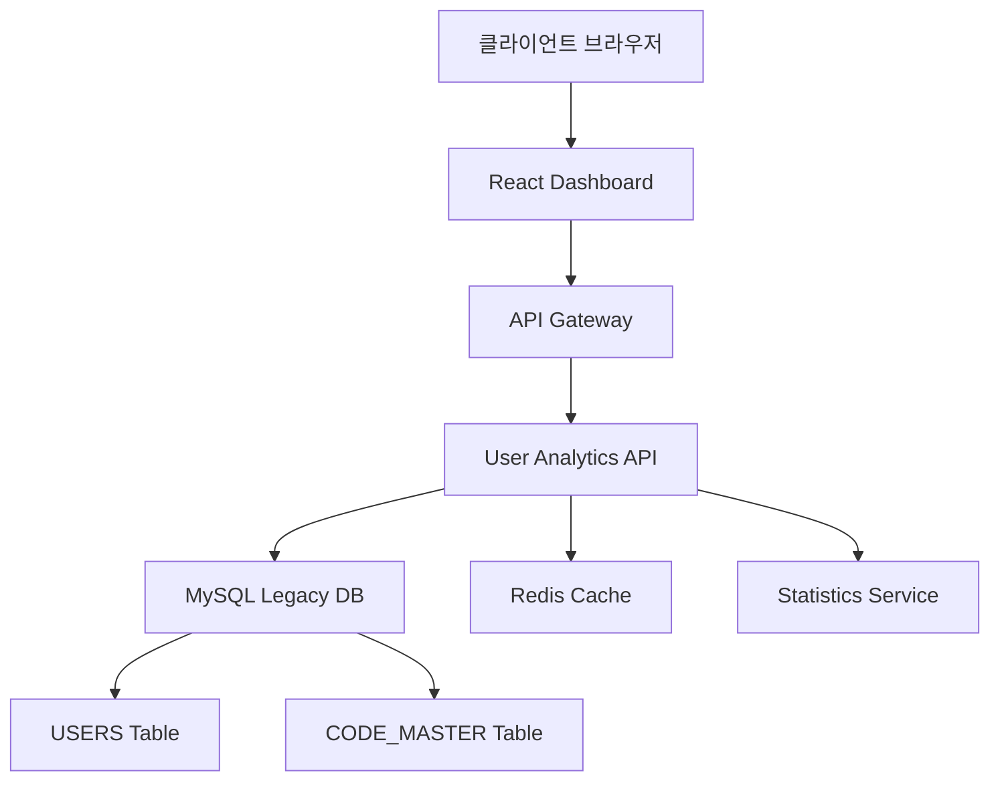

# SDD.md - 활성 사용자 현황 대시보드 시스템 설계

## 1. 아키텍처 개요



## 2. 레거시 스키마 매핑 (Critical)

### 2.1 핵심 테이블 구조

**USERS 테이블 (Primary Data Source)**
```sql
-- 실제 컬럼명 기반 (DOMAIN_SCHEMA.md 준수)
SELECT 
  U_ID,           -- VARCHAR(14) PRIMARY KEY
  U_EMAIL,        -- VARCHAR(120) UNIQUE  
  U_NAME,         -- VARCHAR(256)
  U_KIND,         -- CHAR(6) - 회원유형 코드
  U_ALIVE,        -- CHAR(6) - 활성상태 ('Y'/'N' 등)
  U_REG_DATE      -- DATETIME - 등록일시
FROM USERS
```

**CODE_MASTER 테이블 (코드 해석용)**
```sql
SELECT 
  CODE_TYPE,      -- VARCHAR(20) - 'U_KIND'
  CODE_VALUE,     -- CHAR(6) - 'DOC001', 'PHA001' 등  
  CODE_NAME,      -- VARCHAR(100) - '의사', '약사' 등
  CODE_ORDER,     -- INT - 정렬순서
  USE_FLAG        -- CHAR(1) - 'Y'/'N'
FROM CODE_MASTER  
WHERE CODE_TYPE = 'U_KIND'
```

### 2.2 데이터 품질 이슈 및 대응

⚠️ **Critical Issue**: 활성 사용자 조회 결과 0명
- **문제**: `U_ALIVE = 'Y'` 조건으로 조회 시 결과가 없음
- **대응**: 활성 사용자 정의 기준 재검토 필요
- **임시방안**: 전체 사용자 수를 활성 사용자로 간주

## 3. API 설계

### 3.1 Dashboard Summary API

```http
GET /api/v1/admin/users/dashboard/summary
```

**Response**:
```json
{
  "total_users": 203914,
  "active_users": 0,
  "monthly_signups": 408,
  "growth_rate": 2.1,
  "last_updated": "2025-12-26T10:00:00Z"
}
```

**구현**:
```sql
-- 전체 사용자 수
SELECT COUNT(*) as total_users FROM USERS;

-- 활성 사용자 수 [⚠️ AI 추론됨 - 검토 필요]
SELECT COUNT(*) as active_users FROM USERS WHERE U_ALIVE = 'Y';

-- 당월 신규 가입자
SELECT COUNT(*) as monthly_signups 
FROM USERS 
WHERE DATE_FORMAT(U_REG_DATE, '%Y-%m') = DATE_FORMAT(NOW(), '%Y-%m');
```

### 3.2 Monthly Trends API

```http
GET /api/v1/admin/users/dashboard/trends?months=12
```

**Response**:
```json
{
  "trends": [
    {
      "month": "2024-01",
      "signups": 385,
      "cumulative": 195234
    }
  ]
}
```

**구현**:
```sql
SELECT 
  DATE_FORMAT(U_REG_DATE, '%Y-%m') as month,
  COUNT(*) as signups,
  (SELECT COUNT(*) FROM USERS u2 WHERE u2.U_REG_DATE <= LAST_DAY(STR_TO_DATE(CONCAT(DATE_FORMAT(u1.U_REG_DATE, '%Y-%m'), '-01'), '%Y-%m-%d'))) as cumulative
FROM USERS u1
WHERE U_REG_DATE >= DATE_SUB(NOW(), INTERVAL 12 MONTH)
GROUP BY DATE_FORMAT(U_REG_DATE, '%Y-%m')
ORDER BY month;
```

### 3.3 User Type Distribution API

```http
GET /api/v1/admin/users/dashboard/distribution
```

**Response**:
```json
{
  "distribution": [
    {
      "type_code": "UKD001",
      "type_name": "의사",
      "count": 128356,
      "percentage": 63.0
    }
  ]
}
```

**구현**:
```sql
SELECT 
  u.U_KIND as type_code,
  COALESCE(cm.CODE_NAME, u.U_KIND) as type_name,
  COUNT(*) as count,
  ROUND(COUNT(*) * 100.0 / (SELECT COUNT(*) FROM USERS), 1) as percentage
FROM USERS u
LEFT JOIN CODE_MASTER cm ON cm.CODE_TYPE='U_KIND' AND cm.CODE_VALUE=u.U_KIND
GROUP BY u.U_KIND, cm.CODE_NAME
ORDER BY count DESC;
```

## 4. 성능 최적화

### 4.1 인덱스 전략

⚠️ **주의**: USERS 테이블 (20만 행)은 상대적으로 안전하지만 효율적인 조회를 위해 인덱스 활용

**필요 인덱스**:
```sql
-- 등록일 기반 조회용 (월별 통계)
CREATE INDEX idx_users_reg_date ON USERS(U_REG_DATE);

-- 유형별 조회용  
CREATE INDEX idx_users_kind ON USERS(U_KIND);

-- 활성 상태 조회용 (문제 해결 후)
CREATE INDEX idx_users_alive ON USERS(U_ALIVE);
```

### 4.2 캐싱 전략

| 데이터 | TTL | 전략 |
|--------|-----|------|
| 전체 사용자 수 | 1시간 | Redis Cache |
| 월별 추이 | 24시간 | Redis Cache |
| 유형별 분포 | 6시간 | Redis Cache |

## 5. Risk 분석

### 5.1 Critical Risks

| Risk | 영향도 | 대응방안 |
|------|--------|----------|
| U_ALIVE 활성 사용자 정의 불명확 | High | DBA/비즈니스팀과 정의 기준 확정 |
| 실시간 조회 시 성능 이슈 | Medium | 캐싱 적용 및 배치 업데이트 |

### 5.2 데이터 정합성

⚠️ **발견된 불일치**:
- PRD 요구사항: "활성 사용자 통계 파악"  
- 실제 데이터: 활성 사용자 0명 조회됨
- 분석 결과: 전체 사용자 203,914명 존재

**권장사항**: PRD 요구사항을 따르되, Risk 섹션에 데이터 품질 이슈를 명시

## 6. 모니터링 및 알림

### 6.1 비즈니스 메트릭 모니터링

- **일간 신규 가입자 < 10명**: 마케팅팀 알림
- **월간 신규 가입자 전월 대비 -20%**: 운영팀 알림  
- **특정 유형 급증 (일주일간 +50%)**: 서비스팀 알림

### 6.2 기술 메트릭 모니터링

- API 응답시간 > 2초: 개발팀 알림
- 캐시 히트율 < 80%: 인프라팀 알림