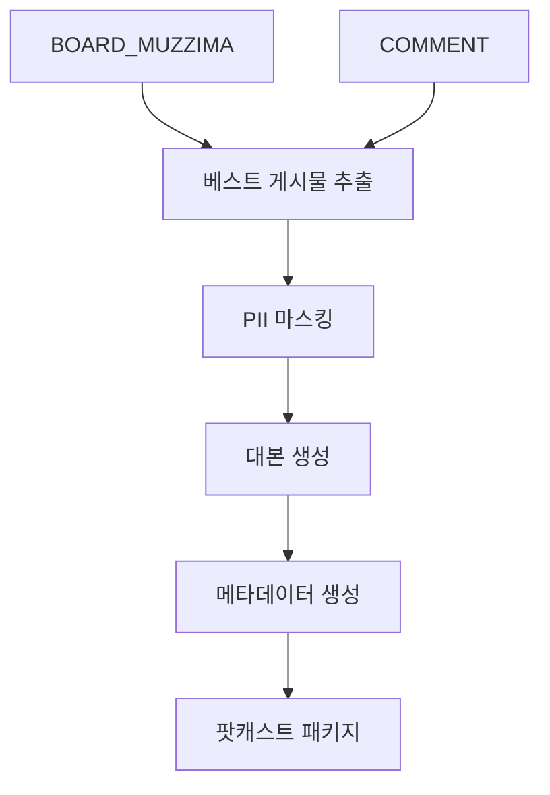

# IA.md - 정보 구조

## 페이지 계층 구조

```
Daily Podcast System
├── Data Collection Layer
│   ├── /api/v1/muzzima/daily-best (베스트 게시물 추출)
│   └── /api/v1/muzzima/sanitize (PII 마스킹)
├── Content Generation Layer  
│   ├── /api/v1/podcast/script (대본 생성)
│   └── /api/v1/podcast/metadata (메타데이터)
└── Delivery Layer
    └── /api/v1/podcast/daily (최종 팟캐스트 패키지)
```

## 라우팅 구조

| 경로 | 메서드 | 역할 |
|------|--------|------|
| `/api/v1/muzzima/daily-best` | GET | 24시간 내 베스트 게시물 5건 추출 |
| `/api/v1/muzzima/sanitize` | POST | PII 마스킹 처리 |
| `/api/v1/podcast/script` | POST | Host-Guest 대화형 대본 생성 |
| `/api/v1/podcast/metadata` | POST | TTS용 메타데이터 생성 |
| `/api/v1/podcast/daily` | GET | 통합 팟캐스트 패키지 조회 |

## 데이터 흐름

