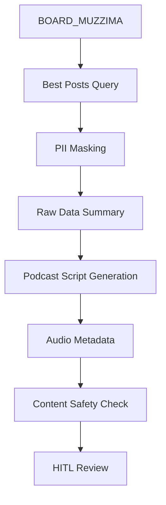

# IA.md - 정보 구조

## 1. 시스템 아키텍처

```
Daily Briefing System
├── Phase A: Analysis
│   ├── /analysis/best-posts (SQL 실행)
│   ├── /analysis/pii-masking (전처리)
│   └── /analysis/raw-data (데이터 요약)
└── Phase B: Content Generation
    ├── /generation/script (대본 생성)
    ├── /generation/metadata (TTS 메타데이터)
    └── /safety/content-check (안전성 검증)
```

## 2. 데이터 플로우



## 3. 페이지 계층 구조

- **백엔드 API만 필요** (Frontend UI 없음)
- 스케줄링: 매일 오전 7시 자동 실행
- 결과물: 파일 시스템 저장 (TTS 연동 준비)

## 4. 라우팅 설계

```yaml
endpoints:
  - path: /api/v1/daily-briefing/analyze
    method: POST
    description: Phase A - 데이터 분석 실행
    
  - path: /api/v1/daily-briefing/generate
    method: POST  
    description: Phase B - 팟캐스트 콘텐츠 생성
    
  - path: /api/v1/daily-briefing/status
    method: GET
    description: 생성 상태 조회
```