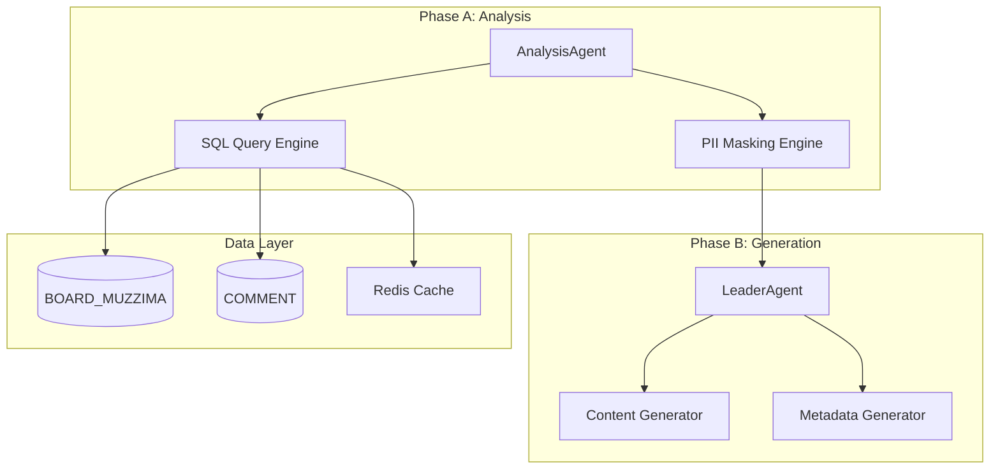

# SDD.md - 시스템 설계

## 1. 아키텍처 개요



## 2. 레거시 스키마 매핑

### BOARD_MUZZIMA 테이블 활용
```sql
-- PRD 요구사항: 최근 24시간 베스트 게시물 5건
SELECT 
    BOARD_IDX,
    TITLE,
    LEFT(CONTENT, 500) as SUMMARY_CONTENT,  -- 텍스트 양 제한
    AGREE_CNT,                              -- 조회수 대신 동의수 활용
    REG_DATE
FROM BOARD_MUZZIMA 
WHERE REG_DATE >= DATE_SUB(NOW(), INTERVAL 24 HOUR)
  AND DEL_FLAG = 'N'
  AND APPROVAL_FLAG = 'Y'
ORDER BY AGREE_CNT DESC, REG_DATE DESC
LIMIT 5;
```

### COMMENT 테이블 연동 (댓글수 집계)
```sql
-- 게시글별 댓글수 집계 (대용량 테이블 주의)
SELECT 
    b.BOARD_IDX,
    b.TITLE,
    b.AGREE_CNT,
    COALESCE(c.comment_count, 0) as COMMENT_COUNT
FROM BOARD_MUZZIMA b
LEFT JOIN (
    SELECT BOARD_IDX, COUNT(*) as comment_count 
    FROM COMMENT 
    WHERE SVC_CODE = 'MUZZIMA'
      AND DEL_FLAG = 'N'
    GROUP BY BOARD_IDX
) c ON b.BOARD_IDX = c.BOARD_IDX
WHERE b.REG_DATE >= DATE_SUB(NOW(), INTERVAL 24 HOUR);
```

## 3. API 설계

### 3.1 베스트 게시물 추출 API
```yaml
GET /api/v1/muzzima/daily-best
parameters:
  - name: hours
    type: integer
    default: 24
    description: 추출 시간 범위
response:
  type: object
  properties:
    success: boolean
    data:
      type: array
      items:
        properties:
          board_idx: integer
          title: string
          summary_content: string
          agree_cnt: integer
          comment_count: integer
          reg_date: string
```

### 3.2 PII 마스킹 API
```yaml
POST /api/v1/muzzima/sanitize
request:
  type: object
  properties:
    content: string
    title: string
response:
  type: object
  properties:
    sanitized_content: string
    sanitized_title: string
    pii_detected:
      type: array
      items:
        type: string
```

### 3.3 팟캐스트 대본 생성 API
```yaml
POST /api/v1/podcast/script
request:
  type: object
  properties:
    posts:
      type: array
      items:
        properties:
          title: string
          content: string
          engagement: integer
response:
  type: object
  properties:
    script: string
    estimated_duration: integer
    word_count: integer
```

## 4. 데이터 처리 파이프라인

### Phase A: 데이터 수집
1. **베스트 게시물 추출**
   - 인덱스 활용: (CTG_CODE, REG_DATE) 복합 인덱스 필수
   - 쿼리 최적화: LIMIT 5로 결과 제한
   - 캐싱: Redis에 1시간 캐시 적용

2. **PII 마스킹**
   - 환자 정보: "김○○ 환자" → "[환자]"
   - 의사 실명: "홍길동 원장" → "[동료의사]"
   - 병원명: "○○병원" → "[의료기관]"

### Phase B: 콘텐츠 생성
1. **대본 생성 규칙**
   ```
   Host: 인사 + 주요 트렌드 소개
   Guest: 구체적 내용 설명
   Host: 반응 + 다음 주제 연결
   Guest: 상세 분석
   Host: 마무리 + 다음 에피소드 예고
   ```

2. **메타데이터 생성**
   ```json
   {
     "emotion_tags": ["friendly", "professional"],
     "speech_rate": 1.2,
     "pause_duration": 0.5,
     "voice_style": {
       "host": "conversational",
       "guest": "informative"
     }
   }
   ```

## 5. 성능 최적화

### 데이터베이스 최적화
- **인덱스 활용**: (CTG_CODE, REG_DATE) 복합 인덱스 강제 사용
- **쿼리 제한**: SELECT * 절대 금지, 필요 컬럼만 명시
- **메모리 관리**: CONTENT 컬럼은 LEFT() 함수로 제한 조회

### 캐싱 전략
```
Redis Key Pattern:
- daily_best:{date} : 일간 베스트 게시물 (TTL: 1시간)
- pii_mask:{hash} : PII 마스킹 결과 (TTL: 24시간)
- podcast:{date} : 완성된 팟캐스트 (TTL: 7일)
```

## 6. 보안 고려사항

### PII 보호
- 환자 개인정보 완전 마스킹
- 의사 실명 익명화
- 의료기관명 일반화
- 마스킹 로그 별도 저장 (감사 목적)

### 접근 제어
- 관리자 권한 필요 API
- API 키 기반 인증
- 민감 데이터 접근 로깅

## 7. 모니터링 및 알림

### 성능 모니터링
- SQL 실행 시간: 3초 이하 목표
- API 응답 시간: 5초 이하 목표
- 캐시 히트율: 80% 이상 목표

### 오류 알림
- DB 쿼리 타임아웃
- PII 마스킹 실패
- 대본 생성 실패

## Risk
- **조회수 데이터 부재**: 분석 결과에 따르면 모든 게시글의 READ_CNT가 0으로 표시됨. 당분간 AGREE_CNT(동의수)를 기준으로 베스트 게시물 선정
- **대용량 테이블 성능**: COMMENT 테이블(1,826만 행)의 집계 쿼리 성능 이슈 가능성
- **PII 마스킹 정확도**: 자동 마스킹의 한계로 인한 누락 가능성