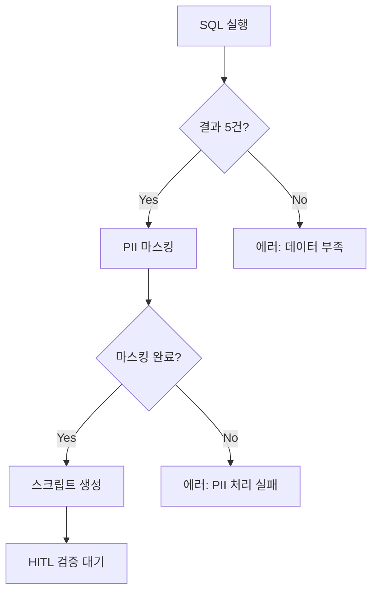

# Wireframe.md - 화면 설계

## 1. 시스템 개요

**주의**: 이 프로젝트는 **백엔드 API 전용**으로 Frontend UI가 없습니다.
결과물은 파일 형태로 저장되며, 향후 TTS 시스템과 연동됩니다.

## 2. 데이터 처리 컴포넌트

### Component A: Best Posts Analyzer
```
Input: BOARD_MUZZIMA 테이블
Process: 
- 24시간 내 게시물 필터링
- (READ_CNT + AGREE_CNT*3) 정렬
- 상위 5건 선택
Output: best_posts_raw.json
```

### Component B: PII Masker
```
Input: 원본 게시물 텍스트
Process:
- 환자명 패턴 감지 → ***님
- 의사 실명 → ***의사
- 병원명 → ***병원
- 연락처 → ***-****-****
Output: masked_content.json
```

### Component C: Script Generator
```
Input: 마스킹된 게시물 데이터
Process:
- 핵심 내용 요약 (400-550 단어)
- Host/Guest 대화 형식 변환
- 구어체 톤앤매너 적용
Output: Podcast_Script.md
```

## 3. 데이터 매핑

| Source Field | Processing | Output Field |
|-------------|------------|-------------|
| BOARD_MUZZIMA.TITLE | PII 마스킹 | script.topic |
| BOARD_MUZZIMA.CONTENT | 요약 + 구어체 변환 | script.dialogue |
| READ_CNT + AGREE_CNT*3 | 인기도 계산 | ranking_score |
| REG_DATE | 시간 필터링 | publication_time |

## 4. 파일 출력 구조

```
/output/daily-briefing/YYYY-MM-DD/
├── best_posts_query.sql          # Phase A
├── raw_data_summary.json         # Phase A
├── Podcast_Script.md             # Phase B
├── Audio_Metadata.json           # Phase B
└── Content_Safety_Check.md       # Phase B
```

## 5. 에러 핸들링 플로우

