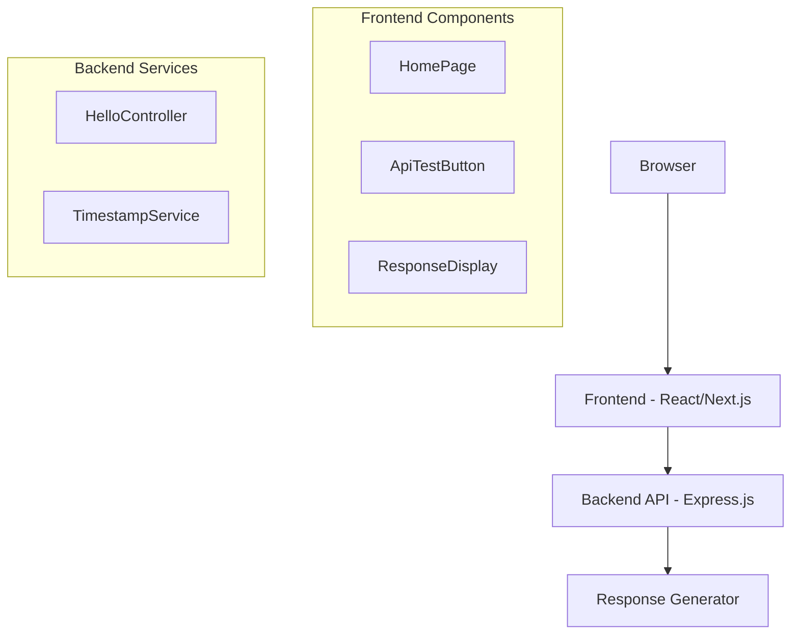

# SDD.md - 시스템 설계

## 1. 아키텍처 개요


## 2. 레거시 스키마 매핑
- **해당 사항 없음**: 이 기능은 단순 API로 데이터베이스 연동이 불필요
- **미래 확장성**: 향후 사용자 인사말 저장 시 `USERS` 테이블 활용 가능

## 3. API 설계

### GET /api/hello
```yaml
summary: Hello World 메시지 반환
responses:
  200:
    description: 성공
    content:
      application/json:
        schema:
          type: object
          properties:
            message:
              type: string
              example: "Hello, World!"
            timestamp:
              type: string
              format: date-time
              example: "2025-12-16T10:30:00Z"
            version:
              type: string
              example: "1.0.0"
```

## 4. 프론트엔드 설계

### 페이지 구조
```typescript
// pages/index.tsx
interface HomePageProps {
  initialMessage?: string;
}

// components/ApiTestButton.tsx
interface ApiTestButtonProps {
  onApiCall: (response: ApiResponse) => void;
  loading?: boolean;
}

// components/ResponseDisplay.tsx
interface ResponseDisplayProps {
  response: ApiResponse | null;
  loading: boolean;
  error?: string;
}
```

### 상태 관리
```typescript
interface AppState {
  apiResponse: ApiResponse | null;
  isLoading: boolean;
  error: string | null;
}
```

## 5. 백엔드 설계

### 컨트롤러 구조
```typescript
// controllers/helloController.ts
export class HelloController {
  async getHelloWorld(req: Request, res: Response): Promise<void>
}
```

### 서비스 레이어
```typescript
// services/helloService.ts
export class HelloService {
  generateMessage(): string
  getCurrentTimestamp(): string
  getVersion(): string
}
```

## 6. 에러 처리
- **Frontend**: API 호출 실패 시 사용자 친화적 메시지 표시
- **Backend**: 표준 HTTP 상태 코드 및 에러 메시지 반환

## 7. 성능 고려사항
- API 응답 시간: < 100ms 목표
- 번들 크기 최적화: 불필요한 라이브러리 제외
- 캐싱: API 응답은 캐싱하지 않음 (실시간 timestamp 표시 목적)

## 8. 보안 고려사항
- CORS 설정 필요
- Rate limiting 적용 (선택사항)
- 민감한 정보 노출 없음 확인