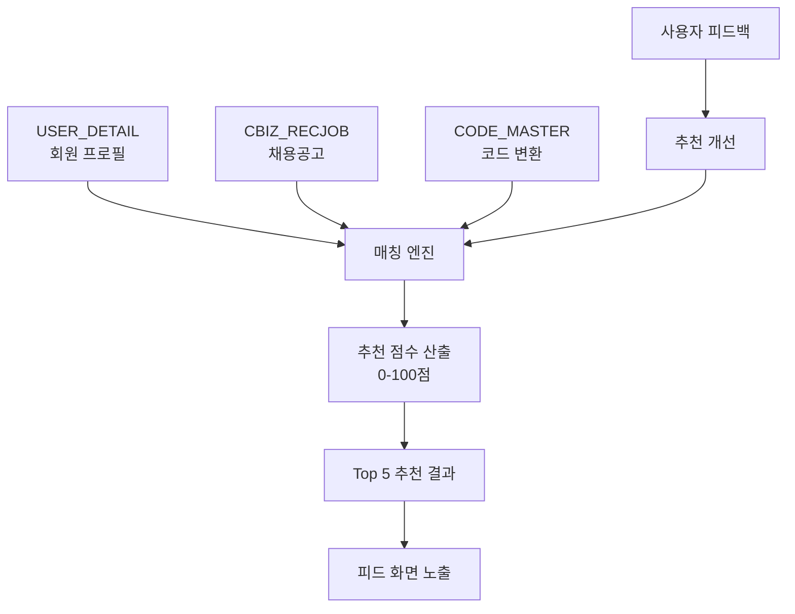

# IA.md - 채용추천 Agent 정보구조

> **문서 버전**: 1.0.0
> **생성일**: 2025-12-18
> **기반 PRD**: 채용추천 Agent v1.0.0

---

## 1. 서비스 정보 계층

```
채용추천 Agent
├── 1. 개인화 추천 피드 (Primary)
│   ├── 1-1. 추천 채용공고 목록 (Top 5)
│   ├── 1-2. 추천 이유 상세 ("왜 추천되었나요?")
│   └── 1-3. 추천 설정 관리
│
├── 2. 추천 성과 분석
│   ├── 2-1. 매칭 점수 분포
│   └── 2-2. 추천 정확도 피드백
│
└── 3. 알림 관리
    ├── 3-1. 신규 매칭 공고 알림
    └── 3-2. 알림 설정
```

## 2. 네비게이션 구조

### Primary Navigation
```
메인 > 채용정보 > 맞춤 추천
```

### Secondary Navigation
```
맞춤 추천
├── 추천공고 (Default)
├── 설정
└── 알림
```

## 3. 데이터 흐름 (Data Flow)



## 4. 정보 우선순위

| 레벨 | 정보 | 중요도 | 노출 위치 |
|------|------|--------|----------|
| L1 | 추천 채용공고 (Top 5) | Critical | 메인 피드 |
| L2 | 매칭 점수 + 추천 이유 | High | 카드 상세 |
| L3 | 알림 설정 | Medium | 설정 페이지 |
| L4 | 성과 분석 | Low | 분석 대시보드 |

## 5. 연관 서비스 연결점

| 기존 서비스 | 연결점 | 데이터 교환 |
|------------|--------|------------|
| 채용정보 목록 | "맞춤 추천" 탭 추가 | 공고 상세 링크 |
| 마이페이지 | 추천 설정 메뉴 | 프로필 정보 |
| 알림센터 | 매칭 알림 | 알림 이력 |
| 지원관리 | 추천→지원 전환 추적 | 전환율 데이터 |