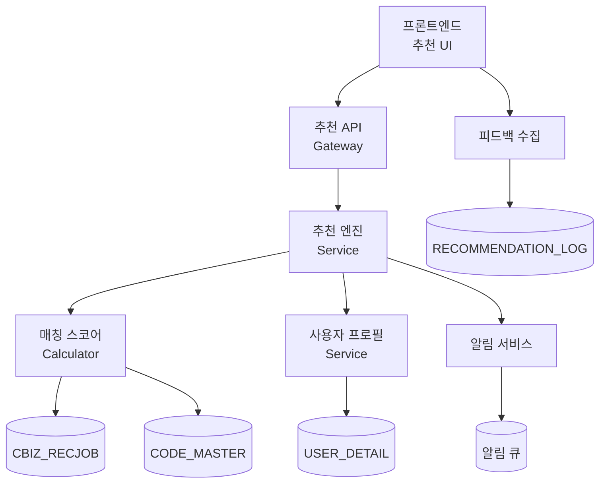
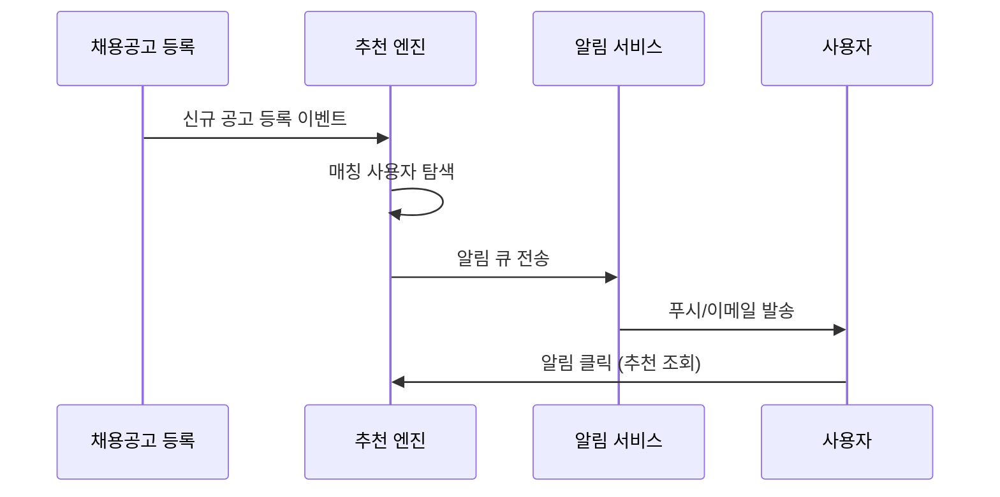

# SDD.md - 채용추천 Agent 시스템설계

> **문서 버전**: 1.0.0
> **생성일**: 2025-12-18
> **기반 문서**: PRD v1.0.0, IA.md, Wireframe.md

---

## 1. 아키텍처 개요



## 2. 레거시 스키마 매핑 (Legacy Mapping)

### 핵심 테이블 매핑

| 기능 | 레거시 테이블 | 주요 컬럼 | 제약사항 |
|------|--------------|-----------|----------|
| 회원 프로필 | `USER_DETAIL` | `U_MAJOR_CODE_1`, `U_WORK_TYPE_1`, `U_OFFICE_ZIP` | FK로 `USERS.U_ID` 연결 필수 |
| 채용공고 | `CBIZ_RECJOB` | `TITLE`, `INVITE_TYPE`, `MAJOR_CODE`, `WORK_AREA_CODE` | 활성 공고만: `APPROVAL_FLAG='Y'` |
| 코드 변환 | `CODE_MASTER` | `CODE_VALUE`, `CODE_NAME` | 다중 조건: `CODE_TYPE` IN ('MAJOR', 'WORK_TYPE') |
| 지원 이력 | `RECRUIT_APPLY` | `U_ID`, `RECRUIT_IDX`, `APPLY_DATE` | 전환율 계산용 |

### 매칭 로직 SQL 패턴

```sql
-- ⚠️ 실제 컬럼명 사용 (추측 금지)
SELECT 
    r.RECRUIT_IDX,
    r.TITLE,
    r.INVITE_TYPE,
    r.MAJOR_CODE,
    -- 매칭 점수 계산
    CASE 
        WHEN r.MAJOR_CODE = ud.U_MAJOR_CODE_1 THEN 40 
        ELSE 0 
    END +
    CASE 
        WHEN r.INVITE_TYPE = ud.U_WORK_TYPE_1 THEN 30 
        ELSE 0 
    END AS match_score
FROM CBIZ_RECJOB r
JOIN USER_DETAIL ud ON ud.U_ID = ?
WHERE r.APPROVAL_FLAG = 'Y'
  AND r.END_DATE >= NOW()
  AND r.DEL_FLAG = 'N'
ORDER BY match_score DESC
LIMIT 5;
```

## 3. API 설계

### 3.1 추천 공고 조회

```yaml
GET /api/v1/recommendations/{u_id}

Parameters:
  - u_id: string (USER.U_ID)
  - limit: integer (default: 5)

Response:
  recommendations:
    - recruit_idx: integer (CBIZ_RECJOB.RECRUIT_IDX)
      title: string
      hospital_name: string
      match_score: integer (0-100)
      match_reasons:
        - type: "major_match" | "work_type_match" | "location_match" | "new_post"
          description: string
      salary_min: integer
      area_name: string
      post_date: datetime

Error Cases:
  - 404: 사용자 프로필 없음 (USER_DETAIL 미존재)
  - 204: 매칭되는 공고 없음
```

### 3.2 추천 설정 관리

```yaml
PUT /api/v1/recommendations/{u_id}/settings

Request Body:
  preferred_major_codes: [string] # CODE_MASTER.CODE_VALUE
  preferred_work_types: [string]  # INVITE_TYPE
  preferred_areas: [string]       # CODE_LOC.ZIP_CODE  
  salary_min: integer
  salary_max: integer
  notification_enabled: boolean

Response:
  success: boolean
  updated_settings: object
```

### 3.3 피드백 수집

```yaml
POST /api/v1/recommendations/{u_id}/feedback

Request Body:
  recruit_idx: integer
  feedback_type: "helpful" | "not_helpful" | "comment"
  comment: string (optional)

Response:
  success: boolean
```

## 4. 추천 알고리즘 상세

### 4.1 매칭 점수 계산 로직

```python
def calculate_match_score(user_profile, job_posting):
    score = 0
    reasons = []
    
    # 1. 전문과목 매칭 (40점)
    if job_posting.major_code == user_profile.u_major_code_1:
        score += 40
        reasons.append("전문과목 일치")
    
    # 2. 근무형태 매칭 (30점) 
    if job_posting.invite_type == user_profile.u_work_type_1:
        score += 30
        reasons.append("근무형태 일치")
    
    # 3. 지역 근접성 (20점)
    location_score = calculate_location_proximity(
        user_profile.u_office_zip, 
        job_posting.work_area_code
    )
    score += location_score
    if location_score > 15:
        reasons.append("지역 선호")
    
    # 4. 신규공고 보너스 (10점)
    if job_posting.post_date >= (datetime.now() - timedelta(days=7)):
        score += 10
        reasons.append("신규공고")
    
    return score, reasons
```

### 4.2 지역 근접성 계산

| 조건 | 점수 | 설명 |
|------|------|------|
| 동일 구/시 | 20점 | 완전 일치 |
| 동일 시/도, 인접 구 | 15점 | 인근 지역 |
| 동일 시/도 | 10점 | 같은 광역시도 |
| 기타 | 5점 | 기본점수 |

## 5. 데이터 모델 변경사항

### 5.1 신규 테이블 생성

```sql
-- 추천 로그 테이블 (성과 측정용)
CREATE TABLE RECOMMENDATION_LOG (
    LOG_IDX INT AUTO_INCREMENT PRIMARY KEY,
    U_ID VARCHAR(14) NOT NULL,
    RECRUIT_IDX INT NOT NULL,
    MATCH_SCORE INT,
    RECOMMENDED_AT DATETIME DEFAULT NOW(),
    CLICKED_AT DATETIME NULL,
    APPLIED_AT DATETIME NULL,
    FEEDBACK VARCHAR(20) NULL,
    
    FOREIGN KEY (U_ID) REFERENCES USERS(U_ID),
    FOREIGN KEY (RECRUIT_IDX) REFERENCES CBIZ_RECJOB(RECRUIT_IDX),
    INDEX idx_user_recommend (U_ID, RECOMMENDED_AT)
);

-- 추천 설정 테이블
CREATE TABLE RECOMMENDATION_SETTINGS (
    U_ID VARCHAR(14) PRIMARY KEY,
    PREFERRED_MAJOR_CODES JSON,     -- ["SPC103", "SPC104"]
    PREFERRED_WORK_TYPES JSON,      -- ["INVITE_1", "INVITE_2"] 
    PREFERRED_AREAS JSON,           -- ["11000", "41000"]
    SALARY_MIN INT DEFAULT 0,
    SALARY_MAX INT DEFAULT 999999999,
    NOTIFICATION_ENABLED CHAR(1) DEFAULT 'Y',
    NOTIFICATION_TYPE VARCHAR(20) DEFAULT 'push,email',
    UPDATED_AT DATETIME DEFAULT NOW(),
    
    FOREIGN KEY (U_ID) REFERENCES USERS(U_ID)
);
```

### 5.2 기존 테이블 인덱스 추가

```sql
-- 추천 성능 향상을 위한 인덱스
ALTER TABLE CBIZ_RECJOB 
ADD INDEX idx_active_jobs (APPROVAL_FLAG, END_DATE, DEL_FLAG);

ALTER TABLE USER_DETAIL 
ADD INDEX idx_user_profile (U_MAJOR_CODE_1, U_WORK_TYPE_1);
```

## 6. 성능 고려사항

### 6.1 캐싱 전략

| 데이터 | 캐시 TTL | 무효화 조건 |
|--------|----------|------------|
| 사용자별 추천 결과 | 1시간 | 신규 공고 등록 시 |
| 코드 마스터 | 24시간 | 수동 업데이트 시 |
| 활성 채용공고 목록 | 30분 | 공고 상태 변경 시 |

### 6.2 쿼리 최적화

```sql
-- ❌ 비효율적 (Full Scan)
SELECT * FROM CBIZ_RECJOB WHERE END_DATE >= NOW();

-- ✅ 효율적 (Index 활용)
SELECT RECRUIT_IDX, TITLE, MAJOR_CODE, INVITE_TYPE 
FROM CBIZ_RECJOB 
WHERE APPROVAL_FLAG = 'Y' 
  AND END_DATE >= NOW() 
  AND DEL_FLAG = 'N'
ORDER BY REG_DATE DESC
LIMIT 100;
```

## 7. 보안 고려사항

### 7.1 개인정보 보호

- **API 접근 제한**: 본인 추천만 조회 가능 (`u_id` 검증)
- **로그 데이터 암호화**: 민감 정보는 해시 처리
- **추천 설정**: 개인정보 활용 동의 범위 내에서만 활용

### 7.2 추천 편향성 방지

- 특정 병원/지역 과도 추천 방지 로직
- 유료 공고 우대 금지 (공정성 확보)
- A/B 테스트를 통한 추천 품질 검증

## 8. 모니터링 지표

| 지표 | 계산 방식 | 목표값 |
|------|----------|--------|
| 추천 CTR | 클릭수 ÷ 추천 노출수 | 6% |
| 지원 전환율 | 지원수 ÷ 추천 클릭수 | 2.2% |
| API 응답속도 | 95 percentile | 500ms 이하 |
| 매칭 정확도 | 긍정 피드백 비율 | 70% |

## 9. 알림 시스템 연동

### 신규 매칭 공고 알림 플로우



## 10. 기존 시스템 연동 포인트

| 기존 시스템 | 연동 방식 | 데이터 흐름 |
|------------|----------|------------|
| 채용 목록 페이지 | 탭 추가 | 추천 API 호출 |
| 지원 관리 | 이벤트 연동 | 지원 시 로그 기록 |
| 마이페이지 | 메뉴 추가 | 추천 설정 관리 |
| 알림 센터 | 알림 타입 추가 | 매칭 알림 발송 |

---

## 관련 문서
- PRD: 채용추천 Agent v1.0.0
- DOMAIN_SCHEMA.md (레거시 스키마 참조)
- TDD_WORKFLOW.md (테스트 케이스 작성 시 참조)