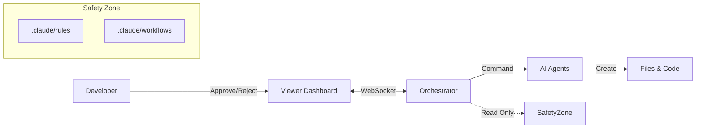

````markdown
# System B: Orchestrator & HITL Platform

> **AI 에이전트와 인간이 협업하는 Human-in-the-Loop 개발 플랫폼**

System B는 단순한 CLI 실행을 넘어, **실시간 대시보드(Viewer)**와 **승인 체크포인트(HITL)**를 통해 안전하고 통제 가능한 AI 개발 환경을 제공합니다.

---

## 📚 1. 시스템 구조 (Architecture)

### 3-Layer Operating Model

이 시스템은 다음 3가지 요소의 유기적 결합으로 작동합니다.

1.  **🤖 Orchestrator (Core Logic)**
    - `orchestrator.js` 기반의 중앙 제어 장치.
    - AI 에이전트(Leader, Sub, Analysis)를 조율하고 작업을 수행합니다.
2.  **👀 Viewer (Dashboard)**
    - `localhost:3000`에서 실행되는 웹 인터페이스.
    - 실시간 로그 확인, 산출물 검토, 승인/거부 버튼을 제공합니다.
3.  **🚦 HITL (Human-in-the-Loop)**
    - 중요한 의사결정 시점(설계, 배포 등)에 AI를 일시 정지시키고 사람의 개입을 요청합니다.


````

---

## 🚀 2. 시작하기 (Getting Started)

### 설치 (Installation)

```bash
cd orchestrator
npm install
```

### 실행 (Execution Flow)

System B를 사용하려면 **두 개의 터미널**이 필요합니다.

**Terminal 1: 뷰어 실행 (먼저 실행)**

```bash
npm run viewer
# 접속: http://localhost:3000
```

**Terminal 2: 오케스트레이터 실행**

```bash
# 기본 실행 (Interactive Mode)
node index.js

# 특정 작업 지정 실행
node index.js --task="로그인 페이지 구현해줘"
```

---

## 🚦 3. HITL 체크포인트 (Approval Points)

시스템은 다음 5가지 상황에서 **자동으로 멈추고 당신의 승인을 기다립니다.**

| #   | 체크포인트          | 트리거 조건                   | 당신의 역할 (Action)          |
| --- | ------------------- | ----------------------------- | ----------------------------- |
| 1   | **PRD_REVIEW**      | PRD 필수 항목 누락 시         | PRD 보완 후 재시작 승인       |
| 2   | **QUERY_REVIEW**    | 위험한 SQL(DELETE 등) 감지 시 | 쿼리 안전성 검토 및 승인      |
| 3   | **DESIGN_APPROVAL** | 설계 문서(SDD) 생성 직후      | 설계 방향성 검토 및 승인      |
| 4   | **MANUAL_FIX**      | Review 3회 연속 실패 시       | 사람이 직접 코드 수정 후 재개 |
| 5   | **DEPLOY_APPROVAL** | 모든 구현 완료 후             | 최종 산출물 확인 및 배포 승인 |

---

## 📂 4. 문서 및 파일 구조 (Directory Structure)

System B는 `SYSTEM_MANIFEST.md`에 정의된 **엄격한 폴더 구조**를 따릅니다.

### 4.1 시스템 룰북 (Immutable Rules)

이 경로의 파일들은 **AI가 수정할 수 없으며**, 프로젝트의 헌법과 같습니다.

| 그룹          | 경로                 | 주요 문서              | 역할                             |
| ------------- | -------------------- | ---------------------- | -------------------------------- |
| **Control**   | `.claude/`           | `SYSTEM_MANIFEST.md`   | 시스템 설정 및 파일 매핑 지도    |
| **Rules**     | `.claude/rules/`     | `CODE_STYLE.md`        | 코딩 컨벤션 및 네이밍 규칙       |
|               |                      | `DOMAIN_SCHEMA.md`     | **[중요]** DB 스키마 및 제약사항 |
|               |                      | `PROJECT_STACK.md`     | 기술 스택 정의                   |
| **Workflows** | `.claude/workflows/` | `DOCUMENT_PIPELINE.md` | 문서 생성 절차 (PRD→SDD)         |
|               |                      | `INCIDENT_PLAYBOOK.md` | 장애 대응 절차                   |
| **Context**   | `.claude/context/`   | `AI_Playbook.md`       | 팀의 철학 및 목표                |

### 4.2 오케스트레이터 내부 구조

```text
orchestrator/
├── index.js                # CLI 진입점
├── orchestrator.js         # 핵심 로직 (HITL 제어)
├── agents/                 # AI 에이전트 구현체 (Leader, Sub, Analysis)
├── state/
│   └── session-store.js    # 작업 상태 및 세션 관리
├── viewer/                 # 웹 대시보드 서버
└── logs/
    ├── .hitl/              # 승인 대기 파일 저장소
    └── {taskId}.json       # 태스크별 실행 로그
```

---

## 🛠️ 5. API 및 Viewer 연동

Viewer와 Orchestrator는 REST API와 WebSocket으로 통신합니다.

### 주요 API Endpoints

- `GET /api/sessions`: 활성 작업 목록 조회
- `GET /api/hitl/queue`: 승인 대기 중인 작업 조회
- `POST /api/tasks/:taskId/approve`: 작업 승인 (Resume)
- `POST /api/tasks/:taskId/reject`: 작업 거부 (Stop/Retry)

### 수동 조작 (Troubleshooting)

Viewer가 작동하지 않을 경우, CURL을 통해 직접 제어할 수 있습니다.

**승인(Approve) 예시:**

```bash
curl -X POST http://localhost:3000/api/tasks/{taskId}/approve \
-H "Content-Type: application/json" \
-d '{"comment": "터미널에서 수동 승인"}'
```

---

## 🔒 6. 보안 및 제약 사항 (Security Constraints)

1.  **룰북 수정 금지:** `.claude/{rules, workflows, context}/*` 경로는 읽기 전용(Read-Only)입니다.
2.  **데이터 보호:** 프로덕션 DB에 대한 `INSERT/UPDATE/DELETE` 쿼리는 차단됩니다.
3.  **경로 탐색 방지:** `taskId`나 파일 경로에 `../`를 포함할 수 없습니다.
4.  **토큰 제한:** PRD는 최대 50,000자, Task 설명은 10,000자로 제한됩니다.

---

## 🔌 7. Multi-LLM Provider (Fallback Chain)

### 7.1 Provider 구조

```text
orchestrator/providers/
├── base.js          # 추상 인터페이스
├── anthropic.js     # Claude API (Primary)
├── openai.js        # GPT-4 API (Fallback #1)
├── gemini.js        # Gemini API (Fallback #2)
├── factory.js       # Provider Factory + Fallback Chain
└── index.js         # 통합 내보내기
```

### 7.2 Fallback Chain

```
┌─────────────────────────────────────────────────────────────────────────────┐
│  Provider Fallback Chain                                                    │
├─────────────────────────────────────────────────────────────────────────────┤
│                                                                             │
│    ┌──────────────┐     FAIL     ┌──────────────┐     FAIL     ┌─────────┐ │
│    │   Claude     │ ──────────►  │   GPT-4o     │ ──────────►  │ Gemini  │ │
│    │  (Primary)   │              │ (Fallback 1) │              │ (FB 2)  │ │
│    │  Streaming   │              │  16K tokens  │              │         │ │
│    └──────────────┘              └──────────────┘              └─────────┘ │
│                                                                             │
│    환경변수:                                                                  │
│    • ANTHROPIC_API_KEY (Claude)                                             │
│    • OPENAI_API_KEY (GPT-4o)                                                │
│    • GOOGLE_API_KEY (Gemini)                                                │
│                                                                             │
└─────────────────────────────────────────────────────────────────────────────┘
```

### 7.3 Provider 설정

```javascript
const orchestrator = new Orchestrator({
  provider: "anthropic",
  fallbackOrder: ["anthropic", "openai", "gemini"],
  useFallback: true,
  providerConfig: {
    anthropic: { model: "claude-sonnet-4-20250514", useStreaming: true },
    openai: { model: "gpt-4o" },
    gemini: { model: "gemini-pro" },
  },
});
```

### 7.4 스트리밍 지원

| Provider      | 스트리밍     | 최대 출력 토큰  | 비고                                        |
| ------------- | ------------ | --------------- | ------------------------------------------- |
| **Anthropic** | ✅ 기본 활성 | 64,000          | 장시간 작업에 필수 (10분+ 시 타임아웃 방지) |
| **OpenAI**    | ❌ 미지원    | 16,384 (gpt-4o) | 모델별 토큰 제한 자동 적용                  |
| **Gemini**    | ❌ 미지원    | 8,192           | Fallback 용도                               |

---

## ⌨️ 8. CLI 사용법

### 8.1 기본 실행

```bash
# 기본 사용
node orchestrator/index.js "로그인 기능 구현"

# PRD 기반 구현
node orchestrator/index.js --prd docs/PRD.md "기능 구현"

# Dry-run (파일 저장 없이)
node orchestrator/index.js --no-save "테스트 작업"
```

### 8.2 옵션

| 옵션                | 설명             | 기본값             |
| ------------------- | ---------------- | ------------------ |
| `--prd <path>`      | PRD 파일 경로    | -                  |
| `--task-id <id>`    | 작업 ID 지정     | `task-{timestamp}` |
| `--no-save`         | 파일 저장 안 함  | false              |
| `--max-retries <n>` | 최대 재시도 횟수 | 3 (상한 5)         |

### 8.3 환경 설정

```bash
# orchestrator/.env
ANTHROPIC_API_KEY="sk-ant-..."
OPENAI_API_KEY="sk-..."           # Optional (Fallback)
GOOGLE_API_KEY="..."              # Optional (Fallback)

ANTHROPIC_MODEL="claude-sonnet-4-20250514"
MAX_RETRIES=3
```

---

## 📊 9. 메트릭 추적

Orchestrator는 다음 메트릭을 자동 추적합니다:

| 메트릭               | 설명                                     |
| -------------------- | ---------------------------------------- |
| **총 소요 시간**     | 전체 작업 완료까지 걸린 시간             |
| **단계별 소요 시간** | Planning, Coding, Review 각 단계         |
| **토큰 사용량**      | Role별 입력/출력 토큰                    |
| **재시도 횟수**      | Review FAIL로 인한 재시도                |
| **Provider 사용**    | 어떤 LLM Provider가 사용되었는지         |
| **보안 이벤트**      | Path Traversal, Prompt Injection 시도 등 |

### 9.1 로그 출력 경로

```text
workspace/logs/<task-id>.json          # 실행 메트릭
workspace/logs/audit/audit-*.jsonl     # 보안 감사 로그
```

---

## 🔄 10. 재시도 정책

| 상황                   | 동작                        |
| ---------------------- | --------------------------- |
| Review PASS            | 작업 완료                   |
| Review FAIL (1~4회)    | 피드백 반영 후 재시도       |
| Review FAIL (5회 초과) | 작업 중단, 사용자 개입 요청 |
| API 에러               | Fallback Provider 시도      |
| 모든 Provider 실패     | 에러 로그 기록, 작업 중단   |

---

## 🔌 11. Extension 경량화 Skills (Claude Code / VSCode)

System B의 Skills는 Orchestrator 외에도 **Claude Code Extension**에서 경량화된 형태로 실행할 수 있습니다.

### 11.1 Orchestrator vs Extension

| 구분 | Orchestrator | Extension |
|------|--------------|-----------|
| **경로** | `orchestrator/tools/{skill}/` | `.claude/skills/{skill}/` |
| **구성** | SKILL.md + index.js + resources/ | SKILL.md (단독) |
| **실행** | Node.js 코드 실행 | LLM 프롬프트 기반 |
| **용도** | 자동화 파이프라인, HITL | 대화형 작업, 빠른 반복 |

### 11.2 Extension Skills 목록

```text
.claude/skills/
├── leader/       # PRD → HANDOFF 생성
├── imleader/     # 산출물 품질 검증
├── designer/     # IA/Wireframe/SDD 설계
├── coder/        # 코드 구현
├── query/        # SQL 생성/분석
├── profiler/     # 세그먼트 분석
└── reviewer/     # PRD 정합성 검증
```

### 11.3 실행 예시: analysis 파이프라인

아래는 데이터 분석(analysis) 파이프라인을 Extension에서 순차적으로 실행하는 예시입니다.

---

**Step 0: PRD 파일 작성 및 저장**

`.claude/project/PRD.md` 또는 `docs/cases/{case-id}/PRD.md`에 PRD를 작성합니다.

---

**Step 1: PRD 분석 및 HANDOFF 생성**

```
/leader PRD.md 기반으로 HANDOFF.md 생성해줘
```

```
━━━━━━━━━━━━━━━━━━━━━━━━━━━━━━━━━━━━━━━━
📋 [Leader Skill Report]
✅ 파이프라인: analysis
✅ 포함 Skill: query, profiler
━━━━━━━━━━━━━━━━━━━━━━━━━━━━━━━━━━━━━━━━
```

---

**Step 2: SQL 쿼리 생성**

```
/query HANDOFF.md 기반으로 SQL 생성해줘
```

---

**Step 3: 프로필 분석**

```
/profiler 쿼리 결과 분석해줘
```

---

**Step 4: 품질 검증**

```
/reviewer 산출물 검증해줘
```

---

### 11.4 실행 예시: ui_mockup 파이프라인

아래는 설계→구현(ui_mockup) 파이프라인을 Extension에서 순차적으로 실행하는 예시입니다.
분석(Phase A) 없이 설계(Phase B) → 구현(Phase C)을 진행합니다.

---

**Step 0: PRD 파일 작성**

`.claude/project/PRD.md`에 PRD를 작성합니다. `pipeline: ui_mockup`을 명시합니다.

---

**Step 1: PRD 분석 및 HANDOFF 생성 (Leader)**

```
/leader PRD.md 기반으로 HANDOFF.md 생성해줘
```

```
━━━━━━━━━━━━━━━━━━━━━━━━━━━━━━━━━━━━━━━━
📋 [Leader Skill Report]
🔧 사용된 Skill: leader v1.0
📚 참조 문서: HANDOFF_PROTOCOL.md ✅ | PRD_GUIDE.md ✅
📥 입력: PRD.md
📤 출력: HANDOFF.md
━━━━━━━━━━━━━━━━━━━━━━━━━━━━━━━━━━━━━━━━
✅ 파이프라인: ui_mockup
✅ 포함 Skill: designer → coder
━━━━━━━━━━━━━━━━━━━━━━━━━━━━━━━━━━━━━━━━
```

---

**Step 2: 설계 문서 생성 (Designer)**

```
/designer HANDOFF.md 기반으로 IA.md, Wireframe.md, SDD.md 생성해줘
```

```
━━━━━━━━━━━━━━━━━━━━━━━━━━━━━━━━━━━━━━━━
📋 [Designer Skill Report]
🔧 사용된 Skill: designer v2.4
📚 참조 문서: IA_TEMPLATE.md ✅ | WF_TEMPLATE.md ✅ | SDD_TEMPLATE.md ✅
📥 입력: HANDOFF.md
📤 출력: IA.md, Wireframe.md, SDD.md
━━━━━━━━━━━━━━━━━━━━━━━━━━━━━━━━━━━━━━━━
✅ IA: 1개 화면 정의
✅ Wireframe: ASCII 레이아웃 포함
✅ SDD: 엔트리포인트 연결 섹션 포함
━━━━━━━━━━━━━━━━━━━━━━━━━━━━━━━━━━━━━━━━
```

> ⚠️ **SDD 필수**: 엔트리포인트 연결 섹션(섹션 5)이 반드시 포함되어야 합니다.

---

**Step 3: 코드 구현 (Coder)**

```
/coder SDD.md 기반으로 React 컴포넌트 구현해줘
```

```
━━━━━━━━━━━━━━━━━━━━━━━━━━━━━━━━━━━━━━━━
📋 [Coder Skill Report]
🔧 사용된 Skill: coder v1.5
📚 참조 문서: SDD.md ✅ | CODE_STYLE.md ✅
📥 입력: SDD.md
📤 출력: React 컴포넌트
━━━━━━━━━━━━━━━━━━━━━━━━━━━━━━━━━━━━━━━━
✅ 컴포넌트: SkillsDashboard.tsx
✅ 타입 정의: types.ts
✅ 엔트리포인트 연결: main.tsx 수정
━━━━━━━━━━━━━━━━━━━━━━━━━━━━━━━━━━━━━━━━
```

---

**Step 4: 동적 검증 (ImLeader)**

```
/imleader 코드 검증해줘 (빌드/엔트리포인트/구동)
```

```
━━━━━━━━━━━━━━━━━━━━━━━━━━━━━━━━━━━━━━━━
📋 [ImLeader Skill Report]
🔧 사용된 Skill: imleader v1.1
📥 입력: 코드 산출물
━━━━━━━━━━━━━━━━━━━━━━━━━━━━━━━━━━━━━━━━
✅ 빌드 테스트: npm run build PASS
✅ 엔트리포인트 연결: main.tsx import 확인
✅ 구동 테스트: npm run dev 렌더링 확인
━━━━━━━━━━━━━━━━━━━━━━━━━━━━━━━━━━━━━━━━
📊 동적 검증: PASS
━━━━━━━━━━━━━━━━━━━━━━━━━━━━━━━━━━━━━━━━
```

> ⚠️ **동적 검증 필수**: Phase C 완료 시 반드시 빌드/엔트리포인트/구동 테스트를 수행해야 합니다.

---

### 11.5 파이프라인별 Skill 순서

| 파이프라인 | Phase | Skill 순서 |
|------------|-------|------------|
| `analysis` | A만 | `/leader` → `/query` → `/profiler` → `/reviewer` |
| `design` | B만 | `/leader` → `/designer` → `/reviewer` |
| `code` | C만 | `/leader` → `/coder` → `/imleader` |
| `ui_mockup` | B→C | `/leader` → `/designer` → `/coder` → `/imleader` |
| `analyzed_design` | A→B | `/leader` → `/query` → `/profiler` → `/designer` → `/reviewer` |
| `full` | A→B→C | `/leader` → `/query` → `/profiler` → `/designer` → `/coder` → `/imleader` |

---

### 11.6 슬래시 커맨드 요약

| 커맨드 | 역할 | 입력 (파일 선택) | 출력 |
|--------|------|-----------------|------|
| `/leader` | PRD 분석 | PRD.md | HANDOFF.md |
| `/designer` | 설계 문서 | HANDOFF.md | IA.md, Wireframe.md, SDD.md |
| `/query` | SQL 생성 | HANDOFF.md | *.sql 파일들 |
| `/profiler` | 세그먼트 분석 | 쿼리 결과 | 프로필 리포트 |
| `/coder` | 코드 구현 | SDD.md | React 컴포넌트, 엔트리포인트 연결 |
| `/reviewer` | 품질 검증 | 산출물 폴더 | 검증 결과 |
| `/imleader` | 동적 검증 | 코드 산출물 | 빌드/엔트리포인트/구동 PASS/FAIL |

### 11.7 파일 구조 예시

**analysis 파이프라인**

```text
docs/cases/active-user-dashboard/
├── PRD.md              # Step 0: 사용자 작성
├── HANDOFF.md          # Step 1: /leader 생성
└── analysis/
    ├── analysis_report.md
    └── results/
        ├── active_doctors.sql
        ├── login_distribution.sql
        └── major_distribution.sql
```

**ui_mockup 파이프라인**

```text
docs/cases/260106-skills-pipeline-test/
├── PRD.md              # Step 0: 사용자 작성
├── HANDOFF.md          # Step 1: /leader 생성
├── IA.md               # Step 2: /designer 생성
├── Wireframe.md        # Step 2: /designer 생성
├── SDD.md              # Step 2: /designer 생성 (엔트리포인트 섹션 필수)
└── (코드는 frontend/src/features/{feature}/ 에 생성)

frontend/src/features/skills-dashboard/
├── SkillsDashboard.tsx # Step 3: /coder 생성
├── types.ts            # Step 3: /coder 생성
└── index.ts            # Step 3: /coder 생성

frontend/src/main.tsx   # Step 3: /coder 수정 (엔트리포인트 연결)
```

---

**System B Team**
_Quality is not an act, it is a habit._
