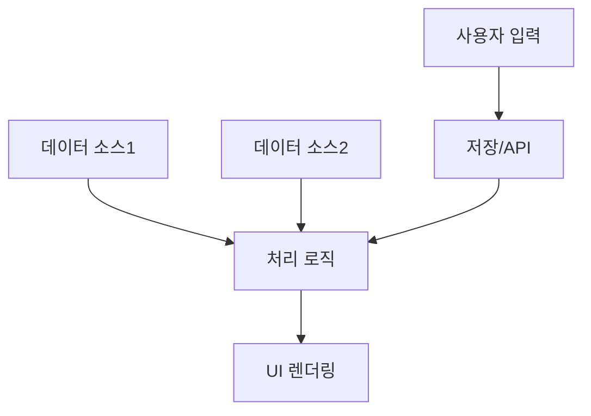

# IA Template

> DesignAgent가 참조하는 정보 구조(IA) 문서 템플릿

---

## 템플릿 구조

```markdown
# IA.md - [서비스명] 정보 구조

> **문서 버전**: 1.0.0
> **최종 업데이트**: YYYY-MM-DD
> **상위 문서**: PRD - [서비스명]

---

## 1. 서비스 정보 계층 구조

(트리 다이어그램으로 서비스의 전체 정보 계층을 표현)

```
[서비스명]
├── 1. 메인 섹션 A
│   ├── 1.1 하위 항목
│   ├── 1.2 하위 항목
│   └── 1.3 하위 항목
│
├── 2. 메인 섹션 B
│   ├── 2.1 하위 항목
│   └── 2.2 하위 항목
│
└── 3. 메인 섹션 C
    └── 3.1 하위 항목
```

---

## 2. 네비게이션 구조

### 2.1 진입점 (Entry Points)

| 위치 | 라우팅 | 설명 |
|------|--------|------|
| [위치1] | `/path1` | 설명1 |
| [위치2] | `/path2` | 설명2 |

### 2.2 페이지 라우팅

```
/base-path (메인)
├── /base-path/sub1 (서브1)
├── /base-path/sub2 (서브2)
└── /base-path/sub3/{id} (동적 라우팅)
```

---

## 3. 데이터 흐름 (Data Flow)

### 3.1 데이터 흐름도



### 3.2 실시간 데이터 소스

| 데이터 | 테이블/API | 업데이트 주기 |
|--------|----------|---------------|
| 데이터1 | `TABLE_NAME` | 실시간 |
| 데이터2 | `/api/endpoint` | 5분 |

---

## 4. 컨텐츠 구조

### 4.1 주요 정보 구성

```yaml
컨텐츠 구조:
  - 항목1 (필드명)
  - 항목2 (필드명)
  - 항목3 (필드명)
  - ...
```

### 4.2 정보 우선순위

| 우선순위 | 항목 | 가중치 |
|----------|------|--------|
| 1 | 핵심 정보 | 40% |
| 2 | 보조 정보 | 30% |
| 3 | 부가 정보 | 20% |
| 4 | 메타 정보 | 10% |

---

## 5. 상태 관리 (State Management)

### 5.1 상태 정의

```yaml
상태 목록:
  - STATE_A: 상태 A 설명
  - STATE_B: 상태 B 설명
  - STATE_C: 상태 C 설명
```

### 5.2 상태 전이 조건

| 현재 상태 | 이벤트 | 다음 상태 |
|----------|--------|----------|
| STATE_A | event1 | STATE_B |
| STATE_B | event2 | STATE_C |

---

## 6. 접근 권한 구조

| 권한 레벨 | 대상 | 접근 범위 |
|-----------|------|----------|
| 기본 | 모든 회원 | 조회 기능 |
| 프리미엄 | 유료 회원 | 전체 기능 |
| 관리자 | 운영팀 | 관리 기능 |

---

## 7. 모바일/반응형 고려사항

### 7.1 모바일 우선 설계
- 항목1
- 항목2

### 7.2 데스크톱 확장
- 항목1
- 항목2

---

**END OF IA.MD**
```

---

## 작성 가이드

### 필수 섹션
1. 서비스 정보 계층 구조 (반드시 트리 형태)
2. 네비게이션 구조 (진입점 + 라우팅)
3. 데이터 흐름 (소스 + 업데이트 주기)

### 선택 섹션
4. 컨텐츠 구조 (복잡한 정보 구조 시)
5. 상태 관리 (상태 전이가 있는 경우)
6. 접근 권한 (권한 분리 필요 시)
7. 반응형 고려 (모바일 대응 시)

### 품질 기준
- 모든 계층은 3단계 이내
- 라우팅은 RESTful 규칙 준수
- 데이터 소스는 실제 테이블/API 명시

---

**END OF TEMPLATE**
