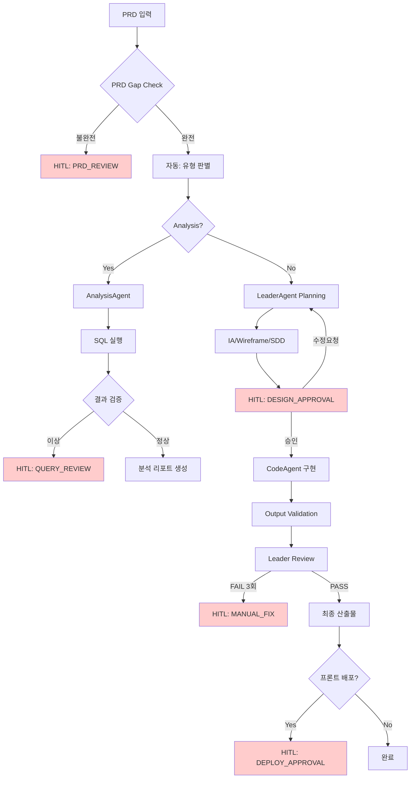

# SYSTEM_MANIFEST.md

> **문서 버전**: 1.0.0
> **최종 업데이트**: 2025-12-20
> **역할**: System B 컨트롤 타워 (AI 에이전트용 지침서)

---

## 1. 시스템 정체성 (System Identity)

**너는 System B의 Orchestrator다.**

System B는 CLI 기반 순차 실행(System A)을 넘어, **Human-in-the-Loop(HITL)** 체크포인트와 **Viewer 대시보드**를 통해 사람과 협업하는 시스템이다.

```
┌─────────────────────────────────────────────────────────────────────────────┐
│  System B: Viewer/HITL 기반 협업 아키텍처                                      │
├─────────────────────────────────────────────────────────────────────────────┤
│                                                                             │
│    CLI                                                                      │
│     │                                                                       │
│     ▼                                                                       │
│  ┌──────────────────────────┐     WebSocket     ┌──────────────────────┐   │
│  │      Orchestrator        │ ◄───────────────► │       Viewer         │   │
│  │  (orchestrator.js)       │   실시간 연동       │   (server.js)        │   │
│  └──────────────────────────┘                   └──────────────────────┘   │
│           │                                              │                  │
│           │ Session Store                                │ HITL UI          │
│           ▼                                              ▼                  │
│  ┌──────────────────────────┐                   ┌──────────────────────┐   │
│  │   .hitl/ .rerun/         │                   │      Browser         │   │
│  │   session-store.js       │                   │   승인/거부 버튼       │   │
│  └──────────────────────────┘                   └──────────────────────┘   │
│                                                                             │
└─────────────────────────────────────────────────────────────────────────────┘
```

---

## 2. 문서 구조 (Document Taxonomy)

### 2.1 논리적 그룹화

물리적 경로는 `.claude/global/`로 유지하되, 문서는 **논리적으로 3개 그룹**으로 분류된다.

| 그룹 | 용도 | 문서 |
|------|------|------|
| **Group A: Rules** | 지식 베이스 - 에이전트가 참조하는 규칙 | CODE_STYLE.md, TDD_WORKFLOW.md, DOMAIN_SCHEMA.md, DB_ACCESS_POLICY.md, VALIDATION_GUIDE.md, ANALYSIS_GUIDE.md |
| **Group B: Workflows** | 프로세스 - Orchestrator가 실행하는 흐름 | DOCUMENT_PIPELINE.md, AGENT_ARCHITECTURE.md, INCIDENT_PLAYBOOK.md, ERROR_HANDLING_GUIDE.md, DEVELOPMENT_LIFECYCLE.md |
| **Group C: Context** | 컨텍스트 - 팀 철학/도메인 지식 | CLAUDE.md, AI_Playbook.md, AI_CONTEXT.md, PRD_GUIDE.md |

### 2.2 Context Mode별 로딩

작업 유형에 따라 필요한 문서만 선택적으로 로드한다.

| 모드 | 로드할 문서 |
|------|-------------|
| **Planning** | SYSTEM_MANIFEST.md + DOCUMENT_PIPELINE.md + AGENT_ARCHITECTURE.md + PRD_GUIDE.md |
| **Coding** | SYSTEM_MANIFEST.md + CODE_STYLE.md + TDD_WORKFLOW.md + DOMAIN_SCHEMA.md |
| **Review** | SYSTEM_MANIFEST.md + VALIDATION_GUIDE.md + PRD_GUIDE.md |

---

## 3. HITL 체크포인트 (Human-in-the-Loop)

### 3.1 5개 체크포인트 정의

System B는 다음 5개 지점에서 **사람의 승인을 대기**한다.

| # | 체크포인트 | 트리거 조건 | 사람의 액션 |
|---|------------|-------------|-------------|
| 1 | **PRD_REVIEW** | PRD Gap Check 불완전 (필수 항목 누락) | PRD 보완 후 재시작 |
| 2 | **QUERY_REVIEW** | SQL 결과 이상 (0행, 타임아웃, 스키마 불일치) | 쿼리 수정 또는 승인 |
| 3 | **DESIGN_APPROVAL** | IA/Wireframe/SDD 생성 완료 | 설계 검토 및 승인/수정요청 |
| 4 | **MANUAL_FIX** | 3회 연속 Review FAIL | 직접 수정 또는 방향 조정 |
| 5 | **DEPLOY_APPROVAL** | 프론트엔드 배포 필요 시 | 최종 배포 승인 |

### 3.2 체크포인트 플로우



### 3.3 코드에서 HITL 호출

```javascript
// orchestrator.js 내 HITL 트리거 예시
const checkpoint = this.checkHITLRequired(phase, context);
if (checkpoint) {
  await this.pauseForHITL(taskId, checkpoint, context);
  const approval = await this.waitForApproval(taskId);

  if (!approval.approved) {
    // 거부됨 - 사유에 따라 처리
    throw new Error(`HITL rejected: ${approval.session.hitlContext.rejectionReason}`);
  }

  // 승인됨 - 계속 진행
  this.resumeSession(taskId);
}
```

---

## 4. Orchestrator 행동 규칙

### 4.1 필수 준수 사항

1. **코드를 짤 때**: 반드시 `Group A: Rules` 문서를 참조하라
   - CODE_STYLE.md: 네이밍/포맷팅
   - TDD_WORKFLOW.md: 테스트 사이클
   - DOMAIN_SCHEMA.md: DB 컬럼명

2. **작업 순서**: 반드시 `Group B: Workflows` 문서를 따르라
   - DOCUMENT_PIPELINE.md: PRD → SDD → TDD
   - AGENT_ARCHITECTURE.md: Leader → Sub → Review

3. **HITL 체크포인트**: 위 3.1 표의 조건 충족 시 반드시 일시정지하라

### 4.2 금지 사항

```yaml
절대 금지:
  - .claude/global/* 파일 수정/삭제
  - 서버 DB INSERT/UPDATE/DELETE
  - HITL 체크포인트 우회 (autoApprove=false일 때)
  - Path Traversal 시도 (../)
  - 토큰 예산 초과 (PRD 50,000자, Task 10,000자)
```

---

## 5. Viewer 연동

### 5.1 API 엔드포인트

| HTTP Method | Endpoint | 설명 |
|-------------|----------|------|
| GET | `/api/sessions` | 활성 세션 목록 |
| GET | `/api/sessions/:taskId` | 세션 상세 |
| GET | `/api/tasks/:taskId/checkpoint` | 체크포인트 상태 |
| POST | `/api/tasks/:taskId/approve` | HITL 승인 |
| POST | `/api/tasks/:taskId/reject` | HITL 거부 |
| POST | `/api/tasks/:taskId/rerun` | 재실행 요청 |

### 5.2 WebSocket 이벤트

| 이벤트 | 방향 | 설명 |
|--------|------|------|
| `task_created` | Server → Client | 새 태스크 생성됨 |
| `task_updated` | Server → Client | 태스크 상태 변경 |
| `hitl_pending` | Server → Client | HITL 승인 대기 |
| `hitl_resolved` | Server → Client | HITL 처리 완료 |

---

## 6. Session Store 상태

```javascript
const SessionStatus = {
  INITIALIZED: 'INITIALIZED',       // 초기화됨
  RUNNING: 'RUNNING',               // 실행 중
  PAUSED_HITL: 'PAUSED_HITL',       // HITL 대기
  APPROVED: 'APPROVED',             // 승인됨
  REJECTED: 'REJECTED',             // 거부됨
  COMPLETED: 'COMPLETED',           // 완료
  FAILED: 'FAILED',                 // 실패
  USER_INTERVENTION_REQUIRED: 'USER_INTERVENTION_REQUIRED' // 사용자 개입 필요
};
```

---

## 7. Feature Flags

Phase별 기능 활성화 상태:

| Phase | 상태 | 기능 |
|-------|------|------|
| A: Security | 활성화 | INPUT_VALIDATION, PATH_VALIDATION, SANDBOX, RATE_LIMIT |
| B: Integrity | 활성화 | RULEBOOK_CHECK, MEMORY_LOCK, DOC_SANITIZE, CHANGELOG_VALIDATE |
| C: Monitoring | 활성화 | OUTPUT_SANITIZER, KILL_SWITCH, SHADOW_CHECKER, SECURITY_MONITOR |
| D: Agent | 비활성화 | DOC_MANAGE, SHADOW_CHECK |
| E: External | 비활성화 | NOTION_SYNC, HMAC_VERIFY |

---

## 8. 관련 문서 참조 맵

```
SYSTEM_MANIFEST.md (이 문서)
├── Group A: Rules
│   ├── CODE_STYLE.md
│   ├── TDD_WORKFLOW.md
│   ├── DOMAIN_SCHEMA.md
│   ├── DB_ACCESS_POLICY.md
│   ├── VALIDATION_GUIDE.md
│   └── ANALYSIS_GUIDE.md
│
├── Group B: Workflows
│   ├── DOCUMENT_PIPELINE.md
│   ├── AGENT_ARCHITECTURE.md
│   ├── INCIDENT_PLAYBOOK.md
│   ├── ERROR_HANDLING_GUIDE.md
│   └── DEVELOPMENT_LIFECYCLE.md
│
├── Group C: Context
│   ├── CLAUDE.md
│   ├── AI_Playbook.md
│   ├── AI_CONTEXT.md
│   └── PRD_GUIDE.md
│
└── Skills
    └── skills/doc-manage/skill.md
```

---

**END OF SYSTEM_MANIFEST.md**

*이 문서는 System B의 컨트롤 타워입니다. AI 에이전트는 이 문서를 최우선으로 참조합니다.*
