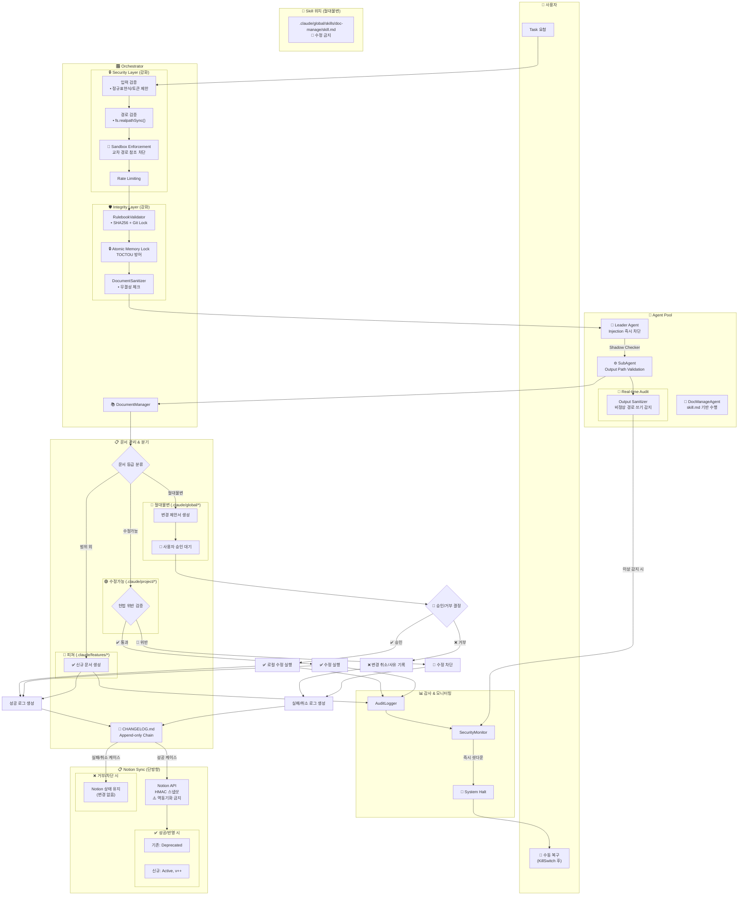

# DOCUMENT_MANAGER_ARCHITECTURE.md

> **문서 버전**: 1.0.0
> **최종 업데이트**: 2025-12-19
> **상위 문서**: CLAUDE.md
> **대상**: Orchestrator, Leader Agent, DocManageAgent

---

## 1. 개요

DocumentManager는 Orchestrator에 통합되어 문서 관리를 담당하는 핵심 모듈입니다.
DocManageAgent(skill.md 기반)가 실제 문서 작업을 수행하며, 레드팀 보안 검토를 거쳐 강화된 보안 레이어를 포함합니다.

---

## 2. 아키텍처 다이어그램



---

## 3. 문서 등급 분류

| 등급 | 경로 | 수정 조건 | 예시 |
|------|------|----------|------|
| 🔴 절대불변 | `.claude/global/*` | 사용자 승인 필수 | CLAUDE.md, DOMAIN_SCHEMA.md, skill.md |
| 🟢 수정가능 | `.claude/project/*` | 헌법(CLAUDE.md) 위반 검증 통과 | 프로젝트별 설정 |
| 🔵 피쳐 | `.claude/features/*` | 자유 생성 가능 | 새 기능 문서 |

---

## 4. 보안 레이어 (레드팀 검토 반영)

### 4.1 Security Layer

| 컴포넌트 | 역할 | 방어 대상 |
|---------|------|----------|
| Input Validation | 정규표현식 + 토큰 제한 | Prompt Injection |
| Path Validation | `fs.realpathSync()` 정규화 | Path Traversal |
| Sandbox Enforcement | 교차 경로 참조 차단 | 권한 상승 |
| Rate Limiting | 요청 빈도 제한 | DoS, 토큰 소진 |

### 4.2 Integrity Layer

| 컴포넌트 | 역할 | 방어 대상 |
|---------|------|----------|
| RulebookValidator | SHA256 해시 + Git Lock | 룰북 변조 |
| Atomic Memory Lock | 파일 잠금 후 작업 | TOCTOU 공격 |
| DocumentSanitizer | 무결성 체크 | 문서 변조 |

### 4.3 Monitoring Layer

| 컴포넌트 | 역할 | 트리거 |
|---------|------|--------|
| Output Sanitizer | 비정상 경로 쓰기 감지 | 실시간 |
| Shadow Checker | Leader→SubAgent 이중 검증 | 모든 작업 |
| AuditLogger | 모든 작업 로깅 | 모든 작업 |
| SecurityMonitor | 이상 징후 감지 | 실시간 |
| KillSwitch | 즉시 시스템 중단 | Critical 이상 |

---

## 5. CHANGELOG 형식

### 5.1 Append-only Chain 구조

```json
{
  "id": "CHG-20251219-001",
  "timestamp": "2025-12-19T14:30:00Z",
  "previousDigest": "sha256:abc123...",
  "currentDigest": "sha256:def456...",
  "entry": {
    "0_변경내용": "DOMAIN_SCHEMA.md에 USER_PROFILE 테이블 추가",
    "1_배경": "회원 프로필 기능 구현 요청",
    "2_목적": "사용자 프로필 데이터 스키마 정의",
    "3_목표": "DB 스키마와 문서 일치성 확보",
    "4_최종산출물": "DOMAIN_SCHEMA.md v2.1.0"
  },
  "result": "SUCCESS",
  "notionSync": {
    "oldVersion": { "id": "page-xxx", "status": "Deprecated" },
    "newVersion": { "id": "page-yyy", "status": "Active", "version": "2.1.0" }
  }
}
```

### 5.2 체인 무결성 검증

- `previousDigest`가 이전 항목의 `currentDigest`와 일치해야 함
- 체인 불일치 시 → SecurityMonitor 알림 → KillSwitch 가능

---

## 6. Notion 동기화 규칙

### 6.1 단방향 원칙

```
로컬 → Notion (O)
Notion → 로컬 (X) ⚠️ 역동기화 금지
```

### 6.2 버전 관리

| 상황 | 기존 문서 | 신규 문서 |
|------|----------|----------|
| 성공 (승인/통과) | `status: Deprecated` | `status: Active`, `version++` |
| 실패 (거부/차단) | 변경 없음 | 생성 안함 |

### 6.3 Active 유일성

- 동일 문서에 대해 `Active` 상태는 항상 1개만 존재
- 새 버전 Active 설정 전 기존 버전 Deprecated 처리 (원자적)

---

## 7. 워크플로우 상세

### 7.1 절대불변 문서 수정

```
1. Agent가 수정 필요 감지
2. 변경 제안서 생성 (diff 포함)
3. 사용자 승인 대기 (동기)
4. 승인 시:
   - Atomic Lock 획득
   - 로컬 수정 실행
   - CHANGELOG 기록 (SUCCESS)
   - Notion 동기화 (Deprecated/Active)
   - Lock 해제
5. 거부 시:
   - CHANGELOG 기록 (REJECTED, 사유 포함)
   - Notion 상태 유지
```

### 7.2 수정가능 문서 수정

```
1. Agent가 수정 요청
2. 헌법(CLAUDE.md) 위반 검증
3. 통과 시:
   - 수정 실행
   - CHANGELOG 기록 (SUCCESS)
   - Notion 동기화
4. 위반 시:
   - 수정 차단
   - CHANGELOG 기록 (BLOCKED, 위반 항목 명시)
   - Notion 상태 유지
```

### 7.3 피쳐 문서 생성

```
1. Agent가 신규 문서 생성
2. 경로 검증 (.claude/features/* 내부인지)
3. 문서 생성
4. CHANGELOG 기록 (CREATED)
5. Notion 동기화 (신규 Active)
```

---

## 8. 파일 구조

```
orchestrator/
├── utils/
│   ├── document-manager.js    # DocumentManager 클래스 (원자적 잠금 포함)
│   ├── rulebook-validator.js  # 룰북 검증
│   ├── handoff-validator.js   # 핸드오프 검증
│   ├── audit-logger.js        # 감사 로깅
│   ├── env-protector.js       # 환경변수 보호
│   ├── notion-sync.js         # Notion 동기화
│   └── index.js               # 통합 내보내기
├── security/
│   ├── input-validator.js     # 입력 검증
│   ├── path-validator.js      # 경로 검증
│   ├── sandbox.js             # 샌드박스 강제
│   ├── rate-limiter.js        # 요청 제한
│   ├── output-sanitizer.js    # 출력 검증
│   ├── kill-switch.js         # 긴급 중단
│   ├── security-monitor.js    # 보안 모니터
│   └── index.js               # 통합 내보내기
├── config/
│   └── feature-flags.js       # 피쳐 플래그
├── agents/
│   ├── leader.js              # Leader Agent
│   ├── subagent.js            # SubAgent
│   └── ...                    # 기타 Agent
└── logs/
    └── audit.log              # 감사 로그

.claude/
├── global/
│   ├── skills/
│   │   └── doc-manage/
│   │       └── skill.md       # DocManageAgent 스킬 (🔴 절대불변)
│   └── *.md                   # 기타 룰북 (🔴 절대불변)
├── project/
│   └── *.md                   # 프로젝트 문서 (🟢 수정가능)
├── features/
│   └── *.md                   # 피쳐 문서 (🔵 자유)
├── CHANGELOG.md               # 변경 이력 (Append-only)
└── .locks/
    └── *.lock                 # 파일 잠금
```

---

## 9. 구현 우선순위

| 순서 | 항목 | 파일 |
|------|------|------|
| 1 | DocumentManager 기본 구조 | `utils/document-manager.js` |
| 2 | Path Validation | `security/path-validator.js` |
| 3 | Atomic Memory Lock | `utils/document-manager.js` (acquireLock/releaseLock) |
| 4 | CHANGELOG 기록 | `utils/document-manager.js` |
| 5 | DocManageAgent Skill | `.claude/global/skills/doc-manage/skill.md` |
| 6 | Notion 동기화 | `utils/notion-sync.js` |
| 7 | KillSwitch | `security/kill-switch.js` |
| 8 | Output Sanitizer | `security/output-sanitizer.js` |

---

## 10. 관련 문서

| 문서 | 역할 |
|------|------|
| CLAUDE.md | 팀 헌법, Safety Rules |
| ERROR_HANDLING_GUIDE.md | 장애 대응 절차 |
| AGENT_ARCHITECTURE.md | Agent 역할 정의 |
| QUALITY_GATES.md | 품질 검증 기준 |

---

## 11. 스캐폴딩 전략

### 11.1 MVP 정의

**MVP (Minimum Viable Product)**: 최소 동작 버전

```
MVP 범위:
├── DocumentManager 핵심 기능 ✅
│   ├── classifyDocument() - 문서 등급 분류
│   ├── acquireLock() / releaseLock() - 원자적 잠금
│   └── appendChangelog() - CHANGELOG 기록
│
├── 스텁 처리 (Phase 1+ 에서 실제 구현):
│   ├── Security Layer → 로깅만 (차단 안함)
│   ├── KillSwitch → console.error만 (실제 중단 안함)
│   ├── Notion Sync → 로컬만 (API 미호출)
│   └── Shadow Checker → 항상 통과
│
└── MVP 검증 기준:
    ├── 문서 등급 분류 정상 동작
    ├── 절대불변 문서 수정 시 승인 대기
    ├── CHANGELOG 엔트리 정상 기록
    └── Lock 획득/해제 정상 동작
```

### 11.2 피쳐 플래그

**위치**: `orchestrator/config/feature-flags.js`

```javascript
export const FEATURES = {
  // ===== Phase A: Security Layer =====
  SECURITY_INPUT_VALIDATION: false,    // 입력 검증 활성화
  SECURITY_PATH_VALIDATION: false,     // 경로 검증 활성화
  SECURITY_SANDBOX: false,             // 샌드박스 강제
  SECURITY_RATE_LIMIT: false,          // 요청 빈도 제한

  // ===== Phase B: Integrity Layer =====
  INTEGRITY_RULEBOOK_CHECK: true,      // 룰북 해시 검증 (기존)
  INTEGRITY_MEMORY_LOCK: true,         // 원자적 잠금 (구현됨)
  INTEGRITY_DOC_SANITIZE: false,       // 문서 새니타이징
  INTEGRITY_CHANGELOG_VALIDATE: false, // CHANGELOG 입력 검증

  // ===== Phase C: Monitoring Layer =====
  MONITORING_OUTPUT_SANITIZER: false,  // 출력 경로 검증
  MONITORING_KILL_SWITCH: false,       // 긴급 중단
  MONITORING_SHADOW_CHECKER: false,    // Leader→Sub 이중 검증
  MONITORING_SECURITY_MONITOR: false,  // 통합 모니터

  // ===== Phase D: Agent Integration =====
  AGENT_DOC_MANAGE: false,             // DocManageAgent 활성화
  AGENT_SHADOW_CHECK: false,           // Shadow Checker 연동

  // ===== Phase E: External =====
  NOTION_SYNC_ENABLED: false,          // Notion 동기화
  NOTION_HMAC_VERIFY: false,           // HMAC 스냅샷 검증
};

// 피쳐 활성화 헬퍼
export function isEnabled(feature) {
  return FEATURES[feature] === true;
}

// Phase별 일괄 활성화
export function enablePhase(phase) {
  const phaseMap = {
    A: ['SECURITY_INPUT_VALIDATION', 'SECURITY_PATH_VALIDATION', 'SECURITY_SANDBOX', 'SECURITY_RATE_LIMIT'],
    B: ['INTEGRITY_DOC_SANITIZE', 'INTEGRITY_CHANGELOG_VALIDATE'],
    C: ['MONITORING_OUTPUT_SANITIZER', 'MONITORING_KILL_SWITCH', 'MONITORING_SHADOW_CHECKER', 'MONITORING_SECURITY_MONITOR'],
    D: ['AGENT_DOC_MANAGE', 'AGENT_SHADOW_CHECK'],
    E: ['NOTION_SYNC_ENABLED', 'NOTION_HMAC_VERIFY'],
  };
  phaseMap[phase]?.forEach(f => FEATURES[f] = true);
}
```

### 11.3 스텁 인터페이스

각 컴포넌트는 피쳐 플래그가 `false`일 때 스텁으로 동작:

| 컴포넌트 | 스텁 동작 | 실제 동작 (활성화 시) |
|---------|----------|---------------------|
| InputValidator | 항상 통과 + 로그 | 패턴 검사 후 차단 |
| PathValidator | 항상 통과 + 로그 | realpathSync 검증 |
| Sandbox | 항상 통과 + 로그 | 교차 경로 차단 |
| RateLimiter | 항상 통과 + 로그 | 요청 제한 적용 |
| KillSwitch | console.error만 | process.exit(1) |
| OutputSanitizer | 항상 통과 + 로그 | 경로 검증 후 차단 |
| ShadowChecker | 항상 통과 | Leader 재검증 |
| NotionSync | 로컬만 저장 | API 호출 |

**스텁 구현 패턴**:

```javascript
// 예시: security/kill-switch.js
import { isEnabled } from '../config/feature-flags.js';
import { getAuditLogger } from '../utils/audit-logger.js';

export class KillSwitch {
  static halt(reason, context = {}) {
    const logger = getAuditLogger();

    if (!isEnabled('MONITORING_KILL_SWITCH')) {
      // 스텁 모드: 로깅만
      logger.warn('KILLSWITCH_STUB', `[STUB] Would halt: ${reason}`, context);
      return { halted: false, stub: true, reason };
    }

    // 실제 모드: 시스템 중단
    logger.security('KILLSWITCH_HALT', `System halt: ${reason}`, context);
    process.exit(1);
  }
}
```

### 11.4 단계별 테스트 계획

| Phase | 테스트 유형 | 검증 항목 | 파일 위치 |
|-------|-----------|----------|----------|
| **0 (MVP)** | 단위 테스트 | DocumentManager 핵심 기능 | `tests/unit/document-manager.test.js` |
| **A** | 단위 테스트 | Security Layer 각 컴포넌트 | `tests/unit/security/*.test.js` |
| **B** | 통합 테스트 | Integrity 검증 흐름 | `tests/integration/integrity.test.js` |
| **C** | 시나리오 테스트 | 이상 감지 → KillSwitch | `tests/scenario/monitoring.test.js` |
| **D** | 통합 테스트 | Agent 간 협업 | `tests/integration/agents.test.js` |
| **E** | E2E 테스트 | Notion 동기화 전체 | `tests/e2e/notion-sync.test.js` |

**테스트 실행 순서**:

```bash
# Phase 0: MVP 검증
npm run test:unit -- document-manager

# Phase A: Security Layer
npm run test:unit -- security/
FEATURES_PHASE=A npm run test:integration

# Phase B~E: 순차 검증
FEATURES_PHASE=B npm run test:integration
FEATURES_PHASE=C npm run test:scenario
FEATURES_PHASE=D npm run test:integration
FEATURES_PHASE=E npm run test:e2e
```

### 11.5 롤백 전략

**Phase별 롤백 방법**:

| Phase | 롤백 트리거 | 롤백 방법 | 영향 범위 |
|-------|-----------|----------|----------|
| A | Security 오탐 다수 | 피쳐 플래그 false | 검증 비활성화 |
| B | Lock 데드락 | Lock 파일 삭제 + 플래그 false | 잠금 해제 |
| C | KillSwitch 오작동 | 플래그 false + 프로세스 재시작 | 모니터링 비활성화 |
| D | Agent 오동작 | skill-loader 롤백 | Agent 격리 |
| E | Notion API 장애 | 플래그 false | 로컬만 동작 |

**긴급 롤백 스크립트**:

```bash
#!/bin/bash
# scripts/emergency-rollback.sh

PHASE=$1

case $PHASE in
  A) sed -i 's/SECURITY_.*: true/SECURITY_.*: false/g' config/feature-flags.js ;;
  B) rm -f .claude/.locks/*.lock && sed -i 's/INTEGRITY_.*: true/INTEGRITY_.*: false/g' config/feature-flags.js ;;
  C) sed -i 's/MONITORING_.*: true/MONITORING_.*: false/g' config/feature-flags.js ;;
  D) sed -i 's/AGENT_.*: true/AGENT_.*: false/g' config/feature-flags.js ;;
  E) sed -i 's/NOTION_.*: true/NOTION_.*: false/g' config/feature-flags.js ;;
  ALL) cp config/feature-flags.js.backup config/feature-flags.js ;;
esac

echo "Rollback Phase $PHASE complete. Restart orchestrator."
```

**롤백 후 체크리스트**:

1. 피쳐 플래그 상태 확인
2. Lock 파일 정리 (`rm .claude/.locks/*.lock`)
3. CHANGELOG 무결성 검증 (`verifyChangelogIntegrity()`)
4. Orchestrator 재시작
5. 스텁 모드 동작 확인

---

**END OF DOCUMENT_MANAGER_ARCHITECTURE.md**

*이 문서는 구현 전 설계 기준으로, 구현 중 참조하며 필요 시 업데이트합니다.*
