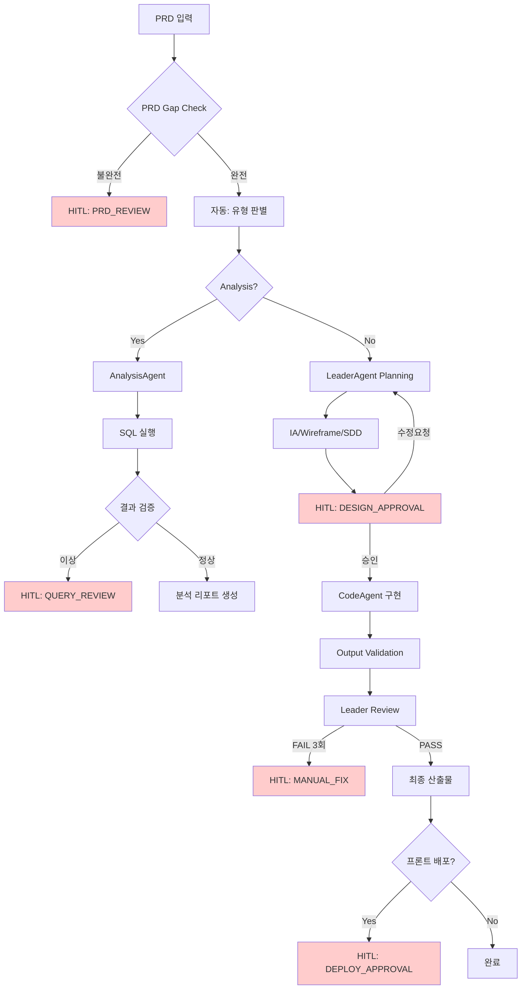

# System B - Orchestrator 사용 가이드

## 1. System B 개요

System B는 **CLI 기반 순차 실행(System A)**을 넘어, **Human-in-the-Loop(HITL)** 체크포인트와 **Viewer 대시보드**를 통해 사람과 협업하는 시스템입니다.

```
┌─────────────────────────────────────────────────────────────────────────────┐
│  System B: Viewer/HITL 기반 협업 아키텍처                                      │
├─────────────────────────────────────────────────────────────────────────────┤
│                                                                             │
│    CLI                                                                      │
│     │                                                                       │
│     ▼                                                                       │
│  ┌──────────────────────────┐     WebSocket     ┌──────────────────────┐   │
│  │      Orchestrator        │ ◄───────────────► │       Viewer         │   │
│  │  (orchestrator.js)       │   실시간 연동       │   (server.js)        │   │
│  └──────────────────────────┘                   └──────────────────────┘   │
│           │                                              │                  │
│           │ Session Store                                │ HITL UI          │
│           ▼                                              ▼                  │
│  ┌──────────────────────────┐                   ┌──────────────────────┐   │
│  │   .hitl/ .rerun/         │                   │      Browser         │   │
│  │   session-store.js       │                   │   승인/거부 버튼       │   │
│  └──────────────────────────┘                   └──────────────────────┘   │
│                                                                             │
└─────────────────────────────────────────────────────────────────────────────┘
```

**주요 특징:**
- **Viewer 대시보드**: 웹 UI를 통한 실시간 작업 모니터링
- **HITL 체크포인트**: 5개 지점에서 사람의 승인 대기
- **Session Store**: 작업 상태 관리 및 재실행 지원
- **WebSocket 연동**: 실시간 알림 및 업데이트

---

## 2. 설치 및 실행

### 2.1 설치

```bash
cd orchestrator
npm install
```

### 2.2 Viewer 서버 시작

```bash
npm run viewer
```

**접속:**
- HTTP: `http://localhost:3000`
- WebSocket: `ws://localhost:3000`

### 2.3 Orchestrator 실행 (CLI)

```bash
node index.js
```

---

## 3. HITL 체크포인트 (5개)

System B는 다음 5개 지점에서 **사람의 승인을 대기**합니다.

| # | 체크포인트 | 트리거 조건 | 사람의 액션 |
|---|------------|-------------|-------------|
| 1 | **PRD_REVIEW** | PRD Gap Check 불완전 (필수 항목 누락) | PRD 보완 후 재시작 |
| 2 | **QUERY_REVIEW** | SQL 결과 이상 (0행, 타임아웃, 스키마 불일치) | 쿼리 수정 또는 승인 |
| 3 | **DESIGN_APPROVAL** | IA/Wireframe/SDD 생성 완료 | 설계 검토 및 승인/수정요청 |
| 4 | **MANUAL_FIX** | 3회 연속 Review FAIL | 직접 수정 또는 방향 조정 |
| 5 | **DEPLOY_APPROVAL** | 프론트엔드 배포 필요 시 | 최종 배포 승인 |

### HITL 체크포인트 플로우



---

## 4. API 엔드포인트

### 4.1 Session API

| HTTP Method | Endpoint | 설명 |
|-------------|----------|------|
| GET | `/api/sessions` | 활성 세션 목록 |
| GET | `/api/sessions/:taskId` | 세션 상세 |
| GET | `/api/tasks/:taskId/checkpoint` | 체크포인트 상태 |

### 4.2 HITL API

| HTTP Method | Endpoint | 설명 |
|-------------|----------|------|
| GET | `/api/hitl/queue` | HITL 대기열 조회 |
| POST | `/api/tasks/:taskId/approve` | HITL 승인 |
| POST | `/api/tasks/:taskId/reject` | HITL 거부 |
| POST | `/api/tasks/:taskId/rerun` | 재실행 요청 |
| POST | `/api/tasks/:taskId/feedback` | 피드백 제출 |

**승인 예시:**
```bash
curl -X POST http://localhost:3000/api/tasks/{taskId}/approve \
  -H "Content-Type: application/json" \
  -d '{"comment": "승인합니다"}'
```

**거부 예시:**
```bash
curl -X POST http://localhost:3000/api/tasks/{taskId}/reject \
  -H "Content-Type: application/json" \
  -d '{"reason": "PRD 수정 필요"}'
```

### 4.3 Logs API

| HTTP Method | Endpoint | 설명 |
|-------------|----------|------|
| GET | `/api/logs` | 로그 목록 |
| GET | `/api/logs/:taskId` | 로그 상세 |
| GET | `/api/running` | 실행 중인 태스크 |

### 4.4 Files & Docs API

| HTTP Method | Endpoint | 설명 |
|-------------|----------|------|
| GET | `/api/files` | 생성된 파일 목록 |
| GET | `/api/file?path={path}` | 파일 내용 |
| GET | `/api/docs/:taskId` | 문서 목록 |
| GET | `/api/docs/:taskId/:filename` | 문서 내용 |

### 4.5 WebSocket 이벤트

| 이벤트 | 방향 | 설명 |
|--------|------|------|
| `connected` | Server → Client | 연결 성공 |
| `running_status` | Server → Client | 실행 중 상태 업데이트 |
| `task_created` | Server → Client | 새 태스크 생성됨 |
| `task_updated` | Server → Client | 태스크 상태 변경 |
| `hitl_pending` | Server → Client | HITL 승인 대기 |
| `hitl_resolved` | Server → Client | HITL 처리 완료 |
| `rerun_queued` | Server → Client | 재실행 큐 등록 |
| `rerun_started` | Server → Client | 재실행 시작 |
| `rerun_completed` | Server → Client | 재실행 완료 |
| `rerun_failed` | Server → Client | 재실행 실패 |

---

## 5. 파일 구조

```
orchestrator/
├── README.md                    # 이 파일
├── package.json                 # 의존성 관리
├── index.js                     # CLI 엔트리포인트
├── orchestrator.js              # 핵심 Orchestrator 로직
│
├── agents/                      # AI 에이전트
│   ├── LeaderAgent.js
│   ├── AnalysisAgent.js
│   └── CodeAgent.js
│
├── state/                       # 상태 관리
│   ├── session-store.js         # 세션 저장소 (HITL 지원)
│   └── sessions/                # 세션 파일 저장
│
├── viewer/                      # Viewer 대시보드
│   ├── server.js                # Express + WebSocket 서버
│   └── dist/                    # 빌드된 프론트엔드 (선택)
│
├── logs/                        # 로그 디렉토리
│   ├── .running.json            # 현재 실행 중인 태스크
│   ├── .hitl/                   # HITL 승인 대기 파일
│   ├── .rerun/                  # 재실행 요청 파일
│   ├── .feedback/               # 피드백 파일
│   └── {taskId}.json            # 태스크별 로그
│
├── config/                      # 설정 파일
│   ├── constants.js
│   └── feature-flags.js
│
├── security/                    # 보안 검증
│   ├── input-validator.js
│   └── path-validator.js
│
├── utils/                       # 유틸리티
│   ├── logger.js
│   └── token-counter.js
│
├── providers/                   # 외부 연동
│   ├── AnthropicProvider.js
│   └── NotionProvider.js
│
├── skills/                      # 스킬 기반 기능
│   └── doc-manage/
│
└── tests/                       # 테스트
    ├── unit/
    └── integration/
```

---

## 6. Session Store 상태

세션은 다음 상태 중 하나를 가집니다.

```javascript
const SessionStatus = {
  INITIALIZED: 'INITIALIZED',       // 초기화됨
  RUNNING: 'RUNNING',               // 실행 중
  PAUSED_HITL: 'PAUSED_HITL',       // HITL 대기
  APPROVED: 'APPROVED',             // 승인됨
  REJECTED: 'REJECTED',             // 거부됨
  COMPLETED: 'COMPLETED',           // 완료
  FAILED: 'FAILED',                 // 실패
  USER_INTERVENTION_REQUIRED: 'USER_INTERVENTION_REQUIRED' // 사용자 개입 필요
};
```

**세션 조회 예시:**
```javascript
import { sessionStore } from './state/session-store.js';

// 활성 세션 목록
const sessions = sessionStore.getActiveSessions();

// 특정 세션 조회
const session = sessionStore.get(taskId);

// HITL 대기열
const pending = sessionStore.getPendingHITLRequests();
```

---

## 7. 관련 문서

### 7.1 시스템 문서 (.claude/global/)

| 그룹 | 문서 | 설명 |
|------|------|------|
| **컨트롤 타워** | `SYSTEM_MANIFEST.md` | System B 전체 아키텍처 |
| **Rules** | `CODE_STYLE.md` | 코딩 스타일 가이드 |
| | `TDD_WORKFLOW.md` | TDD 워크플로우 |
| | `DOMAIN_SCHEMA.md` | DB 스키마 규칙 |
| | `DB_ACCESS_POLICY.md` | DB 접근 정책 |
| | `VALIDATION_GUIDE.md` | 검증 가이드 |
| | `ANALYSIS_GUIDE.md` | 분석 가이드 |
| **Workflows** | `DOCUMENT_PIPELINE.md` | 문서 생성 파이프라인 |
| | `AGENT_ARCHITECTURE.md` | 에이전트 아키텍처 |
| | `INCIDENT_PLAYBOOK.md` | 장애 대응 플레이북 |
| | `ERROR_HANDLING_GUIDE.md` | 에러 핸들링 가이드 |
| | `DEVELOPMENT_LIFECYCLE.md` | 개발 라이프사이클 |
| **Context** | `CLAUDE.md` | Claude 컨텍스트 |
| | `AI_Playbook.md` | AI 플레이북 |
| | `AI_CONTEXT.md` | AI 컨텍스트 |
| | `PRD_GUIDE.md` | PRD 작성 가이드 |

### 7.2 핵심 문서 참조 맵

```
SYSTEM_MANIFEST.md (컨트롤 타워)
├── Group A: Rules
│   ├── CODE_STYLE.md
│   ├── TDD_WORKFLOW.md
│   ├── DOMAIN_SCHEMA.md
│   ├── DB_ACCESS_POLICY.md
│   ├── VALIDATION_GUIDE.md
│   └── ANALYSIS_GUIDE.md
│
├── Group B: Workflows
│   ├── DOCUMENT_PIPELINE.md
│   ├── AGENT_ARCHITECTURE.md (HITL 체크포인트 정의)
│   ├── INCIDENT_PLAYBOOK.md (로그 위치)
│   ├── ERROR_HANDLING_GUIDE.md
│   └── DEVELOPMENT_LIFECYCLE.md
│
├── Group C: Context
│   ├── CLAUDE.md
│   ├── AI_Playbook.md
│   ├── AI_CONTEXT.md
│   └── PRD_GUIDE.md
│
└── Skills
    └── skills/doc-manage/skill.md
```

---

## 8. 사용 예시

### 8.1 기본 워크플로우

```bash
# 1. Viewer 서버 시작
npm run viewer

# 2. 브라우저에서 접속
# http://localhost:3000

# 3. Orchestrator 실행 (별도 터미널)
node index.js

# 4. Viewer에서 HITL 승인 대기 확인
# 5. 승인/거부 버튼 클릭
# 6. 작업 완료 확인
```

### 8.2 HITL 승인 플로우

```bash
# 1. HITL 대기 발생 (예: DESIGN_APPROVAL)
# Viewer에서 알림: "새로운 승인 요청"

# 2. Viewer에서 설계 문서 검토
# - IA.md
# - Wireframe.md
# - SDD.md

# 3. 승인/거부 결정
# - 승인: "설계 확인 완료" 코멘트와 함께 승인
# - 거부: "IA 수정 필요" 사유와 함께 거부

# 4. Orchestrator 자동 재개/중단
```

### 8.3 재실행 (Rerun)

```bash
# 1. Viewer에서 실패한 태스크 선택
# 2. "재실행" 버튼 클릭
# 3. (선택) PRD 수정 또는 모드 변경
# 4. 새 taskId로 자동 재실행 시작
# 5. Viewer에서 실시간 진행 상황 확인
```

---

## 9. 문제 해결

### 9.1 Viewer가 연결되지 않음

```bash
# WebSocket 상태 확인
# 브라우저 콘솔: "연결 끊김" → "실시간 연결됨"

# 방화벽 확인
netstat -an | grep 3000

# 서버 재시작
npm run viewer
```

### 9.2 HITL 승인이 반영되지 않음

```bash
# .hitl/ 디렉토리 확인
ls -la orchestrator/logs/.hitl/

# 파일이 삭제되지 않았다면 수동 삭제
rm orchestrator/logs/.hitl/{taskId}.json

# 세션 상태 확인
curl http://localhost:3000/api/sessions/{taskId}
```

### 9.3 재시도 횟수 초과

```javascript
// session-store.js에서 maxRetries 변경
// 기본값: 3회
session.maxRetries = 5;
```

---

## 10. 보안 및 제한 사항

### 10.1 금지 사항

- `.claude/global/*` 파일 수정/삭제
- 서버 DB INSERT/UPDATE/DELETE (읽기 전용)
- HITL 체크포인트 우회 (autoApprove=false일 때)
- Path Traversal 시도 (`../`)
- 토큰 예산 초과 (PRD 50,000자, Task 10,000자)

### 10.2 보안 계층

| Phase | 활성화 | 기능 |
|-------|--------|------|
| A: Security | ✅ | INPUT_VALIDATION, PATH_VALIDATION, SANDBOX, RATE_LIMIT |
| B: Integrity | ✅ | RULEBOOK_CHECK, MEMORY_LOCK, DOC_SANITIZE, CHANGELOG_VALIDATE |
| C: Monitoring | ✅ | OUTPUT_SANITIZER, KILL_SWITCH, SHADOW_CHECKER, SECURITY_MONITOR |
| D: Agent | ❌ | DOC_MANAGE, SHADOW_CHECK |
| E: External | ❌ | NOTION_SYNC, HMAC_VERIFY |

---

**END OF README.md**

*이 문서는 System B Orchestrator의 사용 가이드입니다. 추가 질문은 `.claude/global/SYSTEM_MANIFEST.md`를 참조하세요.*
