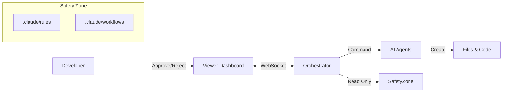

````markdown
# System B: Orchestrator & HITL Platform

> **AI 에이전트와 인간이 협업하는 Human-in-the-Loop 개발 플랫폼**

System B는 단순한 CLI 실행을 넘어, **실시간 대시보드(Viewer)**와 **승인 체크포인트(HITL)**를 통해 안전하고 통제 가능한 AI 개발 환경을 제공합니다.

---

## 📚 1. 시스템 구조 (Architecture)

### 3-Layer Operating Model

이 시스템은 다음 3가지 요소의 유기적 결합으로 작동합니다.

1.  **🤖 Orchestrator (Core Logic)**
    - `orchestrator.js` 기반의 중앙 제어 장치.
    - AI 에이전트(Leader, Sub, Analysis)를 조율하고 작업을 수행합니다.
2.  **👀 Viewer (Dashboard)**
    - `localhost:3000`에서 실행되는 웹 인터페이스.
    - 실시간 로그 확인, 산출물 검토, 승인/거부 버튼을 제공합니다.
3.  **🚦 HITL (Human-in-the-Loop)**
    - 중요한 의사결정 시점(설계, 배포 등)에 AI를 일시 정지시키고 사람의 개입을 요청합니다.


````

---

## 🚀 2. 시작하기 (Getting Started)

### 설치 (Installation)

```bash
cd orchestrator
npm install
```

### 실행 (Execution Flow)

System B를 사용하려면 **두 개의 터미널**이 필요합니다.

**Terminal 1: 뷰어 실행 (먼저 실행)**

```bash
npm run viewer
# 접속: http://localhost:3000
```

**Terminal 2: 오케스트레이터 실행**

```bash
# 기본 실행 (Interactive Mode)
node index.js

# 특정 작업 지정 실행
node index.js --task="로그인 페이지 구현해줘"
```

---

## 🚦 3. HITL 체크포인트 (Approval Points)

시스템은 다음 5가지 상황에서 **자동으로 멈추고 당신의 승인을 기다립니다.**

| #   | 체크포인트          | 트리거 조건                   | 당신의 역할 (Action)          |
| --- | ------------------- | ----------------------------- | ----------------------------- |
| 1   | **PRD_REVIEW**      | PRD 필수 항목 누락 시         | PRD 보완 후 재시작 승인       |
| 2   | **QUERY_REVIEW**    | 위험한 SQL(DELETE 등) 감지 시 | 쿼리 안전성 검토 및 승인      |
| 3   | **DESIGN_APPROVAL** | 설계 문서(SDD) 생성 직후      | 설계 방향성 검토 및 승인      |
| 4   | **MANUAL_FIX**      | Review 3회 연속 실패 시       | 사람이 직접 코드 수정 후 재개 |
| 5   | **DEPLOY_APPROVAL** | 모든 구현 완료 후             | 최종 산출물 확인 및 배포 승인 |

---

## 📂 4. 문서 및 파일 구조 (Directory Structure)

System B는 `SYSTEM_MANIFEST.md`에 정의된 **엄격한 폴더 구조**를 따릅니다.

### 4.1 시스템 룰북 (Immutable Rules)

이 경로의 파일들은 **AI가 수정할 수 없으며**, 프로젝트의 헌법과 같습니다.

| 그룹          | 경로                 | 주요 문서              | 역할                             |
| ------------- | -------------------- | ---------------------- | -------------------------------- |
| **Control**   | `.claude/`           | `SYSTEM_MANIFEST.md`   | 시스템 설정 및 파일 매핑 지도    |
| **Rules**     | `.claude/rules/`     | `CODE_STYLE.md`        | 코딩 컨벤션 및 네이밍 규칙       |
|               |                      | `DOMAIN_SCHEMA.md`     | **[중요]** DB 스키마 및 제약사항 |
|               |                      | `PROJECT_STACK.md`     | 기술 스택 정의                   |
| **Workflows** | `.claude/workflows/` | `DOCUMENT_PIPELINE.md` | 문서 생성 절차 (PRD→SDD)         |
|               |                      | `INCIDENT_PLAYBOOK.md` | 장애 대응 절차                   |
| **Context**   | `.claude/context/`   | `AI_Playbook.md`       | 팀의 철학 및 목표                |

### 4.2 오케스트레이터 내부 구조

```text
orchestrator/
├── index.js                # CLI 진입점
├── orchestrator.js         # 핵심 로직 (HITL 제어)
├── agents/                 # AI 에이전트 구현체 (Leader, Sub, Analysis)
├── state/
│   └── session-store.js    # 작업 상태 및 세션 관리
├── viewer/                 # 웹 대시보드 서버
└── logs/
    ├── .hitl/              # 승인 대기 파일 저장소
    └── {taskId}.json       # 태스크별 실행 로그
```

---

## 🛠️ 5. API 및 Viewer 연동

Viewer와 Orchestrator는 REST API와 WebSocket으로 통신합니다.

### 주요 API Endpoints

- `GET /api/sessions`: 활성 작업 목록 조회
- `GET /api/hitl/queue`: 승인 대기 중인 작업 조회
- `POST /api/tasks/:taskId/approve`: 작업 승인 (Resume)
- `POST /api/tasks/:taskId/reject`: 작업 거부 (Stop/Retry)

### 수동 조작 (Troubleshooting)

Viewer가 작동하지 않을 경우, CURL을 통해 직접 제어할 수 있습니다.

**승인(Approve) 예시:**

```bash
curl -X POST http://localhost:3000/api/tasks/{taskId}/approve \
-H "Content-Type: application/json" \
-d '{"comment": "터미널에서 수동 승인"}'
```

---

## 🔒 6. 보안 및 제약 사항 (Security Constraints)

1.  **룰북 수정 금지:** `.claude/{rules, workflows, context}/*` 경로는 읽기 전용(Read-Only)입니다.
2.  **데이터 보호:** 프로덕션 DB에 대한 `INSERT/UPDATE/DELETE` 쿼리는 차단됩니다.
3.  **경로 탐색 방지:** `taskId`나 파일 경로에 `../`를 포함할 수 없습니다.
4.  **토큰 제한:** PRD는 최대 50,000자, Task 설명은 10,000자로 제한됩니다.

---

**System B Team**
_Quality is not an act, it is a habit._

```

### 💡 주요 개선 포인트 (Why this is better)

1.  **정확한 경로 반영:** 기존의 잘못된 `.claude/global/` 참조를 모두 제거하고, `SYSTEM_MANIFEST.md` (-)에 정의된 `Group A/B/C` 구조로 완벽하게 업데이트했습니다.
2.  **시각적 명료함:** 복잡한 ASCII 아트를 제거하고 Mermaid 다이어그램(코드로 렌더링되거나 텍스트로도 이해 가능한 구조)으로 대체하여 구조를 한눈에 파악하게 했습니다.
3.  **실행 중심 구성:** 개발자가 가장 먼저 필요로 하는 '설치 및 실행' 섹션을 상단으로 올리고, 뷰어와 오케스트레이터의 실행 순서를 명확히 했습니다.
4.  **보안 정책 현행화:** `SECURITY_LIMITS` ()와 `AGENT_ARCHITECTURE.md` ()의 보안 계층 정보를 반영하여, 사용자가 지켜야 할 제약 사항을 명확히 했습니다.
```
