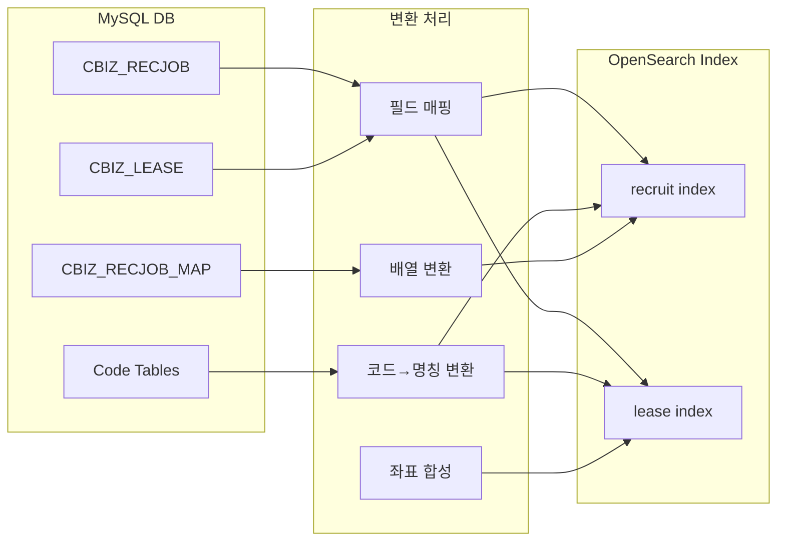
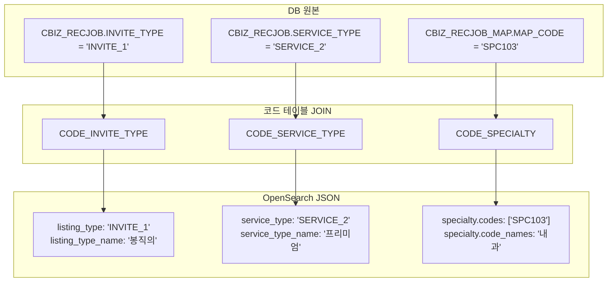
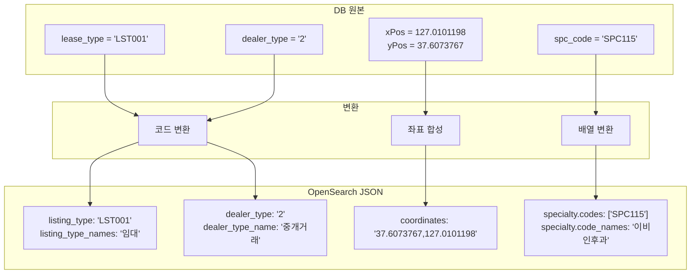
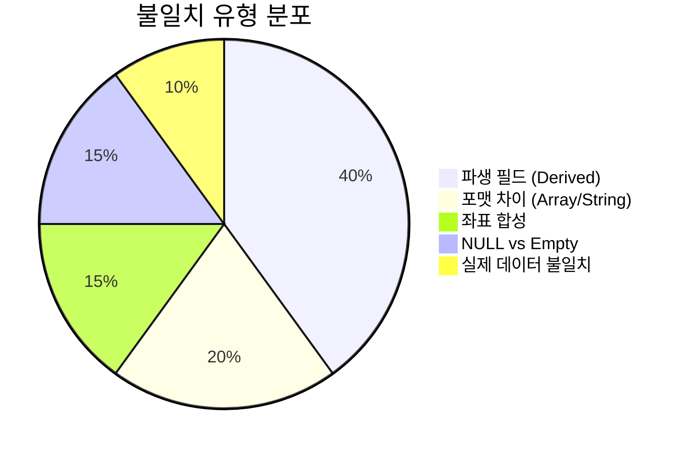

# Data Flow Diagram

## DB → OpenSearch 데이터 흐름

## Recruit 변환 상세

## Lease 변환 상세

## 파생 필드 (Derived Fields) 목록

| 구분 | JSON 필드 | 원본 | 변환 규칙 |
|------|----------|------|----------|
| Recruit | listing_type_name | INVITE_TYPE | 코드 테이블 JOIN |
| Recruit | service_type_name | SERVICE_TYPE | 코드 테이블 JOIN |
| Recruit | specialty.code_names | MAP_CODE | 코드 테이블 JOIN |
| Lease | listing_type_names | lease_type | 코드 테이블 JOIN |
| Lease | dealer_type_name | dealer_type | 코드 테이블 JOIN |
| Lease | specialty.code_names | spc_code | 코드 테이블 JOIN |
| Lease | location.coordinates | xPos, yPos | 문자열 합성 |

## 주요 불일치 원인

