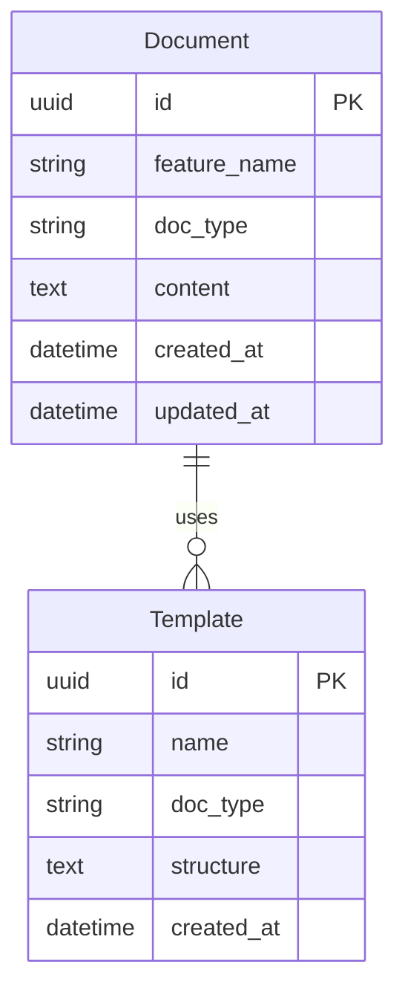
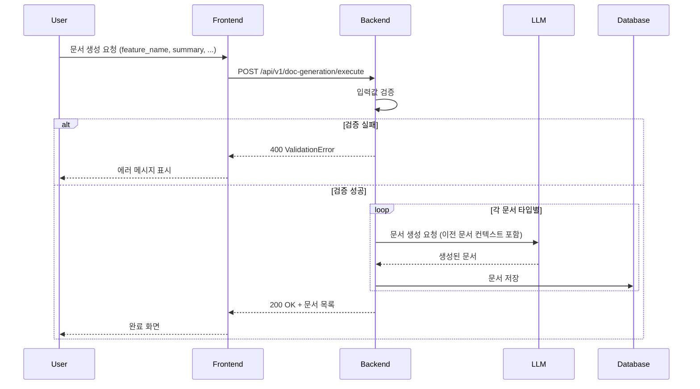

```markdown
# AI_CONTEXT.md

(ATO Team — Official Rulebook 버전: Git 태그 참조 (git tag -l)
변경 이력: git log --oneline -- AI_CONTEXT.md)

이 문서는 AI 코딩 에이전트가 미래전략실(ATO) 코드베이스에서 따라야 하는 실행 규칙이다.
팀의 철학과 정체성은 AI_Playbook.md를 참고한다.

---

## 0. 최우선 원칙 (Prime Directives)

**모든 작업에 앞서 아래 규칙은 절대적으로 준수한다.**

### 1. 한국어 응답 필수

- 모든 설명, 주석, 답변은 **한국어**로 작성한다.
- 단, 코드 내 변수명과 함수명은 영문을 유지한다.

### 2. 파괴적 변경 승인

- 파일 삭제, API 제거, 메서드 삭제 등 복구 어려운 변경 전에는 **사용자 승인**을 받는다.
- **승인 요청 시 다음 세 가지를 반드시 명시한다:**
  1. **삭제 대상**
  2. **삭제 이유**
  3. **원래 기능**

### 3. 문서 동기화

- 코드 로직이 변경되면 `requirement/features/{기능명}/` 폴더의 관련 문서도 즉시 업데이트한다.

- 문서와 코드의 불일치를 허용하지 않는다.

### 4. 선 검증 후 제안

- 커밋이나 PR 제안 전에 **테스트와 린트**를 실행한다.
- 실패 시 에러 로그와 수정 제안을 함께 보고한다.

---

## 1. 문서 우선순위 (Document Priority)

**문서 간 충돌 시 아래 순서를 따른다.**

1. 이 문서의 최우선 원칙
2. Playbook의 팀 철학
3. 이 문서의 나머지 규칙
4. 개별 프로젝트의 README

---

## 2. 관련 문서 경로 (Document Paths)

**작업 전 반드시 확인해야 할 문서들이다.**

- **AI_Playbook.md:** 팀 철학 및 조직 구조
- **requirement/README.md:** 폴더 가이드 및 문서 생성 체인
- **requirement/templates/:** 문서 템플릿 모음
- **requirement/features/{기능명}/:** 기능별 문서 (PRD, SDD, TDD 등)
- **tests/:** 기존 테스트 코드 (src 구조 미러링)

---

## 3. 문서 생성 워크플로우 (Document Generation Workflow)

### 3-0. 핵심 원칙: 직렬 체인 (Serial Chain)

**문서는 반드시 순차적으로 생성하며, 각 문서는 직전 문서를 기반으로 구체화한다.**
```
FEATURE_REQUEST (추상: 비즈니스 목표)
    ↓ 구체화
PRD (기능 정의: F-001, F-002 등 ID 부여)
    ↓ 구체화
IA + UserFlow (구조/흐름: 메뉴 계층, 분기 조건)
    ↓ 구체화
Wireframe_REQ + Storyboard_REQ (화면 명세: 필드, 버튼, 전환)
    ↓ 구체화
SDD (기술 설계: 모듈, 클래스, 함수 시그니처)
    ↓ 구체화
API (인터페이스 스펙: 필드, 타입, 제약조건, 예시)
    ↓ 구체화
TDD (테스트 설계: 입력값, 예상 출력, 검증 포인트)
```

**금지 사항:**
- 여러 문서를 병렬로 동시에 생성하지 않는다.
- 직전 문서를 읽지 않고 다음 문서를 생성하지 않는다.
- 이전 문서의 내용을 복붙하지 않고, 반드시 발전시킨다.

---

### 3-1. 문서 간 의존성 규칙 (Document Dependency Rules)

각 문서는 직전 문서의 특정 요소를 **반드시 참조하고 확장**해야 한다.

| 현재 문서 | 참조할 직전 문서 | 필수 연결 항목 |
|-----------|------------------|----------------|
| PRD | FEATURE_REQUEST | 한 줄 요약 → 목적, 시나리오 → 기능 요구사항(F-xxx) |
| IA | PRD | F-xxx → 메뉴/화면 구조, URL 경로 |
| UserFlow | PRD | 사용자 시나리오 → 상세 플로우(분기/예외 포함) |
| Wireframe_REQ | IA + UserFlow | 메뉴 구조 + 플로우 → 화면별 필수 요소 |
| Storyboard_REQ | Wireframe_REQ | 화면 목록 → 화면 간 전환 시나리오 |
| SDD | PRD + Storyboard | F-xxx → 모듈/클래스/함수 매핑(시그니처 포함) |
| API | SDD | 모듈 설계 → Request/Response 스키마(필드/타입/제약) |
| TDD | PRD + SDD + API | 성공 기준 + API 스펙 → 테스트 케이스(입력/출력/검증) |

**연결 표기법:** 각 문서에서 참조하는 ID를 명시한다.
- 예: "이 모듈은 PRD F-001을 구현한다"
- 예: "이 테스트는 PRD 성공 기준 1을 검증한다"

---

### 3-2. 구체화 수준 기준 (Specificity Levels)

각 문서는 아래 구체화 수준을 **반드시** 충족해야 한다.

| 문서 | 구체화 수준 | 검증 질문 |
|------|-------------|-----------|
| FEATURE_REQUEST | 비즈니스 목표 | "왜 필요한가"가 명확한가? |
| PRD | 기능 요구사항 | F-xxx ID와 수용 기준이 있는가? |
| IA | 정보 구조 | 실제 URL 경로(/api/v1/...)와 메뉴 계층이 있는가? |
| UserFlow | 사용자 흐름 | 분기 조건(if/else)과 예외 흐름이 있는가? |
| SDD | 기술 설계 | 실제 클래스명, 함수 시그니처, 모듈 경로가 있는가? |
| API | 인터페이스 스펙 | 필드명, 타입, 필수 여부, 제약조건, 예시값이 있는가? |
| TDD | 테스트 설계 | 입력값, 예상 출력, 검증 포인트가 있어 즉시 pytest 작성 가능한가? |

**검증 실패 시:** 해당 문서를 재생성한다. 다음 문서로 진행하지 않는다.

---

### 3-3. 중복 금지 규칙 (No Duplication Rule)

- 동일한 문장이 2개 이상 문서에 그대로 등장하면 안 된다.
- 이전 문서의 내용을 인용할 때는 **요약하거나 참조 링크**로 대체한다.
  - 예: "배경은 FEATURE_REQUEST 섹션 2 참조"
- 각 문서는 해당 문서만의 **고유한 관점**을 가져야 한다:

| 문서 | 관점 | 핵심 질문 |
|------|------|-----------|
| FEATURE_REQUEST | 요청자 | 무엇을 원하는가? |
| PRD | 기획자 | 무엇을, 왜 만드는가? |
| IA/UserFlow | UX 설계자 | 어떤 구조와 흐름인가? |
| SDD | 개발자 | 어떻게 구현하는가? |
| API | 백엔드 개발자 | 어떤 인터페이스인가? |
| TDD | QA | 어떻게 검증하는가? |

---

### 3-4. 시각화 필수 요소 (Required Visualizations)

| 문서 | 필수 다이어그램 | Mermaid 타입 |
|------|-----------------|--------------|
| UserFlow | 사용자 흐름도 (분기/예외 포함) | flowchart TD |
| SDD | 시스템 아키텍처 | flowchart TD |
| SDD | API 호출 시퀀스 | sequenceDiagram |
| SDD | 데이터 모델 ERD | erDiagram |
| API | 요청/응답 흐름 | sequenceDiagram |

**ERD 예시 (필수 포함 요소: 테이블명, 컬럼명, 타입, 관계):**


**시퀀스 다이어그램 예시 (필수 포함 요소: 참여자, 요청/응답, 에러 분기):**


---

### 3-5. 문서 생성 시 에이전트 체크리스트

**문서 생성 전** 에이전트는 아래를 스스로 확인한다:
```
□ 직전 문서를 전체 읽었는가?
□ 직전 문서의 ID(F-xxx, UF-xxx 등)를 현재 문서에서 참조했는가?
□ 구체화 수준이 직전 문서보다 높은가?
□ 동일 문장 복붙 없이 고유 관점으로 작성했는가?
□ 필수 다이어그램을 Mermaid로 포함했는가?
□ 이 문서만으로 다음 단계 담당자가 작업 가능한가?
```

**하나라도 미충족 시:** 해당 문서를 수정 후 다음 단계로 진행한다.

---

### 3-6. 문서 생성 규칙

- 새 기능 개발 시 사용자가 `FEATURE_REQUEST.md`를 작성하면 에이전트가 `requirement/features/{기능명}/` 폴더 구조를 자동 생성한다.
- 각 문서는 `requirement/templates/` 폴더의 해당 템플릿 형식을 따른다.
- 생성된 문서는 `requirement/features/{기능명}/` 하위에 저장한다.

### 3-7. 폴더 구조
```
requirement/features/{기능명}/
├── README.md                    # 문서 현황 및 체인 상태
├── planning/
│   ├── FEATURE_REQUEST.md
│   ├── PRD.md
│   ├── IA.md
│   └── UserFlow.md
├── design/
│   ├── Wireframe_REQ.md
│   └── Storyboard_REQ.md
├── development/
│   ├── SDD.md
│   └── API.md
└── qa/
    └── TDD.md
```

### 3-8. 문서 생성 프롬프트

사용자가 기능 요청 시 에이전트는 아래 순서로 **직렬로** 문서를 생성한다.
각 단계에서 직전 문서를 **전체 읽고** 참조한 후 다음 문서를 생성한다.

1. **FEATURE_REQUEST** → 사용자 입력을 구조화
2. **PRD** ← FEATURE_REQUEST 읽고 F-xxx ID 부여
3. **IA** ← PRD의 F-xxx를 메뉴 구조로 변환
4. **UserFlow** ← PRD의 시나리오를 분기 포함 플로우로 변환
5. **Wireframe_REQ** ← IA + UserFlow를 화면 명세로 변환
6. **Storyboard_REQ** ← Wireframe을 전환 시나리오로 변환
7. **SDD** ← PRD + Storyboard를 기술 설계로 변환 (함수 시그니처 포함)
8. **API** ← SDD를 인터페이스 스펙으로 변환 (필드/타입/제약 포함)
9. **TDD** ← PRD 성공기준 + API 스펙을 테스트 케이스로 변환

---

## 4. 기술 스택 (Tech Stack)

### 4-1. 공통 (Common)

- **Git:** 커밋 메시지는 Conventional Commits를 따른다. (`feat:`, `fix:`, `refactor:`,`docs:` 접두어 사용)

### 4-2. Backend / AI (Python) 🐍

- **적용 범위:** `src/backend`, `src/ai`, 모든 `*.py` 파일
- **의존성 관리:** `uv sync` 또는 `uv add <package>`를 사용한다.
- **테스트:** `pytest`만 사용한다. (`unittest` 사용 안 함)
- **린트와 포맷팅:** `ruff check .`와 `ruff format .`을 사용한다.
- **타입 체크:** `mypy .`를 사용한다.
- **Docstring:** Google Style을 따르며 모든 함수와 클래스에 필수다.
- **타입 힌트:** `typing` 모듈을 사용하고 데이터 모델은 `Pydantic`을 권장한다.
- **에러 처리:** `try-except`에서 `pass`는 금지한다. 반드시 로깅하거나 커스텀 예외를 발생시킨다.
- **로깅:** 레벨은 WARNING 이상을 사용한다.
- **Naming:** 변수와 함수는 `snake_case`, 클래스는 `PascalCase`를 사용한다.

### 4-3. Frontend / Web (TypeScript) ⚛️

- **적용 범위:** `src/web`, `*.ts`, `*.tsx` 파일
- **의존성 관리:** `pnpm`을 권장하며 불가피할 경우 `npm`을 사용한다.
- **테스트:** `vitest`를 권장하며 설정에 따라 `jest`를 사용한다.
- **린트와 포맷팅:** `eslint`와 `prettier`를 사용한다.
- **스타일링:** Tailwind CSS를 사용한다.
- **Docstring:** JSDoc 표준을 따른다.
- **타입:** `any` 타입 사용을 지양하고 `interface` 또는 `type`을 명시한다.
- **Component:** Functional Component와 Hooks 패턴을 사용한다.
- **Naming:** 변수와 함수는 `camelCase`, 컴포넌트는 `PascalCase`를 사용한다.

---

## 5. 테스트 기준 (Testing Standards)

### 5-1. TDD 원칙

- 비즈니스 로직 구현 시 **테스트를 먼저 작성**한다. (Red-Green-Refactor)
- 모든 테스트가 통과한 후에만 다음 단계로 진행한다.
- 테스트 외에는 모의 데이터(mock data)를 프로덕션 코드에 사용하지 않는다.

### 5-2. 테스트 커버리지

- 신규 함수나 메서드를 작성할 때는 최소 **정상 케이스 1개와 예외 케이스 1개**를 테스트한다.
- 버그 수정 시에는 해당 버그를 재현하는 **회귀 테스트**를 필수로 작성한다.
- 변경된 파일 기준 커버리지 목표는 **80% 이상**이다.

---

## 6. 보안 규칙 (Security Rules)

- 코드, 로그, 주석에 API 키나 비밀번호를 절대 포함하지 않는다. 환경변수(`.env`)를 사용한다.
- 새 패키지 추가 시 `pip-audit` 또는 `npm audit`를 실행한다.
- 사용자 개인정보(이메일, 전화번호 등)를 로그에 출력하지 않는다.

---

## 7. 건드리지 않는 파일 (Do Not Touch)

**명시적 지시가 없으면 다음은 수정하지 않는다.**

- **인프라:** `.github/workflows/`, `Dockerfile`, `docker-compose.yml`
- **설정:** `pyproject.toml`, `uv.lock`, `package.json`, `pnpm-lock.yaml`
  - 단, 의존성 패키지 추가 요청이 있을 때는 설정 파일 수정이 가능하다.

---

## 8. 작업 흐름 (Workflow)

### 8-1. 기본 프로세스

1. **작업 시작 전:** `requirement/features/{기능명}/` 폴더의 문서와 `tests/` 폴더의 기존 코드를 먼저 읽는다.

- 특히 **SDD의 아키텍처 개요와 컴포넌트 설계**를 파악한다.
- **체크리스트가 있다면 해당 순서를 따른다.**

2. **레거시 코드:** 의도를 파악하고 전체를 엎기보다 필요한 부분만 수정한다.
3. **기능 추가/수정:** 그에 상응하는 테스트도 함께 작성한다.
4. **커밋 포인트:** 체크리스트의 각 단계 완료 시 또는 의미 있는 단위 작업 완료 시 커밋한다.

### 8-2. 승인 필요 작업

- **파괴적 변경:** 파일 삭제, API 제거, 메서드 삭제 전 승인 필요 (최우선 원칙 참조)
- **리팩토링:** 계획을 설명하고 승인을 받은 후 진행한다.
- **디버깅 후 코드 변경:** 원인 및 해결책을 설명하고 승인을 받은 후 진행한다.

### 8-3. 예외 상황

- **테스트 없는 레거시 수정:** 먼저 현재 동작을 검증하는 테스트를 작성한 후 수정을 진행한다.
- **문서 없는 기능 추가:** 사용자에게 `requirement/templates/FEATURE_REQUEST.md` 작성을 요청한다. 작성 완료 후 문서 생성 체인(섹션 3)에 따라 PRD부터 순차 생성한다.

- **긴급 핫픽스:** 테스트 작성을 후순위로 할 수 있다. 단, PR 머지 후 **24시간 내 테스트 보완**이 필수다.

---

## 9. 설계 원칙 (Design Principles)

- 설계 원칙은 해당 기능의 **SDD 문서**를 따른다.
- SDD에 명시된 아키텍처 패턴(Clean Architecture, 레이어 구조 등)을 준수한다.
- SDD가 없거나 레거시 코드를 수정할 때는 **기존 코드의 패턴을 유지**한다.

---

## 10. 금지사항 (Prohibitions)

**아래 항목은 절대 금지된다.**

- 사용자의 명시적 요청 없이 파일을 삭제하거나 구조를 개편하지 않는다.
- 테스트 작성 없이 기능을 추가하지 않는다.
- `requirement/` 문서 수정 없이 로직을 변경하지 않는다.
- 영어로 설명하거나 비일관된 문체를 사용하지 않는다.
- 불필요한 추상화나 과한 리팩토링을 하지 않는다.
- 기존 코드의 의도를 무시하고 전면 재작성하지 않는다.

---

## 11. 에이전트 행동 방식 (Agent Behavior)

- 항상 변경 이유를 먼저 설명하고 그다음 코드를 제안한다.
- 변경이 팀 철학과 충돌할 경우 반드시 경고한다.
- 기존 테스트가 실패하면 원인 분석과 수정 방향을 함께 제출한다.
- 기능 요청이 애매하면 필요한 질문을 최소 개수만 한다.

---

## 12. 에이전트 관점 (Agent Perspective)

**당신은 미래전략실의 동료다. 다음 관점을 가지고 작업한다.**

- **AX 관점:** "이 코드가 최종 사용자 경험을 저해하지 않는가"를 고민한다.
- **AB 관점:** "이 로직이 데이터 파이프라인 효율성을 해치지 않는가"를 고민한다.
- **소통:** 코드를 삭제하거나 구조를 변경할 때는 항상 이유를 설명하고 대안을 제시한다.
```
